[TOC]

# HTML与CSS

## B/S软件的结构 

> C/S即Client/Server（客户机/服务器）结构；B/S即Browser/Server（浏览器/服务器）结构: 

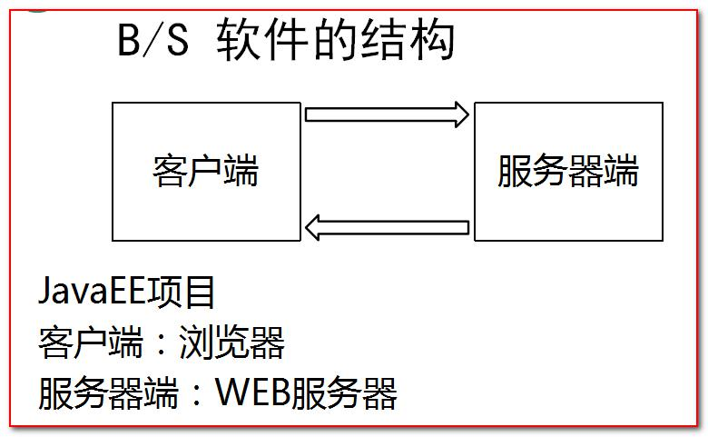

- CS响应速度快，安全性强，通常应用在局域网当中，可是开发维护费用高；
- BS能够完成跨平台，客户端零维护，可是个性化才能低，响应速度较慢。
- 于是有一些单位平日办公应用BS，在实际生产当中使用CS结构。 

## 前端的开发流程

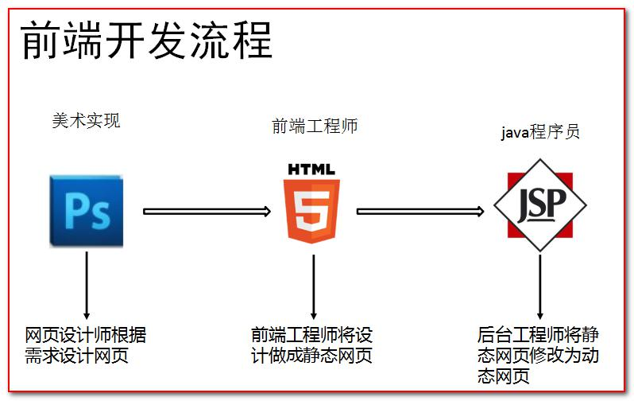

## 网页的组成部分

- 由三部分内容组成！分别是内容（结构）、表现、行为。 

- 内容（结构），是我们在页面中可以看到的数据。我们称之为内容。一般内容我们使用html技术来展示。
- 表现，指的是这些内容在页面上的展示形式。比如说。布局，颜色，大小等等。一般使用CSS技术实现 。
- 行为，指的是页面中元素与输入设备交互的响应。一般使用javascript技术实现。 

----

## HTML简介 

- [HTML文档](https://www.yuque.com/nizhegechouloudetuboshu/library/defyyo)

- HyperTextMarkupLanguage（超文本标记语言）简写：HTML。

- HTML通过标签来标记要显示的网页中的各个部分。网页文件本身是一种文本文件，通过在文本文件中添加标记符，可以告诉浏览器如何显示其中的内容（如：文字如何处理，画面如何安排，图片如何显示等）。

## 创建HTML文件

1. 在IDEA中，创建一个web工程（静态的web工程） 

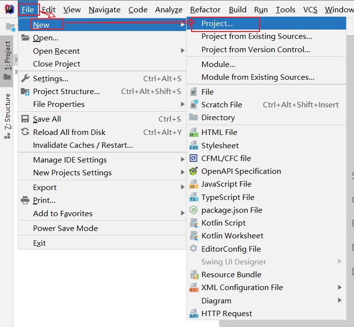

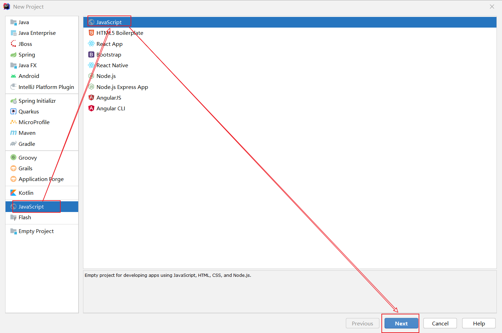

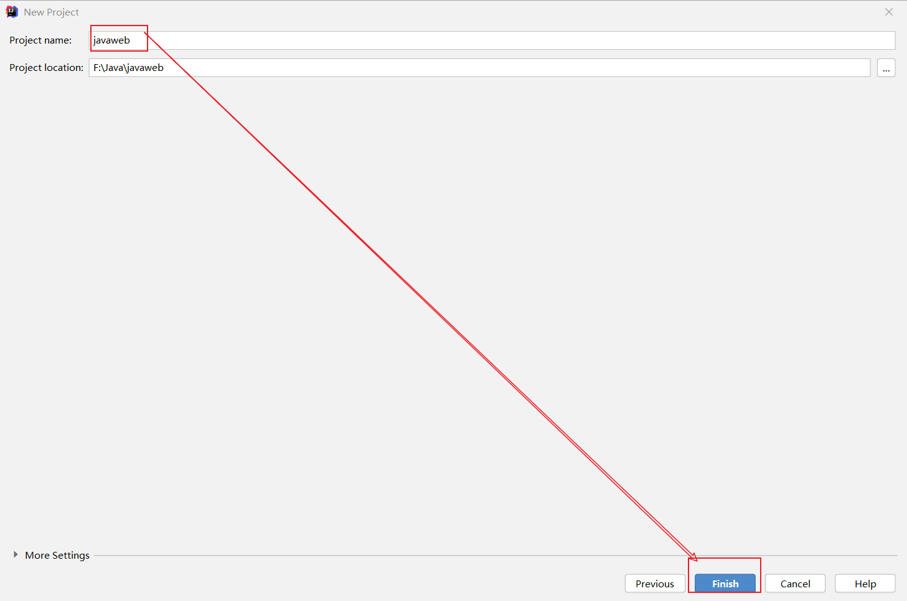

----

2. 在工程下创建 html 页面 

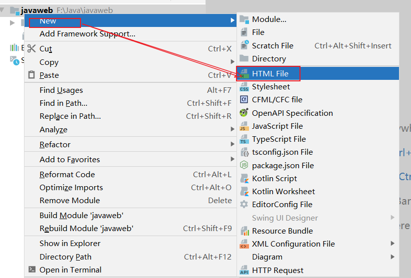

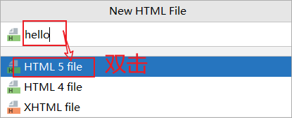

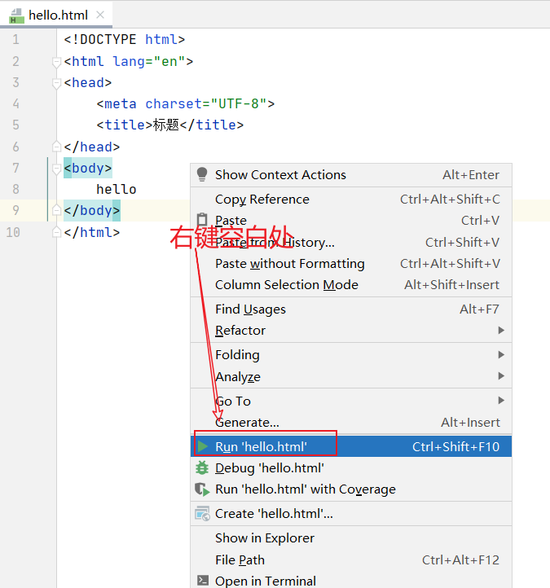

```html
<!DOCTYPE html><!-- 约束，声明 -->
<html lang="en"> <!-- html标签的开始  lang="en"表示英文 html标签中一般分为两部分，分别是：head和body -->
<head> <!-- 表示头部信息，一般包含三部分，title标签，css样式，js代码 -->
    <meta charset="UTF-8"><!-- 表示当前页面使用UTF-8字符集 -->
    <title>标题</title> <!-- 表示标题 -->
</head>
<body> <!-- body标签是整个页面的主体内容 -->
    hello
</body>
</html> <!-- 表示整个html页面的结束  -->
```

- 注：Java 文件是需要先编译，再由  java  虚拟机跑起来。但  HTML  文件它不需要编译，直接由浏览器进行解析执行。 

## HTML 标签介绍

1. 标签的格式: 

```html
<标签名>封装的数据</标签名>
```

2. 标签名大小写不敏感。 
3. 标签拥有自己的属性。

```html
i.基本属性：bgcolor="red"可以修改简单的样式效果;
ii.事件属性：onclick="alert('你好！');"可以直接设置事件响应后的代码。
```

```
<!DOCTYPE html>
<html lang="en"> 
<head> 
    <meta charset="UTF-8">
    <title>标题</title> 
</head>
<!--
bgcolor是背景颜色属性
onclick表示单击（点击）事件

alert()是javaScript语言提供的一个警告框函数。
它可以接收任意参数，参数就是警告框的函数信息。
-->
<body bgcolor="#faebd7"> <!-- body标签是整个页面的主体内容 -->
    hello
    <button onclick="alert('你好，JS')">按钮</button>
</body>
</html> <!-- 表示整个html页面的结束  -->
```

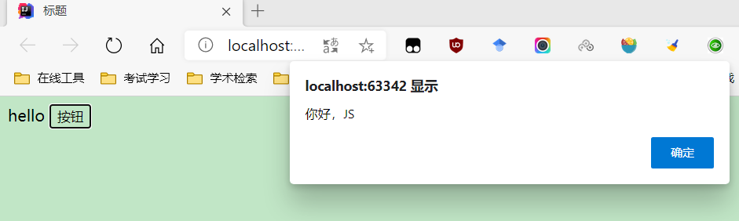

4. 标签又分为，单标签和双标签。 

```html
i.单标签格式：<标签名/>	br换行	hr水平线
ii.双标签格式:<标签名>...封装的数据...</标签名>
```

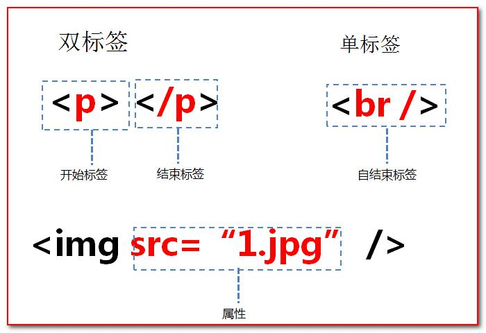

> 标签的语法： 

```html
<!DOCTYPE html><!-- 约束，声明 -->
<html lang="en"> 
<head> 
    <meta charset="UTF-8">
    <title>标题</title> <!-- 表示标题 -->
</head>
<body bgcolor="#faebd7">
    hello
    <hr>
    <!--①标签不能交叉嵌套-->
    正确：<div><span>早安，HTML</span></div>
    错误：<div><span>早安，CSS</div></span>
    <hr/>
    <!--②标签必须正确关闭-->
    <!--i.有文本内容的标签：-->
    
    正确：<div>早安，HTML</div>
    错误：<div>早安，CSS
    <hr/>

    <!--ii.没有文本内容的标签：-->
    正确：<br/>
    错误：<br>
    <hr/>

    <!--③属性必须有值，属性值必须加引号-->
    正确：<font color="blue">早安，HTML</font>
    错误：<font color=blue>早安，CSS</font>
    错误：<font color>早安，JS</font>
        <hr/>

        <!--④注释不能嵌套-->
        正确：<!--注释内容--><br/>
        错误：<!--<!--这是错误的html注释-->-->
        <hr/>
</body>
</html> 
```

- 注意：html代码不是很严谨。有时候标签不闭合，也不会报错。 

##  常用标签

> 介绍文档：w3cschool.CHM 

### 1.font字体标签 

> 需求1：在网页上显示我是字体标签，并修改字体为宋体，颜色为红色。 

```html
<!DOCTYPE html>
<html lang="en"> 
<head>
    <meta charset="UTF-8">
    <title>标题</title> 
</head>
<body> 
<!--字体标签需求1：在网页上显示我是字体标签，并修改字体为宋体，颜色为红色。
font标签是字体标签,它可以用来修改文本的字体,颜色,大小(尺寸)
color属性修改颜色
face属性修改字体
size属性修改文本大小-->
    <font color="red" face="宋体" size="7">我是字体标签</font>
</body>
</html>
```

### 2.特殊字符 

```html
<!DOCTYPE html>
<html lang="en">
<head>
<meta charset="UTF-8">
<title>特殊字符</title>
</head>
<body>
	<!-- 特殊字符
	需求1：把 <br> 换行标签 变成文本 转换成字符显示在页面上

	常用的特殊字符:
		<	===>>>>		&lt;
		>   ===>>>>		&gt;
	  空格	===>>>>		&nbsp;

	 -->
	我是&lt;br&gt;标签<br/>
	定海神珠&nbsp;&nbsp;&nbsp;&nbsp;&nbsp;&nbsp;&nbsp;&nbsp;&nbsp;&nbsp;&nbsp;&nbsp;&nbsp;&nbsp;&nbsp;&nbsp;&nbsp;&nbsp;&nbsp;&nbsp;&nbsp;&nbsp;&nbsp;&nbsp;&nbsp;&nbsp;&nbsp;36颗!
</body>
</html>
```

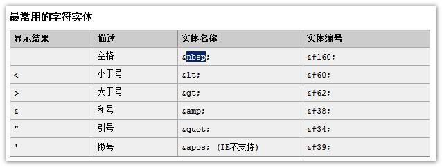

> 其他特殊字符表： 


### 3.标题标签 

```html
<!DOCTYPE html>
<html>
<head>
<meta charset="UTF-8">
<title>标题标签</title>
</head>
<body>
	<!-- 标题标签
	 需求1：演示标题1到 标题6的

	 	h1 - h6 都是标题标签
	 	h1 最大
	 	h6 最小
			align 属性是对齐属性
				left		左对齐(默认)
				center		剧中
				right		右对齐
	 -->
	<h1 align="left">标题1</h1>
	<h2 align="center">标题2</h2>
	<h3 align="right">标题3</h3>
	<h4>标题4</h4>
	<h5>标题5</h5>
	<h6>标题6</h6>
	<h7>标题7</h7>
</body>
</html>
```

### 4.超链接 

> 在网页中所有点击之后可以跳转的内容都是超连接。 

```html
<!DOCTYPE html>
<html>
<head>
	<meta charset="UTF-8">
	<title>超链接</title>
</head>
<body>
<!-- a标签是 超链接
         href属性设置连接的地址
         target属性设置哪个目标进行跳转
             _self		表示当前页面(默认值)
             _blank		表示打开新页面来进行跳转
 -->
<a href="0-标签语法.html">标签超链接</a><br/>
<a href="http://www.baidu.com">百度</a><br/>
<a href="http://www.tmall.com" target="_self">天猫</a><br/>
<a href="http://www.jd.com" target="_blank">京东</a><br/>
</body>
</html>
```

### 5.列表标签

> 分为：有序列表、无序列表。

```html
<!DOCTYPE html>
<html lang="en">
<head>
    <meta charset="UTF-8">
    <title>Title</title>
</head>
<body>
    <!--需求1：使用无序，列表方式，把东北F4，赵四，刘能，小沈阳，宋小宝，展示出来
        ul 是无序列表
            type属性可以修改列表项前面的符号
        li  是列表项
    -->
    <ul>
        <li>F4</li>
        <li>赵四</li>
        <li>刘能</li>
        <li>宋小宝</li>
        <li>小沈阳</li>
    </ul>
</body>
</html>
```

### 6.img标签

> img标签可以在html页面上显示图片。

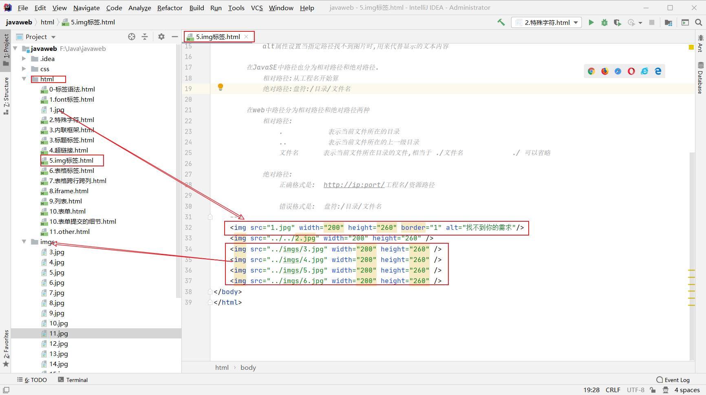

```html
<!DOCTYPE html>
<html lang="ee">
<head>
<meta charset="UTF-8">
<title>img标签</title>
</head>
<body>
    <!--需求1：使用img标签显示一张美女的照片。并修改宽高，和边框属性

        img标签是图片标签,用来显示图片
            src属性可以设置图片的路径
            width属性设置图片的宽度
            height属性设置图片的高度
            border属性设置图片边框大小
            alt属性设置当指定路径找不到图片时,用来代替显示的文本内容

        在JavaSE中路径也分为相对路径和绝对路径.
            相对路径:从工程名开始算
            绝对路径:盘符:/目录/文件名

        在web中路径分为相对路径和绝对路径两种
            相对路径:
                .           表示当前文件所在的目录
                ..          表示当前文件所在的上一级目录
                文件名      表示当前文件所在目录的文件,相当于 ./文件名            ./ 可以省略

            绝对路径:
                正确格式是:  http://ip:port/工程名/资源路径
                
                错误格式是:  盘符:/目录/文件名
    -->
    
    
    
    
    
    
</body>
</html>
```

### 7.表格标签

> 需求1：做一个带表头的，三行，三列的表格，并显示边框；
>
> 需求2：修改表格的宽度，高度，表格的对齐方式，单元格间距。 

```html
<!DOCTYPE html>
<html lang="ee">
<head>
    <meta charset="UTF-8">
    <title>表格标签</title>
</head>
<body>
<!--
	需求1：做一个 带表头的 ，三行，三列的表格，并显示边框
	需求2：修改表格的宽度，高度，表格的对齐方式，单元格间距。

		table 标签是表格标签
			border 设置表格标签
			width 设置表格宽度
			height 设置表格高度
			align 设置表格相对于页面的对齐方式
			cellspacing 设置单元格间距

		tr	是行标签
		th	是表头标签
		td  是单元格标签
		    align 设置单元格文本对齐方式

		b 是加粗标签
-->

<table border="1" width="300" height="200" align="center" cellspacing="0">
    <tr>
        <th>1.1</th>
        <th>1.2</th>
        <th>1.3</th>
    </tr>
    <tr>
        <th>2.1</th>
        <th>2.2</th>
        <th>2.3</th>
    </tr>
    <tr>
        <th>3.1</th>
        <th>3.2</th>
        <th>3.3</th>
    </tr>
</table>
</body>
</html>
```

### 8.跨行跨列表格 

- 需求1：新建一个五行，五列的表格，第一行，第一列的单元格要跨两列，第二行第一列的单元格跨两行，第四行第四列的单元格跨两行两列。 

```html
<!DOCTYPE html>
<html lang="ee">
<head>
	<meta charset="UTF-8">
		<title>表格的跨行跨列</title>
	</head>
	<body>
<!--	需求1：
			新建一个五行，五列的表格，
			第一行，第一列的单元格要跨两列，
			第二行第一列的单元格跨两行，
			第四行第四列的单元格跨两行两列。

			colspan 属性设置跨列
			rowspan 属性设置跨行
-->
		<table width="500" height="500" cellspacing="0" border="1">
			<tr>
				<td colspan="2">1.1</td>
				<td>1.2</td>
				<td>1.3</td>
				<td>1.4</td>
			</tr>
			<tr>
				<td rowspan="2">2.1</td>
				<td>2.2</td>
				<td>2.3</td>
				<td>2.4</td>
				<td>2.5</td>
			</tr>
			<tr>
				<td>3.2</td>
				<td>3.3</td>
				<td>3.4</td>
				<td>3.5</td>
			</tr>
			<tr>
				<td>4.1</td>
				<td>4.2</td>
				<td>4.3</td>
				<td colspan="2" rowspan="2">4.4</td>
			</tr>
			<tr>
				<td>5.1</td>
				<td>5.2</td>
				<td>5.3</td>
			</tr>
		</table>
	</body>
</html>
```

### 9.了解iframe框架标签(内嵌窗口) 

- ifarme标签它可以在一个html页面上,打开一个小窗口,去加载一个单独的页面。 

```html
<!DOCTYPE html>
<html lang="ee">
<head>
    <meta charset="UTF-8">
<title>iframe标签</title>
</head>
<body>
	这是一个单独的完整的页面
    <br/>
    <br/>
    <!--ifarme标签可以在页面上开辟一个小区域显示一个单独的页面
        ifarme和a标签组合使用的步骤:
            1 在iframe标签中使用name属性定义一个名称
            2 在a标签的target属性上设置iframe的name的属性值
    -->
    <iframe src="4.超链接.html" width="300" height="300" name="HJS"></iframe>
    <br/>

    <ul>
        <li><a href="0-标签语法.html" target="abc">标签语法</a></li>
        <li><a href="1.font标签.html" target="abc">font标签</a></li>
        <li><a href="2.特殊字符.html" target="abc">特殊字符</a></li>
    </ul>
</body>
</html>
```

### 10.表单标签 

- 表单就是html页面中,用来收集用户信息的所有元素集合.然后把这些信息发送给服务器。

> - input type=text     是文件输入框  value设置默认显示内容
>
> - input type=password 是密码输入框  value设置默认显示内容  maxlength设置密码最大长度
>
> - input type=radio    是单选框    name属性可以对其进行分组   checked="checked"表示默认选中
>
> - input type=checkbox 是复选框   checked="checked"表示默认选中
>
> - input type=reset    是重置按钮      value属性修改按钮上的文本
>
> - input type=submit   是提交按钮      value属性修改按钮上的文本
>
> - input type=button   是按钮          value属性修改按钮上的文本
>
> - input type=file     是文件上传域
>
> - input type=hidden   是隐藏域    当我们要发送某些信息，而这些信息，不需要用户参与，就可以使用隐藏域（提交的时候同时发送给服务器）
>
----
>
> - select 标签是下拉列表框
>
> - option 标签是下拉列表框中的选项 selected="selected"设置默认选中
>
----
>
> -  textarea 表示多行文本输入框 （起始标签和结束标签中的内容是默认值）
>   - rows 属性设置可以显示几行的高度    
>   - cols 属性设置每行可以显示几个字符宽度

```html
<!DOCTYPE html>
<html lang="en">
<head>
    <meta charset="UTF-8">
    <title>表单的显示</title>
</head>
<body>
<!--
需求1:创建一个个人信息注册的表单界面。包含用户名，密码，确认密码。
     性别（单选），兴趣爱好（多选），国籍（下拉列表）。
隐藏域，自我评价（多行文本域）。重置，提交。-->

<form>
    用户名称：<input type="text" value="your name"/><br/>
    用户密码：<input type="password" value="密码123" maxlength="6"/><br/>
    确认密码：<input type="password" value="密码123" maxlength="6"/><br/>
    性别：<input type="radio" name="sex" checked="checked"/>男 <input type="radio" name="sex"/>女<br/>
    兴趣爱好：<input type="checkbox"/>Java<input type="checkbox"/>JS<input type="checkbox"/>C++<br/>
    国籍：<select>
    <option>-----请选择国籍-----</option>
    <option selected="selected">中国</option>
    <option>俄罗斯</option>
    <option>澳大利亚</option>
</select><br/>
    自我评价：<br/><textarea rows="10" cols="20">我的个人评价</textarea><br/>
    <input type="reset" value="bk"/>
    <input type="submit"/>
    <input type="button"/>
    <input type="file"/>
    <input type="hidden" name="k1" value="abcValue">
</form>
</body>
</html>
```

- 格式化表单

```html
<!DOCTYPE html>
<html lang="en">
<head>
    <meta charset="UTF-8">
    <title>表单的显示</title>
</head>
<body>
<!--
需求1:创建一个个人信息注册的表单界面。包含用户名，密码，确认密码。
     性别（单选），兴趣爱好（多选），国籍（下拉列表）。
隐藏域，自我评价（多行文本域）。重置，提交。-->

<form>
    <h1 align="center">用户注册</h1>
        <table align="center" border="1" width="400" height="200" align="center" cellspacing="0">
            <tr>
                <td>用户名称：</td>
                <td>
                    <input type="text" value="name"/>
                </td>
            </tr>
            <tr>
                <td>用户密码：</td>
                <td><input type="password" value="root"/></td>
            </tr>
            <tr>
                <td>确认密码：</td>
                <td><input type="password" value="root"/></td>
            </tr>
            <tr>
                <td>性别：</td>
                <td>
                    <input type="radio" name="sex" checked="checked" />男
                    <input type="radio" name="sex" />女
                </td>
            </tr>
            <tr>
                <td>兴趣爱好：</td>
                <td>
                    <input type="checkbox" checked="checked" />Java
                    <input type="checkbox" />JavaScript
                    <input type="checkbox" />C++
                </td>
            </tr>
            <tr>
                <td>国籍：</td>
                <td>
                    <select>
                        <option>---请选择国籍---</option>
                        <option selected="selected">中国</option>
                        <option>俄罗斯</option>
                        <option>爱尔兰</option>
                    </select>
                </td>
            </tr>
            <tr>
                <td>自我评价：</td>
                <td><textarea rows="10" cols="20">我的个人评价</textarea></td>
            </tr>
            <tr>
                <td><input type="reset" /></td>
                <td align="center"><input type="submit"/></td>
            </tr>
        </table>
</form>
</body>
</html>
```

- 表单提交的一些细节

  > form标签是表单标签    
  >
  > - action属性设置提交的服务器地址    
  > - method属性设置提交的方式GET(默认值)或POST
  >
  > 
  >
  > 表单提交的时候，数据没有发送给服务器的三种情况：    
  >
  > - 1、表单项没有name属性值    
  > - 2、单选、复选（下拉列表中的option标签）都需要添加value属性，以便发送给服务器    
  > - 3、表单项不在提交的form标签中
  >
  > 
  >
  > GET请求的特点是：    
  >
  > - 1、浏览器地址栏中的地址是：action属性[+?+请求参数]        
  >
  >   请求参数的格式是：name=value&name=value    
  >
  > - 2、不安全    3、它有数据长度的限制
  >
  > 
  >
  > POST请求的特点是：    
  >
  > - 1、浏览器地址栏中只有action属性值    
  > - 2、相对于GET请求要安全    
  > - 3、理论上没有数据长度的限制

```html
<!DOCTYPE html>
<html lang="en">
<head>
    <meta charset="UTF-8">
    <title>表单的细节</title>
</head>
<body>
    <form action="http://localhost:8080" method="post">
        <input type="hidden" name="action" value="login" />
        <h1 align="center">用户注册</h1>
        <table align="center">
            <tr>
                <td> 用户名称：</td>
                <td>
                    <input type="text" name="username" value="name"/>
                </td>
            </tr>
            <tr>
                <td> 用户密码：</td>
                <td><input type="password" name="password" value="root"/></td>
            </tr>
             <tr>
                <td>性别：</td>
                <td>
                    <input type="radio" name="sex" value="boy"/>男
                    <input type="radio" name="sex" checked="checked" value="girl" />女
                </td>
            </tr>
             <tr>
                <td> 兴趣爱好：</td>
                <td>
                    <input name="hobby" type="checkbox" checked="checked" value="java"/>Java
                    <input name="hobby" type="checkbox" value="js"/>JavaScript
                    <input name="hobby" type="checkbox" value="cpp"/>C++
                </td>
            </tr>
             <tr>
                <td>国籍：</td>
                <td>
                    <select name="country">
                        <option value="none">----请选择国籍----</option>
                        <option value="cn" selected="selected">中国</option>
                        <option>俄罗斯</option>
                        <option>爱尔兰</option>
                    </select>
                </td>
            </tr>
             <tr>
                <td>自我评价：</td>
                <td><textarea name="desc" rows="10" cols="20">我的个人评价</textarea></td>
            </tr>
             <tr>
                <td><input type="reset" /></td>
                <td align="center"><input type="submit"/></td>
            </tr>
        </table>
    </form>
</body>
</html>
```

### 11.其他标签 

- div标签       默认独占一行
- span标签      它的长度是封装数据的长度
- p段落标签     默认会在段落的上方或下方各空出一行来（如果已有就不再空）

```html
<!DOCTYPE html>
<html lang="en">
<head>
    <meta charset="UTF-8">
    <title>其他标签</title>
</head>
<body>
        <!-- 需求1：div、span、p标签的演示 -->
    <div>div标签1</div>
    <div>div标签2</div>
    <span>span标签1</span>
    <span>span标签2</span>
    <p>p段落标签1</p>
    <p>p段落标签2</p>
</body>
</html>
```

## CSS技术介绍 

- [文档:CSS2.0.chm](https://www.yuque.com/nizhegechouloudetuboshu/library/defyyo) 

- CSS是「层叠样式表单」。是用于(增强)控制网页样式并允许将样式信息与网页内容分离的一种标记性语言。 

## CSS语法规则 


- 选择器：浏览器根据“选择器”决定受 CSS 样式影响的 HTML 元素（标签）。 

- 属性 (property) 是你要改变的样式名，并且每个属性都有一个值。属性和值被冒号分开，并 
  由花括号包围，这样就组成了一个完整的样式声明（declaration），例如：p {color: blue} 

- 多个声明：如果要定义不止一个声明，则需要用分号将每个声明分开。虽然最后一条声明的 最后可以不加分号(但尽量在每条声明的末尾都加上分号) 

  ```css
  例如： 
  p{ 
  	color:red; 
      font-size:30px;
  }
  
  注：一般每行只描述一个属性
  CSS注释：/*注释内容*/
  ```

## CSS和HTML的结合方式 

> 第一种：在标签的style属性上设置”key:value value;”，修改标签样式。 

```html
<!DOCTYPE html>
<html lang="en">
<head>
    <meta charset="UTF-8">
    <title>Title</title>
    <!-- 需求1：分别定义两个 div、span标签，分别修改每个 div 标签的样式为：边框1个像素，实线，红色。-->
</head>
<body>
    <div style="border:1px solid red;">div标签1</div>
	<div style="border:1px solid red;">div标签2</div>
	<span style="border:1px solid red;">span标签1</span>
	<span style="border:1px solid red;">span标签2</span>
</body>
</html>
```

> 这种方式的缺点？
>
> 1.如果标签多了。样式多了。代码量非常庞大。
>
> 2.可读性非常差。
>
> 3.Css代码没什么复用性可方言。 

> 第二种：在head标签中，使用style标签来定义各种自己需要的css样式。

```html
格式如下：
	xxx{
		Key:value value;
	}
```

```html
<!DOCTYPE html>
<html lang="en">
<head>
    <meta charset="UTF-8">
    <title>Title</title>
    <!--style标签专门用来定义css样式代码-->
    <style type="text/css">
        /* 需求1：分别定义两个 div、span标签，分别修改每个 div 标签的样式为：边框1个像素，实线，红色。*/
        div{
            border: 1px solid red;
        }
        span{
            border: 1px solid red;
        }
    </style>
</head>
<body>
    <div>div标签1</div>
    <div>div标签2</div>

    <span>span标签1</span>
    <span>span标签2</span>
</body>
</html>
```

- Css注释

```css
/*这是css的代码注释*/ 
```

-  这种方式的缺点。
  - 只能在同一页面内复用代码，不能在多个页面中复用css代码。
  - 维护起来不方便，实际的项目中会有成千上万的页面，要到每个页面中去修改。工作量太大了。 

> 第三种：把css样式写成一个单独的css文件，再通过link标签引入即可复用。 
>
>  使用html的<link rel="stylesheet" type="text/css" href="./styles.css"/>标签导入css样式文件。 

- css文件内容： 

  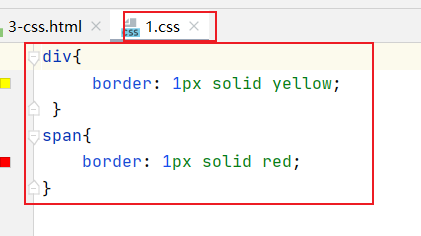

```css
div{
     border: 1px solid yellow;
 }
span{
    border: 1px solid red;
}
```

- html文件代码： 

  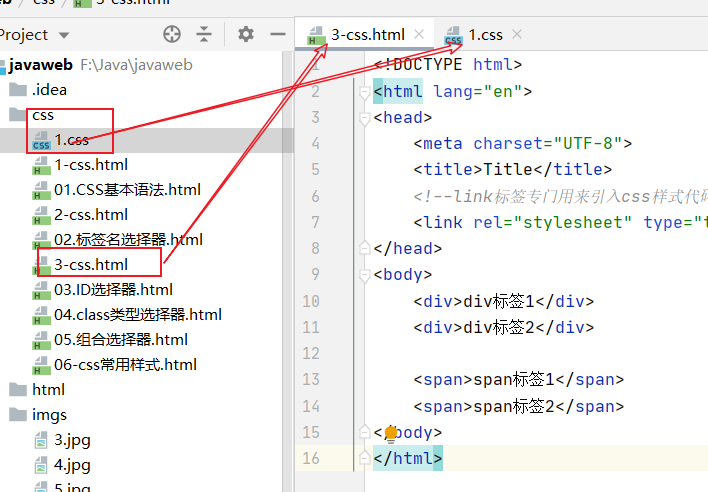

```html
<!DOCTYPE html>
<html lang="en">
<head>
    <meta charset="UTF-8">
    <title>Title</title>
    <!--link标签专门用来引入css样式代码-->
    <link rel="stylesheet" type="text/css" href="1.css"/>
</head>
<body>
    <div>div标签1</div>
    <div>div标签2</div>

    <span>span标签1</span>
    <span>span标签2</span>
</body>
</html>
```

##  CSS选择器 

###  1.标签名选择器 

```css
标签名选择器的格式是：
	标签名{
		属性：值;
	}
	
标签名选择器，可以决定哪些标签被动的使用这个样式。
```

- 示例代码

```html
<!DOCTYPE html>
<html>
<head>
	<meta charset="UTF-8">
	<title>CSS选择器</title>
	<style type="text/css">
		div{
			border: 1px solid yellow;
			color: blue;
			font-size: 30px;
		}
		span{
			border: 5px dashed  blue;
			color: yellow;
			font-size: 20px;
		}
	</style>
</head>
<body>
	<!-- 
	需求1：在所有div标签上修改字体颜色为蓝色，字体大小30个像素。边框为1像素黄色实线。
	并且修改所有span 标签的字体颜色为黄色，字体大小20个像素。边框为5像素蓝色虚线。
	 -->
	<div>div标签1</div>
	<div>div标签2</div>
	<span>span标签1</span>
	<span>span标签2</span>
</body>
</html>  
```

### 2.id选择器 

```css
id选择器的格式是：
	#id属性值{
        属性：值;
	}

id选择器，可以让我们通过id属性选择性的去使用这个样式。
```

- 示例代码：

```html
<!DOCTYPE html>
<html>
<head>
	<meta charset="UTF-8">
	<title>ID选择器</title>
	<style>
		#id001{
			color: blue;
			font-size: 30px;
			border: 1px yellow solid;
		}
		#id002{
			color: red;
			font-size: 20px;
			border: 5px blue dotted;
		}
	</style>
</head>
<body>		
	<!--
	需求1：分别定义两个 div 标签，
	第一个div 标签定义 id 为 id001 ，然后根据id 属性定义css样式修改字体颜色为蓝色，
	字体大小30个像素。边框为1像素黄色实线。
	
	第二个div 标签定义 id 为 id002 ，然后根据id 属性定义css样式 修改的字体颜色为红色，字体大小20个像素。
	边框为5像素蓝色点线。
	 -->
	<div id="id001">div标签1</div>
	<div id="id002">div标签2</div>
</body>
</html>
```

### 3.class选择器

```css
class类型选择器的格式是：
	.class属性值{
        属性：值;
	}

class类型选择器，可以通过class属性有效的选择性地去使用这个样式。
```

- 示例代码 

```html
<!DOCTYPE html>
<html>
<head>
	<meta charset="UTF-8">
	<title>class类型选择器</title>
	<style type="text/css">
		.class01{
			color: blue;
			font-size: 30px;
			border: 1px solid yellow;
		}
		.class02{
			color: grey;
			font-size: 26px;
			border: 1px solid red;
		}
	</style>
</head>
<body>
	<!--
		需求1：修改 class 属性值为 class01的 span 或 div 标签，字体颜色为蓝色，字体大小30个像素。边框为1像素黄色实线。
		需求2：修改 class 属性值为 class02的 div 标签，字体颜色为灰色，字体大小26个像素。边框为1像素红色实线。
	 -->
	<div class="class01">div标签class01</div>
	<div class="class02">div标签</div>
	<span class="class01">span标签class01</span>
	<span class="class02">span标签2</span>
</body>
</html>
```

### 4.组合选择器 

```css
组合选择器的格式是：
	选择器1，选择器2，选择器n{
        属性：值;
	}

组合选择器可以让多个选择器共用同一个css样式代码。
```

- 示例代码

```html
<!DOCTYPE html>
<html>
<head>
    <meta charset="UTF-8">
    <title>class类型选择器</title>
    <style type="text/css">
        .class01 , #id01{
            color: blue;
            font-size: 20px;
            border:  yellow 1px solid;
        }
    </style>
</head>
<body>
	<!-- 
	需求1：修改 class="class01" 的div 标签 和 id="id01" 所有的span标签，
	字体颜色为蓝色，字体大小20个像素。边框为1像素黄色实线。
	 -->
   <div class="class01">div标签class01</div> <br />
   <span>span 标签</span>  <br />
   <div>div标签</div> <br />
   <div id="id01">div标签id01</div> <br />
</body>
</html>
```

### 5.常用样式 

> 1、字体颜色
>
> ```css
> color：red；
> 颜色可以写颜色名如：black,blue,red,green等；
> 颜色也可以写rgb值和十六进制表示值：如rgb(255,0,0)，#00F6DE，如果写十六进制值必须加# 
> ```
>
> ----
>
> 2、宽度
>
> ```css
> width:19px;
> 宽度可以写像素值：19px；
> 也可以写百分比值：20%；
> ```
>
> ----
>
> 3、高度
>
> ```css
> height:20px;
> 高度可以写像素值：19px；
> 也可以写百分比值：20%；
> ```
>
> ----
>
> 4、背景颜色
>
> ```css
> background-color:#0F2D4C
> ```
>
> ----
>
> 5、字体样式：
>
> ```css
> color：#FF0000；字体颜色红色
> font-size：20px;字体大小
> ```
>
> ----
>
> 6、红色1像素实线边框	
>
> ```css
> border：1px solid red;
> ```
>
> ----
>
> 7、DIV居中
>
> ```css
> margin-left:auto;
> margin-right:auto;
> ```
>
> ----
>
> 8、文本居中：
>
> ```css
> text-align:center; 
> ```
>
> ----
>
> 9、超连接去下划线
>
> ```css
> text-decoration:none;
> ```
>
> ----
>
> 10、表格细线
>
> ```css
> table{
> 	border:1px solid black;/*设置边框*/
> 	border-collapse:collapse;/*将边框合并*/
> }
> td,th{
>     border:1px solid black;/*设置边框*/
> }
> ```
>
> ----
>
> 11、列表去除修饰
>
> ```css
> ul{
> 	list-style:none;
> } 
> ```

- 示例代码

```html
<!DOCTYPE html>
<html>
<head>
    <meta charset="UTF-8">
    <title>css常用样式</title>
    <style type="text/css">
        div{
            color: red;
            border: 1px yellow solid;
            width: 300px;
            height: 300px;
            background-color: green;
            font-size: 30px;
            margin-left: auto;
            margin-right: auto;
            text-align: center;
        }
        table{
            border: 1px red solid;
            border-collapse: collapse;
        }

        td{
            border: 1px red solid;
        }
        a{
            text-decoration: none;

        }
        ul{
            list-style: none;
        }
    </style>
</head>
<body>
    <ul>
        <li>23333333333</li>
        <li>23333333333</li>
        <li>23333333333</li>
        <li>23333333333</li>
        <li>23333333333</li>
    </ul>
    <table>
        <tr>
            <td>2.1</td>
            <td>2.2</td>
        </tr>
    </table>
    <a href="http://www.baidu.com">百度</a>
    <div>这是div标签</div>
</body>
</html>
```

