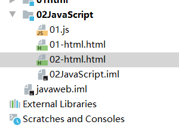
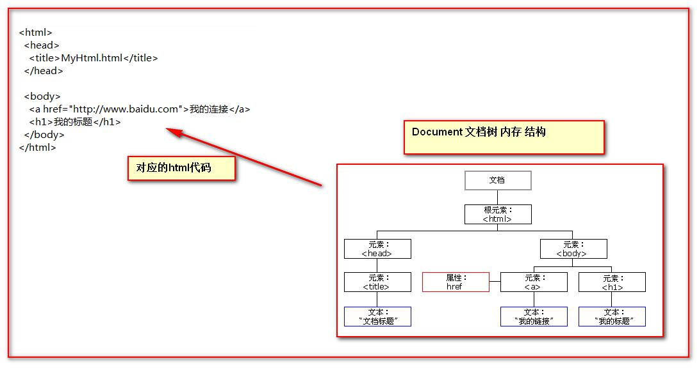

[TOC]

#  JavaScript语言入门 

[JavaScript文档](https://www.yuque.com/nizhegechouloudetuboshu/library/defyyo)

## JavaScript介绍 

- Javascript语言诞生主要是完成页面的数据验证。因此它运行在客户端，需要运行浏览器来解析执行JavaScript代码。
- JS是Netscape网景公司的产品，最早取名为LiveScript;为了吸引更多java程序员。更名为JavaScript。
- JS是弱类型，Java是强类型。 
  - 弱类型就是类型可变。
  - 强类型，就是定义变量时。类型以确定，且不可变的。

> 特点：
>
> 1. 交互性（它可以做的就是信息的动态交互）
>
> 2. 安全性（不允许直接访问本地硬盘）
>
> 3. 跨平台性（只要是可以解释JS的浏览器都可以执行，和平台无关） 

## JavaScript和HTML代码的结合方式 

### 第一种方式

- 只需要在head标签中，或者在body标签中，使用script标签来书写JavaScript代码。  

```html
<!DOCTYPE html>
<html lang="en">
<head>
    <meta charset="UTF-8">
    <title>Title</title>
    <script type="text/javascript">
        // alert是JavaScript语言提供的一个警告框函数。
        // 它可以接收任意类型的参数，这个参数就是警告框的提示信息
        alert("Hello JavaScript!");
    </script>
</head>
<body>

</body>
</html>
```


### 第二种方式

- 使用script标签引入单独的JavaScript代码文件 

- 文件目录



- 示例代码——01.js

```js
alert("12306 hello");
```

- 02-html.html

```html
<!DOCTYPE html>
<html lang="en">
<head>
    <meta charset="UTF-8">
    <title>Title</title>
    <!--
        现在需要使用script引入外部的js文件来执行
            src 属性专门用来引入js文件路径（可以是相对路径，也可以是绝对路径）

        script标签可以用来定义js代码，也可以用来引入js文件
        但是，两个功能二选一使用。不能同时使用两个功能
    -->
    <script type="text/javascript" src="01.js"></script>
    <script type="text/javascript">
        alert("这里能执行？");
    </script>
</head>
<body>

</body>
</html>
```

## 变量

- 什么是变量？变量是可以存放某些值的内存的命名。 

> ```html
> JavaScript的变量类型：
> 	数值类型：number
> 	字符串类型：string
> 	对象类型：object
> 	布尔类型：boolean
> 	函数类型：function
> 
> JavaScript里特殊的值：
> 	undefined未定义，所有js变量未赋于初始值的时候，默认值都是undefined.
> 	null空值
> 	NaN全称是：NotaNumber。非数字。非数值。
> 
> JS中的定义变量格式：
> 	var 变量名;
> 	var 变量名=值;
> ```

```html
<!DOCTYPE html>
<html lang="en">
<head>
    <meta charset="UTF-8">
    <title>Title</title>
    <script>
        var i;
        // alert(i); // undefined

        i = 12;
        // typeof()是JavaScript语言提供的一个函数。
        // alert( typeof(i) ); // number

        i = "abc";
        // 它可以取变量的数据类型返回
        // alert( typeof(i) ); // String

        var a = 12;
        var b = "abc";

        alert( a * b ); // NaN是非数字，非数值。
    </script>
</head>
<body>

</body>
</html>
```

##  关系（比较）运算 

> ```html
> 等于：	==	等于是简单的做字面值的比较;
> 全等于：	===	除了做字面值的比较之外，还会比较两个变量的数据类型.
> ```

```html
<!DOCTYPE html>
<html lang="en">
<head>
    <meta charset="UTF-8">
    <title>Title</title>
    <script type="text/javascript">
        var a = "12";
        var b = 12;

        alert(a==b);    //true
        alert(a===b);   //false
    </script>
</head>
<body>

</body>
</html>
```

## 逻辑运算 

> ```html
> 且运算：&&
> 或运算：||
> 取反运算：!
> 
> 在JavaScript语言中，所有的变量，都可以做为一个boolean类型的变量去使用。
> 0、null、undefined、””(空串)都认为是false；
> ```

```html
<!DOCTYPE html>
<html lang="en">
<head>
    <meta charset="UTF-8">
    <title>Title</title>
    <script type="text/javascript">
        // 在JavaScript语言中，所有的变量，都可以做为一个boolean类型的变量去使用。
        // 0 、null、 undefined、””(空串) 都认为是 false；

        var a = 0;
        if(a){
            alert("0为真");
        } else {
            alert("0为假");
        }

        var b = null;
        if(b){
            alert("null为真");
        } else {
            alert("null为假");
        }

        var c = undefined;
        if(c){
            alert("undefined为真");
        } else {
            alert("undefined为假");
        }

        var d = "";
        if(d){
            alert("空串为真");
        } else {
            alert("空串为假");
        }

        // && 且运算,有两种情况：
        // 	第一种：当表达式全为真的时候。返回最后一个表达式的值。
	    //     第二种：当表达式中，有一个为假的时候。返回第一个为假的表达式的值。

        // var a = "abc";
        // var b = true;
        // var d = false;
        // var c = null;

        // alert( a && b );//true
        // alert( b && a );//abc
        // alert( a && d ); // false
        // alert( a && c ); // null

        // || 或运算
        // 第一种情况：当表达式全为假时，返回最后一个表达式的值
        // 第二种情况：只要有一个表达式为真。就会把回第一个为真的表达式的值

        // alert( d || c ); // null
        // alert( c || d ); // false
        //
        // alert( a || c ); // abc
        // alert( b || c ); // true
    </script>
</head>
<body>

</body>
</html>
```

## 数组 

> ```html
> JS中数组的定义：
> 	格式：var数组名=[];	//	空数组
> 	var数组名=[1,’abc’,true];	//	定义数组同时赋值元素
> ```

```html
<!DOCTYPE html>
<html lang="en">
<head>
    <meta charset="UTF-8">
    <title>Title</title>
    <script type="text/javascript">
        var arr = [];   //定义一个空数组
        alert(arr.length);  //0

        arr[0] = 12;
        alert( arr[0] );    //12
        alert(arr.length);  //1

        // javaScript语言中的数组，只要我们通过数组下标赋值，
        // 那么最大的下标值，就会自动的给数组做扩容操作。
        arr[2] = "abc";
        alert(arr.length);  //3

        alert(arr[1]);  //undefined
        //数组遍历
        for(var i=0;i<arr.length;i++){
            alert(arr[i]);
        }
    </script>
</head>
<body>

</body>
</html>
```

## 函数

### 第一种定义方式

- 使用function关键字来定义函数。 

```html
使用的格式如下:
	function 函数名(形参列表){
		函数体
	}
```

> 在JavaScript语言中，如何定义带有返回值的函数？
>
> 只需要在函数体内直接使用return语句返回值即可！ 

```html
<!DOCTYPE html>
<html lang="en">
<head>
    <meta charset="UTF-8">
    <title>Title</title>
    <script type="text/javascript">
        // 定义一个无参函数
        function fun(){
            alert("无参函数fun()被调用了");
        }
        // 函数调用===才会执行
        fun();

        function fun2(a ,b) {
            alert("有参函数fun2()被调用了 a=>" + a + ",b=>"+b);
        }
        fun2(12,"abc");

        // 定义带有返回值的函数
        function sum(num1,num2) {
            var result = num1 + num2;
            return result;
        }

        alert( sum(100,50) );   //150
    </script>
</head>
<body>

</body>
</html>
```

### 第二种定义方式

```html
使用格式如下：
	var 函数名 = function(形参列表){
		函数体
	}
```

```html
<!DOCTYPE html>
<html lang="en">
<head>
    <meta charset="UTF-8">
    <title>Title</title>
    <script type="text/javascript">
        var fun = function () {
            alert("无参函数");
        }
        fun();

        var fun2 = function (a,b) {
            alert("有参函数a=" + a + ",b=" + b)
        }
        fun2(3,4);

        var fun3 = function (num1,num2) {
            return num1+num2;
        }
        alert(fun3(600,42));    //642
    </script>
</head>
<body>

</body>
</html>
```

- 注：在Java中函数允许重载。但是在JS中函数的重载会直接覆盖掉上一次的定义。

```html
<!DOCTYPE html>
<html lang="en">
<head>
    <meta charset="UTF-8">
    <title>Title</title>
    <script type="text/javascript">
        function fun(a,b) {
            alert("有参函数fun(a,b)");
        }

        function fun() {
            alert("无参函数fun()")
        }

        fun(1,"cd");
    </script>
</head>
<body>

</body>
</html>
```

## 函数的arguments隐形参数（只在function函数内） 

> ```html
> 就是在function函数中不需要定义，但却可以直接用来获取所有参数的变量。我们管它叫隐形参数。
> 隐形参数特别像java基础的可变长参数一样。
> public void fun(Object...args);
> 可变长参数其他是一个数组。
> 那么js中的隐形参数也跟java的可变长参数一样。操作类似数组。
> ```

```html
<!DOCTYPE html>
<html lang="en">
<head>
    <meta charset="UTF-8">
    <title>Title</title>
    <script type="text/javascript">
        function fun() {
            alert(arguments.length);    //可看成参数的个数

            alert(arguments[0]);
            alert(arguments[1]);
            alert(arguments[2]);

            alert("a = " + a);

            for(var i = 0;i<arguments.length;i++){
                alert(arguments[i]);
            }

            alert("无参函数fun()");
        }
        fun(1,"fk",true);

        // 需求：要求 编写 一个函数。用于计算所有参数相加的和并返回
        function sum(num1,num2) {
            var result = 0;
            for(var i = 0;i<arguments.length;i++){
                if (typeof(arguments[i]) == "number") {
                    result += arguments[i];
                }
            }
            return result;
        }
        alert(sum(1,2,3,4,"abc",5,6,7,8,9));
    </script>
</head>
<body>

</body>
</html>
```

## JS中的自定义对象 

### Object形式的自定义对象 

> ```html
> 对象的定义：
> 	var 变量名 = new Object(); //对象实例（空对象）
> 	变量名.属性名 = 值;//定义一个属性
> 	变量名.函数名 = function(){}//定义一个函数
> 
> 对象的访问：
> 	变量名.属性/函数名(); 
> ```

```html
<!DOCTYPE html>
<html lang="en">
<head>
    <meta charset="UTF-8">
    <title>Title</title>
    <script type="text/javascript">
        // 对象的定义：
        //     var 变量名 = new Object();   // 对象实例（空对象）
        //     变量名.属性名 = 值;		  // 定义一个属性
        //     变量名.函数名 = function(){}  // 定义一个函数
        var obj = new Object();
        obj.name = "刘刚";
        obj.age = 20;
        obj.fun = function () {
            alert("姓名：" + this.name + " , 年龄：" + this.age);
        }
        // 对象的访问：
        //     变量名.属性 / 函数名();
        // alert( obj.age );
        obj.fun();
    </script>
</head>
<body>

</body>
</html>
```

### {}花括号形式的自定义对象 

> ```html
> 对象的定义：
> 	var 变量名 = {//空对象
> 		属性名：值,//定义一个属性
> 		属性名：值,//定义一个属性
> 		函数名：function(){}//定义一个函数
> 	};
> 
> 对象的访问：
> 	变量名.属性/函数名(); 
> ```

```html
<!DOCTYPE html>
<html lang="en">
<head>
    <meta charset="UTF-8">
    <title>Title</title>
    <script type="text/javascript" >
        // 对象的定义：
        // var 变量名 = {			// 空对象
        //     属性名：值,			// 定义一个属性
        //     属性名：值,			// 定义一个属性
        //     函数名：function(){}	// 定义一个函数
        // };
        var obj = {
            name:"霍镐",
            age:19,
            fun : function () {
                alert("姓名：" + this.name + " , 年龄：" + this.age);
            }
        };

        // 对象的访问：
        //     变量名.属性 / 函数名();
        alert(obj.name);
        obj.fun();
    </script>
</head>
<body>

</body>
</html>
```

##  js中的事件 

> 什么是事件？
>
> 事件是电脑输入设备与页面进行交互的响应。我们称之为事件。 

- 常用的事件：
  - onload 加载完成事件：页面加载完成之后，常用于做页面js代码初始化操作
  - onclick 单击事件：常用于按钮的点击响应操作。
  - onblur 失去焦点事件：常用用于输入框失去焦点后验证其输入内容是否合法。
  - onchange 内容发生改变事件：常用于下拉列表和输入框内容发生改变后操作
  - onsubmit 表单提交事件：常用于表单提交前，验证所有表单项是否合法。 

- 事件的注册又分为静态注册和动态注册两种： 

> 什么是事件的注册（绑定）？
>
> 其实就是告诉浏览器，当事件响应后要执行哪些操作代码，叫事件注册或事件绑定。

- 静态注册事件：通过html标签的事件属性直接赋于事件响应后的代码，这种方式我们叫静态注册。
- 动态注册事件：是指先通过js代码得到标签的dom对象，然后再通过dom对象.事件名=function(){}这种形式赋于事件响应后的代码，叫动态注册。 

```html
动态注册基本步骤：
	1、获取标签对象
	2、标签对象.事件名=fucntion(){}
```

> onload加载完成事件 

```html
<!DOCTYPE html>
<html lang="en">
<head>
    <meta charset="UTF-8">
    <title>Title</title>
    <script type="text/javascript">
        // onload事件的方法
        function onloadFun() {
            alert('静态注册onload事件，所有代码');
        }

        // onload事件动态注册。这是固定写法
        window.onload = function () {
            alert("动态注册的onload事件");
        }
    </script>
</head>
<!--静态注册onload事件-->
<!--onload事件是浏览器解析完页面之后就会自动触发的事件-->
<body onload="onloadFun();">

</body>
</html>
```

> onclick单击事件 

```html
<!DOCTYPE html>
<html lang="en">
<head>
    <meta charset="UTF-8">
    <title>Title</title>
    <script type="text/javascript">
        function onclickFun() {
            alert("静态注册onclick事件");
        }

        // 动态注册onclick事件
        window.onload = function () {
            // 1 获取标签对象
            /*
            * document 是JavaScript语言提供的一个对象（文档）<br/>
            * get           获取
            * Element       元素（就是标签）
            * By            通过。。   由。。经。。。
            * Id            id属性
            *
            * getElementById通过id属性获取标签对象
            **/
            var btnObj = document.getElementById("btn01");
            // alert( btnObj );
            // 2 通过标签对象.事件名 = function(){}
            btnObj.onclick = function () {
                alert("动态注册的onclick事件");
            }
        }
    </script>
</head>
<body>
    <!--静态注册onClick事件-->
    <button onclick="onclickFun();">按钮1</button>
    <button id="btn01">按钮2</button>
</body>
</html>
```

> onblur失去焦点事件 

```html
<!DOCTYPE html>
<html lang="en">
<head>
    <meta charset="UTF-8">
    <title>Title</title>
    <script type="text/javascript">
        // 静态注册失去焦点事件
        function onblurFun() {
            // console是控制台对象，是由JavaScript语言提供，专门用来向浏览器的控制器打印输出， 用于测试使用
            // log() 是打印的方法
            console.log("静态注册失去焦点事件");
        }

        // 动态注册 onblur事件
        window.onload = function () {
            // 1 获取标签对象
            var passwordObj = document.getElementById("password");
            // alert(passwordObj);
            //  2 通过标签对象.事件名 = function(){};
            passwordObj.onblur = function () {
                console.log("动态注册失去焦点事件");
            }
        }
    </script>
</head>
<body>
    用户名:<input type="text" onblur="onblurFun();"><br/>
    密码:<input id="password" type="text" ><br/>
</body>
</html>
```

> onchange内容发生改变事件 

```html
<!DOCTYPE html>
<html lang="en">
<head>
    <meta charset="UTF-8">
    <title>Title</title>
    <script type="text/javascript">
        function onchangeFun() {
            alert("你已选择1");
        }

        window.onload = function () {
            // 1 获取标签对象
            var selObj = document.getElementById("opk2");
            // alert( selObj );
            // 2 通过标签对象.事件名 = function(){}
            selObj.onchange = function () {
                alert("你已选择2");
            }
        }
    </script>
</head>
<body>
    请回答你的选择1：
    <!--静态注册onchange事件-->
    <select onchange="onchangeFun();">
        <option>--诚信--</option>
        <option>--友善--</option>
        <option>--文明--</option>
        <option>--敬业--</option>
    </select>

    请回答你的选择2：
    <select id="opk2">
        <option>--自由--</option>
        <option>--平等--</option>
        <option>--公正--</option>
        <option>--法制--</option>
    </select>
</body>
</html>
```

> onsubmit表单提交事件 

```html
<!DOCTYPE html>
<html lang="en">
<head>
    <meta charset="UTF-8">
    <title>Title</title>
    <script type="text/javascript" >
        // 静态注册表单提交事务
        function onsubmitFun(){
            // 要验证所有表单项是否合法，如果，有一个不合法就阻止表单提交
            alert("静态注册表单提交事件----发现不合法");
            return false;
        }

        window.onload = function () {
            //1 获取标签对象
            var formObj = document.getElementById("fgh01");
            //2 通过标签对象.事件名 = function(){}
            formObj.onsubmit = function () {
                // 要验证所有表单项是否合法，如果，有一个不合法就阻止表单提交
                alert("动态注册表单提交事件----发现不合法");

                return false;
            }
        }
    </script>
</head>
<body>
    <!--return false 可以阻止 表单提交 -->
    <form action="http://localhost:8080" method="get" onsubmit="return onsubmitFun();">
        <input type="submit" value="静态注册"/>
    </form>
    <form action="http://localhost:8080" id="fgh01">
        <input type="submit" value="动态注册"/>
    </form>
</body>
</html>
```

## DOM模型 

> DOM全称是Document Object Model文档对象模型。
>
> 大白话:就是把文档中的标签，属性，文本，转换成为对象来管理。 

### 1.Document对象 



> ```html
> Document对象的理解： 
>     第一点：Document它管理了所有的 HTML 文档内容。 
>     第二点：Document它是一种树结构的文档。有层级关系。 
>     第三点：它让我们把所有的标签都对象化 
>     第四点：我们可以通过Document访问所有的标签对象。 
> ```

----

> 什么是对象化？？ 

```java
举例： 
有一个人有年龄：18岁，性别：女，名字：张某某 我们要把这个人的信息对象化怎么办！

class Person {
    private int age; 
    private String sex; 
    private String name;
}
```

> 那么html标签要对象化,怎么办？

```html
<body> 
	<div id="div01">div01</div> 
</body>
```

> 模拟对象化，相当于：

```java
class Dom{
    private String id;//id属性		
    private Stringt agName;//表示标签名
    private Dom parentNode;//父亲
    private List<Dom> children;//孩子结点
    private String innerHTML;//起始标签和结束标签中间的内容
}
```

### 2.Document对象中的方法介绍 

> document.getElementById(elementId)
>
> 通过标签的id属性查找标签dom对象，elementId是标签的id属性值.

> document.getElementsByName(elementName)
>
> 通过标签的name属性查找标签dom对象，elementName标签的name属性值.

> document.getElementsByTagName(tagname)
>
> 通过标签名查找标签dom对象。tagname是标签名.

> document.createElement(tagName)
>
> 方法，通过给定的标签名，创建一个标签对象。tagName是要创建的标签名. 

----

> getElementById方法示例：

```html
<!DOCTYPE html>
<html lang="en">
<head>
    <meta charset="UTF-8">
    <title>Title</title>
    <script type="text/javascript" >
        /*
        * 需求：当用户点击了较验按钮，要获取输出框中的内容。然后验证其是否合法。<br/>
        * 验证的规则是：必须由字母，数字。下划线组成。并且长度是5到12位。
        * */
        function onclickFun() {
            // 1 当我们要操作一个标签的时候，一定要先获取这个标签对象。
            var usernameObj = document.getElementById("username");
            // [object HTMLInputElement] 它就是dom对象
            var usernameText = usernameObj.value;
            // 如何 验证 字符串，符合某个规则 ，需要使用正则表达式技术
            var patt = /^\w{5,12}$/;
            /*
            *  test()方法用于测试某个字符串，是不是匹配我的规则 ，
            *  匹配就返回true。不匹配就返回false.
            * */

            if (patt.test(usernameText)) {
                alert("用户名合法！");
            } else {
                alert("用户名不合法！");
            }
        }
    </script>
</head>
<body>
    用户名：<input type="text" id="username" value="null"/>
    <button onclick="onclickFun()">校验</button>
</body>
</html>
```

> getElementsByName方法示例: 

```html
<!DOCTYPE html>
<html lang="en">
<head>
    <meta charset="UTF-8">
    <title>Title</title>
    <script type="text/javascript">
        // 表示要求字符串中，是否包含字母e
        var patt = new RegExp("e");
        // var patt = /e/; // 也是正则表达式对象
        // 表示要求字符串中，是否包含字母a或b或c
        // var patt = /[abc]/;
        // 表示要求字符串，是否包含小写字母
        // var patt = /[a-z]/;
        // 表示要求字符串，是否包含任意大写字母
        // var patt = /[A-Z]/;
        // 表示要求字符串，是否包含任意数字
        // var patt = /[0-9]/;
        // 表示要求字符串，是否包含字母，数字，下划线
        // var patt = /\w/;
        // 表示要求 字符串中是否包含至少一个a
        // var patt = /a+/;
        // 表示要求 字符串中是否 *包含* 零个 或 多个a
        // var patt = /a*/;
        // 表示要求 字符串是否包含一个或零个a
        // var patt = /a?/;
        // 表示要求 字符串是否包含连续三个a
        // var patt = /a{3}/;
        // 表示要求 字符串是否包 至少3个连续的a，最多5个连续的a
        // var patt = /a{3,5}/;
        // 表示要求 字符串是否包 至少3个连续的a，
        // var patt = /a{3,}/;
        // 表示要求 字符串必须以a结尾
        // var patt = /a$/;
        // 表示要求 字符串必须以a打头
        // var patt = /^a/;

        // 要求字符串中是否*包含* 至少3个连续的a
        // var patt = /a{3,5}/;
        // 要求字符串，从头到尾都必须完全匹配
        // var patt = /^a{3,5}$/;

        // var patt = /^\w{5,12}$/;
        var str = "sbgtjfjum";
        alert( patt.test(str) );
    </script>
</head>
<body>

</body>
</html>
```

> 两种常见的验证提示效果:

```html
<!DOCTYPE html>
<html lang="en">
<head>
    <meta charset="UTF-8">
    <title>Title</title>
    <script type="text/javascript" >
        /*
        * 需求：当用户点击了较验按钮，要获取输出框中的内容。然后验证其是否合法。<br/>
        * 验证的规则是：必须由字母，数字。下划线组成。并且长度是5到12位。
        * */
        function onclickFun() {
            // 1 当我们要操作一个标签的时候，一定要先获取这个标签对象。
            var usernameObj = document.getElementById("username");
            // [object HTMLInputElement] 它就是dom对象
            var usernameText = usernameObj.value;
            // 如何 验证 字符串，符合某个规则 ，需要使用正则表达式技术
            var patt = /^\w{5,12}$/;
            /*
            *  test()方法用于测试某个字符串，是不是匹配我的规则 ，
            *  匹配就返回true。不匹配就返回false.
            * */

            var usernameSpanObj = document.getElementById("usernameSpan");
            // innerHTML 表示起始标签和结束标签中的内容
            // innerHTML 这个属性可读，可写
            usernameSpanObj.innerHTML = "这个属性可读写！";

            if (patt.test(usernameText)) {
                // alert("用户名合法！");
                usernameSpanObj.innerHTML = "用户名合法！";
                // usernameSpanObj.innerHTML = "";
            } else {
                // alert("用户名不合法！");
                usernameSpanObj.innerHTML = "用户名不合法！";
                // usernameSpanObj.innerHTML = "";
            }
        }
    </script>
</head>
<body>
    用户名：<input type="text" id="username" value="null"/>
    <span id="usernameSpan" style="color:red;">

    </span>
    <button onclick="onclickFun()">校验</button>
</body>
</html>
```

----

> getElementsByTagName方法示例:

```html
<!DOCTYPE html>
<html lang="en">
<head>
    <meta charset="UTF-8">
    <title>Title</title>
    <script type="text/javascript">
        // 全选
        function checkAll() {
            // 让所有复选框都选中
            // document.getElementsByName();
            // 是根据指定的name属性查询返回多个标签对象集合
            // 这个集合的操作跟数组一样
            // 集合中每个元素都是dom对象
            // 这个集合中的元素顺序是他们在html页面中从上到下的顺序
            var hobbies = document.getElementsByName("hobby");
            // checked 表示复选框的选中状态。如果选中是true，不选中是false
            // checked 这个属性可读，可写
            for (var i = 0; i < hobbies.length; i++){
                hobbies[i].checked = true;
            }
        }
        //全不选
        function checkNo() {
            var hobbies = document.getElementsByName("hobby");

            for (var i = 0; i < hobbies.length; i++){
                hobbies[i].checked = false;
            }
        }
        // 反选
        function checkReverse() {
            var hobbies = document.getElementsByName("hobby");

            for (var i = 0; i < hobbies.length; i++) {
                // if (hobbies[i].checked) {
                //     hobbies[i].checked = false;
                // }else {
                //     hobbies[i].checked = true;
                // }
                
                hobbies[i].checked = !hobbies[i].checked;
            }
        }
    </script>
</head>
<body>
    兴趣爱好:
    <input type="checkbox" name="hobby" value="cpp" checked="checked">C++
    <input type="checkbox" name="hobby" value="java">Java
    <input type="checkbox" name="hobby" value="js">JavaScript
    <br/>
    <button onclick="checkAll()">全选</button>
    <button onclick="checkNo()">全不选</button>
    <button onclick="checkReverse()">反选</button>
</body>
</html>
```

> createElement方法示例:

```html
<!DOCTYPE html>
<html lang="en">
<head>
    <meta charset="UTF-8">
    <title>Title</title>
    <script type="text/javascript">
        // 全选
        function checkAll() {
            alert( document.getElementById("guf01") );
            // document.getElementsByTagName("input");
            // 是按照指定标签名来进行查询并返回集合
            // 这个集合的操作跟数组 一样
            // 集合中都是dom对象
            // 集合中元素顺序是在html页面中从上到下的顺序。
            var inputs = document.getElementsByTagName("input");

            for (var i = 0; i < inputs.length; i++){
                inputs[i].checked = true;
            }
        }
    </script>
</head>
<body>
    兴趣爱好:
    <input type="checkbox" value="cpp" checked="checked">C++
    <input type="checkbox" value="java">Java
    <input type="checkbox" value="js">JavaScript
    <br/>
    <button id="guf01" onclick="checkAll()">全选</button>
</body>
</html>
```

- 注
  - document对象的三个查询方法，如果有id属性，优先使用getElementById方法来进行查询；
  - 如果没有id属性，则优先使用getElementsByName方法来进行查询；
  - 如果id属性和name属性都没有最后再按标签名查getElementsByTagName。
  - 以上三个方法，一定要在页面加载完成之后执行，才能查询到标签对象。 

  ```html
  <!DOCTYPE html>
  <html lang="en">
  <head>
      <meta charset="UTF-8">
      <title>Title</title>
      <script type="text/javascript">
          window.onload = function(){
              alert( document.getElementById("guf01") );
          }
  
          // 全选
          function checkAll() {
              // alert( document.getElementById("guf01") );
              // document.getElementsByTagName("input");
              // 是按照指定标签名来进行查询并返回集合
              // 这个集合的操作跟数组 一样
              // 集合中都是dom对象
              // 集合中元素顺序是在html页面中从上到下的顺序。
              var inputs = document.getElementsByTagName("input");
  
              for (var i = 0; i < inputs.length; i++){
                  inputs[i].checked = true;
              }
          }
      </script>
  </head>
  <body>
      兴趣爱好:
      <input type="checkbox" value="cpp" checked="checked">C++
      <input type="checkbox" value="java">Java
      <input type="checkbox" value="js">JavaScript
      <br/>
      <button id="guf01" onclick="checkAll()">全选</button>
  </body>
  </html>
  ```

### 3.节点的常用属性和方法 

- 节点就是标签对象 

> ```html
> 方法：
>     通过具体的元素节点调用
>     getElementsByTagName()
>     方法，获取当前节点的指定标签名孩子节点
> 
>     appendChild(oChildNode)
>     方法，可以添加一个子节点，oChildNode是要添加的孩子节点
> ```
>
> ----
>
> ```html
> 属性：
> 	childNodes
> 	属性，获取当前节点的所有子节点;
> 	
> 	firstChild
> 	属性，获取当前节点的第一个子节点;
>     
> 	lastChild
> 	属性，获取当前节点的最后一个子节点;
>     
> 	parentNode
> 	属性，获取当前节点的父节点;
> 
>     nextSibling
> 	属性，获取当前节点的下一个节点;
> 
>     previousSibling
> 	属性，获取当前节点的上一个节点;
> 
> 	className
> 	用于获取或设置标签的class属性值;
> 
> 	innerHTML
> 	属性，表示获取/设置起始标签和结束标签中的内容;
> 
> 	innerText
> 	属性，表示获取/设置起始标签和结束标签中的文本;
> ```

- CSS.CSS文件

```css
@CHARSET "UTF-8";

body {
	width: 800px;
	margin-left: auto;
	margin-right: auto;
}

button {
	width: 300px;
	margin-bottom: 10px;
}

#btnList {
	float:left;
}

#total{
	width: 450px;
	float:left;
}

ul{
	list-style-type: none;
	margin: 0px;
	padding: 0px;
}

.inner li{
	border-style: solid;
	border-width: 1px;
	padding: 5px;
	margin: 5px;
	background-color: coral;
	float:left;
}

.inner{
	width:400px;
	border-style: solid;
	border-width: 1px;
	margin-bottom: 10px;
	padding: 10px;
	float: left;
}
```

- HTML文件

```html
<!DOCTYPE html>
<html>
<head>
	<meta charset="UTF-8">
	<title>dom查询</title>
	<link rel="stylesheet" type="text/css" href="style/css.css" />
	<script type="text/javascript">
		window.onload = function(){
			//1.查找#bj节点
			document.getElementById("guf01").onclick = function () {
				var bjObj = document.getElementById("gu");
				alert(bjObj.innerHTML);
			}
			//2.查找所有li节点
			var btn02Ele = document.getElementById("guf02");
			btn02Ele.onclick = function(){
				var lis = document.getElementsByTagName("li");
				alert(lis.length)
			};
			//3.查找name=gender的所有节点
			var btn03Ele = document.getElementById("guf03");
			btn03Ele.onclick = function(){
				var genders = document.getElementsByName("gender");
				alert(genders.length)
			};
			//4.查找#city下所有li节点
			var btn04Ele = document.getElementById("guf04");
			btn04Ele.onclick = function(){
				//1 获取id为city的节点
				//2 通过city节点.getElementsByTagName按标签名查子节点
				var lis = document.getElementById("city").getElementsByTagName("li");
				alert(lis.length)
			};
			//5.返回#city的所有子节点
			var btn05Ele = document.getElementById("guf05");
			btn05Ele.onclick = function(){
				//1 获取id为city的节点
				//2 通过city获取所有子节点
				alert(document.getElementById("city").childNodes.length);
			};
			//6.返回#phone的第一个子节点
			var btn06Ele = document.getElementById("guf06");
			btn06Ele.onclick = function(){
				// 查询id为phone的节点
				alert( document.getElementById("phone").firstChild.innerHTML );
			};
			//7.返回#bj的父节点
			var btn07Ele = document.getElementById("guf07");
			btn07Ele.onclick = function(){
				//1 查询id为bj的节点
				var bjObj = document.getElementById("bj");
				//2 bj节点获取父节点
				alert( bjObj.parentNode.innerHTML );
			};
			//8.返回#android的前一个兄弟节点
			var btn08Ele = document.getElementById("guf08");
			btn08Ele.onclick = function(){
				// 获取id为android的节点
				// 通过android节点获取前面兄弟节点
				alert( document.getElementById("android").previousSibling.innerHTML );
			};
			//9.读取#username的value属性值
			var btn09Ele = document.getElementById("guf09");
			btn09Ele.onclick = function(){
				alert(document.getElementById("username").value);
			};
			//10.设置#username的value属性值
			var btn10Ele = document.getElementById("guf10");
			btn10Ele.onclick = function(){
				document.getElementById("username").value = "这里不想写了！！";
			};
			//11.返回#bj的文本值
			var btn11Ele = document.getElementById("guf11");
			btn11Ele.onclick = function(){
				alert(document.getElementById("city").innerHTML);
				// alert(document.getElementById("city").innerText);
			};
		};
	</script>
</head>
<body>
<div id="total">
	<div class="inner">
		<p>
			你喜欢哪个城市?
		</p>

		<ul id="city">
			<li id="bj">商丘</li>
			<li>大连</li>
			<li>迈阿密</li>
			<li>悉尼</li>
		</ul>

		<br>
		<br>

		<p>
			你喜欢哪款游戏?
		</p>

		<ul id="game">
			<li id="rl">下棋</li>
			<li>吃鸡</li>
			<li>QQ飞车</li>
			<li>联盟</li>
		</ul>

		<br />
		<br />

		<p>
			你手机的操作系统是?
		</p>

		<ul id="phone"><li>HarmonyOS</li><li id="android">Android</li><li>Windows Phone</li></ul>
	</div>

	<div class="inner">
		gender:
		<input type="radio" name="gender" value="male"/>
		Male
		<input type="radio" name="gender" value="female"/>
		Female
		<br>
		<br>
		name:
		<input type="text" name="name" id="username" value="null"/>
	</div>
</div>
<div id="btnList">
	<div><button id="guf01">查找#bj节点</button></div>
	<div><button id="guf02">查找所有li节点</button></div>
	<div><button id="guf03">查找name=gender的所有节点</button></div>
	<div><button id="guf04">查找#city下所有li节点</button></div>
	<div><button id="guf05">返回#city的所有子节点</button></div>
	<div><button id="guf06">返回#phone的第一个子节点</button></div>
	<div><button id="guf07">返回#bj的父节点</button></div>
	<div><button id="guf08">返回#android的前一个兄弟节点</button></div>
	<div><button id="guf09">返回#username的value属性值</button></div>
	<div><button id="guf10">设置#username的value属性值</button></div>
	<div><button id="guf11">返回#bj的文本值</button></div>
</div>
</body>
</html>
```

### document对象补充说明

```html
<!DOCTYPE html>
<html lang="en">
<head>
    <meta charset="UTF-8">
    <title>Title</title>
    <script type="text/javascript">
        window.onload = function () {
            // 现在需要使用js代码来创建html标签，并显示在页面上
            // 标签的内容就是：<div>这是一个文本标签</div>
            var divObj = document.createElement("div"); // 在内存中 <div></div>

            var textNodeObj = document.createTextNode("这是一个文本标签"); // 有一个文本节点对象 #这是一个文本标签

            divObj.appendChild(textNodeObj); // <div>这是一个文本标签</div>

            // divObj.innerHTML = "这是一个文本标签"; // <div>这是一个文本标签</div>,但，还只是在内存中
            // 添加子元素
            document.body.appendChild(divObj);
        }
    </script>
</head>
<body>

</body>
</html>
```

