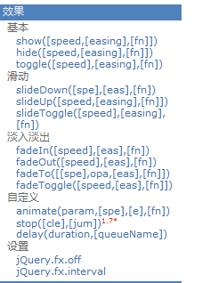

[TOC]

# jQuery  

> [jQuery文档及类库](https://www.yuque.com/nizhegechouloudetuboshu/library/defyyo)

## jQuery介绍 

> 什么是jQuery?
>
> jQuery，顾名思义，也就是JavaScript和查询（Query），它就是辅助JavaScript开发的js类库。 

> jQuery核心思想！！！
>
> 它的核心思想是writeless,domore(写得更少,做得更多)，所以它实现了很多浏览器的兼容问题。 

> jQuery流行程度！！！
>
> jQuery现在已经成为最流行的JavaScript库，在世界前10000个访问最多的网站中，有超过55%在使用jQuery。 

> jQuery好处！！！
>
> jQuery是免费、开源的，jQuery的语法设计可以使开发更加便捷，例如操作文档对象、选择DOM元素、制作动画效果、事件处理、使用Ajax以及其他功能。 

## jQuery的初体验！！！

> 需求：使用jQuery给一个按钮绑定单击事件? 

```html
<!DOCTYPE html>
<html lang="en">
<head>
	<meta charset="UTF-8">
	<title>Title</title>
	<script type="text/javascript" src="../../script/jquery-1.7.2.js"></script>
	<script type="text/javascript" >
		// window.onload = function () {
		// 	var btnObj = document.getElementById("btnId");
		// 	alert(btnObj);	//[object HTMLButtonElement]   ====>>>  dom对象
		// 	btnObj.onclick = function () {
		// 		alert("js 原生点击事件");
		// 	}
		// }
		$(function () {// 表示页面加载完成之后，相当 window.onload = function () {}
			var $btnObj = $("#btnId"); // 表示按id查询标签对象
			$btnObj.click(function () { // 绑定单击事件
				alert("jQuery 的单击事件");
			});
		})
	</script>
</head>
<body>
	<button id="btnId">SayHello</button>
</body>
</html>
```

> 常见问题？
>
> 1、使用jQuery一定要引入jQuery库吗？
>
> ​	答案：是
>
> ----
>
> 2、jQuery中的$到底是什么？
>
> ​	答案：它是一个函数
>
> ----
>
> 3、怎么为按钮添加点击响应函数的？
>
> ​	答案：1、使用jQuery查询到标签对象
>
> ​		  2、使用标签对象.click(function(){}); 

## jQuery核心函数 

> ```html
> $是jQuery的核心函数，能完成jQuery的很多功能。$()就是调用$这个函数 
> ```

```html
<!DOCTYPE html>
<html lang="en">
<head>
	<meta charset="UTF-8">
	<title>Title</title>
	<script type="text/javascript" src="../../script/jquery-1.7.2.js"></script>
	<script type="text/javascript">
		$(function(){
			alert($);
		});
	</script>
</head>
<body>
	<button id="btn">Button</button>
</body>
</html>
```

----

> 1、传入参数为[函数]时：
>
> 表示页面加载完成之后。相当于window.onload=function(){} 

> 2、传入参数为[HTML字符串]时：
>
> 会对我们创建这个html标签对象。 

>  3、传入参数为[选择器字符串]时：
>
> ```html
> $(“#id属性值”);id选择器，根据id查询标签对象;
> $(“标签名”);标签名选择器，根据指定的标签名查询标签对象;
> $(“.class属性值”);类型选择器，可以根据class属性查询标签对象; 
> ```

> 4、传入参数为[DOM对象]时：
>
> 会把这个dom对象转换为jQuery对象。 

```html
<!DOCTYPE html>
<html lang="en">
<head>
    <meta charset="UTF-8">
    <title>Insert title here</title>
    <script type="text/javascript" src="../../script/jquery-1.7.2.js"></script>
    <script type="text/javascript">
        //核心函数的4个作用
        $(function () {
            alert("页面加载完成之后，自动调用");

            $("    <div>" +
                "        <span>div-span1</span>" +
                "        <span>div-span2</span>" +
                "    </div>").appendTo("body");

            alert($("button").length);  //3

            var btnObj = document.getElementById("btn01");
            // alert(btnObj);
            alert( $(btnObj) );
        });
        //传入参数为[函数]时：在文档加载完成后执行这个函数
        //传入参数为[HTML字符串]时：根据这个字符串创建元素节点对象
        //传入参数为[选择器字符串]时：根据这个字符串查找元素节点对象
        //传入参数为[DOM对象]时：将DOM对象包装为jQuery对象返回
    </script>
</head>
<body>
    <button id="btn01">按钮1</button>
    <button>按钮2</button>
    <button>按钮3</button>
</body>
</html>
```

## jQuery对象和dom对象区分 

### 1.什么是jQuery对象，什么是dom对象 

> Dom对象
>
> 	1. 通过getElementById()查询出来的标签对象是Dom对象；
>  	2. 通过getElementsByName()查询出来的标签对象是Dom对象;
>  	3. 通过getElementsByTagName()查询出来的标签对象是Dom对象;
>  	4. 通过createElement()方法创建的对象，是Dom对象. 

- ```html
  DOM对象Alert出来的效果是：
  [object HTML 标签名 Element] 
  ```

> jQuery对象
>
> 	1. 通过JQuery提供的API创建的对象，是JQuery对象；
>  	2. 通过JQuery包装的Dom对象，也是JQuery对象；
>  	3. 通过JQuery提供的API查询到的对象，是JQuery对象  

- ```html
  jQuery对象Alert出来的效果是：
  [object Object]
  ```

### 2.jQuery对象的本质是什么？ 

> jQuery对象是dom对象的数组+jQuery提供的一系列功能函数。 

```html
<!DOCTYPE html>
<html lang="en">
<head>
    <meta charset="UTF-8">
    <title>Title</title>
    <script type="text/javascript" src="../../script/jquery-1.7.2.js"></script>
    <script type="text/javascript">
        $(function () {
            //testDiv.css("color","red")
            //testDiv.style.color = "blue";

            var arr = [12, "abc", true];

            var $btns = $("button");

            for (var i = 0; i < $btns.length; i++) {
                alert($btns[i]);
            }
        });
    </script>
</head>
<body>
    <div id="testDiv">Atguigu is Very Good!</div>
    <button id="dom2dom">使用DOM对象调用DOM方法</button>
    <button id="dom2jQuery">使用DOM对象调用jQuery方法</button>
    <button id="jQuery2jQuery">使用jQuery对象调用jQuery方法</button>
    <button id="jQuery2dom">使用jQuery对象调用DOM方法</button>
</body>
</html>
```

### 3.jQuery对象和Dom对象使用区别 

- jQuery对象不能使用DOM对象的属性和方法
- DOM对象也不能使用jQuery对象的属性和方法 

```html
<!DOCTYPE html>
<html lang="en">
<head>
    <meta charset="UTF-8">
    <title>Title</title>
    <script type="text/javascript" src="../../script/jquery-1.7.2.js"></script>
    <script type="text/javascript">
        $(function () {            document.getElementById("testDiv").innerHTML = "这是dom对象的属性InnerHTML";
            $("#testDiv").innerHTML = "这是dom对象的属性InnerHTML";

            // 反例
            // $("#testDiv").click(function () {
            // 	alert("click()是jQuery对象的方法");
            // });
              
            // document.getElementById("testDiv").click(function () {
            // 	alert("click()是jQuery对象的方法");
            // });           
        });
    </script>
</head>
<body>
    <div id="testDiv">Atguigu is Very Good!</div>
    <button id="dom2dom">使用DOM对象调用DOM方法</button>
    <button id="dom2jQuery">使用DOM对象调用jQuery方法</button>
    <button id="jQuery2jQuery">使用jQuery对象调用jQuery方法</button>
    <button id="jQuery2dom">使用jQuery对象调用DOM方法</button>
</body>
</html>
```

### 4.Dom对象和jQuery对象互转 

> 1. dom对象转化为jQuery对象 

- 1、先有DOM对象
- 2、$(DOM对象)就可以转换成为jQuery对象 

> 2. jQuery对象转为dom对象 

- 1、先有jQuery对象
- 2、jQuery对象[下标]取出相应的DOM对象 


```html
<!DOCTYPE html>
<html lang="en">
<head>
    <meta charset="UTF-8">
    <title>Title</title>
    <script type="text/javascript" src="../../script/jquery-1.7.2.js"></script>
    <script type="text/javascript">
        $(function () {
            alert( document.getElementById("testDiv"));
            // alert( $(document.getElementById("testDiv")));
            // alert( $(document.getElementById("testDiv"))[0]);
        });
    </script>
</head>
<body>
    <div id="testDiv">Atguigu is Very Good!</div>
    <button id="dom2dom">使用DOM对象调用DOM方法</button>
    <button id="dom2jQuery">使用DOM对象调用jQuery方法</button>
    <button id="jQuery2jQuery">使用jQuery对象调用jQuery方法</button>
    <button id="jQuery2dom">使用jQuery对象调用DOM方法</button>
</body>
</html>
```

## jQuery选择器 

### 1.基本选择器 


> ```html
> #ID	选择器：根据id查找标签对象;
> .class	选择器：根据class查找标签对象;
> element	选择器：根据标签名查找标签对象;
> *	选择器：表示任意的，所有的元素;
> selector1，selector2	组合选择器：合并选择器1，选择器2的结果并返回;
> ```

```html
<!DOCTYPE html>
<html lang="en">
	<head>
		<meta http-equiv="Content-Type" content="text/html; charset=UTF-8">
		<title>Untitled Document</title>
		<style type="text/css">
			div, span, p {
			    width: 140px;
			    height: 140px;
			    margin: 5px;
			    background: #aaa;
			    border: #000 1px solid;
			    float: left;
			    font-size: 17px;
			    font-family: Verdana;
			}
			
			div.mini {
			    width: 55px;
			    height: 55px;
			    background-color: #aaa;
			    font-size: 12px;
			}
			
			div.hide {
			    display: none;
			}
		</style>
		<script type="text/javascript" src="../../script/jquery-1.7.2.js"></script>
		<script type="text/javascript">
			
				$(function () {
					//1.选择 id 为 one 的元素 "background-color","#bbffaa"
					$("#btn1").click(function () {
						// css() 方法 可以设置和获取样式
						$("#one").css("background-color","#bbffaa");
					});
					
					//2.选择 class 为 mini 的所有元素
					$("#btn2").click(function () {
						$(".mini").css("background-color","#bbffaa");
					});

					//3.选择 元素名是 div 的所有元素
					$("#btn3").click(function () {
						$("div").css("background-color","#bbffaa");
					});

					//4.选择所有的元素
					$("#btn4").click(function () {
						$("*").css("background-color","#bbffaa");
					});

					//5.选择所有的 span 元素和id为two的元素
					$("#btn5").click(function () {
						$("span,#two").css("background-color","#bbffaa");
					});
				});

		</script>
	</head>
	<body>
<!-- 	<div>
		<h1>基本选择器</h1>
	</div>	 -->	
		<input type="button" value="选择 id 为 one 的元素" id="btn1" />
		<input type="button" value="选择 class 为 mini 的所有元素" id="btn2" />
		<input type="button" value="选择 元素名是 div 的所有元素" id="btn3" />
		<input type="button" value="选择 所有的元素" id="btn4" />
		<input type="button" value="选择 所有的 span 元素和id为two的元素" id="btn5" />
		
		<br>
		<div class="one" id="one">
			id 为 one,class 为 one 的div
			<div class="mini">class为mini</div>
		</div>
		<div class="one" id="two" title="test">
			id为two,class为one,title为test的div
			<div class="mini" title="other">class为mini,title为other</div>
			<div class="mini" title="test">class为mini,title为test</div>
		</div>
		<div class="one">
			<div class="mini">class为mini</div>
			<div class="mini">class为mini</div>
			<div class="mini">class为mini</div>
			<div class="mini"></div>
		</div>
		<div class="one">
			<div class="mini">class为mini</div>
			<div class="mini">class为mini</div>
			<div class="mini">class为mini</div>
			<div class="mini" title="tesst">class为mini,title为tesst</div>
		</div>
		<div style="display:none;" class="none">style的display为"none"的div</div>
		<div class="hide">class为"hide"的div</div>
		<div>
			包含input的type为"hidden"的div<input type="hidden" size="8">
		</div>
		<span class="one" id="span">^^span元素^^</span>
	</body>
</html>
```

### 2.层级选择器 


>```html
>ancestor descendant	后代选择器：在给定的祖先元素下匹配所有的后代元素;
>parent > child	子元素选择器：在给定的父元素下匹配所有的子元素;
>prev + next	相邻元素选择器：匹配所有紧接在prev元素后的next元素
>prev ~ sibings	之后的兄弟元素选择器：匹配prev元素之后的所有siblings元素;
>```

```html
<!DOCTYPE html>
<html>
	<head>
		<meta http-equiv="Content-Type" content="text/html; charset=UTF-8">
		<title>Untitled Document</title>
		<style type="text/css">
			div, span, p {
			    width: 140px;
			    height: 140px;
			    margin: 5px;
			    background: #aaa;
			    border: #000 1px solid;
			    float: left;
			    font-size: 17px;
			    font-family: Verdana;
			}
			div.mini {
			    width: 55px;
			    height: 55px;
			    background-color: #aaa;
			    font-size: 12px;
			}
			div.hide {
			    display: none;
			}			
		</style>
		<script type="text/javascript" src="../../script/jquery-1.7.2.js"></script>
		<script type="text/javascript">
			$(document).ready(function(){
				//1.选择 body 内的所有 div 元素
				$("#btn1").click(function(){
					$("body div").css("background", "#bbffaa");
				});

				//2.在 body 内, 选择div子元素  
				$("#btn2").click(function(){
					$("body > div").css("background", "#bbffaa");
				});

				//3.选择 id 为 one 的下一个 div 元素 
				$("#btn3").click(function(){
					$("#one+div").css("background", "#bbffaa");
				});

				//4.选择 id 为 two 的元素后面的所有 div 兄弟元素
				$("#btn4").click(function(){
					$("#two~div").css("background", "#bbffaa");
				});
			});
		</script>
	</head>
	<body>
<!-- 	<div>
		<h1>层级选择器:根据元素的层级关系选择元素</h1>
		ancestor descendant  ：
		parent > child 		   ：
		prev + next 		   ：
		prev ~ siblings 	   ：
	</div>	 -->
		<input type="button" value="选择 body 内的所有 div 元素" id="btn1" />
		<input type="button" value="在 body 内, 选择div子元素" id="btn2" />
		<input type="button" value="选择 id 为 one 的下一个 div 元素" id="btn3" />
		<input type="button" value="选择 id 为 two 的元素后面的所有 div 兄弟元素" id="btn4" />
		<br><br>
		<div class="one" id="one">
			id 为 one,class 为 one 的div
			<div class="mini">class为mini</div>
		</div>
		<div class="one" id="two" title="test">
			id为two,class为one,title为test的div
			<div class="mini" title="other">class为mini,title为other</div>
			<div class="mini" title="test">class为mini,title为test</div>
		</div>
		<div class="one">
			<div class="mini">class为mini</div>
			<div class="mini">class为mini</div>
			<div class="mini">class为mini</div>
			<div class="mini"></div>
		</div>
		<div class="one">
			<div class="mini">class为mini</div>
			<div class="mini">class为mini</div>
			<div class="mini">class为mini</div>
			<div class="mini" title="tesst">class为mini,title为tesst</div>
		</div>
		<div style="display:none;" class="none">style的display为"none"的div</div>
		<div class="hide">class为"hide"的div</div>
		<div>
			包含input的type为"hidden"的div<input type="hidden" size="8">
		</div>
		<span id="span">^^span元素^^</span>
	</body>
</html>
```

### 3.过滤选择器 

> 1. 基本过滤器 


> ```html
> :first	获取第一个元素;
> :last	获取最后个元素;
> :not(selector)	去除所有与给定选择器匹配的元素;
> :even	匹配所有索引值为偶数的元素，从0开始计数;
> :odd	匹配所有索引值为奇数的元素，从0开始计数;
> :eq(index)	匹配一个给定索引值的元素;
> :gt(index)	匹配所有大于给定索引值的元素;
> :lt(index)	匹配所有小于给定索引值的元素;
> :header	匹配如h1,h2,h3之类的标题元素;
> :animated	匹配所有正在执行动画效果的元素;
> ```

```html
<!DOCTYPE html>
<html>
	<head>
		<meta http-equiv="Content-Type" content="text/html; charset=UTF-8">
		<title>Untitled Document</title>
		<style type="text/css">
			div, span, p {
			    width: 140px;
			    height: 140px;
			    margin: 5px;
			    background: #aaa;
			    border: #000 1px solid;
			    float: left;
			    font-size: 17px;
			    font-family: Verdana;
			}
			div.mini {
			    width: 55px;
			    height: 55px;
			    background-color: #aaa;
			    font-size: 12px;
			}
			div.hide {
			    display: none;
			}			
		</style>
		<script type="text/javascript" src="../../script/jquery-1.7.2.js"></script>
		<script type="text/javascript">
			$(document).ready(function(){
				function anmateIt(){
					$("#mover").slideToggle("slow", anmateIt);
				}
				anmateIt();
			});

			$(document).ready(function(){
				//1.选择第一个 div 元素  
				$("#btn1").click(function(){
					$("div:first").css("background", "#bbffaa");
				});

				//2.选择最后一个 div 元素
				$("#btn2").click(function(){
					$("div:last").css("background", "#bbffaa");
				});

				//3.选择class不为 one 的所有 div 元素
				$("#btn3").click(function(){
					$("div:not(.one)").css("background", "#bbffaa");
				});

				//4.选择索引值为偶数的 div 元素
				$("#btn4").click(function(){
					$("div:even").css("background", "#bbffaa");
				});

				//5.选择索引值为奇数的 div 元素
				$("#btn5").click(function(){
					$("div:odd").css("background", "#bbffaa");
				});

				//6.选择索引值为大于 3 的 div 元素
				$("#btn6").click(function(){
					$("div:gt(3)").css("background", "#bbffaa");
				});

				//7.选择索引值为等于 3 的 div 元素
				$("#btn7").click(function(){
					$("div:eq(3)").css("background", "#bbffaa");
				});

				//8.选择索引值为小于 3 的 div 元素
				$("#btn8").click(function(){
					$("div:lt(3)").css("background", "#bbffaa");
				});

				//9.选择所有的标题元素
				$("#btn9").click(function(){
					$(":header").css("background", "#bbffaa");
				});

				//10.选择当前正在执行动画的所有元素
				$("#btn10").click(function(){
					$(":animated").css("background", "#bbffaa");
				});
				//11.选择没有执行动画的最后一个div
				$("#btn11").click(function(){
					$("div:not(:animated):last").css("background", "#bbffaa");
				});
			});
		</script>
	</head>
	<body>
		<input type="button" value="选择第一个 div 元素" id="btn1" />
		<input type="button" value="选择最后一个 div 元素" id="btn2" />
		<input type="button" value="选择class不为 one 的所有 div 元素" id="btn3" />
		<input type="button" value="选择索引值为偶数的 div 元素" id="btn4" />
		<input type="button" value="选择索引值为奇数的 div 元素" id="btn5" />
		<input type="button" value="选择索引值为大于 3 的 div 元素" id="btn6" />
		<input type="button" value="选择索引值为等于 3 的 div 元素" id="btn7" />
		<input type="button" value="选择索引值为小于 3 的 div 元素" id="btn8" />
		<input type="button" value="选择所有的标题元素" id="btn9" />
		<input type="button" value="选择当前正在执行动画的所有元素" id="btn10" />		
		<input type="button" value="选择没有执行动画的最后一个div" id="btn11" />
		
		<h3>基本选择器.</h3>
		<br><br>
		<div class="one" id="one">
			id 为 one,class 为 one 的div
			<div class="mini">class为mini</div>
		</div>
		<div class="one" id="two" title="test">
			id为two,class为one,title为test的div
			<div class="mini" title="other">class为mini,title为other</div>
			<div class="mini" title="test">class为mini,title为test</div>
		</div>
		<div class="one">
			<div class="mini">class为mini</div>
			<div class="mini">class为mini</div>
			<div class="mini">class为mini</div>
			<div class="mini"></div>
		</div>
		<div class="one">
			<div class="mini">class为mini</div>
			<div class="mini">class为mini</div>
			<div class="mini">class为mini</div>
			<div class="mini" title="tesst">class为mini,title为tesst</div>
		</div>
		<div style="display:none;" class="none">style的display为"none"的div</div>
		<div class="hide">class为"hide"的div</div>
		<div>
			包含input的type为"hidden"的div<input type="hidden" size="8">
		</div>
		<div id="mover">正在执行动画的div元素.</div>
	</body>
</html>
```

----

> 2. 内容过滤器 


> ```html
> :contains(text)	匹配包含给定文本的元素;
> :empty	匹配所有不包含子元素或者文本的空元素;
> :parent	匹配含有子元素或者文本的元素;
> :has(selector)	匹配含有选择器所匹配的元素的元素;
> ```

```html
<!DOCTYPE html>
<html>
	<head>
		<meta http-equiv="Content-Type" content="text/html; charset=UTF-8">
		<title>Untitled Document</title>
		<style type="text/css">
			div, span, p {
			    width: 140px;
			    height: 140px;
			    margin: 5px;
			    background: #aaa;
			    border: #000 1px solid;
			    float: left;
			    font-size: 17px;
			    font-family: Verdana;
			}
			
			div.mini {
			    width: 55px;
			    height: 55px;
			    background-color: #aaa;
			    font-size: 12px;
			}
			
			div.hide {
			    display: none;
			}			
		</style>
		<script type="text/javascript" src="../../script/jquery-1.7.2.js"></script>
		<script type="text/javascript">
			$(document).ready(function(){
				function anmateIt(){
					$("#mover").slideToggle("slow", anmateIt);
				}
	
				anmateIt();				
			});
			
			/** 
			:contains(text)   
			:empty 			  
			:has(selector) 	
			:parent 			
			*/
			$(document).ready(function(){
				//1.选择 含有文本 'di' 的 div 元素
				$("#btn1").click(function(){
					$("div:contains('di')").css("background", "#bbffaa");
				});

				//2.选择不包含子元素(或者文本元素) 的 div 空元素
				$("#btn2").click(function(){
					$("div:empty").css("background", "#bbffaa");
				});

				//3.选择含有 class 为 mini 元素的 div 元素
				$("#btn3").click(function(){
					$("div:has(.mini)").css("background", "#bbffaa");
				});

				//4.选择含有子元素(或者文本元素)的div元素
				$("#btn4").click(function(){
					$("div:parent").css("background", "#bbffaa");
				});
			});
		</script>
	</head>
	<body>		
		<input type="button" value="选择 含有文本 'di' 的 div 元素" id="btn1" />
		<input type="button" value="选择不包含子元素(或者文本元素) 的 div 空元素" id="btn2" />
		<input type="button" value="选择含有 class 为 mini 元素的 div 元素" id="btn3" />
		<input type="button" value="选择含有子元素(或者文本元素)的div元素" id="btn4" />
		
		<br><br>
		<div class="one" id="one">
			id 为 one,class 为 one 的div
			<div class="mini">class为mini</div>
		</div>
		<div class="one" id="two" title="test">
			id为two,class为one,title为test的div
			<div class="mini" title="other">class为mini,title为other</div>
			<div class="mini" title="test">class为mini,title为test</div>
		</div>
		<div class="one">
			<div class="mini">class为mini</div>
			<div class="mini">class为mini</div>
			<div class="mini">class为mini</div>
			<div class="mini"></div>
		</div>
		<div class="one">
			<div class="mini">class为mini</div>
			<div class="mini">class为mini</div>
			<div class="mini">class为mini</div>
			<div class="mini" title="tesst">class为mini,title为tesst</div>
		</div>
		<div style="display:none;" class="none">style的display为"none"的div</div>
		<div class="hide">class为"hide"的div</div>
		<div>
			包含input的type为"hidden"的div<input type="hidden" size="8">
		</div>
		<div id="mover">正在执行动画的div元素.</div>
	</body>
</html>
```

----

> 3. 可见性过滤器


> ```html
> :hidden	匹配所有不可见元素，或者type为hidden的元素;
> :visible	匹配所有的可见元素;
> ```

```html
<!DOCTYPE html>
<html>
	<head>
		<meta http-equiv="Content-Type" content="text/html; charset=UTF-8">
		<title>Untitled Document</title>
		<style type="text/css">
			div, span, p {
			    width: 140px;
			    height: 140px;
			    margin: 5px;
			    background: #aaa;
			    border: #000 1px solid;
			    float: left;
			    font-size: 17px;
			    font-family: Verdana;
			}
			
			div.mini {
			    width: 55px;
			    height: 55px;
			    background-color: #aaa;
			    font-size: 12px;
			}
			
			div.hide {
			    display: none;
			}			
		</style>
		<script type="text/javascript" src="../../script/jquery-1.7.2.js"></script>
		<script type="text/javascript">
			$(document).ready(function(){
				function anmateIt(){
					$("#mover").slideToggle("slow", anmateIt);
				}
	
				anmateIt();	
			});
			/**
				:hidden   
				:visible  
			*/
			$(document).ready(function(){
				//1.选取所有可见的  div 元素
				$("#btn1").click(function(){
					$().css("background", "#bbffaa");
				});

				//2.选择所有不可见的 div 元素
				//不可见：display属性设置为none，或visible设置为hidden
				$("#btn2").click(function(){
					$().show("slow").css("background", "#bbffaa");
				});

				//3.选择所有不可见的 input 元素
				$("#btn3").click(function(){
					alert($().attr("value"));
				});	
			});
		</script>
	</head>
	<body>		
		<input type="button" value="选取所有可见的  div 元素" id="btn1">
		<input type="button" value="选择所有不可见的 div 元素" id="btn2" />
		<input type="button" value="选择所有不可见的 input 元素" id="btn3" />
		
		<br>
		<div class="one" id="one">
			id 为 one,class 为 one 的div
			<div class="mini">class为mini</div>
		</div>
		<div class="one" id="two" title="test">
			id为two,class为one,title为test的div
			<div class="mini" title="other">class为mini,title为other</div>
			<div class="mini" title="test">class为mini,title为test</div>
		</div>
		<div class="one">
			<div class="mini">class为mini</div>
			<div class="mini">class为mini</div>
			<div class="mini">class为mini</div>
			<div class="mini"></div>
		</div>
		<div class="one">
			<div class="mini">class为mini</div>
			<div class="mini">class为mini</div>
			<div class="mini">class为mini</div>
			<div class="mini" title="tesst">class为mini,title为tesst</div>
		</div>
		<div style="display:none;" class="none">style的display为"none"的div</div>
		<div class="hide">class为"hide"的div</div>
		<div>
			包含input的type为"hidden"的div<input type="hidden" value="123456789" size="8">
		</div>
		<div id="mover">正在执行动画的div元素.</div>
	</body>
</html>
```

----

> 4. 属性过滤器 


> ```html
> [attribute]	匹配包含给定属性的元素;
> [attribute=value]	匹配给定的属性是某个特定值的元素;
> [attribute!=value]	匹配所有不含有指定的属性，或者属性不等于特定值的元素;
> [attribute^=value]	匹配给定的属性是以某些值开始的元素;
> [attribute$=value]	匹配给定的属性是以某些值结尾的元素;
> [attribute*=value]	匹配给定的属性是以包含某些值的元素;
> [attrSel1][attrSel2][attrSelN]复合属性选择器，需要同时满足多个条件时使用。
> ```

```html
<!DOCTYPE html>
<html>
<head>
<meta http-equiv="Content-Type" content="text/html; charset=UTF-8">
<title>Untitled Document</title>
<style type="text/css">
div,span,p {
	width: 140px;
	height: 140px;
	margin: 5px;
	background: #aaa;
	border: #000 1px solid;
	float: left;
	font-size: 17px;
	font-family: Verdana;
}

div.mini {
	width: 55px;
	height: 55px;
	background-color: #aaa;
	font-size: 12px;
}

div.hide {
	display: none;
}
</style>
<script type="text/javascript" src="../../script/jquery-1.7.2.js"></script>
<script type="text/javascript">
		/**
		[attribute]
		[attribute=value]
		[attribute!=value]
		[attribute^=value]
		[attribute$=value]
		[attribute*=value]
		[attrSel1][attrSel2][attrSelN]
		*/
	$(function() {
		//1.选取含有 属性title 的div元素
		$("#btn1").click(function() {
			$("div[title]").css("background", "#bbffaa");
		});
		//2.选取 属性title值等于'test'的div元素
		$("#btn2").click(function() {
			$("div[title='test']").css("background", "#bbffaa");
		});
		//3.选取 属性title值不等于'test'的div元素(*没有属性title的也将被选中)
		$("#btn3").click(function() {
			$("div[title!='test']").css("background", "#bbffaa");
		});
		//4.选取 属性title值 以'te'开始 的div元素
		$("#btn4").click(function() {
			$("div[title^='te']").css("background", "#bbffaa");
		});
		//5.选取 属性title值 以'est'结束 的div元素
		$("#btn5").click(function() {
			$("div[title$='est']").css("background", "#bbffaa");
		});
		//6.选取 属性title值 含有'es'的div元素
		$("#btn6").click(function() {
			$("div[title*='es']").css("background", "#bbffaa");
		});
		
		//7.首先选取有属性id的div元素，然后在结果中 选取属性title值 含有'es'的 div 元素
		$("#btn7").click(function() {
			$("div[id][title*='es']").css("background", "#bbffaa");
		});
		//8.选取 含有 title 属性值, 且title 属性值不等于 test 的 div 元素
		$("#btn8").click(function() {
			$("div[title][title!='test']").css("background", "#bbffaa");
		});
	});
</script>
</head>
<body>
	<input type="button" value="选取含有 属性title 的div元素." id="btn1" style="display: none;"/>
	<input type="button" value="选取 属性title值等于'test'的div元素." id="btn2" />
	<input type="button"
		value="选取 属性title值不等于'test'的div元素(没有属性title的也将被选中)." id="btn3" />
	<input type="button" value="选取 属性title值 以'te'开始 的div元素." id="btn4" />
	<input type="button" value="选取 属性title值 以'est'结束 的div元素." id="btn5" />
	<input type="button" value="选取 属性title值 含有'es'的div元素." id="btn6" />
	<input type="button"
		value="组合属性选择器,首先选取有属性id的div元素，然后在结果中 选取属性title值 含有'es'的 div 元素."
		id="btn7" />
	<input type="button"
		value="选取 含有 title 属性值, 且title 属性值不等于 test 的 div 元素." id="btn8" />

	<br>
	<br>
	<div class="one" id="one">
		id 为 one,class 为 one 的div
		<div class="mini">class为mini</div>
	</div>
	<div class="one" id="two" title="test">
		id为two,class为one,title为test的div
		<div class="mini" title="other">class为mini,title为other</div>
		<div class="mini" title="test">class为mini,title为test</div>
	</div>
	<div class="one">
		<div class="mini">class为mini</div>
		<div class="mini">class为mini</div>
		<div class="mini">class为mini</div>
		<div class="mini"></div>
	</div>
	<div class="one">
		<div class="mini">class为mini</div>
		<div class="mini">class为mini</div>
		<div class="mini">class为mini</div>
		<div class="mini" title="tesst">class为mini,title为tesst</div>
	</div>
	<div style="display: none;" class="none">style的display为"none"的div</div>
	<div class="hide">class为"hide"的div</div>
	<div>
		包含input的type为"hidden"的div<input type="hidden" value="123456789"
			size="8">
	</div>
	<div id="mover">正在执行动画的div元素.</div>
</body>
</html>
```

----

> 5. 表单过滤器 


> ```html
> :input	匹配所有input,textarea,select和button元素;
> :text	匹配所有文本输入框;
> :password	匹配所有的密码输入框;
> :radio	匹配所有的单选框;
> :checkbox	匹配所有的复选框;
> :submit	匹配所有提交按钮;
> :image	匹配所有img标签;
> :reset	匹配所有重置按钮;
> :button	匹配所有inputtype=button<button>按钮;
> :file	匹配所有inputtype=file文件上传;
> :hidden	匹配所有不可见元素display:none或inputtype=hidden;
> ```

```html
<!DOCTYPE html>
<html>
	<head>
		<meta http-equiv="Content-Type" content="text/html; charset=UTF-8">
		<title>Untitled Document</title>
		<script type="text/javascript" src="../../script/jquery-1.7.2.js"></script>
		<script type="text/javascript">
			$(function(){
			/**
			:input
			:text
			:password
			:radio
			:checkbox
			:submit
			:image
			:reset
			:button
			:file
			:hidden

			表单对象的属性
			:enabled
			:disabled
			:checked
			:selected
			*/

				//1.对表单内 可用input 赋值操作
				$("#btn1").click(function(){
					// val()可以操作表单项的value属性值
					// 它可以设置和获取
					$(":text:enabled").val("我是万能的程序员");
				});
				//2.对表单内 不可用input 赋值操作
				$("#btn2").click(function(){
					$(":text:disabled").val("管你可用不可用，反正我是万能的程序员");
				});
				//3.获取多选框选中的个数  使用size()方法获取选取到的元素集合的元素个数
				$("#btn3").click(function(){
					alert( $(":checkbox:checked").length );
				});
				//4.获取多选框，每个选中的value值
				$("#btn4").click(function(){
					// 获取全部选中的复选框标签对象
					var $checkboies = $(":checkbox:checked");
					// 老式遍历
					// for (var i = 0; i < $checkboies.length; i++){
					// 	alert( $checkboies[i].value );
					// }

					// each方法是jQuery对象提供用来遍历元素的方法
					// 在遍历的function函数中，有一个this对象，这个this对象，就是当前遍历到的dom对象
					$checkboies.each(function () {
						alert( this.value );
					});

				});
				//5.获取下拉框选中的内容  
				$("#btn5").click(function(){
					// 获取选中的option标签对象
					var $options = $("select option:selected");
					// 遍历，获取option标签中的文本内容
					$options.each(function () {
						// 在each遍历的function函数中，有一个this对象。这个this对象是当前正在遍历到的dom对象
						alert(this.innerHTML);
					});
				});
			})	
		</script>
	</head>
	<body>
		<h3>表单对象属性过滤选择器</h3>
		 <button id="btn1">对表单内 可用input 赋值操作.</button>
  		 <button id="btn2">对表单内 不可用input 赋值操作.</button><br /><br />
		 <button id="btn3">获取多选框选中的个数.</button>
		 <button id="btn4">获取多选框选中的内容.</button><br /><br />
         <button id="btn5">获取下拉框选中的内容.</button><br /><br />
		 
		<form id="form1" action="#">			
			可用元素: <input name="add" value="可用文本框1"/><br>
			不可用元素: <input name="email" disabled="disabled" value="不可用文本框"/><br>
			可用元素: <input name="che" value="可用文本框2"/><br>
			不可用元素: <input name="name" disabled="disabled" value="不可用文本框"/><br>
			<br>
			
			多选框: <br>
			<input type="checkbox" name="newsletter" checked="checked" value="test1" />test1
			<input type="checkbox" name="newsletter" value="test2" />test2
			<input type="checkbox" name="newsletter" value="test3" />test3
			<input type="checkbox" name="newsletter" checked="checked" value="test4" />test4
			<input type="checkbox" name="newsletter" value="test5" />test5
			
			<br><br>
			下拉列表1: <br>
			<select name="test" multiple="multiple" style="height: 100px" id="sele1">
				<option>浙江</option>
				<option selected="selected">辽宁</option>
				<option>北京</option>
				<option selected="selected">天津</option>
				<option>广州</option>
				<option>湖北</option>
			</select>
			
			<br><br>
			下拉列表2: <br>
			<select name="test2">
				<option>浙江</option>
				<option>辽宁</option>
				<option selected="selected">北京</option>
				<option>天津</option>
				<option>广州</option>
				<option>湖北</option>
			</select>
		</form>		
	</body>
</html>
```

----

> 6. 表单对象属性过滤器 


> ```html
> :enabled	匹配所有可用元素;
> :disabled	匹配所有不可用元素;
> :checked	匹配所有选中的单选，复选，和下拉列表中选中的option标签对象;
> :selected	匹配所有选中的option;
> ```

## jQuery元素筛选  


> ```html
> eq()	获取给定索引的元素;	功能跟:eq()一样;
> first()	获取第一个元素;	功能跟:first一样;
> last()	获取最后一个元素;	功能跟:last一样
> filter(exp)	留下匹配的元素
> is(exp)	判断是否匹配给定的选择器，只要有一个匹配就返回，true;
> has(exp)	返回包含有匹配选择器的元素的元素;	功能跟:has一样;
> not(exp)	删除匹配选择器的元素;	功能跟:not一样;
> children(exp)	返回匹配给定选择器的子元素;	功能跟parent>child一样;
> find(exp)	返回匹配给定选择器的后代元素;	功能跟ancestordescendant一样;
> next()	返回当前元素的下一个兄弟元素;	功能跟prev+next功能一样;
> nextAll()	返回当前元素后面所有的兄弟元素;	功能跟prev~siblings功能一样;
> nextUntil()	返回当前元素到指定匹配的元素为止的后面元素;
> parent()	返回父元素;
> prev(exp)	返回当前元素的上一个兄弟元素;
> prevAll()	返回当前元素前面所有的兄弟元素;
> prevUnit(exp)	返回当前元素到指定匹配的元素为止的前面元素;
> siblings(exp)	返回所有兄弟元素;
> add()	把add匹配的选择器的元素添加到当前jquery对象中;
> ```

```html
<!DOCTYPE html>
<html lang="zh_CN">
<head>
    <meta charset="UTF-8">
    <title>Title</title>
    <script type="text/javascript" src="../../script/jquery-1.7.2.js"></script>
    <script type="text/javascript">

        $(function () {
            alert( $("input[name!='newsletter']").length );
            // alert( $("div").has("span").length );
            // $("div:first").nextUntil("span").addClass("after");
            // alert($("div").add("span").length)
        });
    </script>
</head>
<body>
    <div></div>
    <span></span>
    <div></div>
    <div></div>
    <div></div>
</body>
</html>
```

- 练习

```html
<!DOCTYPE html>
<html>
	<head>
		<meta charset="UTF-8">
		<title>Title</title>
		<style type="text/css">
			div, span, p {
			    width: 140px;
			    height: 140px;
			    margin: 5px;
			    background: #aaa;
			    border: #000 1px solid;
			    float: left;
			    font-size: 17px;
			    font-family: Verdana;
			}
			
			div.mini {
			    width: 55px;
			    height: 55px;
			    background-color: #aaa;
			    font-size: 12px;
			}
			
			div.hide {
			    display: none;
			}			
		</style>
		<script type="text/javascript" src="../../script/jquery-1.7.2.js"></script>
		<script type="text/javascript">
			$(document).ready(function(){
				function anmateIt(){
					$("#mover").slideToggle("slow", anmateIt);
				}
				anmateIt();
			/**
			过滤
			eq(index|-index)
			first()
			last()
			hasClass(class)
			filter(expr|obj|ele|fn)
			is(expr|obj|ele|fn)1.6*
			has(expr|ele)
			not(expr|ele|fn)
			slice(start,[end])

			查找
			children([expr])
			closest(expr,[con]|obj|ele)1.6*
			find(expr|obj|ele)
			next([expr])
			nextall([expr])
			nextUntil([exp|ele][,fil])1.6*
			parent([expr])
			parents([expr])
			parentsUntil([exp|ele][,fil])1.6*
			prev([expr])
			prevall([expr])
			prevUntil([exp|ele][,fil])1.6*
			siblings([expr])

			串联
			add(expr|ele|html|obj[,con])
			*/
				
				//(1)eq()  选择索引值为等于 3 的 div 元素
				$("#btn1").click(function(){
					$("div").eq(3).css("background-color","#bfa");
				});
				//(2)first()选择第一个 div 元素
				 $("#btn2").click(function(){
					 //first()   选取第一个元素
					$("div").first().css("background-color","#bfa");
				});
				//(3)last()选择最后一个 div 元素
				$("#btn3").click(function(){
					//last()  选取最后一个元素
					$("div").last().css("background-color","#bfa");
				});
				//(4)filter()在div中选择索引为偶数的
				$("#btn4").click(function(){
					//filter()  过滤   传入的是选择器字符串
					$("div").filter(":even").css("background-color","#bfa");
				});
				 //(5)is()判断#one是否为:empty或:parent
				//is用来检测jq对象是否符合指定的选择器
				$("#btn5").click(function(){
					alert( $("#one").is(":empty") );
				});
				
				//(6)has()选择div中包含.mini的
				$("#btn6").click(function(){
					//has(selector)  选择器字符串    是否包含selector
					$("div").has(".mini").css("background-color","#bfa");
				});
				//(7)not()选择div中class不为one的
				$("#btn7").click(function(){
					//not(selector)  选择不是selector的元素
					$("div").not('.one').css("background-color","#bfa");
				});
				//(8)children()在body中选择所有class为one的div子元素
				$("#btn8").click(function(){
					//children()  选出所有的子元素
					$("body").children("div.one").css("background-color","#bfa");
				});
				
				
				//(9)find()在body中选择所有class为mini的div元素
				$("#btn9").click(function(){
					//find()  选出所有的后代元素
					$("body").find("div.mini").css("background-color","#bfa");
				});
				//(10)next() #one的下一个div
				$("#btn10").click(function(){
					//next()  选择下一个兄弟元素
					$("#one").next("div").css("background-color","#bfa");
				});
				//(11)nextAll() #one后面所有的span元素
				$("#btn11").click(function(){
					//nextAll()   选出后面所有的元素
					$("#one").nextAll("span").css("background-color","#bfa");
				});
				//(12)nextUntil() #one和span之间的元素
				$("#btn12").click(function(){
					//
					$("#one").nextUntil("span").css("background-color","#bfa")
				});
				//(13)parent() .mini的父元素
				$("#btn13").click(function(){
					$(".mini").parent().css("background-color","#bfa");
				});
				//(14)prev() #two的上一个div
				$("#btn14").click(function(){
					//prev()  
					$("#two").prev("div").css("background-color","#bfa")
				});
				//(15)prevAll() span前面所有的div
				$("#btn15").click(function(){
					//prevAll()   选出前面所有的元素
					$("span").prevAll("div").css("background-color","#bfa")
				});
				//(16)prevUntil() span向前直到#one的元素
				$("#btn16").click(function(){
					//prevUntil(exp)   找到之前所有的兄弟元素直到找到exp停止
					$("span").prevUntil("#one").css("background-color","#bfa")
				});
				//(17)siblings() #two的所有兄弟元素
				$("#btn17").click(function(){
					//siblings()    找到所有的兄弟元素，包括前面的和后面的
					$("#two").siblings().css("background-color","#bfa")
				});
				
				
				//(18)add()选择所有的 span 元素和id为two的元素
				$("#btn18").click(function(){
	
					//   $("span,#two,.mini,#one")
					$("span").add("#two").add("#one").css("background-color","#bfa");
					
				});
			});
		</script>
	</head>
	<body>		
		<input type="button" value="eq()选择索引值为等于 3 的 div 元素" id="btn1" />
		<input type="button" value="first()选择第一个 div 元素" id="btn2" />
		<input type="button" value="last()选择最后一个 div 元素" id="btn3" />
		<input type="button" value="filter()在div中选择索引为偶数的" id="btn4" />
		<input type="button" value="is()判断#one是否为:empty或:parent" id="btn5" />
		<input type="button" value="has()选择div中包含.mini的" id="btn6" />
		<input type="button" value="not()选择div中class不为one的" id="btn7" />
		<input type="button" value="children()在body中选择所有class为one的div子元素" id="btn8" />
		<input type="button" value="find()在body中选择所有class为mini的div后代元素" id="btn9" />
		<input type="button" value="next()#one的下一个div" id="btn10" />
		<input type="button" value="nextAll()#one后面所有的span元素" id="btn11" />
		<input type="button" value="nextUntil()#one和span之间的元素" id="btn12" />
		<input type="button" value="parent().mini的父元素" id="btn13" />
		<input type="button" value="prev()#two的上一个div" id="btn14" />
		<input type="button" value="prevAll()span前面所有的div" id="btn15" />
		<input type="button" value="prevUntil()span向前直到#one的元素" id="btn16" />
		<input type="button" value="siblings()#two的所有兄弟元素" id="btn17" />
		<input type="button" value="add()选择所有的 span 元素和id为two的元素" id="btn18" />

		<h3>基本选择器.</h3>
		<br /><br />
		文本框<input type="text" name="account" disabled="disabled" />
		<br><br>
		<div class="one" id="one">
			id 为 one,class 为 one 的div
			<div class="mini">class为mini</div>
		</div>
		<div class="one" id="two" title="test">
			id为two,class为one,title为test的div
			<div class="mini" title="other"><b>class为mini,title为other</b></div>
			<div class="mini" title="test">class为mini,title为test</div>
		</div>
		
		<div class="one">
			<div class="mini">class为mini</div>
			<div class="mini">class为mini</div>
			<div class="mini">class为mini</div>
			<div class="mini"></div>
		</div>
		<div class="one">
			<div class="mini">class为mini</div>
			<div class="mini">class为mini</div>
			<div class="mini">class为mini</div>
			<div class="mini" title="tesst">class为mini,title为tesst</div>
		</div>
		<div style="display:none;" class="none">style的display为"none"的div</div>
		<div class="hide">class为"hide"的div</div>
		<span id="span1">^^span元素 111^^</span>
		<div>
			包含input的type为"hidden"的div<input type="hidden" size="8">
		</div>
		<span id="span2">^^span元素 222^^</span>
		<div id="mover">正在执行动画的div元素.</div>
	</body>
</html>
```

## jQuery的属性操作 


> ```html
> html()	它可以设置和获取起始标签和结束标签中的内容。	跟dom属性innerHTML一样。
> text()	它可以设置和获取起始标签和结束标签中的文本。	跟dom属性innerText一样。
> val()	它可以设置和获取表单项的value属性值。	跟dom属性value一样
> ```

- val方法同时设置多个表单项的选中状态： 

```html
<!DOCTYPE html>
<html lang="en">
<head>
    <meta charset="UTF-8">
    <title>Title</title>
    <script type="text/javascript" src="../../script/jquery-1.7.2.js" ></script>
    <script type="text/javascript" >
        $(function () {
            // 不传参数，是获取，传递参数是设置
            alert( $("div").html() );   // 获取
            $("div").html("<h1>div中的标题1</h1>"); //设置

            // alert( $("div").text() ); // 获取
            // $("div").text("<h1>div中的标题1</h1>"); // 设置

            // $("button").click(function () {
            //     alert($("#username").val());//获取
            //     $("#username").val("一只程序猿");// 设置
            // });
        });
    </script>
</head>
<body>
    <div>div标签 <span>div中的span</span></div>

<!--    <input type="text" name="username" id="username" />-->
<!--    <button>操作输入框</button>-->
</body>
</html>
```

```html
<!DOCTYPE html>
<html lang="en">
<head>
    <meta charset="UTF-8">
    <title>Title</title>
    <script type="text/javascript" src="../../script/jquery-1.7.2.js"></script>
    <script type="text/javascript">
        $(function () {
            // 批量操作单选
            $(":radio").val(["radio2"]);
            // 批量操作筛选框的选中状态
            // $(":checkbox").val(["checkbox3","checkbox2"]);
            // 批量操作多选的下拉框选中状态
            // $("#multiple").val(["mul2","mul3","mul4"]);
            // 操作单选的下拉框选中状态
            // $("#single").val(["sin2"]);

            // $("#multiple,#single,:radio,:checkbox").val(["radio2", "checkbox1", "checkbox3", "mul1", "mul4", "sin3"]);
        });
    </script>
</head>
<body>
    单选:
    <input name="radio" type="radio" value="radio1"/>radio1
    <input name="radio" type="radio" value="radio2"/>radio2
    <br/>

    多选:
    <input name="checkbox" type="checkbox" value="checkbox1"/>checkbox1
    <input name="checkbox" type="checkbox" value="checkbox2"/>checkbox2
    <input name="checkbox" type="checkbox" value="checkbox3"/>checkbox3
    <br/>

    下拉多选:
    <select id="multiple" multiple="multiple" size="4">
        <option value="mul1">mul1</option>
        <option value="mul2">mul2</option>
        <option value="mul3">mul3</option>
        <option value="mul4">mul4</option>
    </select>
    <br/>

    下拉单选:
    <select id="single">
        <option value="sin1">sin1</option>
        <option value="sin2">sin2</option>
        <option value="sin3">sin3</option>
    </select>
</body>
</html>
```


> ```html
> attr()	可以设置和获取属性的值，不推荐操作checked、readOnly、selected、disabled等等;
> 		attr方法还可以操作非标准的属性。比如自定义属性：abc,bbj;
> prop()	可以设置和获取属性的值,只推荐操作checked、readOnly、selected、disabled等等;
> ```

```html
<!DOCTYPE html>
<html lang="en">
<head>
    <meta charset="UTF-8">
    <title>Title</title>
    <script type="text/javascript" src="../../script/jquery-1.7.2.js"></script>
    <script type="text/javascript">
        $(function () {
            // attr
            // alert( $(":checkbox:first").attr("name") ); // 获取
            // $(":checkbox:first").attr("name","abc") ; // 设置

            // $(":checkbox").prop("checked",false );// 官方觉得返回undefined是一个错误

            // $(":checkbox:first").attr("abc","abcValue");
            // alert( $(":checkbox:first").attr("abc") );
        });
    </script>
</head>
<body>
    <br/>
    多选:
    <input name="checkbox" type="checkbox" checked="checked" value="checkbox1" />checkbox1
    <input name="checkbox" type="checkbox" value="checkbox2" />checkbox2
    <br/><br/>
    <div>12306</div>
    <div>12306</div>
</body>
</html>
```

## jQuery练习1

- 全选，全不选，反选 

```html
<!DOCTYPE html>
<html lang="zh_CN">
	<head>
		<meta charset="UTF-8">
		<title>Insert title here</title>
		<script type="text/javascript" src="../../script/jquery-1.7.2.js"></script>
		<script type="text/javascript">
		$(function(){
			// 给全选绑定单击事件
			$("#checkedAllBtn").click(function () {
				$(":checkbox").prop("checked",true);
			});
			// 给全不选绑定单击事件
			$("#checkedNoBtn").click(function () {
				$(":checkbox").prop("checked",false);
			});
			// 给反选绑定单击事件
			$("#checkedRevBtn").click(function () {
				// 查询全部的球类的复选框
				$(":checkbox[name='items']").each(function () {
					// 在each遍历的function函数中，有一个this对象。这个this对象是当前正在遍历到的dom对象
					this.checked = !this.checked;
				});

				// 检查是否满选，先获取全部的球类个数
				var allCount = $(":checkbox[name='items']").length;
				// 再获取选中的球类个数
				var checkedCount = $(":checkbox[name='items']:checked").length;

				// if (allCount == checkedCount) {
				// 	$("#checkedAllBox").prop("checked",true);
				// } else {
				// 	$("#checkedAllBox").prop("checked",false);
				// }

				$("#checkedAllBox").prop("checked",allCount == checkedCount);
			});
			// 【提交】按钮单击事件
			$("#sendBtn").click(function () {
				// 获取选中的球类的复选框
				$(":checkbox[name='items']:checked").each(function () {
					alert(this.value);
				});
			});
			// 给【全选/全不选】绑定单击事件
			$("#checkedAllBox").click(function () {
				// 在事件的function函数中，有一个this对象，这个this对象是当前正在响应事件的dom对象
				// alert(this.checked);
				$(":checkbox[name='items']").prop("checked",this.checked);
			});
			// 给全部球类绑定单击事件
			$(":checkbox[name='items']").click(function () {
				// 检查是否满选，先获取全部的球类个数
				var allCount = $(":checkbox[name='items']").length;
				// 再获取选中的球类个数
				var checkedCount = $(":checkbox[name='items']:checked").length;

				$("#checkedAllBox").prop("checked",allCount == checkedCount);
			});
		});
</script>
</head>
<body>
	<form method="post" action="">
		你爱好的运动是？<input type="checkbox" id="checkedAllBox" />全选/全不选
		<br />
		<input type="checkbox" name="items" value="足球" />足球
		<input type="checkbox" name="items" value="篮球" />篮球
		<input type="checkbox" name="items" value="羽毛球" />羽毛球
		<input type="checkbox" name="items" value="乒乓球" />乒乓球
		<br />
		<input type="button" id="checkedAllBtn" value="全　选" />
		<input type="button" id="checkedNoBtn" value="全不选" />
		<input type="button" id="checkedRevBtn" value="反　选" />
		<input type="button" id="sendBtn" value="提　交" />
	</form>
</body>
</html>
```

## DOM的增删改 


> ```html
> 内部插入:
> appendTo()	a.appendTo(b)	把a插入到b子元素末尾，成为最后一个子元素;
> prependTo()	a.prependTo(b)	把a插到b所有子元素前面，成为第一个子元素;
> ```
>
> ----
>
> ```html
> 外部插入：
> insertAfter()	a.insertAfter(b)	得到ba
> insertBefore()	a.insertBefore(b)	得到ab
> ```
>
> ----
>
> ```html
> 替换:
> replaceWith()	a.replaceWith(b)	用b替换掉a
> replaceAll()	a.replaceAll(b)	用a替换掉所有b
> ```
>
> ----
>
> ```html
> 删除：
> remove()	a.remove();	删除a标签
> empty()	a.empty();	清空a标签里的内容
> ```

```html
<!DOCTYPE html>
<html lang="en">
<head>
    <meta charset="UTF-8">
    <title>Title</title>
    <script type="text/javascript" src="../../script/jquery-1.7.2.js"></script>
    <script type="text/javascript">
        $(function () {
            $("<h1>标题</h1>").prependTo( $("div") );
            // $("<h1>标题</h1>").insertAfter("div");

            // $("<h1>标题</h1>").insertBefore( $("div") );

            // $("<h1>标题</h1>").replaceWith("div");

            // $("div").replaceWith( $("<h1>标题</h1>") );

            // $("<h1>标题</h1>").replaceAll( "div" );

            // $("div").empty();
        });
    </script>
</head>
<body>
    <br/>
    多选:
    <input name="checkbox" type="checkbox" checked="checked" value="checkbox1" />checkbox1
    <input name="checkbox" type="checkbox" value="checkbox2" />checkbox2
    <br/><br/>
    <div>12306</div>
    <div>12306</div>
</body>
</html>
```

## jQuery练习2

- 从左到右，从右到左练习 

```html
<!DOCTYPE html>
<html>
<head>
<meta http-equiv="Content-Type" content="text/html; charset=UTF-8">
<title>Insert title here</title>
	<style type="text/css">
		select {
			width: 100px;
			height: 140px;
		}
		div {
			width: 130px;
			float: left;
			text-align: center;
		}
	</style>
	<script type="text/javascript" src="../../script/jquery-1.7.2.js"></script>
	<script type="text/javascript">
		$(function () {
			// 第一个按钮 【选中添加到右边】
			$("button:eq(0)").click(function () {
				$("select:eq(0) option:selected").appendTo($("select:eq(1)"));
			});
			// 第二个按钮 【全部添加到右边】
			$("button:eq(1)").click(function () {
				$("select:eq(0) option").appendTo($("select:eq(1)"));
			});
			// 第三个按钮 【选中删除到左边】
			$("button:eq(2)").click(function () {
				$("select:eq(1) option:selected").appendTo($("select:eq(0)"));
			});
			// 第四个按钮 【全部删除到左边】
			$("button:eq(3)").click(function () {
				$("select:eq(1) option").appendTo($("select:eq(0)"));
			});
		});
	</script>
</head>
<body>
	<div id="left">
		<select multiple="multiple" name="sel01">
			<option value="opt01">选项1</option>
			<option value="opt02">选项2</option>
			<option value="opt03">选项3</option>
			<option value="opt04">选项4</option>
			<option value="opt05">选项5</option>
			<option value="opt06">选项6</option>
			<option value="opt07">选项7</option>
			<option value="opt08">选项8</option>
		</select>
		<button>选中添加到右边</button>
		<button>全部添加到右边</button>
	</div>
	<div id="rigth">
		<select multiple="multiple" name="sel02">
		</select>
		<button>选中删除到左边</button>
		<button>全部删除到左边</button>
	</div>
</body>
</html>
```

- 动态添加、删除表格记录 

```html
<!DOCTYPE HTML>
<html>
<head>
<meta http-equiv="Content-Type" content="text/html; charset=UTF-8">
<title>Untitled Document</title>
	<link rel="stylesheet" type="text/css" href="styleB/css.css" />
	<script type="text/javascript" src="../../script/jquery-1.7.2.js"></script>
	<script type="text/javascript">
		$(function () {
			// 创建一个用于复用的删除的function函数
			var deleteFun = function(){
				// alert("删除 操作 的function : " + this);
				// 在事件响应的function函数中，有一个this对象。这个this对象是当前正在响应事件的dom对象。
				var $trObj = $(this).parent().parent();
				var name = $trObj.find("td:first").text();
				// confirm 是JavaScript语言提供的一个确认提示框函数。你给它传什么，它就提示什么<br/>
				// 当用户点击了确定，就返回true。当用户点击了取消，就返回false
				if( confirm("确定要删除掉[" + name +  "]吗？") ){
					$trObj.remove();
				}
				// return false; 可以阻止 元素的默认行为。
				return false;
			};

			// 给【Submit】按钮绑定单击事件
			$("#addEmpButton").click(function () {
				// 获取输入框，姓名，邮箱，工资的内容
				var name = $("#empName").val();
				var email = $("#email").val();
				var salary = $("#salary").val();
				// 创建一个行标签对象，添加到显示数据的表格中
				var $trObj = $("<tr>" +
						"<td>" + name +  "</td>" +
						"<td>" + email + "</td>" +
						"<td>" + salary + "</td>" +
						"<td><a href=\"deleteEmp?id=002\">Delete</a></td>" +
						"</tr>");
				// 添加到显示数据的表格中
				$trObj.appendTo( $("#employeeTable") );
				// 给添加的行的a标签绑上事件
				$trObj.find("a").click( deleteFun );
			});
			
			// 给删除的a标签绑定单击事件
			$("a").click( deleteFun );
		});
	</script>
</head>
<body>
	<table id="employeeTable">
		<tr>
			<th>Name</th>
			<th>Email</th>
			<th>Salary</th>
			<th>&nbsp;</th>
		</tr>
		<tr>
			<td>Tom</td>
			<td>tom@tom.com</td>
			<td>5000</td>
			<td><a href="deleteEmp?id=001">Delete</a></td>
		</tr>
		<tr>
			<td>Jerry</td>
			<td>jerry@sohu.com</td>
			<td>8000</td>
			<td><a href="deleteEmp?id=002">Delete</a></td>
		</tr>
		<tr>
			<td>Bob</td>
			<td>bob@tom.com</td>
			<td>10000</td>
			<td><a href="deleteEmp?id=003">Delete</a></td>
		</tr>
	</table>
	<div id="formDiv">
		<h4>添加新员工</h4>
		<table>
			<tr>
				<td class="word">name: </td>
				<td class="inp">
					<input type="text" name="empName" id="empName" />
				</td>
			</tr>
			<tr>
				<td class="word">email: </td>
				<td class="inp">
					<input type="text" name="email" id="email" />
				</td>
			</tr>
			<tr>
				<td class="word">salary: </td>
				<td class="inp">
					<input type="text" name="salary" id="salary" />
				</td>
			</tr>
			<tr>
				<td colspan="2" align="center">
					<button id="addEmpButton" value="abc">
						Submit
					</button>
				</td>
			</tr>
		</table>
	</div>
</body>
</html>
```

## CSS样式操作 


> ```html
> addClass()	添加样式
> removeClass()	删除样式
> toggleClass()	有就删除，没有就添加样式。
> offset()	获取和设置元素的坐标。
> ```

```html
<!DOCTYPE html>
<html>
<head>
<meta http-equiv="Content-Type" content="text/html; charset=UTF-8">
<title>Insert title here</title>
<style type="text/css">
	div{
		width:100px;
		height:260px;
	}
	div.whiteborder{
		border: 2px white solid;
	}
	div.redDiv{
		background-color: #FF5500;
	}
	div.blueBorder{
		border: 5px dodgerblue solid;
	}
</style>
<script type="text/javascript" src="../script/jquery-1.7.2.js"></script>
<script type="text/javascript">
	$(function(){
		var $divEle = $('div:first');

		$('#btn01').click(function(){
			//addClass() - 向被选元素添加一个或多个类
			$divEle.addClass('redDiv blueBorder');
		});
		$('#btn02').click(function(){
			//removeClass() - 从被选元素删除一个或多个类 
			$divEle.removeClass();
		});

		$('#btn03').click(function(){
			//toggleClass() - 对被选元素进行添加/删除类的切换操作 
			$divEle.toggleClass('redDiv')
		});
		
		$('#btn04').click(function(){
			//offset() - 返回第一个匹配元素相对于文档的位置。
			var pos = $divEle.offset();
			console.log(pos);

			$divEle.offset({
				top:100,
				left:50
			});
		});
	})
</script>
</head>
<body>
	<table align="center">
		<tr>
			<td>
				<div class="border">
				</div>
			</td>
			<td>
				<div class="btn">
					<input type="button" value="addClass()" id="btn01"/>
					<input type="button" value="removeClass()" id="btn02"/>
					<input type="button" value="toggleClass()" id="btn03"/>
					<input type="button" value="offset()" id="btn04"/>
				</div>
			</td>
		</tr>
	</table>
	<br /> <br />
	<br /> <br />
</body>
</html>
```

## jQuery动画 



> ```html
> 基本动画:
> show()	将隐藏的元素显示;
> hide()	将可见的元素隐藏。
> toggle()	可见就隐藏，不可见就显示。
> 
> 以上动画方法都可以添加参数。
> 	1、第一个参数是动画执行的时长，以毫秒为单位;
> 	2、第二个参数是动画的回调函数(动画完成后自动调用的函数).
> ```

---

> ```html
> 淡入淡出动画:
> fadeIn()	淡入（慢慢可见）
> fadeOut()	淡出（慢慢消失）
> fadeTo()	在指定时长内慢慢的将透明度修改到指定的值。0透明，1完成可见，0.5半透明
> fadeToggle()	淡入/淡出切换
> ```

- CSS文件

```css
table,td {
	border: 1px solid;
	border-collapse: collapse;
}
span {
	background-color: #fb6;
	text-align: center;
	width: 100px;
	height: 50px;
	display: block;
}
```

- HTML文件

```html
<!DOCTYPE HTML>
<html>
	<head>
		<meta http-equiv="Content-Type" content="text/html; charset=UTF-8">
		<title>Untitled Document</title>
		<link href="css/style.css" type="text/css" rel="stylesheet" />
		<script type="text/javascript" src="script/jquery-1.7.2.js"></script>
	<script type="text/javascript">
		/*
		基本
		show([speed,[easing],[fn]]) 
		hide([speed,[easing],[fn]]) 
		toggle([speed],[easing],[fn]) 
		滑动
		slideDown([spe],[eas],[fn]) 
		slideUp([speed,[easing],[fn]]) 
		slideToggle([speed],[easing],[fn]) 
		淡入淡出
		fadeIn([speed],[eas],[fn]) 
		fadeOut([speed],[eas],[fn]) 
		fadeTo([[spe],opa,[eas],[fn]]) 
		fadeToggle([speed,[eas],[fn]])
		*/
		$(function(){
			//显示   show()
			$("#btn1").click(function(){
				$("#div1").show(2000,function () {
					alert("show动画完成 ")
				});
			});		
			//隐藏  hide()
			$("#btn2").click(function(){
				$("#div1").hide(1000,function () {
					alert("hide动画 执行完成 ")
				});
			});	
			//切换   toggle()
			$("#btn3").click(function(){
				$("#div1").toggle(1000,function () {
					alert("toggle动画 完成 ")
				});
			});

			// var abc = function(){
			// 	$("#div1").toggle(1000,abc);
			// }
			// abc();
			
			//淡入   fadeIn()
			$("#btn4").click(function(){
				$("#div1").fadeIn(2000,function () {
					alert("fadeIn完成 ")
				});
			});	
			//淡出  fadeOut()
			$("#btn5").click(function(){
				$("#div1").fadeOut(2000,function () {
					alert("fadeOut完成 ")
				});
			});	
			
			//淡化到  fadeTo()
			$("#btn6").click(function(){
				$("#div1").fadeTo(2000,0.5,function () {
					alert('fadeTo完成 ')
				});
			});	
			//淡化切换  fadeToggle()
			$("#btn7").click(function(){
				$("#div1").fadeToggle(1000,function () {
					alert("fadeToggle完成 ")
				});
			});	
		})
	</script>
	</head>
	<body>
		<table style="float: left;">
			<tr>
				<td><button id="btn1">显示show()</button></td>
			</tr>
			<tr>
				<td><button id="btn2">隐藏hide()</button></td>
			</tr>
			<tr>
				<td><button id="btn3">显示/隐藏切换 toggle()</button></td>
			</tr>
			<tr>
				<td><button id="btn4">淡入fadeIn()</button></td>
			</tr>
			<tr>
				<td><button id="btn5">淡出fadeOut()</button></td>
			</tr>
			<tr>
				<td><button id="btn6">淡化到fadeTo()</button></td>
			</tr>
			<tr>
				<td><button id="btn7">淡化切换fadeToggle()</button></td>
			</tr>
		</table>
		<div id="div1" style="float:left;border: 1px solid;background-color: #96E555;width: 300px;height: 200px;">
			jquery动画定义了很多种动画效果，可以很方便的使用这些动画效果
		</div>
	</body>
</html>
```

## jQuery事件操作 


> $(function(){});和window.onload=function(){}的区别？ 

```html
<!DOCTYPE html>
<html>
<head>
<meta http-equiv="Content-Type" content="text/html; charset=UTF-8">
<title>Insert title here</title>
<script type="text/javascript"></script>
<script type="text/javascript" src="../../script/jquery-1.7.2.js"></script>
<script type="text/javascript">
	//$(function(){}) 和  window.onload = function(){}的区别
	window.onload = function () {
		alert("原生js的页面加载完成之后--1")
	}
	window.onload = function () {
		alert("原生js的页面加载完成之后--2")
	}
	window.onload = function () {
		alert("原生js的页面加载完成之后--3")
	}
	$(function () {
		alert("jquery的页面加载完成 之后--3")
	});
	// jquery的页面加载完成 之后
	$(function () {
		alert("jquery的页面加载完成 之后--1")
	});
	$(function () {
		alert("jquery的页面加载完成 之后--2")
	});
</script>
</head>
<body>
	<button>我是按钮</button>
	<iframe src="https://youhui.pinduoduo.com">PDD</iframe>
	
</body>
</html>
```

> 他们分别是在什么时候触发？
>
> ​	1、jQuery的页面加载完成之后是浏览器的内核解析完页面的标签创建好DOM对象之后就会马上执行。
>
> ​	2、原生js的页面加载完成之后，除了要等浏览器内核解析完标签创建好DOM对象，还要等标签显示时需要的内容加载完成。
>
> ----
>
> 他们触发的顺序？
>
> ​	1、jQuery页面加载完成之后先执行；
>
> ​	2、原生js的页面加载完成之后。
>
> ----
>
> 他们执行的次数？
>
> ​	1、原生js的页面加载完成之后，只会执行最后一次的赋值函数。
>
> ​	2、jQuery的页面加载完成之后是全部把注册的function函数，依次顺序全部执行。 

###  jQuery中其他的事件处理方法

> ```html
> click()	它可以绑定单击事件，以及触发单击事件
> mouseover()	鼠标移入事件
> mouseout()	鼠标移出事件
> bind()	可以给元素一次性绑定一个或多个事件。
> one()	使用上跟bind一样。但是one方法绑定的事件只会响应一次。
> unbind()	跟bind方法相反的操作，解除事件的绑定
> live()	也是用来绑定事件。它可以用来绑定选择器匹配的所有元素的事件。哪怕这个元素是后面动态创建出来的也有效
> ```

```html
<!DOCTYPE HTML>
<html>
	<head>
		<meta http-equiv="Content-Type" content="text/html; charset=UTF-8">
		<title>Untitled Document</title>
		<link href="css/style.css" type="text/css" rel="stylesheet" />
		<script type="text/javascript" src="../../script/jquery-1.7.2.js"></script>
		<script type="text/javascript">
			$(function(){
				$("h5").click(function () { // 传function是绑定事件
					alert('h5单击事件 == click方法绑定')
				});

				// 使用live绑定的单击事件
				// $("h5").live("click",function () {
				// 	alert('h5单击事件 == live方法绑定');
				// });

				// $('<h5 class="head">什么是jQuery?</h5>').appendTo( $("#panel") );

				// $("button").click(function () {
				// 	$("h5").click(); // 不传function是触发事件
				// });
				//鼠标移入
				// $("h5").mouseover(function () {
				// 	console.log("你进来了")
				// });
				// //鼠标移出
				// $("h5").mouseout(function () {
				// 	console.log("你出去了")
				// });

				// 使用bind绑定事件
				// $("h5").bind("click mouseover mouseout",function () {
				// 	console.log("这是bind绑定的事件");
				// });

				// $("h5").one("click mouseover mouseout",function () {
				// 	console.log("这是one绑定的事件");
				// });

				// $("h5").unbind();
			});
		</script>
	</head>
	<body>
		<div id="panel">
			<h5 class="head">什么是jQuery?</h5>
			<div class="content">
				jQuery是继Prototype之后又一个优秀的JavaScript库，它是一个由 John Resig 创建于2006年1月的开源项目。jQuery凭借简洁的语法和跨平台的兼容性，极大地简化了JavaScript开发人员遍历HTML文档、操作DOM、处理事件、执行动画和开发Ajax。它独特而又优雅的代码风格改变了JavaScript程序员的设计思路和编写程序的方式。
			</div>
		</div>
	</body>
</html>
```

### 事件的冒泡

> 什么是事件的冒泡？
>
> 事件的冒泡是指，父子元素同时监听同一个事件。当触发子元素的事件的时候，同一个事件也被传递到了父元素的事件里去响应。
>
> ---
>
> 那么如何阻止事件冒泡呢？
>
> 在子元素事件函数体内，returnfalse;可以阻止事件的冒泡传递。 

```html
<!DOCTYPE HTML>
<html>
	<head>
		<meta http-equiv="Content-Type" content="text/html; charset=UTF-8">
		<title>Untitled Document</title>
		<style type="text/css">
			*{
				margin: 0;
				padding: 0;
			}
			body{
				font-size: 13px;
				line-height: 130%;
				padding: 60px;
			}
			#content{
				width: 220px;
				border: 1px solid #0050D0;
				background: #96E555;
			}
			span{
				width: 200px;
				margin: 10px;
				background: #666666;
				cursor: pointer;
				color: white;
				display: block;
			}
			p{
				width: 200px;
				background: #888;
				color: white;
				height: 16px;
			}
		</style>
		<script type="text/javascript" src="jquery-1.7.2.js"></script>
		<script type="text/javascript">
			$(function(){
				$("#content").click(function () {
					alert('这是div');
				});
				$("span").click(function () {
					alert('这是span');
						return false;
				});
			})
		</script>
	</head>
	<body>
		<div id="content">
			外层div元素
			<span>内层span元素</span>
			外层div元素
		</div>
		<div id="msg"></div>
		<br><br>
		<a href="https://youhui.pinduoduo.com/">WWW.HAO123.COM</a>
	</body>
</html>
```

###  javaScript事件对象

> 事件对象，是封装有触发的事件信息的一个javascript对象。我们重点关心的是怎么拿到这个javascript的事件对象。以及使用。
>
> ---
>
> 如何获取呢javascript事件对象呢？
>
> 在给元素绑定事件的时候，在事件的function(event)参数列表中添加一个参数，这个参数名，我们习惯取名为event。这个event就是javascript传递参事件处理函数的事件对象。 

```html
<!DOCTYPE html PUBLIC "-//W3C//DTD HTML 4.01 Transitional//EN" "http://www.w3.org/TR/html4/loose.dtd">
<html>
<head>
<meta http-equiv="Content-Type" content="text/html; charset=UTF-8">
<title>Insert title here</title>
<style type="text/css">
	#areaDiv {
		border: 1px solid black;
		width: 300px;
		height: 50px;
		margin-bottom: 10px;
	}
	#showMsg {
		border: 1px solid black;
		width: 300px;
		height: 20px;
	}
</style>
<script type="text/javascript" src="jquery-1.7.2.js"></script>
<script type="text/javascript">
	//1.原生javascript获取 事件对象
	// window.onload = function () {
	// 	document.getElementById("areaDiv").onclick = function (event) {
	// 		console.log(event);
	// 	}
	// }
	//2.JQuery代码获取 事件对象
	$(function () {
		// $("#areaDiv").click(function (event) {
		// 	console.log(event);
		// });
		//3.使用bind同时对多个事件绑定同一个函数。怎么获取当前操作是什么事件。
		$("#areaDiv").bind("mouseover mouseout",function (event) {
			if (event.type == "mouseover") {
				console.log("鼠标移入。");
			} else if (event.type == "mouseout") {
				console.log("鼠标移出。");
			}
		});
	});
</script>
</head>
<body>
	<div id="areaDiv"></div>
	<div id="showMsg"></div>
</body>
</html>
```

-  练习事件——图片跟随 

```html
<!DOCTYPE html>
<html>
<head>
<meta http-equiv="Content-Type" content="text/html; charset=UTF-8">
<title>Insert title here</title>
<style type="text/css">
	body {
		text-align: center;
	}
	#small {
		margin-top: 150px;
	}
	#showBig {
		position: absolute;
		display: none;
	}
</style>
<script type="text/javascript" src="script/jquery-1.7.2.js"></script>
<script type="text/javascript">
	$(function(){
		$("#small").bind("mouseover mouseout mousemove",function (event) {
			if (event.type == "mouseover") {
				$("#showBig").show();
			} else if (event.type == "mousemove") {
				console.log(event);
				$("#showBig").offset({
					left: event.pageX + 10,
					top: event.pageY + 10
				});
			} else if (event.type == "mouseout") {
				$("#showBig").hide();
			}
		});
	});
</script>
</head>
<body>
	
	<div id="showBig">
		
	</div>
</body>
</html>
```

## 感谢查阅，欢迎斧正！！！


