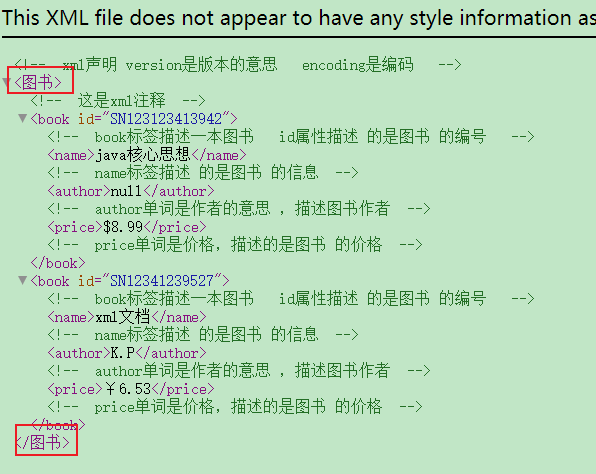
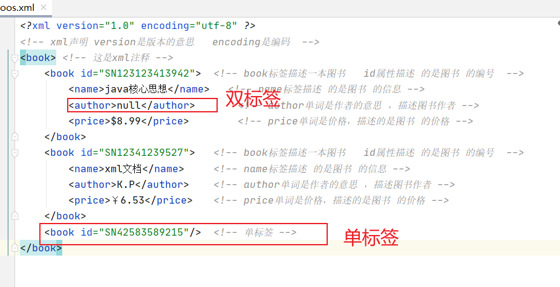
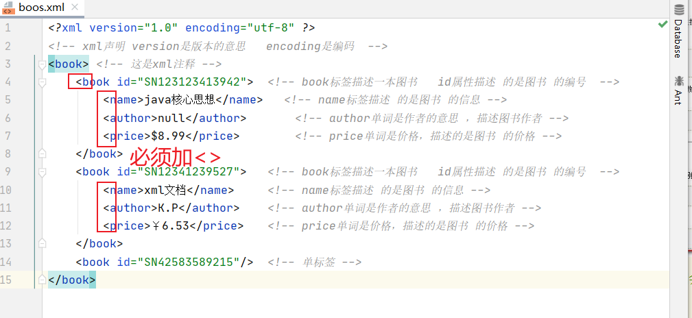
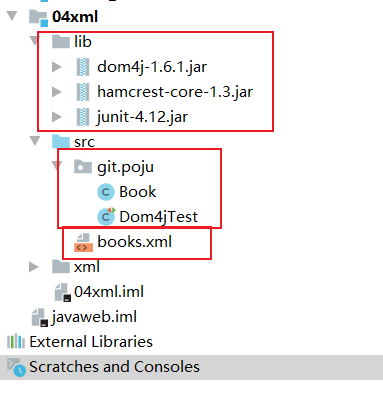
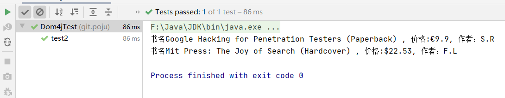

[TOC]

# XML

## XML简介

- [XML文档](https://www.yuque.com/nizhegechouloudetuboshu/library/defyyo/edit)

> 什么是xml？
>
> xml是可扩展的标记性语言。 

> xml的作用？
>
> 1. 用来保存数据，而且这些数据具有自我描述性;
> 2. 它还可以做为项目或者模块的配置文件;
> 3. 还可以做为网络传输数据的格式（现在JSON为主）。 

## xml语法 

### 1.文档声明

- 在IDEA的Java工程中，创建一个xml文件： 


- 文件名： 


> ```xml
> <?xmlversion="1.0"encoding="UTF-8"?>xml声明。
> <!--xml声明version是版本的意思encoding是编码-->
> 而且这个<?xml要连在一起写，否则会有报错;
> 
> 属性:
> version		是版本号;
> encoding	是xml的文件编码;
> standalone="yes/no"	表示这个xml文件是否是独立的xml文件;
> ```

- 实例

```xml
<?xml version="1.0" encoding="utf-8" ?>
<!-- xml声明 version是版本的意思   encoding是编码  -->
<books> <!-- 这是xml注释 -->
    <book id="SN123123413942">  <!-- book标签描述一本图书   id属性描述 的是图书 的编号  -->
        <name>java核心思想</name>   <!-- name标签描述 的是图书 的信息 -->
        <author>null</author>		<!-- author单词是作者的意思 ，描述图书作者 -->
        <price>$8.99</price>		<!-- price单词是价格，描述的是图书 的价格 -->
    </book>
    <book id="SN12341239527">	<!-- book标签描述一本图书   id属性描述 的是图书 的编号  -->
        <name>xml文档</name>	    <!-- name标签描述 的是图书 的信息 -->
        <author>K.P</author>	<!-- author单词是作者的意思 ，描述图书作者 -->
        <price>￥6.53</price>	<!-- price单词是价格，描述的是图书 的价格 -->
    </book>
</books>
```

- 在浏览器中可以查看到文档 


---

### 2.xml注释 

```xml
html和XML注释一样:<!--html注释-->
```

### 3.元素（标签）

> ```html
> 先回忆一下html标签：
> 	格式：<标签名>封装的数据</标签名>
> 	单标签:<标签名/>	<br/>换行	<hr/>水平线
> 	双标签:<标签名>封装的数据</标签名>
> 	标签名大小写不敏感;
> 	标签有属性，有基本属性和事件属性;
> 	标签要闭合（不闭合，html中不报错。但要养成良好的书写习惯。闭合）
> ```

- 什么是xml元素 


> 元素是指从开始标签到结束标签的内容。
>
> 例如：<title>java编程思想</title>
>
> 
>
> 元素我们可以简单的理解为是标签。Element 翻译 元素 

- XML元素必须遵循以下命名规则  

1. 名称可以含字母、数字以及其他的字符；



2. 名称不能以数字或者标点符号开始 


3. 名称不能以字符“xml”（或者XML、Xml）开始（虽然文档这么说，但是它是可以的！！！） 


4. 名称不能包含空格 


- xml中的元素（标签）也分成单标签和双标签 

```html
单标签
	格式：<标签名属性=”值”属性=”值”....../>

双标签
	格式：<标签名属性=”值”属性=”值”......>文本数据或子标签</标签名>
```




### 4.xml属性

> xml的标签属性和html的标签属性是非常类似的，属性可以提供元素的额外信息。
>
> 在标签上可以书写属性：
>
> ​	一个标签上可以书写多个属性。
>
> ​	每个属性的值必须使用引号引起来。
>
> ​	属性的规则和标签的书写规则一致。 


- XML属性必须使用引号引起来，不引会报错示例代码 



- 所有XML元素都须有关闭标签（也就是闭合） 

- XML标签对大小写敏感 

- XML必须正确地嵌套 

- XML文档必须有根元素 
  - 根元素就是顶级元素。
  - 没有父标签的元素，叫顶级元素。
  - 根元素是没有父标签的顶级元素，而且是唯一一个才行。 

- XML的属性值须加引号 

- XML中的特殊字符 


### 5.文本区域（CDATA区） 

> CDATA语法可以告诉xml解析器，我CDATA里的文本内容，只是纯文本，不需要xml语法解析
>
> ```xml
> CDATA格式：
> <![CDATA[这里可以把你输入的字符原样显示，不会解析xml]]> 
> ```


##  xml解析技术介绍 

> xml可扩展的标记语言。
>
> 不管是html文件还是xml文件它们都是标记型文档，都可以使用w3c组织制定的dom技术来解析。 


- document对象表示的是整个文档（可以是html文档，也可以是xml文档） 

> 早期JDK为我们提供了两种xml解析技术DOM和Sax简介（已经过时，但我们需要知道这两种技术）
>
> ---
>
> dom解析技术是W3C组织制定的，而所有的编程语言都对这个解析技术使用了自己语言的特点进行实现。Java对dom技术解析标记也做了实现。
>
> ---
>
> sun公司在JDK5版本对dom解析技术进行升级：SAX（SimpleAPIforXML）SAX解析，它跟W3C制定的解析不太一样。它是以类似事件机制通过回调告诉用户当前正在解析的内容。它是一行一行的读取xml文件进行解析的。不会创建大量的dom对象。所以它在解析xml的时候，在内存的使用上。和性能上。都优于Dom解析。 
>
> ---
>
> 第三方的解析：
>
> ​	jdom在dom基础上进行了封装、dom4j又对jdom进行了封装。
>
> ​	pull主要用在Android手机开发，是在跟sax非常类似都是事件机制解析xml文件。 

- Dom4j它是第三方的解析技术。我们需要使用第三方给我们提供好的类库才可以解析xml文件。 

##  dom4j解析技术 

> 由于dom4j它不是sun公司的技术，而属于第三方公司的技术，需要使用dom4j就需要到dom4j官网下载dom4j的jar包。 
>
> ---
>
> dom4j-1.6下载地址：https://www.yuque.com/nizhegechouloudetuboshu/library/defyyo


### 1.dom4j编程步骤

> ```xml
> 第一步：先加载xml文件创建Document对象；
> 第二步：通过Document对象拿到根元素对象；
> 第三步：通过根元素.elelemts(标签名);可以返回一个集合，这个集合里放着。所有你指定的标签名的元素对象；
> 第四步：找到你想要修改、删除的子元素，进行相应在的操作；
> 第五步，保存到硬盘上。
> ```

### 2.获取document对象 

1. 构建基本测试文件



> Book.xml文件

```xml
<?xml version="1.0" encoding="UTF-8"?>
<books>
    <book sn="SN12341232">
        <name>Google Hacking for Penetration Testers (Paperback)</name>
        <price>€9.9</price>
        <author>S.R</author>
    </book>
    <book sn="SN12341231">
        <name>Mit Press: The Joy of Search (Hardcover)</name>
        <price>$22.53</price>
        <author>F.L</author>
    </book>
</books>
```

> Book.java

```java
package git.poju;

import java.math.BigDecimal;

public class Book {
    private String sn;
    private String name;
    private String author;
    private BigDecimal price;

    public Book() {
    }

    public Book(String sn, String name, String author, BigDecimal price) {
        this.sn = sn;
        this.name = name;
        this.author = author;
        this.price = price;
    }

    public String getSn() {
        return sn;
    }

    public void setSn(String sn) {
        this.sn = sn;
    }

    public String getName() {
        return name;
    }

    public void setName(String name) {
        this.name = name;
    }

    public String getAuthor() {
        return author;
    }

    public void setAuthor(String author) {
        this.author = author;
    }

    public BigDecimal getPrice() {
        return price;
    }

    public void setPrice(BigDecimal price) {
        this.price = price;
    }

    @Override
    public String toString() {
        return "Book{" +
                "sn='" + sn + '\'' +
                ", name='" + name + '\'' +
                ", author='" + author + '\'' +
                ", price=" + price +
                '}';
    }
}
```

2. 创建一个lib目录，并添加dom4j的jar包。并添加到类路径。 


3. 解析获取Document对象的代码——Dom4jTest.java

```java
package git.poju;

import org.dom4j.Document;
import org.dom4j.io.SAXReader;
import org.junit.Test;

public class Dom4jTest {

    @Test
    public void test() throws Exception{
        // 创建一个SaxReader输入流，去读取 xml配置文件，生成Document对象
        SAXReader saxReader = new SAXReader();

        Document document = saxReader.read("src/books.xml");

        System.out.println(document);
    }
}
```

### 3.遍历标签获取所有标签中的内容 

> ```java
> 需要分四步操作:
> 	第一步，通过创建SAXReader对象。来读取xml文件，获取Document对象;
> 	第二步，通过Document对象。拿到XML的根元素对象;
> 	第三步，通过根元素对象。获取所有的book标签对象；
>     第四步，遍历每个book标签对象。然后获取到book标签对象内的每一个元素，再通过getText()方法拿到起始标签和结束标签之间的文本内容。
> ```

```java
package git.poju;

import org.dom4j.Document;
import org.dom4j.Element;
import org.dom4j.io.SAXReader;
import org.junit.Test;

import java.util.List;

public class Dom4jTest {

    /**
     * 读取books.xml文件生成book类
     * @throws Document
     */
    @Test
    public void test2() throws Exception{
        // 第一步，通过创建SAXReader对象。来读取xml文件，获取Document对象
        SAXReader reader = new SAXReader();
        Document document = reader.read("src/books.xml");
        // 第二步，通过 Document对象。拿到  XML的根元素对象
                Element root = document.getRootElement();
        // 打印测试
        // Element.asXML() 它将当前元素转换成为  String对象
        // System.out.println( root.asXML() );

        // 第三步，通过根元素对象。获取所有的  book 标签对象
        // Element.elements(标签名)它可以拿到当前元素下的指定的子元素的集合
        List<Element> books = root.elements("book");

        // 第四步，遍历每个 book标签对象。然后获取到  book标签对象内的每一个元素，
        for (Element book : books) {
            // 测试
            // System.out.println(book.asXML());
            // 拿到  book下面的  name元素对象
            Element nameElement = book.element("name");
            // 拿到  book下面的  price元素对象
            Element priceElement = book.element("price");
            // 拿到  book下面的  author元素对象
            Element authorElement = book.element("author");
            // 再通过  getText() 方法拿到起始标签和结束标签之间的文本内容
            System.out.println("书名" + nameElement.getText() + " , 价格:"
                    + priceElement.getText() + ", 作者：" + authorElement.getText());
        }
    }
}
```

- 运行结果：



# Tomcat

## JavaWeb的概念 

> a)什么是JavaWeb
>
> JavaWeb是指，所有通过Java语言编写可以通过浏览器访问的程序的总称，叫JavaWeb。JavaWeb是基于请求和响应来开发的。
>
> ---
>
> b)什么是请求
>
> 请求是指客户端给服务器发送数据，叫请求Request。
>
> ---
>
> c)什么是响应
>
> 响应是指服务器给客户端回传数据，叫响应Response。
>
> ---
>
> d)请求和响应的关系
>
> 请求和响应是成对出现的，有请求就有响应。 


##  Web资源的分类 

> web资源按实现的技术和呈现的效果的不同，又分为静态资源和动态资源两种。
>
> - 静态资源：html、css、js、txt、mp4视频,jpg图片
> - 动态资源：jsp页面、Servlet程序 

##  常用的Web服务器 

- Tomcat：由Apache组织提供的一种Web服务器，提供对jsp和Servlet的支持。它是一种轻量级的javaWeb容器（服务器），也是当前应用最广的JavaWeb服务器（免费）。
- Jboss：是一个遵从JavaEE规范的、开放源代码的、纯Java的EJB服务器，它支持所有的JavaEE规范（免费）。
- GlassFish：由Oracle公司开发的一款JavaWeb服务器，是一款强健的商业服务器，达到产品级质量（应用很少）。
- Resin：是CAUCHO公司的产品，是一个非常流行的服务器，对servlet和JSP提供了良好的支持，性能也比较优良，resin自身采用JAVA语言开发（收费，应用比较多）。
- WebLogic：是Oracle公司的产品，是目前应用最广泛的Web服务器，支持JavaEE规范，而且不断的完善以适应新的开发要求，适合大型项目（收费，用的不多，适合大公司）。 

## Tomcat服务器和Servlet版本的对应关系 

> ```java
> 当前企业常用的版本7.*、8.* 
> ```


> Servlet程序从2.5版本是现在世面使用最多的版本（xml配置）到了Servlet3.0之后。就是注解版本的Servlet使用。
>
> 以2.5版本为主线讲解Servlet程序。 

## Tomcat的使用 

### 1.安装

> 找到你需要用的Tomcat版本对应的zip压缩包，解压到需要安装的目录即可。 

### 2.目录介绍

> ```java
> bin		专门用来存放Tomcat服务器的可执行程序
> conf	专门用来存放Tocmat服务器的配置文件
> lib		专门用来存放Tomcat服务器的jar包
> logs	专门用来存放Tomcat服务器运行时输出的日记信息
> temp	专门用来存放Tomcdat运行时产生的临时数据
> webapps	专门用来存放部署的Web工程。
> work	是Tomcat工作时的目录，用来存放Tomcat运行时jsp翻译为Servlet的源码，和Session钝化的目录。
> ```

### 3.启动Tomcat服务器

> 找到Tomcat目录下的bin目录下的startup.bat文件，双击，就可以启动Tomcat服务器。 


> 如何测试Tomcat服务器启动成功？？？
>
> 
>
> 打开浏览器，在浏览器地址栏中输入以下地址测试：
>
> ​	1、http://localhost:8080
>
> ​	2、http://127.0.0.1:8080
>
> ​	3、http://真实ip:8080 
>
> 
>
> 当出现如下界面，说明Tomcat服务器启动成功！！！ 


### 4.常见的启动失败的情况 

> 双击startup.bat文件，就会出现一个小黑窗口一闪而来。
>
> 这个时候，失败的原因基本上都是因为没有配置好JAVA_HOME环境变量。 

```java
配置JAVA_HOME环境变量，参考：https://www.cnblogs.com/cnwutianhao/p/5487758.html    

常见的JAVA_HOME配置错误有以下几种情况：
    一：JAVA_HOME必须全大写。
    二：JAVA_HOME中间必须是下划线，不是减号-
    三：JAVA_HOME配置的路径只需要配置到jdk的安装目录即可。不需要带上bin目录。
```

### 5.另一种启动tomcat服务器的方式 

> ```java
> 1、打开命令行
> 2、cd到你的Tomcat的bin目录下
> ```


> ```java
> 3、敲入启动命令：catalina run
> ```


### 6.Tomcat的停止 

- 1、点击tomcat服务器窗口的x关闭按钮；
- 2、把Tomcat服务器窗口置为当前窗口，然后按快捷键Ctrl+C；
- 3、找到Tomcat的bin目录下的shutdown.bat双击，就可以停止Tomcat服务器； 

### 7.如何修改Tomcat的端口号 

> Mysql默认的端口号是：3306
>
> Tomcat默认的端口号是：8080 
>
> HTTP协议默认的端口号是：80 

- 找到Tomcat目录下的conf目录，找到server.xml配置文件。 


### 8.如何部暑web工程到Tomcat中 

> 第一种部署方法：只需要把web工程的目录拷贝到Tomcat的webapps目录下即可。 

- 在webapps目录下创建一个新的工程(例如图中的book文件夹) 


- 把个人的项目内容拷贝到里面 


- 访问Tomcat下的web工程 

> 在浏览器中输入访问地址，格式如下：
>
> http://ip:port/工程名/目录下/文件名 
>
> ---
>
> 例如： http://localhost:8080/book/index.html 


---

> 第二种部署方法：
>
> 找到Tomcat下的conf目录\Catalina\localhost\下,创建如下的配置文件： 


```xml
<!-- Context  表示一个工程上下文 
path  表示工程的访问路径:/abc docBase  表示你的工程目录在哪里 
--> 
<Context path="/abc" docBase="F:\Java\javaweb\04book_static" />
```

> 访问这个工程的路径如下:http://ip:port/abc/就表示访问F:\Java\javaweb\04book_static目录 
>
> ---
>
> 例如： http://localhost:8080/abc/ 


### 9.手托html页面到浏览器和在浏览器中输入http://ip:端口号/工程名/访问的区别 

> 手托 html 页面的原理：


> 输入访问地址访问的原因： 


### 10.ROOT的工程的访问，以及默认index.html页面的访问 

> ```java
> 当我们在浏览器地址栏中输入访问地址如下：
>     http://ip:port/		====>>>>	没有工程名的时候，默认访问的是ROOT工程。
> 
> 当我们在浏览器地址栏中输入的访问地址如下：
>     http://ip:port/工程名/		====>>>>	没有资源名，默认访问index.html页面
> ```

## IDEA整合Tomcat服务器 

> 操作的菜单如下： File | Settings | Build, Execution, Deployment | Application Servers


> 配置你的Tomcat安装目录： 


> 通过创建一个Model查看是不是配置成功！！！ 


## IDEA中动态web工程的操作 

### 1.IDEA中如何创建动态web工程 

> 1、创建一个新模块： 


> 2、选择你要创建什么类型的模块:


> 3、输入你的模块名，点击【Finish】完成创建。 


> 4、创建成功如下图:


### 2.Web工程的目录介绍 


### 3.如何给动态web工程添加额外jar包 

> 方式一：
>
> 1、在web-info文件目录内新建lib文件夹：


> 将jar粘贴到lib文件，并设置为自用：


> 导入成功，如图所示：


---

> 第二种方式：
>
> 1、在web-info文件目录内新建lib文件夹，将jar粘贴到lib文件夹。打开项目结构菜单操作界面，添加一个自己的类库： 


> 2、添加你你类库需要的jar包文件。 


> 3、选择你添加的类库，给哪个模块使用： 


> 4、选择Artifacts选项，将类库，添加到打包部署中： 


> 5、最后点击OK，结束。

### 4.如何在IDEA中部署工程到Tomcat上运行 

> 1、建议修改web工程对应的Tomcat运行实例名称： 


> 2、确认你的Tomcat实例中有你要部署运行的web工程模块： 


> 3、你还可以修改你的Tomcat实例启动后默认的访问地址： 


> 4、在IDEA中如何运行，和停止Tomcat实例。 
>
> ​	4.1、正常启动Tomcat实例： 


> ​	4.2、Debug方式启动Tomcat运行实例： 


> ​	4.3、停止Tomcat运行实例： 


### 问题总结——intellij idea 启动tomcat出现1099端口被占用，但找不到占用它的服务

> 网上流行一种说法是找到占用的那个服务用： 

```java
netstat -aon|findstr 1099
```

> 然后找到是哪个占用的:

```java
taskkill -f -pid xxx
```

> 但我运行后，显示如下：


> 千辛万苦之下最近终于找到了解决办法，不管你用没用端口，以管理员身份运行cmd：

```java
netsh winsock reset
```

> 然后重启电脑，完美解决！！
>
> 2020-10-02 更：版本 IDEA 2020.1，tomcat 8.5
> 参考：[intellij idea 启动tomcat出现1099端口被占用](https://blog.csdn.net/weixin_42070148/article/details/88664676?utm_medium=distribute.pc_relevant.none-task-blog-BlogCommendFromMachineLearnPai2-2.channel_param&depth_1-utm_source=distribute.pc_relevant.none-task-blog-BlogCommendFromMachineLearnPai2-2.channel_param)

