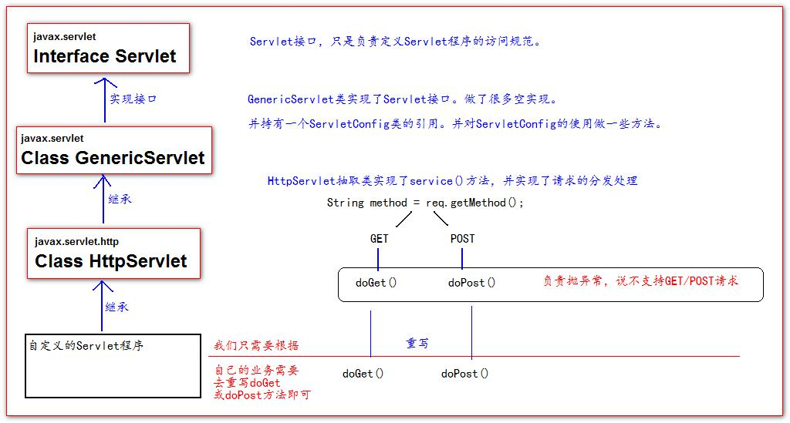
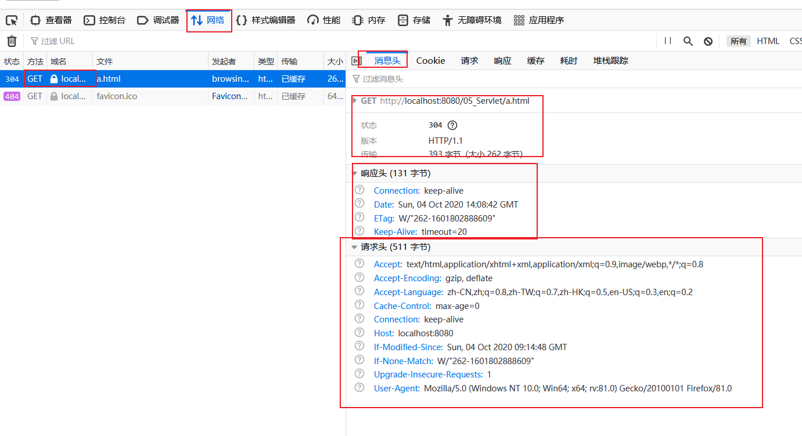

[TOC]

#  Servlet 

## Servlet技术
### 1.什么是Servlet

> 什么是Servlet???
>
> 1、Servlet是JavaEE规范之一。规范就是接口;
>
> 2、Servlet就JavaWeb三大组件之一。三大组件分别是：Servlet程序、Filter过滤器、Listener监听器。
>
> 3、Servlet是运行在服务器上的一个java小程序，它可以接收客户端发送过来的请求，并响应数据给客户端。 
>
> ---
>
> 手动实现Servlet程序
>
> 1、编写一个类去实现Servlet接口;
>
> 2、实现service方法，处理请求，并响应数据;
>
> 3、到web.xml中去配置servlet程序的访问地址。 

### 2.第一个Servlet程序

> 新建一个动态Web项目，再其中新建一个类：


> index.jsp文件

```jsp
<%@ page contentType="text/html;charset=UTF-8" language="java" %>
<html>
  <head>
    <title>$Title$</title>
  </head>
  <body>
  这是首页，写点东西。
  </body>
</html>
```

> HelloServlet.java文件

```java
package github.servlet;

import javax.servlet.*;
import java.io.IOException;

public class HelloServlet implements Servlet {
    @Override
    public void init(ServletConfig servletConfig) throws ServletException {

    }

    @Override
    public ServletConfig getServletConfig() {
        return null;
    }

    /**
     * service方法是专门用来处理请求和响应的
     * @param servletRequest
     * @param servletResponse
     * @throws ServletException
     * @throws IOException
     */
    @Override
    public void service(ServletRequest servletRequest, ServletResponse servletResponse) throws ServletException, IOException {
        System.out.println("Hello Servlet 被访问了！！！");
    }

    @Override
    public String getServletInfo() {
        return null;
    }

    @Override
    public void destroy() {

    }
}
```

> web.xml文件

```xml
<?xml version="1.0" encoding="UTF-8"?>
<web-app xmlns="http://xmlns.jcp.org/xml/ns/javaee"
         xmlns:xsi="http://www.w3.org/2001/XMLSchema-instance"
         xsi:schemaLocation="http://xmlns.jcp.org/xml/ns/javaee http://xmlns.jcp.org/xml/ns/javaee/web-app_4_0.xsd"
         version="4.0">
<!--    servlet标签给Tomcat配置Servlet程序-->
    <servlet>
<!--        servlet-name标签 Servlet程序起一个别名（一般是类名）-->
        <servlet-name>HelloServlet</servlet-name>
<!--        servlet-class是Servlet程序的全类名-->
        <servlet-class>github.servlet.HelloServlet</servlet-class>
    </servlet>

<!--    servlet-mapping标签给servlet程序配置访问地址-->
    <servlet-mapping>
<!--        servlet-name标签的作用是告诉服务器，我当前配置的地址给哪个Servlet程序使用-->
        <servlet-name>HelloServlet</servlet-name>
<!--        url-pattern标签配置访问地址                                     <br/>
               / 斜杠在服务器解析的时候，表示地址为：http://ip:port/工程路径          <br/>
               /hello 表示地址为：http://ip:port/工程路径/hello              <br/>
-->
        <url-pattern>/hello</url-pattern>
    </servlet-mapping>
    
</web-app>
```

> 上面的xml文件中的工程路径：


> 启动项目，运行如图：


### 3.Servlet程序常见错误

> 常见的错误1：url-pattern 中配置的路径没有以斜杠打头。


> 常见错误 2：servlet-name 配置的值不存在：


> 常见错误 3：servlet-class 标签的全类名配置错误：


### 4.url地址到Servlet程序的访问 


### 5.Servlet的生命周期 

> ```java
> 1、执行Servlet构造器方法;
> 2、执行init初始化方法;
> 	第一、二步，是在第一次访问，的时候创建Servlet程序会调用。
> 3、执行service方法;
> 	第三步，每次访问都会调用。
> 4、执行destroy销毁方法
>     第四步，在web工程停止的时候调用。
> ```

```java
package github.servlet;

import javax.servlet.*;
import java.io.IOException;

public class HelloServlet implements Servlet {

    public HelloServlet() {
        System.out.println("1 构造器方法");
    }

    @Override
    public void init(ServletConfig servletConfig) throws ServletException {
        System.out.println("2 init初始化");
    }

    @Override
    public ServletConfig getServletConfig() {
        return null;
    }

    /**
     * service方法是专门用来处理请求和响应的
     * @param servletRequest
     * @param servletResponse
     * @throws ServletException
     * @throws IOException
     */
    @Override
    public void service(ServletRequest servletRequest, ServletResponse servletResponse) throws ServletException, IOException {
        System.out.println("Hello Servlet 被访问了！！！");
        System.out.println("3 Service方法");
    }

    @Override
    public String getServletInfo() {
        return null;
    }

    @Override
    public void destroy() {
        System.out.println("4 destroy销毁方法");
    }
}
```


### 6.GET和POST请求的分发处理 


```java
import javax.servlet.*;
import javax.servlet.http.HttpServletRequest;
import java.io.IOException;

public class HelloServlet implements Servlet {

    /**
     * service方法是专门用来处理请求和响应的
     * @param servletRequest
     * @param servletResponse
     * @throws ServletException
     * @throws IOException
     */
    @Override
    public void service(ServletRequest servletRequest, ServletResponse servletResponse) throws ServletException, IOException {
        System.out.println("Hello Servlet 被访问了！！！");
//        类型转换（因为有getMethod方法）
        HttpServletRequest httpServletRequest = (HttpServletRequest) servletRequest;
//        获取请求的方式
        String method = httpServletRequest.getMethod();
        if("GET".equals(method)){
            doGet();
        }else if("POST".equals(method)){
            doPost();
        }
        System.out.println(method);
    }

    /**
     * 做doget请求
     */
    public void doGet(){
        System.out.println("get请求");
        System.out.println("get请求");
    }

    /**
     * 做dopost请求
     */
    public void doPost(){
        System.out.println("post请求");
        System.out.println("post请求");
    }
}
```

> a.html文件

```html
<!DOCTYPE html>
<html lang="en">
<head>
    <meta charset="UTF-8">
    <title>Title</title>
</head>
<body>
    <form action="http://localhost:8080/05_Servlet/hello" method="post">
        <input type="submit" name="" id="">
    </form>
</body>
</html>
```


### 7.通过继承HttpServlet实现Servlet程序 

> 一般在实际项目开发中，都是使用继承HttpServlet类的方式去实现Servlet程序。
>
> 	1. 编写一个类去继承HttpServlet类;
>  	2. 根据业务需要重写doGet或doPost方法;
>  	3. 到web.xml中的配置Servlet程序的访问地址。

> Servlet类的代码：

```java
package github.servlet;

import javax.servlet.ServletException;
import javax.servlet.http.HttpServlet;
import javax.servlet.http.HttpServletRequest;
import javax.servlet.http.HttpServletResponse;
import java.io.IOException;

public class HelloServlet02 extends HttpServlet {
    /**
     * doGet()方法，在get请求中使用
     * @param req
     * @param resp
     * @throws ServletException
     * @throws IOException
     */
    @Override
    protected void doGet(HttpServletRequest req, HttpServletResponse resp) throws ServletException, IOException {
        System.out.println("Hello2 doGet()方法");
    }

    /**
     * doPost()方法，在post请求中使用
     * @param req
     * @param resp
     * @throws ServletException
     * @throws IOException
     */
    @Override
    protected void doPost(HttpServletRequest req, HttpServletResponse resp) throws ServletException, IOException {
        System.out.println("Hello2 doPost()方法");
    }
}
```

> web.xml中的配置 

```xml
<?xml version="1.0" encoding="UTF-8"?>
<web-app xmlns="http://xmlns.jcp.org/xml/ns/javaee"
         xmlns:xsi="http://www.w3.org/2001/XMLSchema-instance"
         xsi:schemaLocation="http://xmlns.jcp.org/xml/ns/javaee http://xmlns.jcp.org/xml/ns/javaee/web-app_4_0.xsd"
         version="4.0">
    
    <servlet>
        <servlet-name>HelloServlet02</servlet-name>
        <servlet-class>github.servlet.HelloServlet02</servlet-class>
    </servlet>
    <servlet-mapping>
        <servlet-name>HelloServlet02</servlet-name>
        <url-pattern>/hello2</url-pattern>
    </servlet-mapping>
    
</web-app>
```

### 8.使用IDEA创建Servlet程序 

> 右键点击包名：


> 配置Servlet的信息 


### 9.Servlet类的继承体系 



## ServletConfig类 

> - ServletConfig类从类名上来看，就知道是Servlet程序的配置信息类。
> - Servlet程序和ServletConfig对象都是由Tomcat负责创建，我们负责使用。
> - Servlet程序默认是第一次访问的时候创建，ServletConfig是每个Servlet程序创建时，就创建一个对应的ServletConfig对象。 

> ServletConfig类的三大作用 

```java
1、可以获取Servlet程序的别名servlet-name的值;
2、获取初始化参数init-param;
3、获取ServletContext对象.
```

> web.xml文件

```xml
<?xml version="1.0" encoding="UTF-8"?>
<web-app xmlns="http://xmlns.jcp.org/xml/ns/javaee"
         xmlns:xsi="http://www.w3.org/2001/XMLSchema-instance"
         xsi:schemaLocation="http://xmlns.jcp.org/xml/ns/javaee http://xmlns.jcp.org/xml/ns/javaee/web-app_4_0.xsd"
         version="4.0">
<!--    servlet标签给Tomcat配置Servlet程序-->
    <servlet>
<!--        servlet-name标签 Servlet程序起一个别名（一般是类名）-->
        <servlet-name>HelloServlet</servlet-name>
<!--        servlet-class是Servlet程序的全类名-->
        <servlet-class>github.servlet.HelloServlet</servlet-class>
        <!--init-param是初始化参数-->
        <init-param>
            <!--是参数名-->
            <param-name>namespace</param-name>
            <!--是参数值-->
            <param-value>root</param-value>
        </init-param>
        <init-param>
            <param-name>url</param-name>
            <param-value>jdbc:mysql://localhost:3306/test</param-value>
        </init-param>
    </servlet>

<!--    servlet-mapping标签给servlet程序配置访问地址-->
    <servlet-mapping>
<!--        servlet-name标签的作用是告诉服务器，我当前配置的地址给哪个Servlet程序使用-->
        <servlet-name>HelloServlet</servlet-name>
<!--        url-pattern标签配置访问地址                                     <br/>
               / 斜杠在服务器解析的时候，表示地址为：http://ip:port/工程路径          <br/>
               /hello 表示地址为：http://ip:port/工程路径/hello              <br/>
-->
        <url-pattern>/hello</url-pattern>
    </servlet-mapping>
    
    <servlet>
        <servlet-name>HelloServlet02</servlet-name>
        <servlet-class>github.servlet.HelloServlet02</servlet-class>
    </servlet>
    <servlet-mapping>
        <servlet-name>HelloServlet02</servlet-name>
        <url-pattern>/hello2</url-pattern>
    </servlet-mapping>

    <servlet>
        <servlet-name>HelloServlet03</servlet-name>
        <servlet-class>github.servlet.HelloServlet03</servlet-class>
    </servlet>
    <servlet-mapping>
        <servlet-name>HelloServlet03</servlet-name>
        <url-pattern>/hello03</url-pattern>
    </servlet-mapping>
</web-app>
```

```java
@Override
    public void init(ServletConfig servletConfig) throws ServletException {
//        System.out.println("2 init初始化");

//        1、可以获取Servlet程序的别名servlet-name的值
        System.out.println("HelloServlet程序的别名是:" + servletConfig.getServletName());
//        2、获取初始化参数init-param
        System.out.println("初始化参数namespace的值是;" + servletConfig.getInitParameter("namespace"));
        System.out.println("初始化参数url的值是;" + servletConfig.getInitParameter("url"));
//        3、获取ServletContext对象
        System.out.println(servletConfig.getServletContext());
    }
```


##  ServletContext类 

### 1.什么是ServletContext? 

> 1. ServletContext是一个接口，它表示Servlet上下文对象
>
> 2. 一个web工程，只有一个ServletContext对象实例。
>
> 3. ServletContext对象是一个域对象。
>
> 4. ServletContext是在web工程部署启动的时候创建。在web工程停止的时候销毁。
>
> ---
>
> 什么是域对象?
>
> - 域对象，是可以像Map一样存取数据的对象，叫域对象。这里的域指的是存取数据的操作范围，整个web工程。 

|        |     存数据     |     取数据     |      删除数据      |
| :----: | :------------: | :------------: | :----------------: |
|  Map   |     put()      |     get()      |      remove()      |
| 域对象 | setAttribute() | getAttribute() | removeAttribute(); |

### 2.ServletContext类的四个作用 

> 1. 获取web.xml中配置的上下文参数context-param；
> 2. 获取当前的工程路径，格式:/工程路径;
> 3. 获取工程部署后在服务器硬盘上的绝对路径;
> 4. 像Map一样存取数据.

---

> 案例演示：


> web.xml文件

```xml
<?xml version="1.0" encoding="UTF-8"?>
<web-app xmlns="http://xmlns.jcp.org/xml/ns/javaee"
         xmlns:xsi="http://www.w3.org/2001/XMLSchema-instance"
         xsi:schemaLocation="http://xmlns.jcp.org/xml/ns/javaee http://xmlns.jcp.org/xml/ns/javaee/web-app_4_0.xsd"
         version="4.0">

    <!--context-param是上下文参数(它属于整个web工程)-->
    <context-param>
        <param-name>username</param-name>
        <param-value>context</param-value>
    </context-param>
    <context-param>
        <param-name>password</param-name>
        <param-value>root</param-value>
    </context-param>

    <servlet>
        <servlet-name>ContextServlet</servlet-name>
        <servlet-class>github.servlet.ContextServlet</servlet-class>
    </servlet>
    <servlet-mapping>
        <servlet-name>ContextServlet</servlet-name>
        <url-pattern>/cons</url-pattern>
    </servlet-mapping>
</web-app>
```

> java文件

```java
package github.servlet;

import javax.servlet.ServletContext;
import javax.servlet.ServletException;
import javax.servlet.http.HttpServlet;
import javax.servlet.http.HttpServletRequest;
import javax.servlet.http.HttpServletResponse;
import java.io.IOException;

public class ContextServlet extends HttpServlet {
    protected void doPost(HttpServletRequest request, HttpServletResponse response) throws ServletException, IOException {
    }

    protected void doGet(HttpServletRequest request, HttpServletResponse response) throws ServletException, IOException {
//        1. 获取web.xml中配置的上下文参数context-param；

        ServletContext context = getServletConfig().getServletContext();
        String username = context.getInitParameter("username");
        System.out.println("context-param参数username的值是:"+username);
        System.out.println("context-param参数password的值是:"+context.getInitParameter("password"));
//        2. 获取当前的工程路径，格式:/工程路径;
        System.out.println("当前工程路径:"+context.getContextPath());
//        3. 获取工程部署后在服务器硬盘上的绝对路径;
//        / 斜杠被服务器解析地址为:http://ip:port/工程名/  映射到IDEA代码的web目录    <br/>
        System.out.println("工程部署的路径是:"+context.getRealPath("/"));
        System.out.println("工程下css目录的绝对路径是:"+context.getRealPath("/css"));
        System.out.println("工程下imgs目录1.jpg的绝对路径是:"+context.getRealPath("/imgs/h2.jpeg"));
    }
}
```

### 3.ServletContext像Map一样存取数据 


> ContextServlet02.java

```java
package github.servlet;

import javax.servlet.ServletContext;
import javax.servlet.ServletException;
import javax.servlet.http.HttpServlet;
import javax.servlet.http.HttpServletRequest;
import javax.servlet.http.HttpServletResponse;
import java.io.IOException;

public class ContextServlet02 extends HttpServlet {

    protected void doGet(HttpServletRequest request, HttpServletResponse response) throws ServletException, IOException {
        // 获取ServletContext对象
        ServletContext context = getServletContext();
        System.out.println(context);
        System.out.println("保存之前ContextServlet02获取key的值是:"+ context.getAttribute("key"));

        context.setAttribute("key","value");
        System.out.println("ContextServlet02中获取域数据key的值是:"+ context.getAttribute("key"));
    }
}
```

> ContextServlet03.java

```java
package github.servlet;

import javax.servlet.ServletContext;
import javax.servlet.ServletException;
import javax.servlet.http.HttpServlet;
import javax.servlet.http.HttpServletRequest;
import javax.servlet.http.HttpServletResponse;
import java.io.IOException;

public class ContextServlet03 extends HttpServlet {

    protected void doGet(HttpServletRequest request, HttpServletResponse response) throws ServletException, IOException {
        ServletContext context = getServletContext();
        System.out.println(context);
        System.out.println("ContextServlet03中获取域数据key的值是:"+ context.getAttribute("key"));
    }
}
```

> web.xml

```xml
<?xml version="1.0" encoding="UTF-8"?>
<web-app xmlns="http://xmlns.jcp.org/xml/ns/javaee"
         xmlns:xsi="http://www.w3.org/2001/XMLSchema-instance"
         xsi:schemaLocation="http://xmlns.jcp.org/xml/ns/javaee http://xmlns.jcp.org/xml/ns/javaee/web-app_4_0.xsd"
         version="4.0">

    <servlet>
        <servlet-name>ContextServlet02</servlet-name>
        <servlet-class>github.servlet.ContextServlet02</servlet-class>
    </servlet>
    <servlet-mapping>
        <servlet-name>ContextServlet02</servlet-name>
        <url-pattern>/cons2</url-pattern>
    </servlet-mapping>

    <servlet>
        <servlet-name>ContextServlet03</servlet-name>
        <servlet-class>github.servlet.ContextServlet03</servlet-class>
    </servlet>
    <servlet-mapping>
        <servlet-name>ContextServlet03</servlet-name>
        <url-pattern>/cons3</url-pattern>
    </servlet-mapping>
</web-app>
```

## HTTP协议 

### 1.什么是HTTP协议 

> 什么是协议?
>
> - 协议是指双方，或多方，相互约定好，大家都需要遵守的规则，叫协议。
>
>  ----
>
>  所谓HTTP协议，就是指，客户端和服务器之间通信时，发送的数据，需要遵守的规则，叫HTTP协议。
>
> - HTTP协议中的数据又叫报文。 

### 2.请求的HTTP协议格式

> 客户端给服务器发送数据叫请求。
>
> 服务器给客户端回传数据叫响应。
>
> 请求又分为GET请求，和POST请求两种:

- GET请求 

```html
1、请求行
	(1)请求的方式	GET
	(2)请求的资源路径	[+?+请求参数]
	(3)请求的协议的版本号	HTTP/1.1

2、请求头
	key:value	组成不同的键值对，表示不同的含义。
```


- POST请求 

```html
1、请求行
	(1)请求的方式	POST
	(2)请求的资源路径	[+?+请求参数]
	(3)请求的协议的版本号	HTTP/1.1

2、请求头
	(1)key:value	不同的请求头，有不同的含义;
	空行

3、请求体	===>>>	就是发送给服务器的数据
```


- 常用请求头的说明 

```html
Accept:       表示客户端可以接收的数据类型 
Accpet-Languege:      表示客户端可以接收的语言类型 
User-Agent:         表示客户端浏览器的信息 
Host：    表示请求时的服务器 ip 和端口号
```

- 哪些是 GET 请求?哪些是 POST 请求?

```html
GET  请求有哪些： 
	1、form 标签    method=get 
	2、a 标签 
	3、link 标签引入  css 
	4、Script  标签引入  js  文件 
	5、img 标签引入图片 
	6、iframe 引入  html 页面 
	7、在浏览器地址栏中输入地址后敲回车 

POST 请求有哪些： 
	1、form 标签    method=post
```

### 3.响应的HTTP协议格式 

> 1. 响应行 
> (1) 响应的协议和版本号 
> (2) 响应状态码 
> (3) 响应状态描述符 
>
> ---
>
> 2. 响应头
>
>    (1) key:value	不同的响应头，有其不同含义;
>
>    空行 
>
> ---
>
> 3. 响应体 ---->>> 就是回传给客户端的数据


### 4.常用的响应码说明 

> ```html
> 200		表示请求成功;
> 302		表示请求重定向;
> 404		表示请求服务器已经收到了，但是你要的数据不存在（请求地址错误）;
> 500		表示服务器已经收到请求，但是服务器内部错误（代码错误）;
> ```

### 5.MIME类型说明 

> MIME是HTTP协议中数据类型。
>
> MIME的英文全称是"Multipurpose Internet Mail Extensions"多功能Internet邮件扩充服务。MIME类型的格式是“大类型/小类型”，并与某一种文件的扩展名相对应。 

- 常见的MIME类型 

|        文件        | MIME类型                              |
| :----------------: | :------------------------------------ |
| 超文本标记语言文本 | .html,.htm      text/html             |
|      普通文本      | .txt      text/plain                  |
|      RTF文本       | .rtf      application/rtf             |
|      GIF图形       | .gif      image/gif                   |
|      JPEG图形      | .jpeg,.jpg      image/jpeg            |
|     au声音文件     | .au         audio/basic               |
|    MIDI音乐文件    | mid,.midi     audio/midi,audio/x-midi |
| RealAudio音乐文件  | .ra,.ram       audio/x-pn-realaudio   |
|      MPEG文件      | .mpg,.mpeg     video/mpeg             |
|      AVI文件       | .avi        video/x-msvideo           |
|      GZIP文件      | .gz        application/x-gzip         |
|      TAR文件       | .tar      application/x-tar           |

- 谷歌浏览器如何查看HTTP协议:


- 火狐浏览器如何查看HTTP协议:



## HttpServletRequest类 

### 1.HttpServletRequest类有什么作用 

> 每次只要有请求进入Tomcat服务器，Tomcat服务器就会把请求过来的HTTP协议信息解析好封装到Request对象中。
>
> 然后传递到service方法（doGet和doPost）中给我们使用。
>
> 我们可以通过HttpServletRequest对象，获取到所有请求的信息。 

### 2.HttpServletRequest类的常用方法 

> ```java
> i.getRequestURI()	获取请求的资源路径;
> ii.getRequestURL()	获取请求的统一资源定位符（绝对路径）;
> iii.getRemoteHost()	获取客户端的ip地址;
> iv.getHeader()	获取请求头;
> v.getParameter()	获取请求的参数;
> vi.getParameterValues()	获取请求的参数（多个值的时候使用）;
> vii.getMethod()	获取请求的方式GET或POST;
> viii.setAttribute(key,value);	设置域数据;
> ix.getAttribute(key);	获取域数据;
> x.getRequestDispatcher()	获取请求转发对象;
> ```

```java
package github.servlet;

import javax.servlet.ServletException;
import javax.servlet.http.HttpServlet;
import javax.servlet.http.HttpServletRequest;
import javax.servlet.http.HttpServletResponse;
import java.io.IOException;

public class RequestAPI extends HttpServlet {

    @Override
    protected void doGet(HttpServletRequest req, HttpServletResponse resp) throws ServletException, IOException {
//        i.getRequestURI()	获取请求的资源路径;
        System.out.println("URI=>" + req.getRequestURI());
//        ii.getRequestURL()	获取请求的统一资源定位符（绝对路径）;
        System.out.println("URL=>" + req.getRequestURL());
//        iii.getRemoteHost()	获取客户端的ip地址;
//        在IDEA中，使用localhost访问时，得到的客户端 ip 地址是 ===>>> 127.0.0.1  <br/>
//        在IDEA中，使用127.0.0.1访问时，得到的客户端 ip 地址是 ===>>> 127.0.0.1  <br/>
//        在IDEA中，使用 真实ip 访问时，得到的客户端 ip 地址是 ===>>> 真实的客户端 ip 地址  <br/>
        System.out.println("IP=>" + req.getRemoteHost());
//        iv.getHeader()	获取请求头;
        System.out.println("Head=>" + req.getHeader("User-Agent"));
//        v.getParameter()	获取请求的参数;
        System.out.println("Part=>" + req.getParameter("getParameter"));
//        vi.getParameterValues()	获取请求的参数（多个值的时候使用）;
        System.out.println("MPart=>" + req.getParameterValues("Part"));
//        vii.getMethod()	获取请求的方式GET或POST;
        System.out.println("Method=>" + req.getMethod());
    }
}
```

```xml
<?xml version="1.0" encoding="UTF-8"?>
<web-app xmlns="http://xmlns.jcp.org/xml/ns/javaee"
         xmlns:xsi="http://www.w3.org/2001/XMLSchema-instance"
         xsi:schemaLocation="http://xmlns.jcp.org/xml/ns/javaee http://xmlns.jcp.org/xml/ns/javaee/web-app_4_0.xsd"
         version="4.0">
    <servlet>
        <servlet-name>RequestAPI</servlet-name>
        <servlet-class>github.servlet.RequestAPI</servlet-class>
    </servlet>
    <servlet-mapping>
        <servlet-name>RequestAPI</servlet-name>
        <url-pattern>/requestAPI</url-pattern>
    </servlet-mapping>
</web-app>
```


### 3.如何获取请求参数 

> 表单：

```html
<!DOCTYPE html>
<html lang="en">
<head>
    <meta charset="UTF-8">
    <title>Title</title>
</head>
<body>
    <form action="http://localhost:8080/06_servlet/parmentServlet" method="get">
        用户名:<input type="text" name="username"><br/>
        密码:<input type="password" name="password"><br/>
        兴趣爱好:<input type="checkbox" name="hobby" value="cpp">C++
        <input type="checkbox" name="hobby" value="java">Java
        <input type="checkbox" name="hobby" value="js">JavaScript<br/>
        <input type="submit">
    </form>
</body>
</html>
```

> Java代码：

```java
package github.servlet;

import javax.servlet.ServletException;
import javax.servlet.http.HttpServlet;
import javax.servlet.http.HttpServletRequest;
import javax.servlet.http.HttpServletResponse;
import java.io.IOException;
import java.util.Arrays;

public class ParmentServlet extends HttpServlet {
    @Override
    protected void doGet(HttpServletRequest req, HttpServletResponse resp) throws ServletException, IOException {
        //获取请求的参数
        String username = req.getParameter("username");
        String password = req.getParameter("password");
        String[] hobby = req.getParameterValues("hobby");

        System.out.println("用户名:" + username);
        System.out.println("密码:" + password);
        System.out.println("爱好:" + Arrays.asList(hobby));
    }
}
```

> web.xml文件：

```xml
<?xml version="1.0" encoding="UTF-8"?>
<web-app xmlns="http://xmlns.jcp.org/xml/ns/javaee"
         xmlns:xsi="http://www.w3.org/2001/XMLSchema-instance"
         xsi:schemaLocation="http://xmlns.jcp.org/xml/ns/javaee http://xmlns.jcp.org/xml/ns/javaee/web-app_4_0.xsd"
         version="4.0">
    <servlet>
        <servlet-name>ParmentServlet</servlet-name>
        <servlet-class>github.servlet.ParmentServlet</servlet-class>
    </servlet>
    <servlet-mapping>
        <servlet-name>ParmentServlet</servlet-name>
        <url-pattern>/parmentServlet</url-pattern>
    </servlet-mapping>
</web-app>
```


### 4.doGet请求的中文乱码解决 

> 对于这个问题呢！！！网上的一半是这样做：

```java
//1 先以iso8859-1进行编码
//2 再以utf-8进行解码
//        username = new String(username.getBytes("iso-8859-1"), "UTF-8");
```

> 也就是这样：


> 所以，经查证：
>
> 因为容器是tomcat，所以需要配置下它的配置文件/conf/server.xml


> 修改为：

```xml
<Connector connectionTimeout="20000" port="8080" protocol="HTTP/1.1" redirectPort="8443" URIEncoding="UTF-8"/>
```

> 因为修改了服务器的配置文件，需要重启Tomcat，运行之：


### 5.POST请求的中文乱码解决 

> 只需要在post方法中添加如下：
>
> ```java
> // 设置请求体的字符集为UTF-8，从而解决post请求的中文乱码问题
> // 也要在获取请求参数之前调用才有效
> req.setCharacterEncoding("UTF-8");
> ```


### 6.请求的转发 

> 什么是请求的转发?
>
> 请求转发是指，服务器收到请求后，从一次资源跳转到另一个资源的操作叫请求转发。 


> Servlet1代码： 

```java
package github.servlet;

import javax.servlet.RequestDispatcher;
import javax.servlet.ServletException;
import javax.servlet.http.HttpServlet;
import javax.servlet.http.HttpServletRequest;
import javax.servlet.http.HttpServletResponse;
import java.io.IOException;

public class Servlet1 extends HttpServlet {

    @Override
    protected void doGet(HttpServletRequest req, HttpServletResponse resp) throws ServletException, IOException {
        // 获取请求的参数（办事的材料）查看
        String username = req.getParameter("username");
        System.out.println("在Servlet1（柜台1）中查看参数（材料）：" + username);

        // 给材料 盖一个章，并传递到Servlet2（柜台 2）去查看
        req.setAttribute("key","柜台1的章");

        // 问路:Servlet2（柜台 2）怎么走
        // 请求转发必须要以斜杠打头，/ 斜杠表示地址为：http://ip:port/工程名/ , 映射到IDEA代码的web目录 <br/>
        RequestDispatcher requestDispatcher = req.getRequestDispatcher("/servlet2");
//        RequestDispatcher requestDispatcher = req.getRequestDispatcher("http://www.baidu.com");

        // 走向Sevlet2（柜台 2）
        requestDispatcher.forward(req,resp);
    }
}
```

> Servlet2代码: 

```java
package github.servlet;

import javax.servlet.ServletException;
import javax.servlet.http.HttpServlet;
import javax.servlet.http.HttpServletRequest;
import javax.servlet.http.HttpServletResponse;
import java.io.IOException;

public class Servlet2 extends HttpServlet {

    @Override
    protected void doGet(HttpServletRequest req, HttpServletResponse resp) throws ServletException, IOException {
        // 获取请求的参数（办事的材料）查看
        String username = req.getParameter("username");
        System.out.println("在Servlet2（柜台2）中查看参数（材料）：" + username);

        // 查看 柜台1 是否有盖章
        Object key1 = req.getAttribute("key");
        System.out.println("柜台1是否有章：" + key1);

        // 处理自己的业务
        System.out.println("Servlet2 处理自己的业务 ");
    }
}
```

> web.xml文件

```xml
<?xml version="1.0" encoding="UTF-8"?>
<web-app xmlns="http://xmlns.jcp.org/xml/ns/javaee"
         xmlns:xsi="http://www.w3.org/2001/XMLSchema-instance"
         xsi:schemaLocation="http://xmlns.jcp.org/xml/ns/javaee http://xmlns.jcp.org/xml/ns/javaee/web-app_4_0.xsd"
         version="4.0">

    <servlet>
        <servlet-name>Servlet1</servlet-name>
        <servlet-class>github.servlet.Servlet1</servlet-class>
    </servlet>
    <servlet-mapping>
        <servlet-name>Servlet1</servlet-name>
        <url-pattern>/servlet1</url-pattern>
    </servlet-mapping>

    <servlet>
        <servlet-name>Servlet2</servlet-name>
        <servlet-class>github.servlet.Servlet2</servlet-class>
    </servlet>
    <servlet-mapping>
        <servlet-name>Servlet2</servlet-name>
        <url-pattern>/servlet2</url-pattern>
    </servlet-mapping>
</web-app>
```


### 7.base标签的作用 


> index.html

```html
<!DOCTYPE html>
<html lang="en">
<head>
    <meta charset="UTF-8">
    <title>index</title>
</head>
<body>
这是Web下的index.html <br/>
<a href="a/b/c.html">a/b/c.html</a><br/>
<a href="http://localhost:8080/06_servlet/forwardC">请求转发:a/b/c.html</a><br/>
</body>
</html>
```

> c.html

```html
<!DOCTYPE html>
<html lang="zh_CN">
<head>
    <meta charset="UTF-8">
    <title>Title</title>
    <!--base标签设置页面相对路径工作时参照的地址
            href 属性就是参数的地址值
    -->
    <base href="http://localhost:8080/06_servlet/a/b/">
</head>
<body>
这是a下的b下的c.html页面<br/>
<a href="../../index.html">跳回首页</a><br/>
</body>
</html>
```

>ForwardC.java

```java
package github.servlet;

import javax.servlet.ServletException;
import javax.servlet.http.HttpServlet;
import javax.servlet.http.HttpServletRequest;
import javax.servlet.http.HttpServletResponse;
import java.io.IOException;

public class ForwardC extends HttpServlet {
    @Override
    protected void doGet(HttpServletRequest req, HttpServletResponse resp) throws ServletException, IOException {
        System.out.println("经过了ForwardC程序");
        req.getRequestDispatcher("/a/b/c.html").forward(req, resp);
    }
}
```

> web.xml

```xml
<?xml version="1.0" encoding="UTF-8"?>
<web-app xmlns="http://xmlns.jcp.org/xml/ns/javaee"
         xmlns:xsi="http://www.w3.org/2001/XMLSchema-instance"
         xsi:schemaLocation="http://xmlns.jcp.org/xml/ns/javaee http://xmlns.jcp.org/xml/ns/javaee/web-app_4_0.xsd"
         version="4.0">

    <servlet>
        <servlet-name>ForwardC</servlet-name>
        <servlet-class>github.servlet.ForwardC</servlet-class>
    </servlet>
    <servlet-mapping>
        <servlet-name>ForwardC</servlet-name>
        <url-pattern>/forwardC</url-pattern>
    </servlet-mapping>
</web-app>
```

> 运行后


### 8.Web中的相对路径和绝对路径 

> ```html
> 在javaWeb中，路径分为相对路径和绝对路径两种：
> 
> 相对路径是：
> 	.		表示当前目录;
> 	..		表示上一级目录;
> 	资源名		表示当前目录/资源名
> 
> 绝对路径是：
> 	http://ip:port/工程路径/资源路径
> 
> 在实际开发中，路径都使用绝对路径，而不简单的使用相对路径。
> 	1、绝对路径;
> 	2、base+相对;
> ```

### 9.web中/斜杠的不同意义 

> 在web中/斜杠是一种绝对路径。
>
> ```html
> /	斜杠如果被浏览器解析，得到的地址是：
> 		http://ip:port/
> <a href="/">斜杠</a>
> 
> /	斜杠如果被服务器解析，得到的地址是：
> 		http://ip:port/工程路径
> 	1、<url-pattern>/servlet1</url-pattern>
> 	2、servletContext.getRealPath("/");
> 	3、request.getRequestDispatcher("/");
> 
> 特殊情况：response.sendRediect("/");
> 把斜杠发送给浏览器解析。得到http://ip:port/ 
> ```

## HttpServletResponse类 

### 1.HttpServletResponse类的作用 

> HttpServletResponse类和HttpServletRequest类一样。每次请求进来，Tomcat服务器都会创建一个Response对象传递给Servlet程序去使用。
>
> ---
>
> HttpServletRequest表示请求过来的信息，HttpServletResponse表示所有响应的信息，我们如果需要设置返回给客户端的信息，都可以通过HttpServletResponse对象来进行设置。

### 2.两个输出流的说明 

> ```java
> 字节流		getOutputStream();		常用于下载（传递二进制数据）
> 字符流		getWriter();		常用于回传字符串（常用）
>     
> 两个流同时只能使用一个。
> 使用了字节流，就不能再使用字符流，反之亦然，否则就会报错。    
> ```

```java
package github.servlet;

import javax.servlet.ServletException;
import javax.servlet.http.HttpServlet;
import javax.servlet.http.HttpServletRequest;
import javax.servlet.http.HttpServletResponse;
import java.io.IOException;

public class ResponseIOServlet extends HttpServlet {
    @Override
    protected void doGet(HttpServletRequest req, HttpServletResponse resp) throws ServletException, IOException {
        resp.getWriter();
        resp.getOutputStream();
    }
}
```


### 3.如何往客户端回传数据 

```java
package github.servlet;

import javax.servlet.ServletException;
import javax.servlet.http.HttpServlet;
import javax.servlet.http.HttpServletRequest;
import javax.servlet.http.HttpServletResponse;
import java.io.IOException;
import java.io.PrintWriter;

public class ResponseIOServlet extends HttpServlet {
    @Override
    protected void doGet(HttpServletRequest req, HttpServletResponse resp) throws ServletException, IOException {
//        要求: 往客户端回传字符串数据。
        PrintWriter writer = resp.getWriter();
        writer.write("subeiLY！！！！");
    }
}
```

### 4.响应的乱码解决 

> web响应会出现中文乱码，如下图，具体解决方法是以下两种，但更推荐第二种，因为更方便。


> 解决响应中文乱码方案一（不推荐使用）: 

```java
//        设置服务器字符集为 UTF-8
        resp.setCharacterEncoding("UTF-8");
//        通过响应头，设置浏览器也使用 UTF-8字符集
        resp.setHeader("Content-Type", "text/html; charset=UTF-8");
```

> 解决响应中文乱码方案二（推荐）：

```java
//        它会同时设置服务器和客户端都使用 UTF-8字符集，还设置了响应头
//        此方法一定要在获取流对象之前调用才有效
        resp.setContentType("text/html; charset=UTF-8");
```


### 5.请求重定向

> 请求重定向，是指客户端给服务器发请求，然后服务器告诉客户端说。我给你一些地址。你去新地址访问。叫请求 重定向（因为之前的地址可能已经被废弃）。


> Resp1.java

```java
package github.servlet;

import javax.servlet.ServletException;
import javax.servlet.http.HttpServlet;
import javax.servlet.http.HttpServletRequest;
import javax.servlet.http.HttpServletResponse;
import java.io.IOException;

public class Resp1 extends HttpServlet {
    @Override
    protected void doGet(HttpServletRequest req, HttpServletResponse resp) throws ServletException, IOException {
        System.out.println("五指山到此一游 Resp1 ");

        req.setAttribute("key","value");
//         设置响应状态码302 ，表示重定向，（已搬迁）
        resp.setStatus(302);
        // 设置响应头，说明 新的地址在哪里
        resp.setHeader("Location", "http://localhost:8080/06_servlet/resp2");
//        resp.setHeader("Location", "http://localhost:8080");

//        resp.sendRedirect("http://localhost:8080");
    }
}
```

> Resp1.java

```java
package github.servlet;

import javax.servlet.ServletException;
import javax.servlet.http.HttpServlet;
import javax.servlet.http.HttpServletRequest;
import javax.servlet.http.HttpServletResponse;
import java.io.IOException;

public class Resp2 extends HttpServlet {
    @Override
    protected void doGet(HttpServletRequest req, HttpServletResponse resp) throws ServletException, IOException {
        System.out.println(req.getAttribute("key"));
        resp.getWriter().write("resp2 is result!");
    }
}
```

> web.xml

```java
<?xml version="1.0" encoding="UTF-8"?>
<web-app xmlns="http://xmlns.jcp.org/xml/ns/javaee"
         xmlns:xsi="http://www.w3.org/2001/XMLSchema-instance"
         xsi:schemaLocation="http://xmlns.jcp.org/xml/ns/javaee http://xmlns.jcp.org/xml/ns/javaee/web-app_4_0.xsd"
         version="4.0">
    <servlet>
        <servlet-name>Resp1</servlet-name>
        <servlet-class>github.servlet.Resp1</servlet-class>
    </servlet>
    <servlet-mapping>
        <servlet-name>Resp1</servlet-name>
        <url-pattern>/resp1</url-pattern>
    </servlet-mapping>

    <servlet>
        <servlet-name>Resp2</servlet-name>
        <servlet-class>github.servlet.Resp2</servlet-class>
    </servlet>
    <servlet-mapping>
        <servlet-name>Resp2</servlet-name>
        <url-pattern>/resp2</url-pattern>
    </servlet-mapping>
</web-app>
```

> ```java
> 请求重定向的第一种方案： 
> // 设置响应状态码 302，表示重定向。（已搬迁） 
> resp.setStatus(302); 
> // 设置响应头，说明新的地址在哪里 
> resp.setHeader("Location", "http://localhost:8080"); 
> 
> 请求重定向的第二种方案（推荐使用）: 
> resp.sendRedirect("http://localhost:8080");
> ```


