[TOC]

#  书城第二阶段 

> 书城的第一阶段是对于表单的验证的实现。不做过多赘述！！！

## JavaEE项目的三层架构  

> 为什么要分层？分层的好处是？？？
>
> 请看下图，请思考水管分层的好处是什么？？？？


- 如果你思考后有了想法，那不用多说，综合下图：分层就是为了解耦。


- 解耦就是为了降低代码的耦合度。方便项目后期的维护和升级。
- 大白话讲：分层就是为了方便项目后期的维护、升级。

```java
web层			github.web/servlet/controller
service层		github.service						Service接口包
    		     github.service.impl			     Service接口实现类
dao持久层	  	  github.dao					  	  Dao接口包
    		 	 github.dao.impl				 	 Dao接口实现类
实体bean对象 	 github.pojo/entity/domain/bean	 	 JavaBean类
测试包		  	  github.test/junit
工具类		  	  github.utils
```

> 搭建书城项目开发环境:

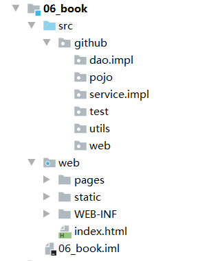

## 创建数据库和t_user用户表:

```sql
drop database if exists atguigu;	## 如果原来的数据库存在，就删除

create database atguigu;			## 创建数据库

use atguigu;					## 切换到数据库


##创建表t_user
create table t_user(
	`id` int primary key auto_increment,
	`username` varchar(50) not null unique,
	`password` varchar(32) not null,
	`email` varchar(50) 
);

##插入初始数据
insert into t_user(username,`password`,email) values('admin','admin','admin@atguigu.com');

## 查询表
select * from t_user;
```

##  编写数据库表对应的JavaBean对象 

```java
package github.pojo;

public class User {
    private Integer id;
    private String username;
    private String password;
    private String email;

    public Integer getId() {
        return id;
    }

    public void setId(Integer id) {
        this.id = id;
    }

    public String getUsername() {
        return username;
    }

    public void setUsername(String username) {
        this.username = username;
    }

    public String getPassword() {
        return password;
    }

    public void setPassword(String password) {
        this.password = password;
    }

    public String getEmail() {
        return email;
    }

    public void setEmail(String email) {
        this.email = email;
    }

    @Override
    public String toString() {
        return "User{" +
                "id=" + id +
                ", username='" + username + '\'' +
                ", password='" + password + '\'' +
                ", email='" + email + '\'' +
                '}';
    }

    public User() {
    }

    public User(Integer id, String username, String password, String email) {
        this.id = id;
        this.username = username;
        this.password = password;
        this.email = email;
    }
}
```

## 编写工具类JdbcUtils  

### 1.导入需要的jar包 

```java
数据库和连接池需要:	
	druid-1.1.9.jar
    mysql-connector-java-5.1.7-bin.jar

以下是测试需要：
	hamcrest-core-1.3.jar
	junit-4.12.jar
```

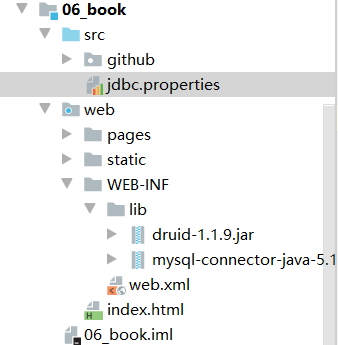

### 2.在src源码目录下编写jdbc.properties属性配置文件 

```java
username=root
password=root
url=jdbc:mysql://localhost:3306/book
driverClassName=com.mysql.jdbc.Driver
initialSize=5
maxActive=10
```

### 3.编写JdbcUtils工具类 

```java
package github.utils;

import com.alibaba.druid.pool.DruidDataSource;
import com.alibaba.druid.pool.DruidDataSourceFactory;

import java.io.InputStream;
import java.sql.Connection;
import java.sql.SQLException;
import java.util.Properties;

public class JdbcUtils {

    private static DruidDataSource dataSource;

    static {
        try {
            Properties properties = new Properties();
            // 读取属性配置文件
            InputStream inputStream = JdbcUtils.class.getClassLoader().getResourceAsStream("jdbc.properties");
            // 从流中加载数据
            properties.load(inputStream);
            // 创建了数据库连接池
            dataSource = (DruidDataSource) DruidDataSourceFactory.createDataSource(properties);

//            测试1
//            System.out.println(dataSource.getConnection());

        } catch (Exception e) {
            e.printStackTrace();
        }
    }

    /**
     * 获取数据库连接池
     * @return 如果返回null，则获值失败
     */
    public static Connection getConnection(){
        Connection conn = null;

        try {
            conn = dataSource.getConnection();
        } catch (SQLException e) {
            e.printStackTrace();
        }

        return conn;
    }

    /**
     * 关闭数据库连接池
     * @param conn
     */
    public static void close(Connection conn){
        if(conn != null){
            try {
                conn.close();
            } catch (SQLException e) {
                e.printStackTrace();
            }
        }
    }
}
```

> 导入jar包：

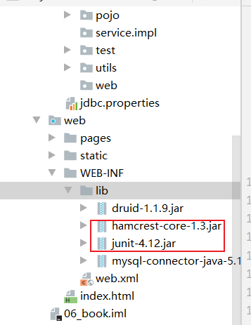

### 4.JdbcUtils测试 

```java
package github.test;

import github.utils.JdbcUtils;
import org.junit.Test;

import java.sql.Connection;

public class JdbcUtilTest {
    @Test
    public void testJdbcUtils(){
        for (int i=0;i<100;i++) {
            Connection connection = JdbcUtils.getConnection();
            System.out.println(connection);
            JdbcUtils.close(connection);
        }
    }
}
```

## 编写BaseDao 

### 1.导入DBUtils的jar包 

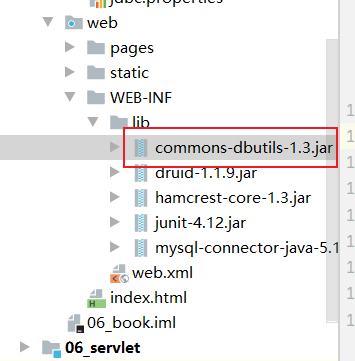

### 2.编写BaseDao

```java
package github.dao.impl;

import github.utils.JdbcUtils;
import org.apache.commons.dbutils.QueryRunner;
import org.apache.commons.dbutils.handlers.BeanHandler;
import org.apache.commons.dbutils.handlers.BeanListHandler;
import org.apache.commons.dbutils.handlers.ScalarHandler;

import java.sql.Connection;
import java.sql.SQLException;
import java.util.List;

public abstract class BaseDao {
    // 使用Dbutils操作数据库
    private QueryRunner queryRunner = new QueryRunner();

    /**
     * update()方法用来执行:Insert\Update\Delete语句
     * @param sql
     * @param args
     * @return 如果返回-1，程序失败；返回其他，表示影响的行数
     */
    public int update(String sql,Object ... args){
        Connection connection = JdbcUtils.getConnection();
        try {
            return queryRunner.update(connection,sql,args);
        } catch (SQLException e) {
            e.printStackTrace();
        }
        return -1;
    }

    /**
     * 查询返回一个JavaBean的SQL语句
     * @param type 返回对象的类型
     * @param sql 执行的SQL语句
     * @param args sql对应的参数
     * @param <T> 返回的类型的泛型
     * @return
     */
    public <T> T queryForOne(Class<T> type, String sql,Object ... args){
        Connection con = JdbcUtils.getConnection();
        try {
            return queryRunner.query(con,sql,new BeanHandler<T>(type),args);
        } catch (SQLException e) {
            e.printStackTrace();
        } finally {
            JdbcUtils.close(con);
        }
        return null;
    }

    /**
     * 查询返回多个javaBean的sql语句
     * @param type 返回对象的类型
     * @param sql 执行的SQL语句
     * @param args sql对应的参数
     * @param <T> 返回的类型的泛型
     * @return
     */
    public <T> List<T> queryForList(Class<T> type, String sql, Object ... args){
        Connection con = JdbcUtils.getConnection();
        try {
            return queryRunner.query(con,sql,new BeanListHandler<T>(type),args);
        } catch (SQLException e) {
            e.printStackTrace();
        } finally {
            JdbcUtils.close(con);
        }
        return null;
    }

    /**
     * 执行返回一行一列的sql语句
     * @param sql 执行的sql语句
     * @param args sql对应的参数
     * @return
     */
    public Object queryForSingle(String sql,Object... args){
        Connection con = JdbcUtils.getConnection();

        try {
            queryRunner.query(con,sql,new ScalarHandler(),args);
        } catch (SQLException e) {
            e.printStackTrace();
        } finally {
            JdbcUtils.close(con);
        }

        return null;
    }
}
```

## 编写UserDao和测试 

> UserDao接口: 

```java
package github.dao;

import github.pojo.User;

public interface UserDao {

    /**
     * 根据用户名查询用户信息
     * @param username 用户名
     * @return 如果返回null,查询无此用户；反之，亦然。
     */
    public User queryUserByUsername(String username);

    /**
     * 根据用户名和密码查询用户信息
     * @param username
     * @param password
     * @return 如果返回null,说明用户名或密码错误；反之，亦然。
     */
    public User queryUserByUsernameAndPassword(String username,String password);

    /**
     * 保存用户信息
     * @param user
     * @return 返回-1表示操作失败，其他是sql语句影响的行数
     */
    public int saveUser(User user);
}
```

> UserDaoImpl实现类:

```java
package github.dao.impl;

import github.dao.UserDao;
import github.pojo.User;

public class UserDaoImpl extends BaseDao implements UserDao {

    @Override
    public User queryUserByUsername(String username) {
        String sql = "select `id`,`username`,`password`,`email` from t_user where username = ?";
        return queryForOne(User.class, sql, username);
    }

    @Override
    public User queryUserByUsernameAndPassword(String username, String password) {
        String sql = "select `id`,`username`,`password`,`email` from t_user where username = ? and password = ?";
        return queryForOne(User.class, sql, username,password);
    }

    @Override
    public int saveUser(User user) {
        String sql = "insert into t_user(`username`,`password`,`email`) values(?,?,?)";
        return update(sql, user.getUsername(),user.getPassword(),user.getEmail());
    }
}
```

> UserDao测试:

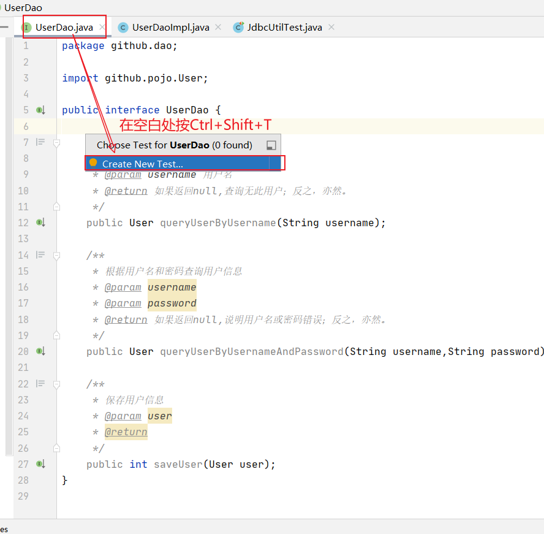

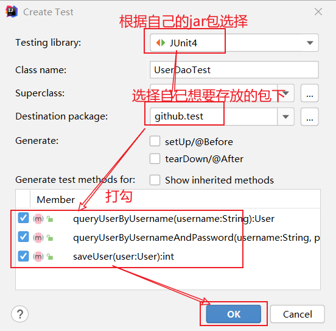

```java
package github.test;

import github.dao.UserDao;
import github.dao.impl.UserDaoImpl;
import github.pojo.User;
import org.junit.Test;

import static org.junit.Assert.*;

public class UserDaoTest {

    UserDao userDao = new UserDaoImpl();

    @Test
    public void queryUserByUsername() {
        if (userDao.queryUserByUsername("subei") == null ){
            System.out.println("用户名可用！");
        } else {
            System.out.println("用户名已存在！");
        }
    }

    @Test
    public void queryUserByUsernameAndPassword() {
        if ( userDao.queryUserByUsernameAndPassword("admin","admin") == null) {
            System.out.println("用户名或密码错误，登录失败");
        } else {
            System.out.println("查询成功");
        }
    }

    @Test
    public void saveUser() {
        System.out.println( userDao.saveUser(new User(null,"subei", "root", "subei@qq.com")) );
    }
}
```

## 编写UserService和测试 

> UserService接口 

```java
package github.service;

import github.pojo.User;

public interface UserService {

    /**
     * 注册用户
     * @param user
     */
    public void registUser(User user);

    /**
     * 登录
     * @param user
     * @return 如果返回null，说明登录失败，返回有值，是登录成功
     */
    public User login(User user);

    /**
     * 检查用户名是否可用
     * @param username
     * @return 返回true表示用户名已存在，返回false表示用户名可用
     */
    public boolean existsUsername(String username);

}
```

> UserServiceImpl实现类 

```java
package github.service.impl;

import github.dao.UserDao;
import github.dao.impl.UserDaoImpl;
import github.pojo.User;
import github.service.UserService;

public class UserServiceImpl  implements UserService {
    private UserDao userDao = new UserDaoImpl();

    @Override
    public void registUser(User user) {
        userDao.saveUser(user);
    }

    @Override
    public User login(User user) {
        return userDao.queryUserByUsernameAndPassword(user.getUsername(), user.getPassword());
    }

    @Override
    public boolean existsUsername(String username) {

        if (userDao.queryUserByUsername(username) == null) {
            // 等于null,说明没查到，即表示可用
            return false;
        }
        return true;
    }
}
```

> UserService测试 

```java
package github.test;

import github.pojo.User;
import github.service.UserService;
import github.service.impl.UserServiceImpl;
import org.junit.Test;

import static org.junit.Assert.*;

public class UserServiceTest {

    UserService userService = new UserServiceImpl();

    @Test
    public void registUser() {
        userService.registUser(new User(null,"subei365","666666","subei@qq.com"));
        userService.registUser(new User(null,"teah4399","1314912","hoist@qq.com"));
    }

    @Test
    public void login() {
        System.out.println(userService.login(new User(null, "zhangsan168", "9527", null)));
    }

    @Test
    public void existsUsername() {
        if(userService.existsUsername("zhangsansan168")){
            System.out.println("用户名已存在");
        }else{
            System.out.println("你输入了什么？？？？");
        }
    }
}
```

## 编写web层 

### 1.实现用户注册的功能 

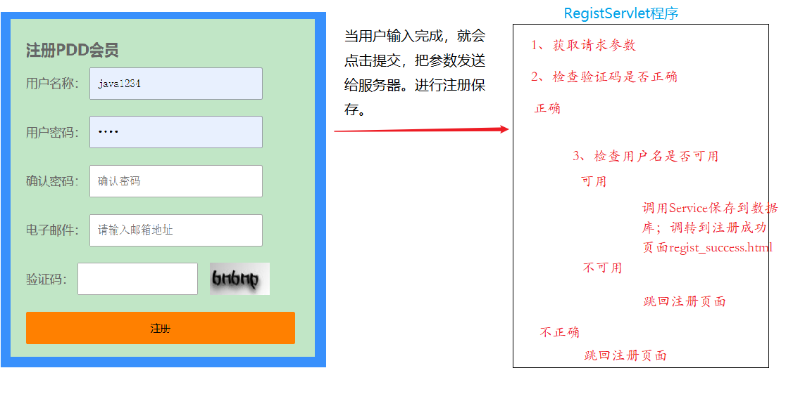

> 修改regist.html页面： 

```html
<!DOCTYPE html>
<html>
<head>
	<meta charset="UTF-8">
	<title>PDD会员注册页面</title>
	<!--写base标签，永远固定相对路径跳转的结果-->
	<base href="http://localhost:8080/06_book/">
	<link type="text/css" rel="stylesheet" href="static/css/style.css">
	<script type="text/javascript" src="static/script/jquery-1.7.2.js" <script type="text/javascript">
	// 页面加载完成后
	$(function() {
		// 给注册绑定单击事件
		$("#sub_btn").click(function() {
			// 验证用户名：必须由字母，数字下划线组成，并且长度为5到12位
			// 1.获取用户名输入框里的内容
			var usernameText = $("#username").val();
			// 2.创建正则表达式对象
			var usernamePatt = /^\w{5,12}$/;
			// 3.使用test方法验证
			if (!usernamePatt.test(usernameText)) {
				// 4.提示用户结果
				$("span.errorMsg").text("用户名不合法！");
				return false;
			}

			// 验证密码：必须由字母，数字下划线组成，并且长度为5到12位
			// 1.获取用户名输入框里的内容
			var passwordText = $("#password").val();
			// 2.创建正则表达式对象
			var passwordPatt = /^\w{5,12}$/;
			// 3.使用test方法验证
			if (!passwordPatt.test(passwordText)) {
				// 4.提示用户结果
				$("span.errorMsg").text("用户名不合法！");
				return false;
			}

			// 验证确认密码：和密码相同
			// 1.获取确认密码内容
			var repwdText = $("#repwd").val();
			// 2.和密码相比较
			if (repwdText != passwordText) {
				// 3.提示用户
				$("span.errorMsg").text("两次密码不一致！");
				return false;
			}

			// 邮箱验证：xxxxx@xxx.com
			// 1.获取邮箱里的内容
			var emailText = $("#email").val();
			// 2.创建正则表达式对象
			var emailPatt = /^[a-z\d]+(\.[a-z\d]+)*@([\da-z](-[\da-z])?)+(\.{1,2}[a-z]+)+$/;
			// 3.使用test方法验证是否合法
			if (!emailPatt.test(emailText)) {
				// 4.提示用户
				$("span.errorMsg").text("邮箱格式不合法！");
				return false;
			}

			// 验证码：现在只需要验证用户已输入。因为还没讲到服务器。验证码生成。
			var codeText = $("#code").val();
			// 去掉验证码前后空格
			// alert("去空格前：["+codeText+"]")
			codeText = $.trim(codeText);
			// alert("去空格后：["+codeText+"]")
			if (codeText == null || codeText == "") {
				// 4.提示用户
				$("span.errorMsg").text("验证码不能为空！");
				return false;
			}

			// 去掉错误信息
			$("span.errorMsg").text("");
		});
	});
</script>
	<style type="text/css">
	.login_form {
		height: 420px;
		margin-top: 25px;
	}
	</style>
	</head>
	<body>
	<div id="login_header">
			
			</div>
			<div class="login_banner">
			<div id="l_content">
			<span class="login_word">欢迎注册</span>
			</div>
			<div id="content">
			<div class="login_form">
			<div class="login_box">
			<div class="tit">
			<h1>注册PDD会员</h1>
			<span class="errorMsg"></span>
			</div>
			<div class="form">
			<form action="registServlet" method="post">
			<label>用户名称：</label>
	<input class="itxt" type="text" placeholder="请输入用户名" autocomplete="off" tabindex="1" name="username" id="username" />
			<br />
			<br />
			<label>用户密码：</label>
	<input class="itxt" type="password" placeholder="请输入密码" autocomplete="off" tabindex="1" name="password" id="password" />
			<br />
			<br />
			<label>确认密码：</label>
	<input class="itxt" type="password" placeholder="确认密码" autocomplete="off" tabindex="1" name="repwd" id="repwd" />
			<br />
			<br />
			<label>电子邮件：</label>
	<input class="itxt" type="text" placeholder="请输入邮箱地址" autocomplete="off" tabindex="1" name="email" id="email" />
			<br />
			<br />
			<label>验证码：</label>
	<input class="itxt" type="text" name="code" style="width: 150px;" id="code" value="abcde"/>
			
			<br />
			<br />
			<input type="submit" value="注册" id="sub_btn" />
			</form>
			</div>
			</div>
			</div>
			</div>
			</div>
			<div id="bottom">
			<span>
			PDD书城.Copyright &copy;2020
	</span>
	</div>
	</body>
	</html>
```

> 修改regist_success.html页面：

```html
<!DOCTYPE html>
<html>
<head>
	<meta charset="UTF-8">
	<title>会员注册页面</title>
	<!--写base标签，永远固定相对路径跳转的结果-->
	<base href="http://localhost:8080/06_book/">
	<link type="text/css" rel="stylesheet" href="static/css/style.css">
	<style type="text/css">
		h1 {
			text-align: center;
			margin-top: 200px;
		}
		h1 a {
			color: red;
		}
	</style>
</head>
<body>
<div id="header">
	
	<span class="wel_word"></span>
	<div>
		<span>欢迎<span class="um_span">subeiLY</span>光临PDD书城</span>
		<a href="../order/order.html">我的订单</a>
		<a href="../../index.html">注销</a>&nbsp;&nbsp;
		<a href="../../index.html">返回</a>
	</div>
</div>
<div id="main">
	<h1>注册成功! <a href="../../index.html">转到主页</a></h1>
</div>
<div id="bottom">
			<span>
				PDD书城.Copyright &copy;2020
			</span>
</div>
</body>
</html>
```

> 编写RegistServlet程序:

```java
package github.web;

import github.pojo.User;
import github.service.UserService;
import github.service.impl.UserServiceImpl;

import javax.servlet.ServletException;
import javax.servlet.http.HttpServlet;
import javax.servlet.http.HttpServletRequest;
import javax.servlet.http.HttpServletResponse;
import java.io.IOException;

public class RegistServlet extends HttpServlet {

    private UserService userService = new UserServiceImpl();

    @Override
    protected void doPost(HttpServletRequest req, HttpServletResponse resp) throws ServletException, IOException {
//          1、获取请求的参数
        String username = req.getParameter("username");
        String password = req.getParameter("password");
        String email = req.getParameter("email");
        String code = req.getParameter("code");

//        2、检查验证码是否正确  ===>> 写死,要求验证码为:abcde
        if ("abcde".equalsIgnoreCase(code)) {
//        3、检查用户名是否可用
            if (userService.existsUsername(username)) {
                System.out.println("用户名[" + username + "]已存在!");
//        跳回注册页面
                req.getRequestDispatcher("/pages/user/regist.html").forward(req, resp);
            } else {
//                   可用
//                调用Sservice保存到数据库
                userService.registUser(new User(null, username, password, email));
//
//                 跳到注册成功页面 regist_success.html
                req.getRequestDispatcher("/pages/user/regist_success.html").forward(req, resp);
            }
        } else {
            System.out.println("验证码[" + code + "]错误");
            req.getRequestDispatcher("/pages/user/regist.html").forward(req, resp);
        }
    }
}
```

### 2.用户登录功能的实现 

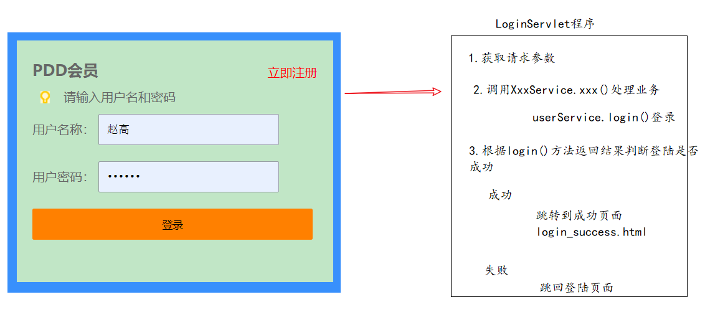

> 修改login.html页面: 

```html
<!DOCTYPE html>
<html>
<head>
<meta charset="UTF-8">
<title>PDD会员登录页面</title>
<!--写base标签，永远固定相对路径跳转的结果-->
<base href="http://localhost:8080/06_book/">
<link type="text/css" rel="stylesheet" href="static/css/style.css" >
</head>
<body>
		<div id="login_header">
			
		</div>
			<div class="login_banner">
			
				<div id="l_content">
					<span class="login_word">欢迎登录</span>
				</div>
				
				<div id="content">
					<div class="login_form">
						<div class="login_box">
							<div class="tit">
								<h1>PDD会员</h1>
								<a href="regist.html">立即注册</a>
							</div>
							<div class="msg_cont">
								<b></b>
								<span class="errorMsg">请输入用户名和密码</span>
							</div>
							<div class="form">
								<form action="loginServlet" method="post">
									<label>用户名称：</label>
									<input class="itxt" type="text" placeholder="请输入用户名" autocomplete="off" tabindex="1" name="username" />
									<br />
									<br />
									<label>用户密码：</label>
									<input class="itxt" type="password" placeholder="请输入密码" autocomplete="off" tabindex="1" name="password" />
									<br />
									<br />
									<input type="submit" value="登录" id="sub_btn" />
								</form>
							</div>
							
						</div>
					</div>
				</div>
			</div>
		<div id="bottom">
			<span>
				PDD书城.Copyright &copy;2020
			</span>
		</div>
</body>
</html>
```

> 修改login_success.html页面:

```html
<!DOCTYPE html>
<html>
<head>
<meta charset="UTF-8">
<title>PDD会员注册页面</title>
<!--写base标签，永远固定相对路径跳转的结果-->
<base href="http://localhost:8080/06_book/">
<link type="text/css" rel="stylesheet" href="static/css/style.css" >
<style type="text/css">
	h1 {
		text-align: center;
		margin-top: 200px;
	}
	h1 a {
		color:red;
	}
</style>
</head>
<body>
		<div id="header">
				
				<div>
					<span>欢迎<span class="um_span">subeiLY</span>光临PDD书城</span>
					<a href="../order/order.html">我的订单</a>
					<a href="../../index.html">注销</a>&nbsp;&nbsp;
					<a href="../../index.html">返回</a>
				</div>
		</div>
		<div id="main">
			<h1>欢迎回来 <a href="../../index.html">转到主页</a></h1>
		</div>
		<div id="bottom">
			<span>
				PDD书城.Copyright &copy;2020
			</span>
		</div>
</body>
</html>
```

> 编写LoginServlet程序:

```java
package github.web;

import github.pojo.User;
import github.service.UserService;
import github.service.impl.UserServiceImpl;

import javax.servlet.ServletException;
import javax.servlet.http.HttpServlet;
import javax.servlet.http.HttpServletRequest;
import javax.servlet.http.HttpServletResponse;
import java.io.IOException;

public class LoginServlet extends HttpServlet {

    private UserService userService = new UserServiceImpl();
    @Override
    protected void doPost(HttpServletRequest req, HttpServletResponse resp) throws ServletException, IOException {
//          1、获取请求的参数
        String username = req.getParameter("username");
        String password = req.getParameter("password");
//         调用 userService.login()登录处理业务
        User loginUser = userService.login(new User(null, username, password, null));
//         如果等于null,说明登录 失败!
        if (loginUser == null) {
//               跳回登录页面
            req.getRequestDispatcher("/pages/user/login.html").forward(req, resp);
        } else {
//             登录成功
//            跳到成功页面login_success.html
            req.getRequestDispatcher("/pages/user/login_success.html").forward(req, resp);
        }
    }
}
```

# JSP(了解)

## 1.什么是jsp，它有什么用? 

> jsp的全换是java server pages。Java的服务器页面。

> jsp的主要作用是代替Servlet程序回传html页面的数据。因为Servlet程序回传html页面数据是一件非常繁锁的事情。开发成本和维护成本都极高。 

> Servlet回传html页面数据: 

```java
package github.Servlet;

import javax.servlet.ServletException;
import javax.servlet.http.HttpServlet;
import javax.servlet.http.HttpServletRequest;
import javax.servlet.http.HttpServletResponse;
import java.io.IOException;
import java.io.PrintWriter;

public class PrintHtml extends HttpServlet {
    @Override
    protected void doGet(HttpServletRequest req, HttpServletResponse resp) throws ServletException, IOException {
        //通过相应的回传流回传html页面
        resp.setContentType("text/html;charset=UTF-8");
        PrintWriter writer = resp.getWriter();
        writer.write("<!DOCTYPE html>");
        writer.write("<html lang=\"en\">");
        writer.write("<head>");
        writer.write("    <meta charset=\"UTF-8\">");
        writer.write("    <title>Title</title>");
        writer.write("</head>");
        writer.write("<body>");
        writer.write("    这是HTML页面");
        writer.write("</body>");
        writer.write("</html>");
    }
}
```

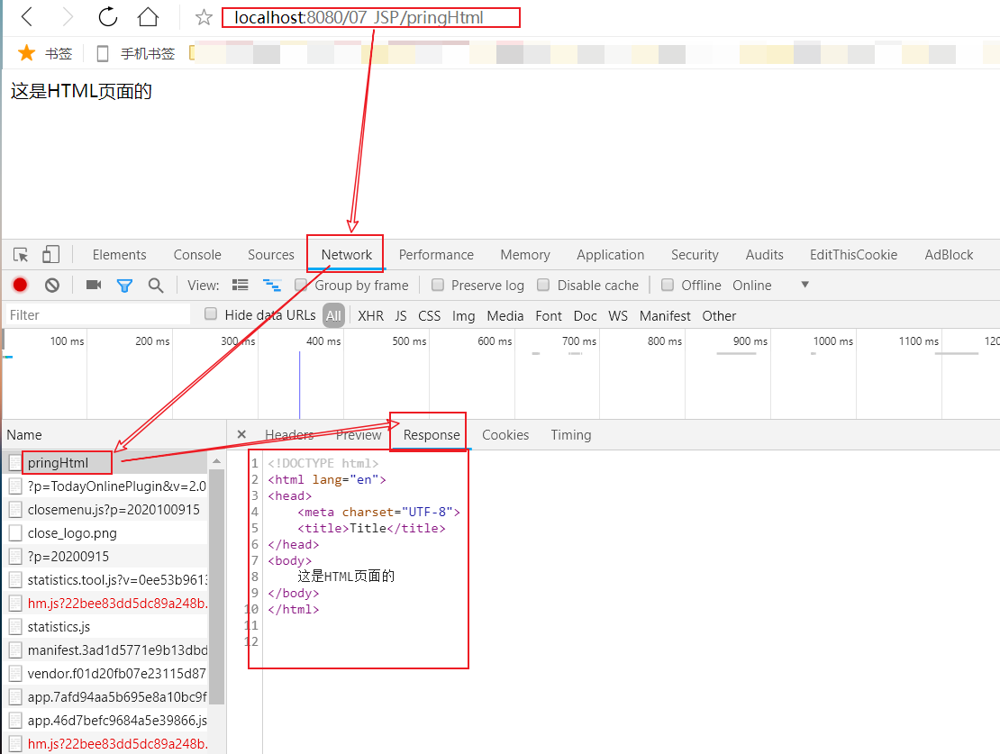

> jsp回传一个简单html页面:

```jsp
<%@ page contentType="text/html;charset=UTF-8" language="java" %>
<html>
<head>
    <title>Title</title>
</head>
<body>
    这是html页面的数据
</body>
</html>
```

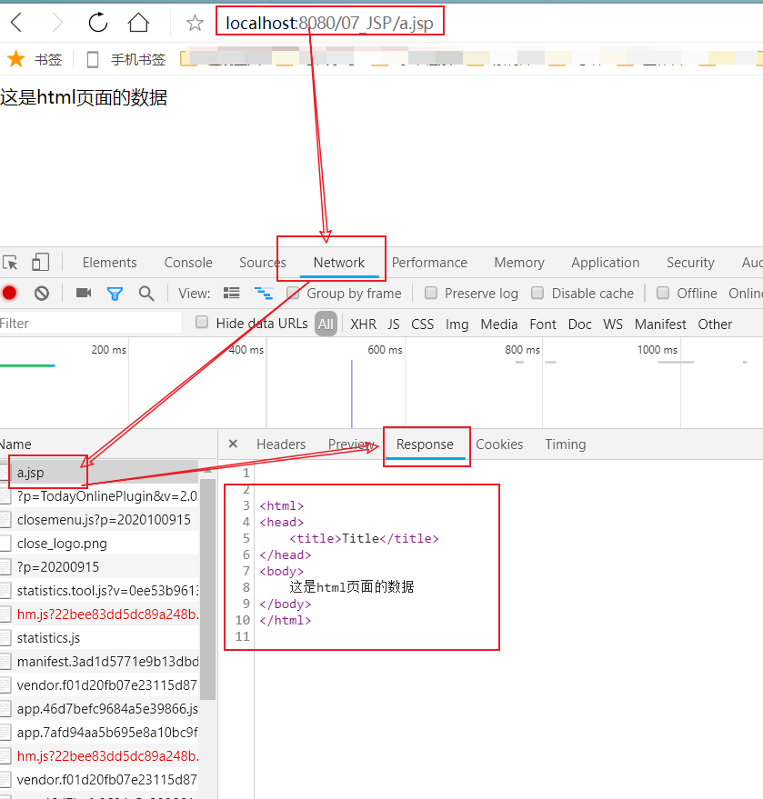

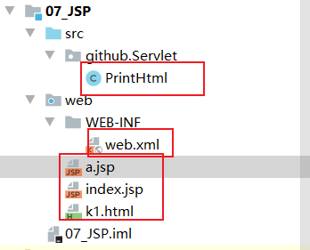

> JSP小结：

> jsp页面和html页面一样，都是存放在web目录下。访问也跟访问html页面一样。 

```jsp
比如：
在web目录下有如下的文件：
	web目录
		a.html页面	访问地址是=======>>>>>>	http://ip:port/工程路径/a.html
		b.jsp页面		访问地址是=======>>>>>>	http://ip:port/工程路径/b.jsp
```

## 2.jsp的本质是什么 

> jsp页面本质上是一个Servlet程序。

- 当我们第一次访问jsp页面的时候。Tomcat服务器会帮我们把jsp页面翻译成为一个java源文件。并且对它进行编译成为.class字节码程序。我们打开java源文件不难发现其里面的内容是：

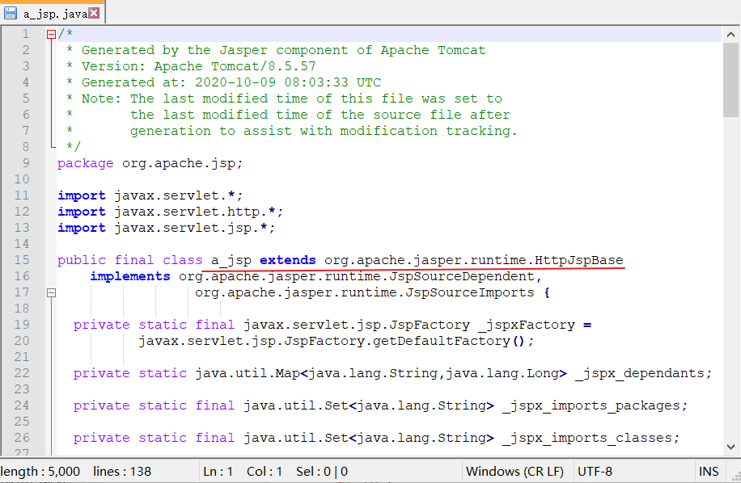

- 跟踪原代码发现，HttpJspBase类。它直接地继承了HttpServlet类。也就是说。jsp翻译出来的java类，它间接了继承了HttpServlet类。也就是说，翻译出来的是一个Servlet程序：

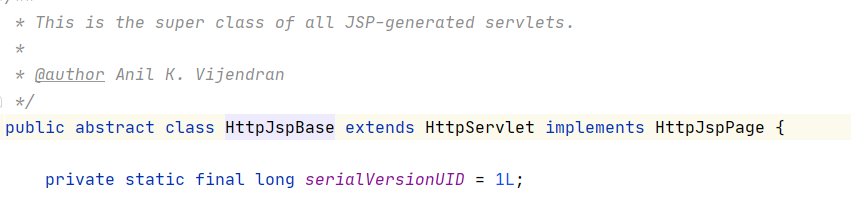

- 总结：通过翻译的java源代码我们就可以得到结果：jsp就是Servlet程序。
- 也可以去观察翻译出来的Servlet程序的源代码，不难发现。其底层实现，也是通过输出流。把html页面数据回传给客户端。 

```java
public void _jspService(final javax.servlet.http.HttpServletRequest request, final javax.servlet.http.HttpServletResponse response)
      throws java.io.IOException, javax.servlet.ServletException {

    final java.lang.String _jspx_method = request.getMethod();
    if (!"GET".equals(_jspx_method) && !"POST".equals(_jspx_method) && !"HEAD".equals(_jspx_method) && !javax.servlet.DispatcherType.ERROR.equals(request.getDispatcherType())) {
      response.sendError(HttpServletResponse.SC_METHOD_NOT_ALLOWED, "JSP 只允许 GET、POST 或 HEAD。Jasper 还允许 OPTIONS");
      return;
    }

    final javax.servlet.jsp.PageContext pageContext;
    javax.servlet.http.HttpSession session = null;
    final javax.servlet.ServletContext application;
    final javax.servlet.ServletConfig config;
    javax.servlet.jsp.JspWriter out = null;
    final java.lang.Object page = this;
    javax.servlet.jsp.JspWriter _jspx_out = null;
    javax.servlet.jsp.PageContext _jspx_page_context = null;


    try {
      response.setContentType("text/html;charset=UTF-8");
      pageContext = _jspxFactory.getPageContext(this, request, response,
      			null, true, 8192, true);
      _jspx_page_context = pageContext;
      application = pageContext.getServletContext();
      config = pageContext.getServletConfig();
      session = pageContext.getSession();
      out = pageContext.getOut();
      _jspx_out = out;

      out.write("\r\n");
      out.write("\r\n");
      out.write("<html>\r\n");
      out.write("<head>\r\n");
      out.write("    <title>Title</title>\r\n");
      out.write("</head>\r\n");
      out.write("<body>\r\n");
      out.write("    这是a.JSP页面的数据\r\n");
      out.write("</body>\r\n");
      out.write("</html>\r\n");
    } catch (java.lang.Throwable t) {
      if (!(t instanceof javax.servlet.jsp.SkipPageException)){
        out = _jspx_out;
        if (out != null && out.getBufferSize() != 0)
          try {
            if (response.isCommitted()) {
              out.flush();
            } else {
              out.clearBuffer();
            }
          } catch (java.io.IOException e) {}
        if (_jspx_page_context != null) _jspx_page_context.handlePageException(t);
        else throw new ServletException(t);
      }
    } finally {
      _jspxFactory.releasePageContext(_jspx_page_context);
    }
  }
```

### 小问题解决——报错Cannot resolve symbol 'jasper'

> 这种报Cannot resolve symbol XXX;基本都是缺少某个jar包，找到它，导入即可解决问题。

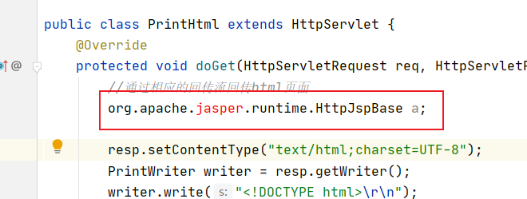

> 具体步骤如下：

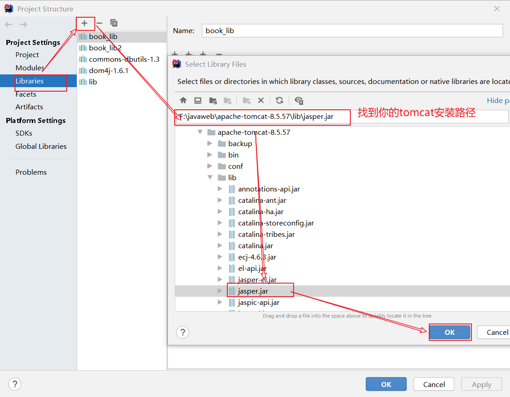

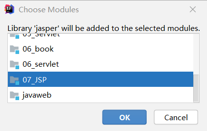

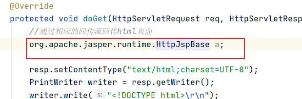

## 3.jsp的三种语法 

### 1.jsp头部的page指令 

> jsp的page指令可以修改jsp页面中一些重要的属性，或者行为。 

```java
1. language属性		表示jsp翻译后是什么语言文件。暂时只支持java;
2. contentType属性	表示jsp返回的数据类型是什么。也是源码中response.setContentType()参数值;
3. pageEncoding属性	表示当前jsp页面文件本身的字符集;
4. import属性			跟java源代码中一样。用于导包，导类;
5. autoFlush属性		设置当out输出流缓冲区满了之后，是否自动刷新冲级区。默认值是true;
6. buffer属性			设置out缓冲区的大小。默认是8kb;
7. errorPage属性		设置当jsp页面运行时出错，自动跳转去的错误页面路径;
8. isErrorPage属性	设置当前jsp页面是否是错误信息页面。默认是false。如果是true可以获取异常信息;
9. session属性		设置访问当前jsp页面，是否会创建HttpSession对象。默认是true;
10. extends属性		设置jsp翻译出来的java类默认继承谁。
```

### 2.jsp中的常用脚本 

> 声明脚本:

- 声明脚本的格式是：<%!声明java代码%>
- 作用：可以给jsp翻译出来的java类定义属性和方法甚至是静态代码块。内部类等。 

> 表达式脚本:
>
> ```jsp
> 表达式脚本的格式是：<%=表达式%>
> 表达式脚本的作用是：的jsp页面上输出数据。
> ```

- 表达式脚本的特点：
  - 所有的表达式脚本都会被翻译到_jspService()方法中；
  - 表达式脚本都会被翻译成为out.print()输出到页面上;
  - 由于表达式脚本翻译的内容都在_jspService()方法中,所以 _jspService()方法中的对象都可以直接使用。
  - 表达式脚本中的表达式不能以分号结束。 

> 代码脚本:
>
> ```jsp
> 代码脚本的格式是：
> 	<%
> 		java语句
>     %>
> 
> 代码脚本的作用是：可以在jsp页面中，编写我们自己需要的功能（写的是java语句）。
> ```

- 代码脚本的特点是：
  - 代码脚本翻译之后都在_jspService方法中;
  - 代码脚本由于翻译到_jspService()方法中，所以在 _jspService()方法中的现有对象都可以直接使用;
  - 还可以由多个代码脚本块组合完成一个完整的java语句;
  - 代码脚本还可以和表达式脚本一起组合使用，在jsp页面上输出数据。

### 3.jsp中的三种注释 

> html注释： 

```html
<!--这是html注释-->
html注释会被翻译到java源代码中。在_jspService方法里，以out.writer输出到客户端。
```

> java注释: 

```java
<%
        // 单行java注释
        /*  多行java注释  */
%>
java注释会被翻译到java源代码中。    
```

> jsp注释： 

```jsp
<%-- 这是jsp注释  --%>
jsp注释可以注掉，jsp页面中所有代码。
```

>整理一下：

```jsp
<%@ page contentType="text/html;charset=UTF-8" language="java" isELIgnored="true" %>
<!--
errorPage表示错误后自动跳转去的路径　<br/>
这个路径一般都是以斜杠打头，它表示请求地址为http://ip:port/工程路径/
映射到代码的Web目录
-->
<html>
<head>
    <title>Title</title>
</head>
<body>
    这是b.JSP页面的数据
    <!-- 这是html注释  -->
    <%
        // 单行java注释
        /*  多行java注释  */
    %>

    <%-- 这是jsp注释  --%>
</body>
</html>
```

## 4.jsp九大内置对象 

> jsp中的内置对象，是指Tomcat在翻译jsp页面成为Servlet源代码后，内部提供的九大对象，叫内置对象。 

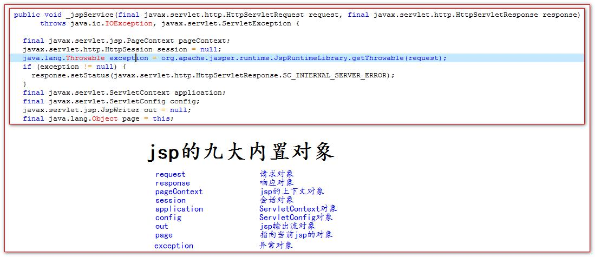

## 5.jsp四大域对象 

> ```jsp
> 四个域对象分别是：
> 	pageContext		(PageContextImpl类)		当前jsp页面范围内有效;
> 	request			(HttpServletRequest类)	一次请求内有效;
> 	session			(HttpSession类)			一个会话范围内有效（打开浏览器访问服务器，直到关闭浏览器）;
> 	application		(ServletContext类)		整个web工程范围内都有效（只要web工程不停止，数据都在）.
> ```
>
> - 域对象是可以像Map一样存取数据的对象。四个域对象功能一样。不同的是它们对数据的存取范围。
>
> - 虽然四个域对象都可以存取数据。在使用上它们是有优先顺序的。
> - 四个域在使用的时候，优先顺序分别是，他们从小到大的范围的顺序。
>
> ```jsp
> pageContext	====>>>	request	====>>>	session	====>>>	application
> ```

```jsp
<%@ page contentType="text/html;charset=UTF-8" language="java" %>
<html>
<head>
    <title>Title</title>
</head>
<body>
    <h1>scope.jsp页面</h1>
    <%
        // 往四个域中都分别保存了数据
        pageContext.setAttribute("key", "pageContext");
        request.setAttribute("key", "request");
        session.setAttribute("key", "session");
        application.setAttribute("key", "application");
    %>
    pageContext域是否有值：<%=pageContext.getAttribute("key")%> <br>
    request域是否有值：<%=request.getAttribute("key")%> <br>
    session域是否有值：<%=session.getAttribute("key")%> <br>
    application域是否有值：<%=application.getAttribute("key")%> <br>
    <%
        //        request.getRequestDispatcher("/scope2.jsp").forward(request,response);
    %>
</body>
</html>
```

```jsp
<%@ page contentType="text/html;charset=UTF-8" language="java" %>
<html>
<head>
    <title>Title</title>
</head>
<body>
    <h1>scope2.jsp页面</h1>
    pageContext域是否有值：<%=pageContext.getAttribute("key")%> <br>
    request域是否有值：<%=request.getAttribute("key")%> <br>
    session域是否有值：<%=session.getAttribute("key")%> <br>
    application域是否有值：<%=application.getAttribute("key")%> <br>
</body>
</html>
```

## 6.jsp中的out输出和response.getWriter输出的区别 

> response中表示响应，我们经常用于设置返回给客户端的内容（输出）.
>
> out也是给用户做输出使用的.


> 由于jsp翻译之后，底层源代码都是使用out来进行输出，所以一般情况下。我们在jsp页面中统一使用out来进行输出。避免打乱页面输出内容的顺序。
>
> out.write()输出字符串没有问题;
>
> out.print()输出任意数据都没有问题（都转换成为字符串后调用的write输出） 

```jsp
结论：在jsp页面中，可以统一使用out.print()来进行输出
```

## 7.jsp的常用标签 

### 1.jsp静态包含 

```jsp
<%@ page contentType="text/html;charset=UTF-8" language="java" %>
<html>
<head>
    <title>Title</title>
</head>
<body>
    头部信息 <br/>
    主体内容 <br/>
    <%--
        <%@ include file=""%> 就是静态包含
            file 属性指定你要包含的jsp页面的路径
            地址中第一个斜杠 / 表示为http://ip:port/工程路径/  映射到代码的web目录

         静态包含的特点：
            1、静态包含不会翻译被包含的jsp页面。
            2、静态包含其实是把被包含的jsp页面的代码拷贝到包含的位置执行输出。--%>
    <%@ include file="/include/foots.jsp"%>
</body>
</html>
```

> foots.jsp

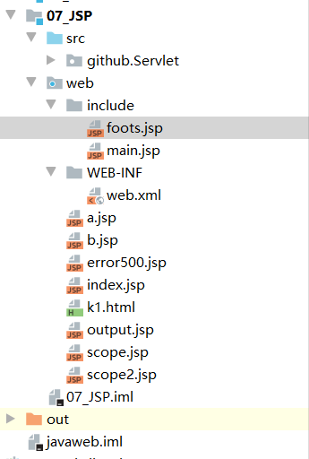

```jsp
<%@ page contentType="text/html;charset=UTF-8" language="java" %>
<html>
<head>
    <title>Title</title>
</head>
<body>
    脚页信息 <br>
    改动一下 <%=request.getParameter("password")%>
</body>
</html>
```

### 2.jsp动态包含 

```jsp
<%@ page contentType="text/html;charset=UTF-8" language="java" %>
<html>
<head>
    <title>Title</title>
</head>
<body>
    <%--
        <jsp:include page=""></jsp:include>     这是动态包含
        page 属性是指定你要包含的jsp页面的路径
        动态包含也可以像静态包含一样。把被包含的内容执行输出到包含位置

        动态包含的特点：
            1、动态包含会把包含的jsp页面也翻译成为java代码
            2、动态包含底层代码使用如下代码去调用被包含的jsp页面执行输出。
                JspRuntimeLibrary.include(request, response, "/include/foots.jsp", out, false);
            3、动态包含，还可以传递参数
    --%>
    <jsp:include page="/include/foots.jsp">
        <jsp:param name="username" value="bbj"/>
        <jsp:param name="password" value="root"/>
    </jsp:include>
</body>
</html>
```

> 动态包含的底层原理:


### 3.jsp标签-转发 

```jsp
<%--
        <jsp:forward page=""></jsp:forward> 是请求转发标签，它的功能就是请求转发
            page 属性设置请求转发的路径
    --%>
    <jsp:forward page="/scope2.jsp"></jsp:forward>
```

## 8.什么是Listener监听器？ 

> - Listener监听器它是JavaWeb的三大组件之一。JavaWeb的三大组件分别是：Servlet程序、Filter过滤器、Listener监听器。
> - Listener它是JavaEE的规范，就是接口。
> - 监听器的作用是，监听某种事物的变化。然后通过回调函数，反馈给客户（程序）去做一些相应的处理。 

### ServletContextListener监听器 

> ServletContextListener它可以监听ServletContext对象的创建和销毁。
>
> ServletContext对象在web工程启动的时候创建，在web工程停止的时候销毁。
>
> 监听到创建和销毁之后都会分别调用ServletContextListener监听器的方法反馈。
>
> 两个方法分别是： 

```java
import javax.servlet.ServletContextEvent;
import javax.servlet.ServletContextListener;

public class ListenerImpl implements ServletContextListener {

    @Override
    public void contextInitialized(ServletContextEvent servletContextEvent) {
        
    }

    @Override
    public void contextDestroyed(ServletContextEvent servletContextEvent) {
        
    }
}
```

> ```java
> 如何使用ServletContextListener监听器监听ServletContext对象。
> 使用步骤如下：
> 	1、编写一个类去实现ServletContextListener;
> 	2、实现其两个回调方法;
> 	3、到web.xml中去配置监听器
> ```

> 监听器实现类 

```java
package github.listen;

import javax.servlet.ServletContextEvent;
import javax.servlet.ServletContextListener;

public class ListenerImpl implements ServletContextListener {

    @Override
    public void contextInitialized(ServletContextEvent servletContextEvent) {
        System.out.println("ServletContext对象被创建了");
    }

    @Override
    public void contextDestroyed(ServletContextEvent servletContextEvent) {
        System.out.println("ServletContext对象被销毁了");
    }
}
```

> web.xml配置:

```xml
<?xml version="1.0" encoding="UTF-8"?>
<web-app xmlns="http://xmlns.jcp.org/xml/ns/javaee"
         xmlns:xsi="http://www.w3.org/2001/XMLSchema-instance"
         xsi:schemaLocation="http://xmlns.jcp.org/xml/ns/javaee http://xmlns.jcp.org/xml/ns/javaee/web-app_4_0.xsd"
         version="4.0">
    <!--配置监听器-->
    <listener>
        <listener-class>github.listen.ListenerImpl</listener-class>
    </listener>
</web-app>
```

## 9.JSP练习

> 1. 在jsp页面中输出九九乘法口诀表 

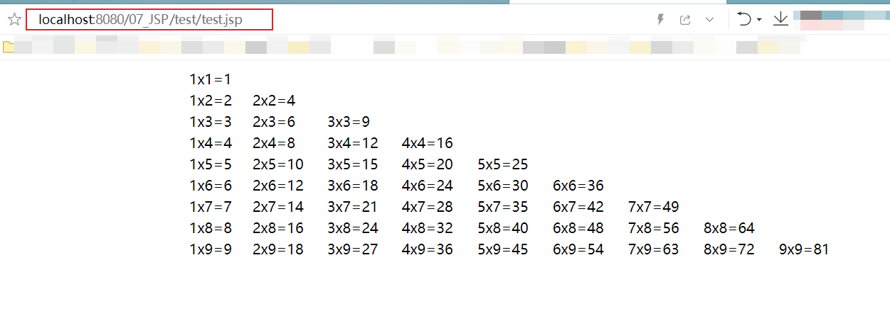

```jsp
<%@ page contentType="text/html;charset=UTF-8" language="java" %>
<html>
<head>
    <title>Title</title>
    <style>
        table{
            width: 750px;
        }
    </style>
</head>
<body>
<%--在jsp页面中输出九九乘法口诀表--%>
<table align="center">
    <% for (int i=1;i<=9;i++){ %>
        <tr>
          <% for(int j=1;j<=i;j++){ %>
            <td> <%=j + "x" + i + "=" +(i*j) %> </td>
          <%  } %>
        </tr>
    <% } %>
</table>
</body>
</html>
```

> 2. jsp输出一个表格，里面有10个学生信息。 

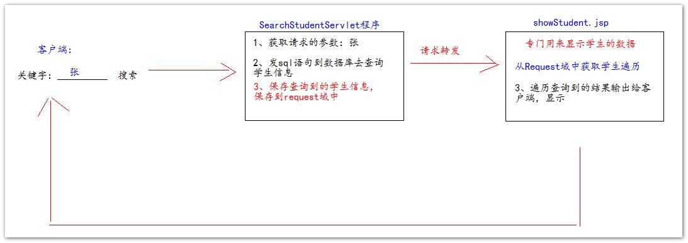

> Student类

```java
package github.pojo;

public class Student {
    private Integer id;
    private String name;
    private Integer age;
    private String phone;

    public Integer getId() {
        return id;
    }

    public void setId(Integer id) {
        this.id = id;
    }

    public String getName() {
        return name;
    }

    public void setName(String name) {
        this.name = name;
    }

    public Integer getAge() {
        return age;
    }

    public void setAge(Integer age) {
        this.age = age;
    }

    public String getPhone() {
        return phone;
    }

    public void setPhone(String phone) {
        this.phone = phone;
    }

    public Student() {
    }

    public Student(Integer id, String name, Integer age, String phone) {
        this.id = id;
        this.name = name;
        this.age = age;
        this.phone = phone;
    }

    @Override
    public String toString() {
        return "Student{" +
                "id=" + id +
                ", name='" + name + '\'' +
                ", age=" + age +
                ", phone='" + phone + '\'' +
                '}';
    }
}
```

> SearchStudentServlet类 

```java
package github.Servlet;

import github.pojo.Student;

import javax.servlet.ServletException;
import javax.servlet.http.HttpServlet;
import javax.servlet.http.HttpServletRequest;
import javax.servlet.http.HttpServletResponse;
import java.io.IOException;
import java.util.ArrayList;
import java.util.List;

public class SearchStudentServlet extends HttpServlet {
    @Override
    protected void doGet(HttpServletRequest req, HttpServletResponse resp) throws ServletException, IOException {
        // 获取请求的参数
        // 发sql语句查询学生的信息
        // 使用for循环生成查询到的数据做模拟
        List<Student> studentList = new ArrayList<Student>();
        for (int i = 0; i < 10; i++) {
            int t = i + 1;
            studentList.add(new Student(t,"name"+t, 18+t,"phone"+t));
        }
        // 保存查询到的结果（学生信息）到request域中
        req.setAttribute("stuList", studentList);
        // 请求转发到SStudent.jsp页面
        req.getRequestDispatcher("/test/SStudent.jsp").forward(req,resp);
    }
}
```

> JSP文件

```jsp
<%@ page import="java.util.List" %>
<%@ page import="github.pojo.Student" %>
<%@ page contentType="text/html;charset=UTF-8" language="java" %>
<html>
<head>
    <title>Title</title>
    <style>
        table{
            border: 1px gold solid;
            width: 700px;
            border-collapse: collapse;
        }
        td,th{
            border: 1px greenyellow solid;
        }
    </style>
</head>
<body>
<%--jsp输出一个表格，里面有10个学生信息。--%>
    <%
        List<Student> studentList = (List<Student>) request.getAttribute("stuList");
    %>
    <table>
        <tr>
            <td>编号</td>
            <td>姓名</td>
            <td>年龄</td>
            <td>电话</td>
            <td>操作</td>
        </tr>
        <% for (Student student : studentList) { %>
        <tr>
            <td><%=student.getId()%></td>
            <td><%=student.getName()%></td>
            <td><%=student.getAge()%></td>
            <td><%=student.getPhone()%></td>
            <td>删除、修改</td>
        </tr>
        <% } %>
    </table>
</body>
</html>
```

> web.xml文件

```xml
<?xml version="1.0" encoding="UTF-8"?>
<web-app xmlns="http://xmlns.jcp.org/xml/ns/javaee"
         xmlns:xsi="http://www.w3.org/2001/XMLSchema-instance"
         xsi:schemaLocation="http://xmlns.jcp.org/xml/ns/javaee http://xmlns.jcp.org/xml/ns/javaee/web-app_4_0.xsd"
         version="4.0">
    <servlet>
        <servlet-name>SearchStudentServlet</servlet-name>
        <servlet-class>github.Servlet.SearchStudentServlet</servlet-class>
    </servlet>
    <servlet-mapping>
        <servlet-name>SearchStudentServlet</servlet-name>
        <url-pattern>/searchStudentServlet</url-pattern>
    </servlet-mapping>
</web-app>
```

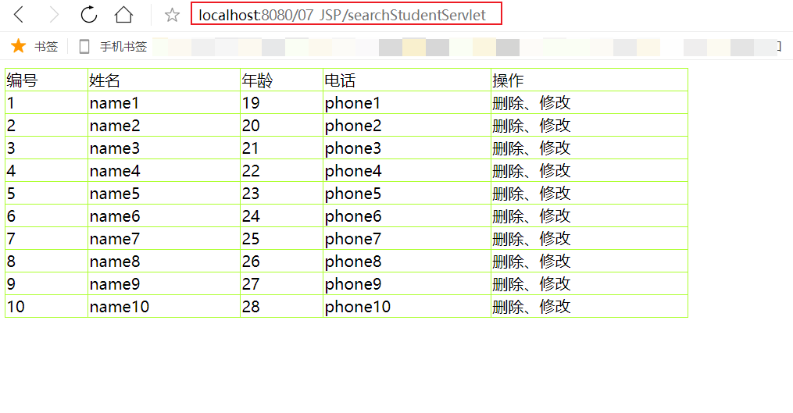