[TOC]

# EL

## 1.EL表达式 

> EL表达式的全称是：ExpressionLanguage。是表达式语言。

> EL表达式的什么作用：EL表达式主要是代替jsp页面中的表达式脚本在jsp页面中进行数据的输出。
>
> 因为EL表达式在输出数据的时候，要比jsp的表达式脚本要简洁很多。 

```jsp
<%@ page contentType="text/html;charset=UTF-8" language="java" %>
<html>
<head>
    <title>Title</title>
</head>
<body>
    <%
        request.setAttribute("key","值");
    %>
    表达式脚本输出key的值:<%=request.getAttribute("key")==null?"":request.getAttribute("key")%><br/>
    EL表达式输出key的值是:${key}<br/>
    表达式脚本输出key的值:<%=request.getAttribute("key1")==null?"":request.getAttribute("key1")%><br/>
    EL表达式输出key的值是:${key1}
</body>
</html>
```

> EL表达式的格式是：${表达式};
>
> EL表达式在输出null值的时候，输出的是空串。jsp表达式脚本输出null值的时候，输出的是null字符串。 

## 2.EL表达式搜索域数据的顺序 

> EL表达式主要是在jsp页面中输出数据。
>
> 主要是输出域对象中的数据。
>
> ---
>
> 当四个域中都有相同的key的数据的时候，EL表达式会按照四个域的从小到大的顺序去进行搜索，找到就输出。 

```jsp
<%@ page contentType="text/html;charset=UTF-8" language="java" %>
<html>
<head>
    <title>Title</title>
</head>
<body>
    <%
        // 往四个域中都保存了相同的key的数据。
        request.setAttribute("key","request");
        session.setAttribute("key","session");
        application.setAttribute("key","application");
        pageContext.setAttribute("key","pageContext");
    %>
    ${ key }
</body>
</html>
```

## 3.EL表达式输出Bean的普通属性，数组属性。List集合属性，map集合属性 

- 需求——输出Person类中普通属性，数组属性。list集合属性和map集合属性。 

> Person类

```java
import java.util.Arrays;
import java.util.List;
import java.util.Map;

public class Person {
    private String name;
    private String[] phones;
    private List<String> cities;
    private Map<String,Object> map;
    private int age = 18;

    public int getAge() {
        return age;
    }

    public void setAge(int age) {
        this.age = age;
    }

    public String getName() {
        return name;
    }

    public void setName(String name) {
        this.name = name;
    }

    public String[] getPhones() {
        return phones;
    }

    public void setPhones(String[] phones) {
        this.phones = phones;
    }

    public List<String> getCities() {
        return cities;
    }

    public void setCities(List<String> cities) {
        this.cities = cities;
    }

    public Map<String, Object> getMap() {
        return map;
    }

    public void setMap(Map<String, Object> map) {
        this.map = map;
    }

    @Override
    public String toString() {
        return "Person{" +
                "name='" + name + '\'' +
                ", phones=" + Arrays.toString(phones) +
                ", cities=" + cities +
                ", map=" + map +
                '}';
    }
}
```

> JSP文件

```jsp
<%@ page contentType="text/html;charset=UTF-8" language="java" %>
<html>
<head>
    <title>Title</title>
</head>
<body>
    <%
        Person person=new Person();
        person.setName("到底要不要面试！");
        person.setPhones(new String[]{"18335964285","18335964285","18359642785"});

        List<String> cities=new ArrayList<String>();
        cities.add("北京");
        cities.add("上海");
        cities.add("深圳");
        person.setCities(cities);

        Map<String,Object> map=new HashMap<>();
        map.put("key1","value1");
        map.put("key2","value2");
        map.put("key3","value3");person.setMap(map);
        pageContext.setAttribute("p",person);
    %>

    输出Person:${p}<br/>
    输出Person的name属性：${p.name} <br>
    输出Person的phones数组属性值：${p.phones[2]} <br>
    输出Person的cities集合中的元素值：${p.cities} <br>
    输出Person的List集合中个别元素值：${p.cities[2]} <br>
    输出Person的Map集合: ${p.map} <br>
    输出Person的Map集合中某个key的值: ${p.map.key3} <br>
    输出Person的age属性：${p.age} <br>
</body>
</html>
```

## 4.EL表达式——运算 

> 语法：${运算表达式}，EL表达式支持如下运算符: 

- 关系运算符

| 关系运算符 |   说明   |        范例        | 结果  |
| :--------: | :------: | :----------------: | :---: |
|   ==或eq   |   等于   |  ${5==5}或${5eq5}  | true  |
|   !=或ne   |  不等于  |  ${5!=5}或${5ne5}  | false |
|   <或lt    |   小于   |  ${3<5}或${3lt5}   | true  |
|   >或gt    |   大于   | ${2>10}或${2gt10}  | false |
|   <=或le   | 小于等于 | ${5<=12}或${5le12} | true  |
|   >=或ge   | 大于等于 |  ${3>=5}或${3ge5}  | false |

```jsp
<%@ page contentType="text/html;charset=UTF-8" language="java" %>
<html>
<head>
    <title>Title</title>
</head>
<body>
    ${12==12} 或 ${12 eq 12}<br>
    ${12!=12} 或 ${12 ne 12}<br>
    ${12<12} 或 ${12 lt 12}<br>
    ${12>12} 或 ${12 gt 12}<br>
    ${12<=12} 或 ${12 le 12}<br>
    ${12>=12} 或 ${12 ge 12}<br>
</body>
</html>
```

- 逻辑运算 

| 逻辑运算符 |   说明   |                       范例                       | 结果  |
| :--------: | :------: | :----------------------------------------------: | :---: |
|  &&或and   |  与运算  | ${ 12 == 12 && 12 < 11 } 或 { 12 == 12 and12<11}​ | false |
|  \|\|或or  |  或运算  | $ { 12 == 12 \|\| 12 < 11} 或 {12==12 or 12<11}  | true  |
|   !或not   | 取反运算 |          $ { ! true } 或 $ { not true}           | false |

```jsp
<%@ page contentType="text/html;charset=UTF-8" language="java" %>
<html>
<head>
    <title>Title</title>
</head>
<body>
    ${12==12 && 12>11} 或 ${12==12 and 12>11}<br>
    ${12==12 || 12>11} 或 ${12==12 or 12>11}<br>
    ${!true} 或 ${ not true } <br>
</body>
</html>
```

- 算术运算

| 算数运算符 | 说明 |              范例              | 结果 |
| :--------: | :--: | :----------------------------: | :--: |
|     +      | 加法 |            ${12+18}            |  30  |
|     -      | 减法 |            ${18-8}             |  10  |
|     *      | 乘法 |            ${12*12}            | 144  |
|   /或div   | 除法 |    ${144/12}或${144 div 12}    |  12  |
|   %或mod   | 取模 | $ { 144 % 10 } 或 $ {144mod10} |  4   |

```jsp
<%@ page contentType="text/html;charset=UTF-8" language="java" %>
<html>
<head>
    <title>Title</title>
</head>
<body>
    ${ 12 + 12 } <br>
    ${ 12 - 12 } <br>
    ${ 12 * 12 } <br>
    ${ 18 / 12 } 或 ${ 18 div 12 }<br>
    ${ 18 % 12 } 或 ${ 18 mod 12 } <br>
</body>
</html>
```

- empty运算 

> empty运算可以判断一个数据是否为空，如果为空，则输出true,不为空输出false。
>
> 以下几种情况为空：
>
> ​	1、值为null值的时候，为空;
>
> ​	2、值为空串的时候，为空;
>
> ​	3、值是Object类型数组，长度为零的时候;
>
> ​	4、list集合，元素个数为零;
>
> ​	5、map集合，元素个数为零。

```jsp
<%@ page contentType="text/html;charset=UTF-8" language="java" %>
<html>
<head>
    <title>Title</title>
</head>
<body>
    <%
//        1、值为null值的时候，为空
        request.setAttribute("emtyNull",null);
//        2、值为空串的时候，为空
        request.setAttribute("emtyStr","");
//        3、值是Object类型数组，长度为零的时候
        request.setAttribute("emptyArr",new Object[]{});
//        4、list集合，元素个数为零;
        List<String> list = new ArrayList<>();
        list.add("kdf");
        request.setAttribute("emtyList",list);
//        5、map集合，元素个数为零。
        Map<String,Object> map = new HashMap<>();
        map.put("key","value");
        request.setAttribute("emptyMap",map);
    %>
    ${ empty emptyNull } <br>
    ${ empty emtyStr } <br>
    ${ empty emptyArr } <br>
    ${ empty emtyList } <br>
    ${ empty emptyMap } <br>
</body>
</html>
```

- 三元运算 

> 表达式1？表达式2：表达式3
>
> 如果表达式1的值为真，返回表达式2的值，如果表达式1的值为假，返回表达式3的值。 

```jsp
<%@ page contentType="text/html;charset=UTF-8" language="java" %>
<html>
<head>
    <title>Title</title>
</head>
<body>
    ${12!=12 ? "javaweb":"javase"}
</body>
</html>
```

- “.”点运算和[]中括号运算符 

> .点运算，可以输出Bean对象中某个属性的值。
>
> []中括号运算，可以输出有序集合中某个元素的值。
>
> 并且[]中括号运算，还可以输出map集合中key里含有特殊字符的key的值。 

```jsp
<%@ page contentType="text/html;charset=UTF-8" language="java" %>
<html>
<head>
    <title>Title</title>
</head>
<body>
    ${12!=12 ? "javaweb":"javase"}
    <hr>
    <%
        Map<String,Object> map = new HashMap<String,Object>();
        map.put("a+a+a","3a");
        map.put("a.a.a","3a");
        map.put("b-b-b","-2b");
        map.put("c*c*c","c^3");

        request.setAttribute("map",map);
    %>
    ${map.a+a+a}<br>
    ${map["a+a+a"]}<br>
    ${map["a.a.a"]}<br>
    ${map["b-b-b"]}<br>
    ${map["c*c*c"]}<br>
</body>
</html>
```

## 5.EL表达式的11个隐含对象 

> ```html
> EL个达式中11个隐含对象，是EL表达式中自己定义的，可以直接使用。
> 
> 变量						类型						作用	
> pageContext				PageContextImpl		它可以获取jsp中的九大内置对象;
> 
> pageScopeMap			<String,Object>		它可以获取pageContext域中的数据;
> requestScopeMap			<String,Object>		它可以获取Request域中的数据;
> sessionScopeMap			<String,Object>		它可以获取Session域中的数据;
> applicationScopeMap		<String,Object>		它可以获取ServletContext域中的数据;
>     
> paramMap				<String,String>		它可以获取请求参数的值;
> paramValuesMap			<String,String[]>	它也可以获取请求参数的值，获取多个值的时候使用;
>     
> headerMap				<String,String>		它可以获取请求头的信息;
> headerValuesMap			<String,String[]>	它可以获取请求头的信息，它可以获取多个值的情况;
> cookieMap				<String,Cookie>		它可以获取当前请求的Cookie信息;    
> initParamMap			<String,String>		它可以获取在web.xml中配置的<context-param>上下文参数;
> ```

- EL获取四个特定域中的属性 

> ```jsp
> pageScope			======	pageContext域
> requestScope		======	Request域
> sessionScope		======	Session域
> applicationScope	======	ServletContext域
> ```

```jsp
<%@ page contentType="text/html;charset=UTF-8" language="java" %>
<html>
<head>
    <title>Title</title>
</head>
<body>
    <%
        pageContext.setAttribute("key","pageContext");
        pageContext.setAttribute("key2","pageContext2");
        request.setAttribute("key2","request");
        session.setAttribute("key2","session");
        application.setAttribute("key2","application");
    %>
    ${pageScope.key}<br>
    ${pageScope.key2}<br>
    ${requestScope.key2}<br>
</body>
</html>
```

- pageContext对象的使用 

```jsp
<%@ page contentType="text/html;charset=UTF-8" language="java" %>
<html>
<head>
    <title>Title</title>
</head>
<body>
    <%--
    request.getScheme() 它可以获取请求的协议
    request.getServerName() 获取请求的服务器ip或域名
    request.getServerPort() 获取请求的服务器端口号
    getContextPath() 获取当前工程路径
    request.getMethod() 获取请求的方式（GET或POST）
    request.getRemoteHost()  获取客户端的ip 地址
    session.getId() 获取会话的唯一标识
    --%>
    <%
        pageContext.setAttribute("req", request);
    %>
    <%=request.getScheme() %> <br>
    1.协议： ${ req.scheme }<br>
    2.服务器ip：${ pageContext.request.serverName }<br>
    3.服务器端口：${ pageContext.request.serverPort }<br>
    4.获取工程路径：${ pageContext.request.contextPath }<br>
    5.获取请求方法：${ pageContext.request.method }<br>
    6.获取客户端ip地址：${ pageContext.request.remoteHost }<br>
    7.获取会话的id编号：${ pageContext.session.id }<br>
</body>
</html>
```

- EL表达式其他隐含对象的使用 

> ```jsp
> param			Map<String,String>		它可以获取请求参数的值;
> paramValues		Map<String,String[]>	它也可以获取请求参数的值，获取多个值的时候使用;
>     
> header			Map<String,String>		它可以获取请求头的信息;
> headerValues	Map<String,String[]>	它可以获取请求头的信息，它可以获取多个值的情况;
>     
> cookie			Map<String,Cookie>		它可以获取当前请求的Cookie信息;  
> ```

```jsp
<%@ page contentType="text/html;charset=UTF-8" language="java" %>
<html>
<head>
    <title>Title</title>
</head>
<body>
    输出请求参数username的值：${ param.username } <br>
    输出请求参数password的值：${ param.password } <br>
    <hr>
    输出请求参数username的值：${ paramValues.username[0] } <br>
    输出请求参数hobby的值：${ paramValues.hobby[0] } <br>
    输出请求参数hobby的值：${ paramValues.hobby[1] } <br>
    <hr>
    输出请求头【User-Agent】的值：${ header['User-Agent'] } <br>
    输出请求头【Connection】的值：${ header.Connection } <br>
    输出请求头【User-Agent】的值：${ headerValues['User-Agent'][0] } <br>
    <hr>
    获取Cookie的名称：${ cookie.JSESSIONID.name } <br>
    获取Cookie的值：${ cookie.JSESSIONID.value } <br>
</body>
</html>
```

> ```jsp
> initParam		Map<String,String>		它可以获取在web.xml中配置的<context-param>上下文参数;
> ```

- web.xml中的配置 

```xml
<?xml version="1.0" encoding="UTF-8"?>
<web-app xmlns="http://xmlns.jcp.org/xml/ns/javaee"
         xmlns:xsi="http://www.w3.org/2001/XMLSchema-instance"
         xsi:schemaLocation="http://xmlns.jcp.org/xml/ns/javaee http://xmlns.jcp.org/xml/ns/javaee/web-app_4_0.xsd"
         version="4.0">

    <context-param>
        <param-name>username</param-name>
        <param-value>root</param-value>
    </context-param>
    <context-param>
        <param-name>url</param-name>
        <param-value>jdbc:mysql:///test</param-value>
    </context-param>
</web-app>
```

- JSP案例

```jsp
<%@ page contentType="text/html;charset=UTF-8" language="java" %>
<html>
<head>
    <title>Title</title>
</head>
<body>
    输出&lt;Context-param&gt;username的值：${ initParam.username } <br>
    输出&lt;Context-param&gt;url的值：${ initParam.url } <br>
</body>
</html>
```

# JSTL标签库 

> JSTL标签库全称是指JSPStandardTagLibraryJSP标准标签库。是一个不断完善的开放源代码的JSP标签库。
>
> EL表达式主要是为了替换jsp中的表达式脚本，而标签库则是为了替换代码脚本。这样使得整个jsp页面变得更佳简洁。 

- JSTL由五个不同功能的标签库组成。 

|  功能范围  |                  URI                   | 前缀 |
| :--------: | :------------------------------------: | :--: |
| 核心标签库 |   http://java.sun.com/jsp/jstl/core    |  c   |
|   格式化   |    http://java.sun.com/jsp/jstl/fmt    | fmt  |
|    函数    | http://java.sun.com/jsp/jstl/functions |  fn  |
|   数据库   |    http://java.sun.com/jsp/jstl/sql    | sql  |
|    XML     |    http://java.sun.com/jsp/jstl/xml    |  x   |

- 在jsp标签库中使用taglib指令引入标签库 

```jsp
CORE标签库
	<% @taglib prefix="c" uri="http://java.sun.com/jsp/jstl/core"%>
XML标签库
	<% @taglib prefix="x" uri="http://java.sun.com/jsp/jstl/xml"%>
FMT标签库
	<% @taglib prefix="fmt" uri="http://java.sun.com/jsp/jstl/fmt"%>
SQL标签库
	<% @taglib prefix="sql" uri="http://java.sun.com/jsp/jstl/sql"%>
FUNCTIONS标签库
	<% @taglib prefix="fn" uri="http://java.sun.com/jsp/jstl/functions"%>
```

## 1.JSTL标签库的使用步骤 

- 导入jstl标签库的jar包。 

```java
taglibs-standard-impl-1.2.1.jar
taglibs-standard-spec-1.2.1.jar
```

下载地址：https://www.yuque.com/nizhegechouloudetuboshu/library/defyyo

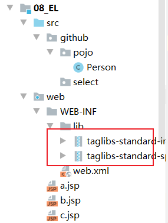

- 第二步，使用taglib指令引入标签库。 

```jsp
<%@ taglib prefix="c" uri="http://java.sun.com/jsp/jstl/core" %>

<%@ page contentType="text/html;charset=UTF-8" language="java" %>
<html>
<head>
    <title>Title</title>
</head>
<body>
    <c:forEach begin=""></c:forEach>
</body>
</html>
```

## 2.core核心库使用 

> ```jsp
> <c:set/>	作用：set标签可以往域中保存数据
> ```

```jsp
<%@ taglib prefix="c" uri="http://java.sun.com/jsp/jstl/core" %>

<%@ page contentType="text/html;charset=UTF-8" language="java" %>
<html>
<head>
    <title>Title</title>
</head>
<body>
   <%--
    <c:set />
        作用：set标签可以往域中保存数据

        域对象.setAttribute(key,value);
        scope 属性设置保存到哪个域
            page表示PageContext域（默认值）
            request表示Request域
            session表示Session域
            application表示ServletContext域
        var属性设置key是多少
        value属性设置值
    --%>
    保存之前：${ sessionScope.abc } <br>
    <c:set scope="session" var="abc" value="abcValue"/>
    保存之后：${ sessionScope.abc } <br>
</body>
</html>
```

> ```jsp
> <c:if/>		if标签用来做if判断。
> ```

```jsp
<%@ taglib prefix="c" uri="http://java.sun.com/jsp/jstl/core" %>

<%@ page contentType="text/html;charset=UTF-8" language="java" %>
<html>
<head>
    <title>Title</title>
</head>
<body>
    <%--
       <c:if />
         if标签用来做if判断。
         test属性表示判断的条件（使用EL表达式输出）
    --%>
    <c:if test="${ 12 == 12 }">
        <h1>12等于12</h1>
    </c:if>
    <c:if test="${ 12 != 12 }">
        <h1>12不等于12</h1>
    </c:if>
</body>
</html>
```

> ```jsp
> <c:choose><c:when><c:otherwise>标签
> 作用：多路判断。跟switch...case....default非常接近    
> ```

```jsp
<%@ taglib prefix="c" uri="http://java.sun.com/jsp/jstl/core" %>

<%@ page contentType="text/html;charset=UTF-8" language="java" %>
<html>
<head>
    <title>Title</title>
</head>
<body>
   <%--
    <c:choose> <c:when> <c:otherwise>标签
    作用：多路判断。跟switch ... case .... default非常接近

    choose标签开始选择判断
    when标签表示每一种判断情况
        test属性表示当前这种判断情况的值
    otherwise标签表示剩下的情况

    <c:choose> <c:when> <c:otherwise>标签使用时需要注意的点：
        1、标签里不能使用html注释，要使用jsp注释
        2、when标签的父标签一定要是choose标签
    --%>
    <%
        request.setAttribute("height", 180);
    %>
    <c:choose>
        <%-- 这是html注释 --%>
        <c:when test="${ requestScope.height > 190 }">
            <h2>H1</h2>
        </c:when>
        <c:when test="${ requestScope.height > 180 }">
            <h2>H2</h2>
        </c:when>
        <c:when test="${ requestScope.height > 170 }">
            <h2>emmmmmm</h2>
        </c:when>
        <c:otherwise>
            <c:choose>
                <c:when test="${requestScope.height > 160}">
                    <h3>大于160</h3>
                </c:when>
                <c:when test="${requestScope.height > 150}">
                    <h3>大于150</h3>
                </c:when>
                <c:when test="${requestScope.height > 140}">
                    <h3>大于140</h3>
                </c:when>
                <c:otherwise>
                    其他小于140
                </c:otherwise>
            </c:choose>
        </c:otherwise>
    </c:choose>
</body>
</html>
```

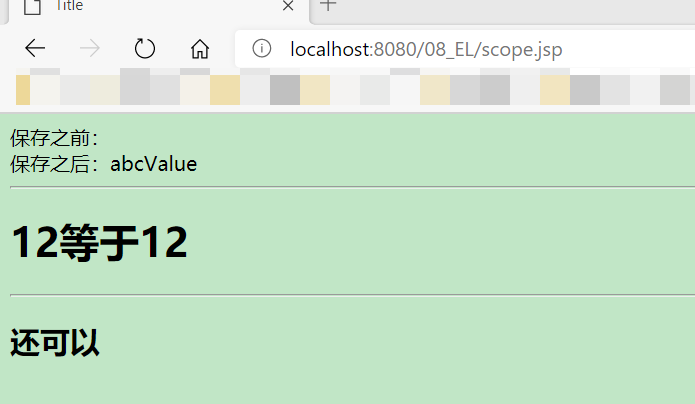

> ```jsp
> <c:forEach/>	作用：遍历输出使用。
> ```

- 遍历1到10，输出 

```jsp
<%@ taglib prefix="c" uri="http://java.sun.com/jsp/jstl/core_1_1" %>
<%--
  Created by IntelliJ IDEA.
  User: subei
  Date: 2020/10/21
  Time: 15:31
  To change this template use File | Settings | File Templates.
--%>
<%@ page contentType="text/html;charset=UTF-8" language="java" %>
<html>
<head>
    <title>Title</title>
    <style type="text/css">
        table{
            width: 500px;
            border: 1px solid red;
            border-collapse: collapse;
        }
        th , td{
            border: 1px solid red;
        }
    </style>
</head>
<body>
    <%--1.遍历1到10，输出
       begin属性设置开始的索引
       end 属性设置结束的索引
       var 属性表示循环的变量(也是当前正在遍历到的数据)
       for (int i = 1; i < 10; i++)
--%>
    <table border="1">
       <c:forEach begin="1" end="10" var="i">
           <tr>
               <td>第${i}行</td>
           </tr>
       </c:forEach>
    </table>
    <hr>
</body>
</html>
```

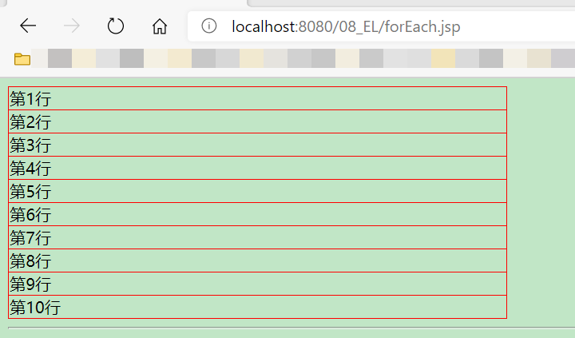

- 遍历Object数组 

```jsp
<%@ taglib prefix="c" uri="http://java.sun.com/jsp/jstl/core_1_1" %>

<%@ page contentType="text/html;charset=UTF-8" language="java" %>
<html>
<head>
    <title>Title</title>
    <style type="text/css">
        table{
            width: 500px;
            border: 1px solid red;
            border-collapse: collapse;
        }
        th , td{
            border: 1px solid red;
        }
    </style>
</head>
<body>
    <hr>
    <%-- 2.遍历Object数组
        for (Object item: arr)
        items 表示遍历的数据源（遍历的集合）
        var 表示当前遍历到的数据
--%>
    <%
        request.setAttribute("arr", new String[]{"18610541354","18688886666","18699998888"});
    %>
    <c:forEach items="${ requestScope.arr }" var="item">
        ${ item } <br>
    </c:forEach>
    <hr>
</body>
</html>
```

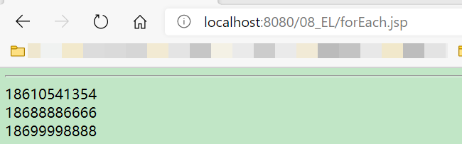

- 遍历Map集合 

```jsp
<%@ page import="java.util.Map" %>
<%@ page import="java.util.HashMap" %>
<%@ taglib prefix="c" uri="http://java.sun.com/jsp/jstl/core_1_1" %>

<%@ page contentType="text/html;charset=UTF-8" language="java" %>
<html>
<head>
    <title>Title</title>
    <style type="text/css">
        table{
            width: 500px;
            border: 1px solid red;
            border-collapse: collapse;
        }
        th , td{
            border: 1px solid red;
        }
    </style>
</head>
<body>
    <%
        Map<String,Object> map = new HashMap<String, Object>();
        map.put("key1", "value1");
        map.put("key2", "value2");
        map.put("key3", "value3");
//        for ( Map.Entry<String,Object> entry : map.entrySet()) {
//        }
        request.setAttribute("map", map);
    %>
    <c:forEach items="${ requestScope.map }" var="entry">
        <h1>${entry.key} = ${entry.value}</h1>
    </c:forEach>
    <hr>
</body>
</html>
```

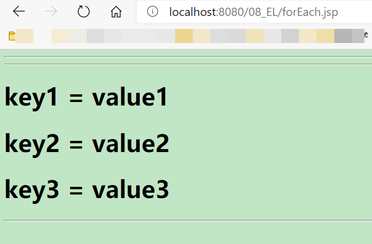

- 遍历List集合---list中存放Student类，有属性：编号，用户名，密码，年龄，电话信息 

> Student类

```java
public class Student {
    //4.编号，用户名，密码，年龄，电话信息
    private Integer id;
    private String username;
    private String password;
    private Integer age;
    private String phone;

    public Student(Integer id, String username, String password, Integer age, String phone) {
        this.id = id;
        this.username = username;
        this.password = password;
        this.age = age;
        this.phone = phone;
    }

    public Student() {
    }

    public Integer getId() {
        return id;
    }

    public void setId(Integer id) {
        this.id = id;
    }

    public String getUsername() {
        return username;
    }

    public void setUsername(String username) {
        this.username = username;
    }

    public String getPassword() {
        return password;
    }

    public void setPassword(String password) {
        this.password = password;
    }

    public Integer getAge() {
        return age;
    }

    public void setAge(Integer age) {
        this.age = age;
    }

    public String getPhone() {
        return phone;
    }

    public void setPhone(String phone) {
        this.phone = phone;
    }

    @Override
    public String toString() {
        return "Student{" +
                "id=" + id +
                ", username='" + username + '\'' +
                ", password='" + password + '\'' +
                ", age=" + age +
                ", phone='" + phone + '\'' +
                '}';
    }
}
```

> JSP文件

```jsp
<%@ page import="github.pojo.Student" %>
<%@ page import="java.util.List" %>
<%@ page import="java.util.ArrayList" %>
<%@ taglib prefix="c" uri="http://java.sun.com/jsp/jstl/core_1_1" %>

<%@ page contentType="text/html;charset=UTF-8" language="java" %>
<html>
<head>
    <title>Title</title>
    <style type="text/css">
        table{
            width: 500px;
            border: 1px solid red;
            border-collapse: collapse;
        }
        th , td{
            border: 1px solid red;
        }
    </style>
</head>
<body>
    <%--4.遍历List集合---list中存放 Student类，有属性：编号，用户名，密码，年龄，电话信息--%>
    <%
        List<Student> studentList = new ArrayList<Student>();
        for (int i = 1; i <= 10; i++) {
            studentList.add(new Student(i,"username"+i ,"pass"+i,18+i,"phone"+i));
        }
        request.setAttribute("stus", studentList);
    %>
    <form action="" enctype=""></form>
    <table>
        <tr>
            <th>编号</th>
            <th>用户名</th>
            <th>密码</th>
            <th>年龄</th>
            <th>电话</th>
            <th>操作</th>
        </tr>
        <%--
            items 表示遍历的集合
            var 表示遍历到的数据
            begin表示遍历的开始索引值
            end 表示结束的索引值
            step 属性表示遍历的步长值
            varStatus 属性表示当前遍历到的数据的状态
            for（int i = 1; i < 10; i+=2）
        --%>
        <c:forEach begin="2" end="7" step="2" varStatus="status" items="${requestScope.stus}" var="stu">
            <tr>
                <td>${stu.id}</td>
                <td>${stu.username}</td>
                <td>${stu.password}</td>
                <td>${stu.age}</td>
                <td>${stu.phone}</td>
                <td>${status.step}</td>
            </tr>
        </c:forEach>
    </table>
</body>
</html>
```

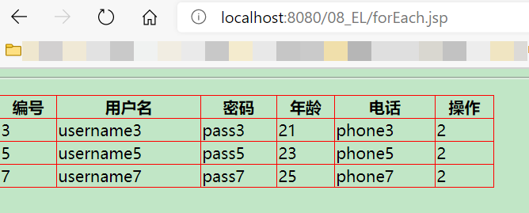

# 文件上传与下载

> 文件的上传和下载，是非常常见的功能。很多的系统中，或者软件中都经常使用文件的上传和下载。
>
> 比如：QQ头像，就使用了上传。
>
> 邮箱中也有附件的上传和下载功能。
>
> OA系统中审批有附件材料的上传。 

## 1.文件的上传

1. 要有一个form标签，method=post请求;
2. form标签的encType属性值必须为multipart/form-data值;
3. 在form标签中使用inputtype=file添加上传的文件;
4. 编写服务器代码（Servlet程序）接收，处理上传的数据。

> encType=multipart/form-data表示提交的数据，以多段（每一个表单项一个数据段）的形式进行拼接，然后以二进制流的形式发送给服务器。

> 文件上传，HTTP协议的说明 

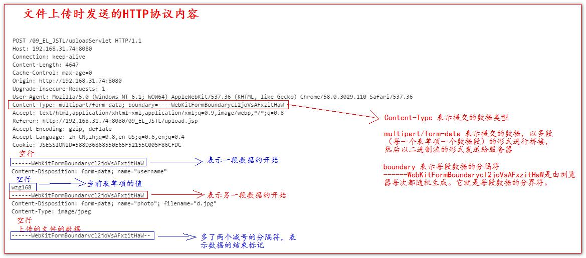

---

> ```java
> commons-fileupload.jar和commons-io.jar包中，我们常用的类有哪些？
>     
> ServletFileUpload类，用于解析上传的数据。
> FileItem类，表示每一个表单项。
> 
> boolean ServletFileUpload.isMultipartContent(HttpServletRequest request);
> 	判断当前上传的数据格式是否是多段的格式。
> 
> public List<FileItem> parseRequest(HttpServletRequest request)
> 	解析上传的数据.
> 
> boolean FileItem.isFormField()
>     判断当前这个表单项，是否是普通的表单项。还是上传的文件类型。
>     true表示普通类型的表单项;
> 	false表示上传的文件类型.
>         
> String FileItem.getFieldName()获取表单项的name属性值.
> String FileItem.getString()获取当前表单项的值。
> String FileItem.getName();获取上传的文件名.
> void FileItem.write(file);将上传的文件写到参数file所指向抽硬盘位置。        
> ```

> fileupload类库的使用:
>
> 上传文件的表单,jsp文件  

```jsp
<%@ page contentType="text/html;charset=UTF-8" language="java" %>
<html>
<head>
    <title>Title</title>
</head>
<body>
    <form action="http://192.168.0.1:8080/08_EL_JSTL/uploadServlet" method="post" enctype="multipart/form-data">
        用户名：<input type="text" name="username" /> <br>
        头像：<input type="file" name="photo" > <br>
        <input type="submit" value="上传">
    </form>
</body>
</html>
```

> 先导入jar包.

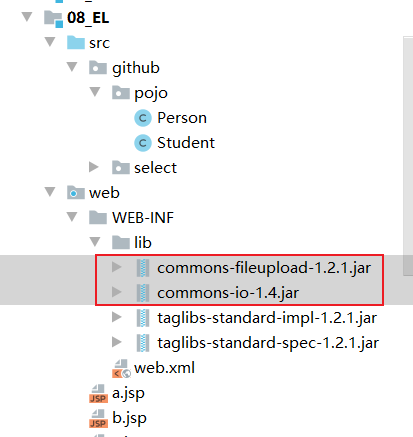

> jar包下载地址：https://www.yuque.com/nizhegechouloudetuboshu/library/defyyo

> Java代码

```java
import org.apache.commons.fileupload.FileItem;
import org.apache.commons.fileupload.FileItemFactory;
import org.apache.commons.fileupload.disk.DiskFileItemFactory;
import org.apache.commons.fileupload.servlet.ServletFileUpload;

import javax.servlet.ServletException;
import javax.servlet.http.HttpServlet;
import javax.servlet.http.HttpServletRequest;
import javax.servlet.http.HttpServletResponse;
import java.io.File;
import java.io.IOException;
import java.util.List;

public class UploadServlet extends HttpServlet {
    /**
     * 用来处理上传的数据
     * @param req
     * @param resp
     * @throws ServletException
     * @throws IOException
     */
    @Override
    protected void doPost(HttpServletRequest req, HttpServletResponse resp) throws ServletException, IOException {

//         先判断上传的数据是否多段数据（只有是多段的数据，才是文件上传的）
        if (ServletFileUpload.isMultipartContent(req)) {
//           创建FileItemFactory工厂实现类
            FileItemFactory fileItemFactory = new DiskFileItemFactory();
//             创建用于解析上传数据的工具类ServletFileUpload类
            ServletFileUpload servletFileUpload = new ServletFileUpload(fileItemFactory);
            try {
//                 解析上传的数据，得到每一个表单项FileItem
                List<FileItem> list = servletFileUpload.parseRequest(req);
//                 循环判断，每一个表单项，是普通类型，还是上传的文件
                for (FileItem fileItem : list) {

                    if (fileItem.isFormField()) {
//                         普通表单项
                        System.out.println("表单项的name属性值：" + fileItem.getFieldName());
                        // 参数UTF-8.解决乱码问题
                        System.out.println("表单项的value属性值：" + fileItem.getString("UTF-8"));
                    } else {
                        // 上传的文件
                        System.out.println("表单项的name属性值：" + fileItem.getFieldName());
                        System.out.println("上传的文件名：" + fileItem.getName());

                        fileItem.write(new File("E:\\" + fileItem.getName()));
                    }
                }
            } catch (Exception e) {
                e.printStackTrace();
            }
        }
    }
}
```

> web.xml配置

```xml
<?xml version="1.0" encoding="UTF-8"?>
<web-app xmlns="http://xmlns.jcp.org/xml/ns/javaee"
         xmlns:xsi="http://www.w3.org/2001/XMLSchema-instance"
         xsi:schemaLocation="http://xmlns.jcp.org/xml/ns/javaee http://xmlns.jcp.org/xml/ns/javaee/web-app_4_0.xsd"
         version="4.0">
    <servlet>
        <servlet-name>UploadServlet</servlet-name>
        <servlet-class>github.select.UploadServlet</servlet-class>
    </servlet>
    <servlet-mapping>
        <servlet-name>UploadServlet</servlet-name>
        <url-pattern>/UploadServlet</url-pattern>
    </servlet-mapping>

</web-app>
```

> 运行如下：

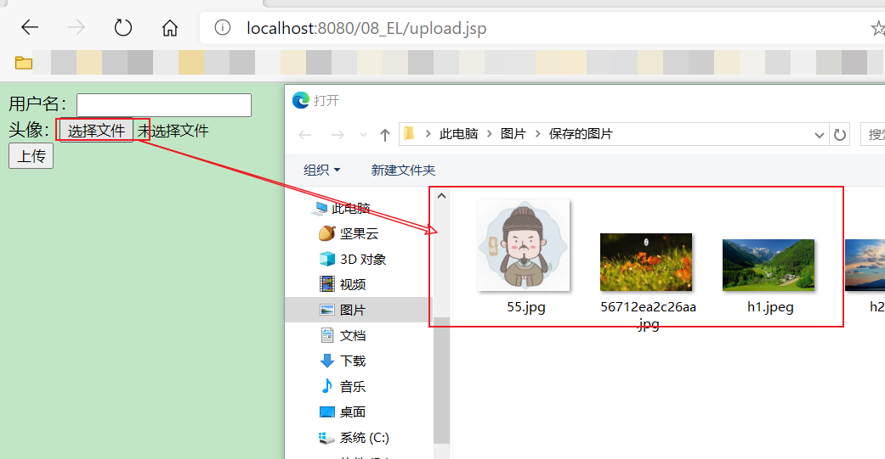

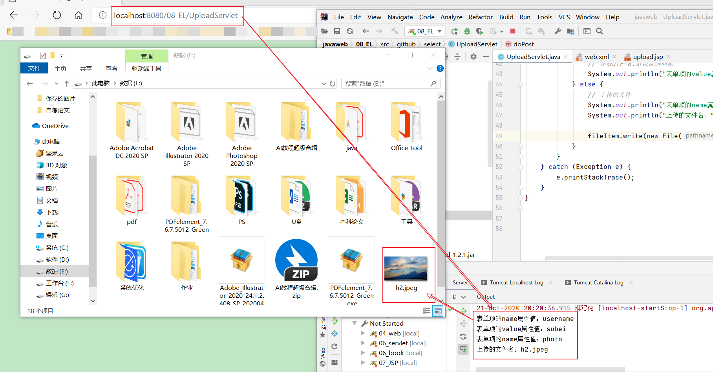

## 2.文件的下载 

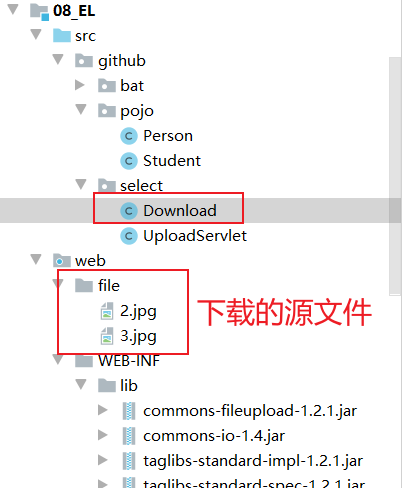

> Java文件

```java
import org.apache.commons.io.IOUtils;
import sun.misc.BASE64Encoder;

import javax.servlet.ServletContext;
import javax.servlet.ServletException;
import javax.servlet.http.HttpServlet;
import javax.servlet.http.HttpServletRequest;
import javax.servlet.http.HttpServletResponse;
import java.io.IOException;
import java.io.InputStream;
import java.io.OutputStream;
import java.net.URLEncoder;

public class Download extends HttpServlet {

    @Override
    protected void doGet(HttpServletRequest req, HttpServletResponse resp) throws ServletException, IOException {
//        1、获取要下载的文件名
        String downloadFileName = "2.jpg";
//        2、读取要下载的文件内容 (通过ServletContext对象可以读取)
        ServletContext servletContext = getServletContext();
        // 获取要下载的文件类型
        String mimeType = servletContext.getMimeType("/file/" + downloadFileName);
        System.out.println("下载的文件类型：" + mimeType);
//        4、在回传前，通过响应头告诉客户端返回的数据类型
        resp.setContentType(mimeType);
//        5、还要告诉客户端收到的数据是用于下载使用（还是使用响应头）
        // Content-Disposition响应头，表示收到的数据怎么处理
        // attachment表示附件，表示下载使用
        // filename= 表示指定下载的文件名
        // url编码是把汉字转换成为%xx%xx的格式
        if (req.getHeader("User-Agent").contains("Firefox")) {
            // 如果是火狐浏览器使用Base64编码
            resp.setHeader("Content-Disposition", "attachment; filename==?UTF-8?B?" + new BASE64Encoder().encode("火山.jpg".getBytes("UTF-8")) + "?=");
        } else {
            // 如果不是火狐，是IE或谷歌，使用URL编码操作
            resp.setHeader("Content-Disposition", "attachment; filename=" + URLEncoder.encode("火山.jpg", "UTF-8"));
        }
        //斜杠被服务器解析表示地址为http://ip:prot/工程名/  映射 到代码的Web目录
        InputStream resourceAsStream = servletContext.getResourceAsStream("/file/" + downloadFileName);
        // 获取响应的输出流
        OutputStream outputStream = resp.getOutputStream();
        // 3、把下载的文件内容回传给客户端
        // 读取输入流中全部的数据，复制给输出流，输出给客户端
        IOUtils.copy(resourceAsStream, outputStream);
    }
}
```

> xml配置

```xml
<?xml version="1.0" encoding="UTF-8"?>
<web-app xmlns="http://xmlns.jcp.org/xml/ns/javaee"
         xmlns:xsi="http://www.w3.org/2001/XMLSchema-instance"
         xsi:schemaLocation="http://xmlns.jcp.org/xml/ns/javaee http://xmlns.jcp.org/xml/ns/javaee/web-app_4_0.xsd"
         version="4.0">

    <servlet>
        <servlet-name>Download</servlet-name>
        <servlet-class>github.select.Download</servlet-class>
    </servlet>
    <servlet-mapping>
        <servlet-name>Download</servlet-name>
        <url-pattern>/download</url-pattern>
    </servlet-mapping>
</web-app>
```

> 运行结果：

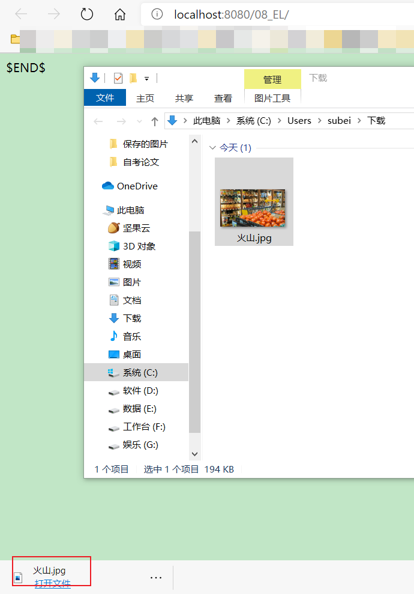

> 中文名乱码问题解决方案——Base64编解码操作

```java
import sun.misc.BASE64Decoder;
import sun.misc.BASE64Encoder;

public class Base64 {
    public static void main(String[] args) throws Exception {
        String content = "这是需要Base64编码的内容";
        // 创建一个Base64编码器
        BASE64Encoder base64Encoder = new BASE64Encoder();
        // 执行Base64编码操作
        String encodedString = base64Encoder.encode(content.getBytes("UTF-8"));

        System.out.println( encodedString );
        // 创建Base64解码器
        BASE64Decoder base64Decoder = new BASE64Decoder();
        // 解码操作
        byte[] bytes = base64Decoder.decodeBuffer(encodedString);

        String str = new String(bytes, "UTF-8");

        System.out.println(str);
    }
}
```

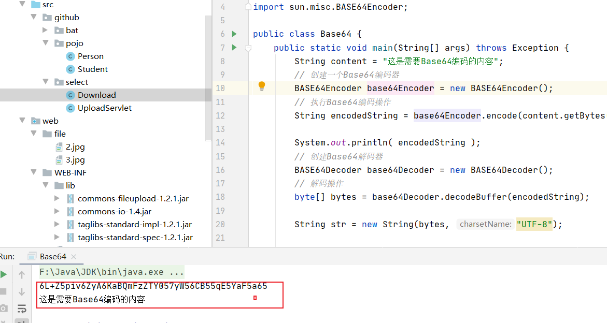

