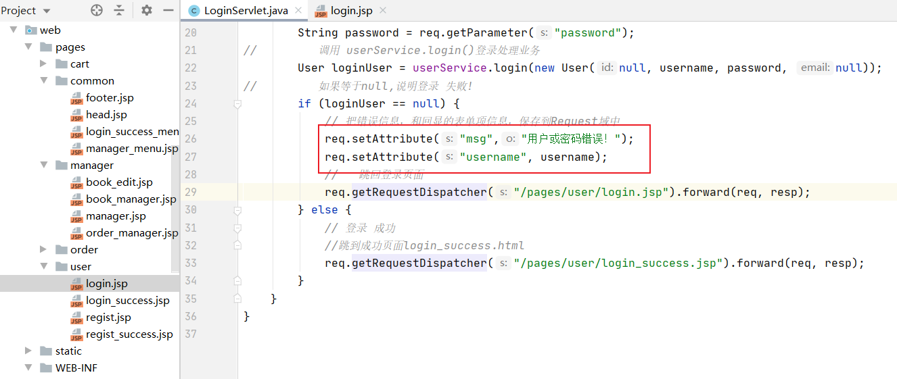
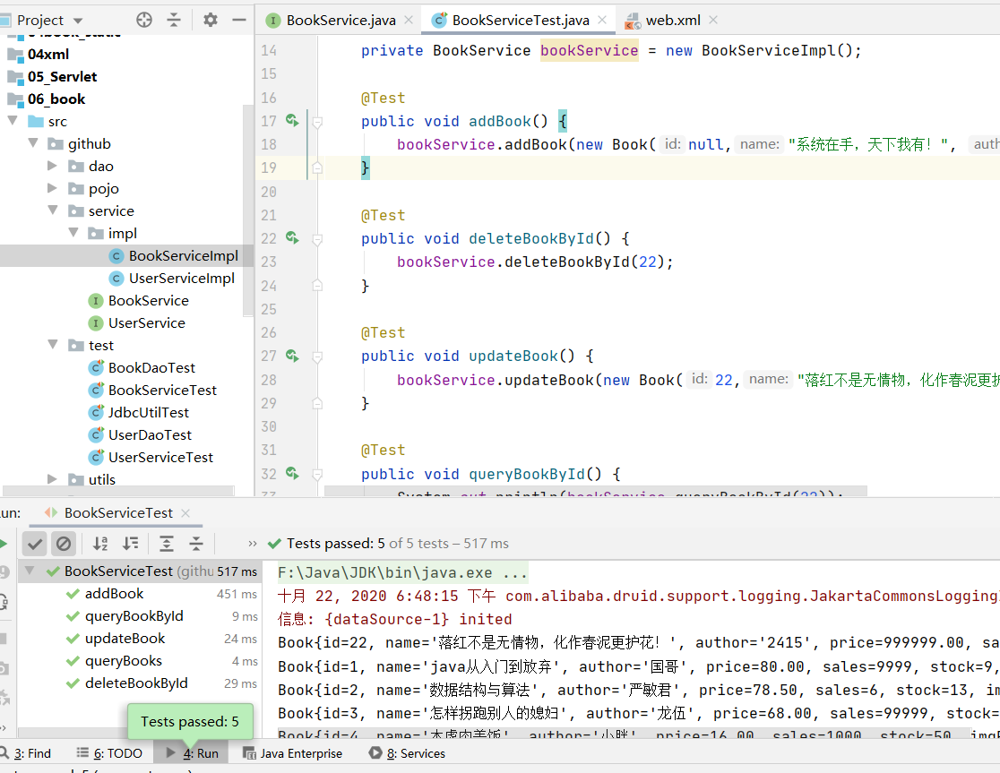
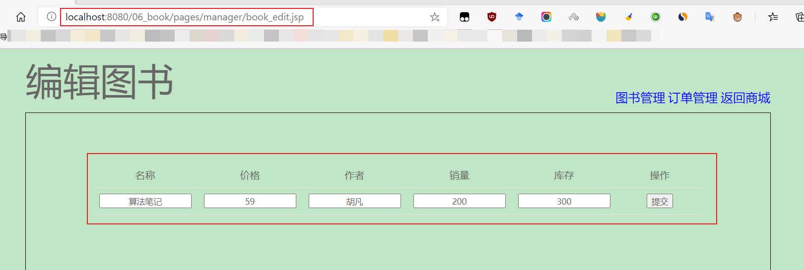
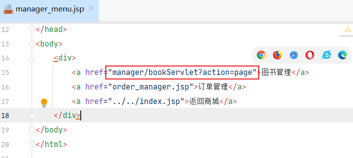

[TOC]

# 书城项目第三阶段 

## 1.页面jsp动态化 

> 1、在html页面顶行添加page指令。

```jsp
<%@ page contentType="text/html;charset=UTF-8" language="java" %>
```

> 2、修改文件后缀名为：.jsp


> 3、使用IDEA搜索替换.html为.jsp


> 替换结果，及运行检测：


## 2.抽取页面中相同的内容 


> 1.head中css、jquery、base标签——head.jsp

```jsp
<%@ page contentType="text/html;charset=UTF-8" language="java" %>
<%
    String basePath = request.getScheme()
            + "://"
            + request.getServerName()
            + ":"
            + request.getServerPort()
            + request.getContextPath()
            + "/";
%>
<html>
<head>
    <title>Title</title>
</head>
<body>
<!--写base标签，永远固定相对路径跳转的结果-->
<base href="<%=basePath%>">
<link type="text/css" rel="stylesheet" href="static/css/style.css" >
<script type="text/javascript" src="static/script/jquery-1.7.2.js"></script>
</body>
</html>
```


```jsp
<%-- 静态包含 base标签、css样式、jQuery文件 --%>
	<%@ include file="/pages/common/head.jsp"%>
	<script type="text/javascript">
```

---

> 2.每个页面的页脚——footer.jsp 

```jsp
<%@ page contentType="text/html;charset=UTF-8" language="java" %>
<html>
<head>
    <title>Title</title>
</head>
<body>
<div id="bottom">
    <span>
	    PDD书城.Copyright &copy;2020
	</span>
</div>
</body>
</html>
```


```jsp
<%--静态包含页脚内容--%>
			<%@include file="/pages/common/footer.jsp"%>
```

> 3.替换登录成功后的菜单——login_success_menu.jsp

```jsp
<%@ page contentType="text/html;charset=UTF-8" language="java" %>
<html>
<head>
    <title>Title</title>
</head>
<body>
    <div>
        <span>欢迎<span class="um_span">subeiLY</span>光临PDD书城</span>
        <a href="../order/order.jsp">我的订单</a>
        <a href="../../index.jsp">注销</a>&nbsp;&nbsp;
        <a href="../../index.jsp">返回</a>
    </div>
</body>
</html>
```


```jsp
<%--静态包含，登录 成功之后的菜单 --%>
			<%@ include file="/pages/common/login_success_menu.jsp"%>
```

> 4.manager模块的菜单——manager_menu.jsp

```jsp
<%@ page contentType="text/html;charset=UTF-8" language="java" %>
<html>
<head>
    <title>Title</title>
</head>
<body>
    <div>
        <a href="book_manager.jsp">图书管理</a>
        <a href="order_manager.jsp">订单管理</a>
        <a href="../../index.jsp">返回商城</a>
    </div>
</body>
</html>
```


```jsp
<%-- 静态包含 manager管理模块的菜单  --%>
		<%@include file="/pages/common/manager_menu.jsp"%>
```

## 3.登录，注册错误提示，及表单回显 

> 以登陆为例，Servlet程序端需要添加回显信息到Request域中:



```java
// 把错误信息，和回显的表单项信息，保存到Request域中
req.setAttribute("msg","用户或密码错误！");
req.setAttribute("username", username);
```


```jsp
<%@ page contentType="text/html;charset=UTF-8" language="java" %>
<!DOCTYPE html>
<html>
<head>
<meta charset="UTF-8">
<title>PDD会员登录页面</title>
	<%-- 静态包含 base标签、css样式、jQuery文件 --%>
	<%@ include file="/pages/common/head.jsp"%>
</head>
<body>
		<div id="login_header">
			
		</div>
			<div class="login_banner">
			
				<div id="l_content">
					<span class="login_word">欢迎登录</span>
				</div>
				
				<div id="content">
					<div class="login_form">
						<div class="login_box">
							<div class="tit">
								<h1>PDD会员</h1>
								<a href="regist.jsp">立即注册</a>
							</div>
							<div class="msg_cont">
								<b></b>
								<span class="errorMsg">
									${ empty requestScope.msg ? "请输入用户名和密码":requestScope.msg }
								</span>
							</div>
							<div class="form">
								<form action="loginServlet" method="post">
									<label>用户名称：</label>
									<input class="itxt" type="text" placeholder="请输入用户名"
										   autocomplete="off" tabindex="1" name="username"
										   value="${requestScope.username}" />
									<br />
									<br />
									<label>用户密码：</label>
									<input class="itxt" type="password" placeholder="请输入密码" autocomplete="off" tabindex="1" name="password" />
									<br />
									<br />
									<input type="submit" value="登录" id="sub_btn" />
								</form>
							</div>
							
						</div>
					</div>
				</div>
			</div>
		<%--静态包含页脚内容--%>
		<%@include file="/pages/common/footer.jsp"%>
</body>
</html>
```


## 4.BaseServlet的抽取 

> 在实际的项目开发中，一个模块，一般只使用一个Servlet程序。 

- 合并LoginServlet和RegistServlet程序为UserServlet程序 


- 抽取BaseServlet程序 


> BaseServlet程序代码 

```java
package github.web;

import javax.servlet.ServletException;
import javax.servlet.http.HttpServlet;
import javax.servlet.http.HttpServletRequest;
import javax.servlet.http.HttpServletResponse;
import java.io.IOException;
import java.lang.reflect.Method;

public abstract class BaseServlet extends HttpServlet {

    @Override
    protected void doGet(HttpServletRequest req, HttpServletResponse resp) throws ServletException, IOException {
        doPost(req, resp);
    }

    protected void doPost(HttpServletRequest req, HttpServletResponse resp) throws ServletException, IOException {
        // 解决post请求中文乱码问题
        // 一定要在获取请求参数之前调用才有效
        req.setCharacterEncoding("UTF-8");
        String action = req.getParameter("action");
        try {
            // 获取action业务鉴别字符串，获取相应的业务 方法反射对象
            Method method = this.getClass().getDeclaredMethod(action, HttpServletRequest.class, HttpServletResponse.class);
//            System.out.println(method);
            // 调用目标业务 方法
            method.invoke(this, req, resp);
        } catch (Exception e) {
            e.printStackTrace();
        }
    }
}
```

> BeanUtils工具类，它可以一次性的把所有请求的参数注入到JavaBean中。
>
> BeanUtils工具类，经常用于把Map中的值注入到JavaBean中，或者是对象属性值的拷贝操作。
>
> BeanUtils它不是Jdk的类。而是第三方的工具类。所以需要导包。
>
> 1、导入需要的jar包：
>
> commons-beanutils-1.8.0.jar
>
> commons-logging-1.1.1.jar 


> 编写WebUtils工具类——WebUtil.java

```java
import org.apache.commons.beanutils.BeanUtils;

import java.util.Map;

public class WebUtils {
    // 把Map中的值注入到对应的JavaBean属性中。
    public static <T> T copyParamToBean(Map value , T bean ){
        try {
            System.out.println("注入之前：" + bean);
            // 把所有请求的参数都注入到user对象中
            BeanUtils.populate(bean, value);
            System.out.println("注入之后：" + bean);
        } catch (Exception e) {
            e.printStackTrace();
        }
        return bean;
    }
}
```

> RegistServlet.java

```java
import github.pojo.User;
import github.service.UserService;
import github.service.impl.UserServiceImpl;

import javax.servlet.ServletException;
import javax.servlet.http.HttpServlet;
import javax.servlet.http.HttpServletRequest;
import javax.servlet.http.HttpServletResponse;
import java.io.IOException;

public class RegistServlet extends HttpServlet {

    private UserService userService = new UserServiceImpl();

    @Override
    protected void doPost(HttpServletRequest req, HttpServletResponse resp) throws ServletException, IOException {
        //  1、获取请求的参数
        String username = req.getParameter("username");
        String password = req.getParameter("password");
        String email = req.getParameter("email");
        String code = req.getParameter("code");


//        2、检查 验证码是否正确  === 写死,要求验证码为:abcde
        if ("abcde".equalsIgnoreCase(code)) {
//        3、检查 用户名是否可用
            if (userService.existsUsername(username)) {
                System.out.println("用户名[" + username + "]已存在!");

                // 把回显信息，保存到Request域中
                req.setAttribute("msg", "用户名已存在！！");
                req.setAttribute("username", username);
                req.setAttribute("email", email);

//        跳回注册页面
                req.getRequestDispatcher("/pages/user/regist.jsp").forward(req, resp);
            } else {
                //      可用
//                调用Sservice保存到数据库
                userService.registUser(new User(null, username, password, email));
//
//        跳到注册成功页面 regist_success.jsp
                req.getRequestDispatcher("/pages/user/regist_success.jsp").forward(req, resp);
            }
        } else {
            // 把回显信息，保存到Request域中
            req.setAttribute("msg", "验证码错误！！");
            req.setAttribute("username", username);
            req.setAttribute("email", email);

            System.out.println("验证码[" + code + "]错误");
            req.getRequestDispatcher("/pages/user/regist.jsp").forward(req, resp);
        }
    }
}
```

> UserServlet.java

```java
import github.pojo.User;
import github.service.UserService;
import github.service.impl.UserServiceImpl;
import github.utils.WebUtils;

import javax.servlet.ServletException;
import javax.servlet.http.HttpServletRequest;
import javax.servlet.http.HttpServletResponse;
import java.io.IOException;

public class UserServlet extends BaseServlet{
    private UserService userService = new UserServiceImpl();

    /**
     * 处理登录的功能
     * @param req
     * @param resp
     * @throws ServletException
     * @throws IOException
     */
    protected void login(HttpServletRequest req, HttpServletResponse resp) throws ServletException, IOException {

        //  1、获取请求的参数
        String username = req.getParameter("username");
        String password = req.getParameter("password");
        // 调用 userService.login()登录处理业务
        User loginUser = userService.login(new User(null, username, password, null));
        // 如果等于null,说明登录 失败!
        if (loginUser == null) {
            // 把错误信息，和回显的表单项信息，保存到Request域中
            req.setAttribute("msg", "用户或密码错误！");
            req.setAttribute("username", username);
            //   跳回登录页面
            req.getRequestDispatcher("/pages/user/login.jsp").forward(req, resp);
        } else {
            // 登录 成功
            //跳到成功页面login_success.html
            req.getRequestDispatcher("/pages/user/login_success.jsp").forward(req, resp);
        }
    }

    /**
     * 处理注册的功能
     * @param req
     * @param resp
     * @throws ServletException
     * @throws IOException
     */
    protected void regist(HttpServletRequest req, HttpServletResponse resp) throws ServletException, IOException {
        //  1、获取请求的参数
        String username = req.getParameter("username");
        String password = req.getParameter("password");
        String email = req.getParameter("email");
        String code = req.getParameter("code");

        User user = WebUtils.copyParamToBean(req.getParameterMap(), new User());

//        2、检查 验证码是否正确  === 写死,要求验证码为:abcde
        if ("abcde".equalsIgnoreCase(code)) {
//        3、检查 用户名是否可用
            if (userService.existsUsername(username)) {
                System.out.println("用户名[" + username + "]已存在!");

                // 把回显信息，保存到Request域中
                req.setAttribute("msg", "用户名已存在！！");
                req.setAttribute("username", username);
                req.setAttribute("email", email);

//        跳回注册页面
                req.getRequestDispatcher("/pages/user/regist.jsp").forward(req, resp);
            } else {
                //      可用
//                调用Sservice保存到数据库
                userService.registUser(new User(null, username, password, email));
//
//        跳到注册成功页面 regist_success.jsp
                req.getRequestDispatcher("/pages/user/regist_success.jsp").forward(req, resp);
            }
        } else {
            // 把回显信息，保存到Request域中
            req.setAttribute("msg", "验证码错误！！");
            req.setAttribute("username", username);
            req.setAttribute("email", email);

            System.out.println("验证码[" + code + "]错误");
            req.getRequestDispatcher("/pages/user/regist.jsp").forward(req, resp);
        }
    }
}
```

> 给login.jsp添加隐藏域和修改请求地址:


> web.xml配置

```xml
<servlet>
        <servlet-name>UserServlet</servlet-name>
        <servlet-class>github.web.UserServlet</servlet-class>
    </servlet>
    <servlet-mapping>
        <servlet-name>UserServlet</servlet-name>
        <url-pattern>/userServlet</url-pattern>
    </servlet-mapping>
```


## 5.使用EL表达式修改表单回显 


# 书城项目第四阶段——图书模块 

## 1.MVC概念

> MVC全称：Model模型、View视图、Controller控制器。
>
> MVC最早出现在JavaEE三层中的Web层，它可以有效的指导Web层的代码如何有效分离，单独工作。
>
> View视图：只负责数据和界面的显示，不接受任何与显示数据无关的代码，便于程序员和美工的分工合作——JSP/HTML。
>
> Controller控制器：只负责接收请求，调用业务层的代码处理请求，然后派发页面，是一个“调度者”的角色——Servlet。转到某个页面。或者是重定向到某个页面。
>
> Model模型：将与业务逻辑相关的数据封装为具体的JavaBean类，其中不掺杂任何与数据处理相关的代码——JavaBean/domain/entity/pojo。
>
> MVC是一种思想。
>
> MVC的理念是将软件代码拆分成为组件，单独开发，组合使用（目的还是为了降低耦合度）。 


> MVC的作用还是为了降低耦合。让代码合理分层。方便后期升级和维护。 

## 2.编写图书模块的数据库表 

```sql
SET NAMES utf8mb4;
SET FOREIGN_KEY_CHECKS = 0;

-- ----------------------------
-- Table structure for t_book
-- ----------------------------
DROP TABLE IF EXISTS `t_book`;
##创建图书表
CREATE TABLE `t_book`  (
  `id` int(11) NOT NULL AUTO_INCREMENT,										## 主键
  `name` varchar(50) CHARACTER SET utf8 COLLATE utf8_bin NOT NULL,			## 书名 
  `author` varchar(50) CHARACTER SET utf8 COLLATE utf8_bin NOT NULL,		## 作者
  `price` decimal(11, 2) NOT NULL,											## 价格
  `sales` int(11) NOT NULL,													## 销量
  `stock` int(11) NOT NULL,													## 库存
  `img_path` varchar(200) CHARACTER SET utf8 COLLATE utf8_bin NOT NULL,		## 书的图片路径
  PRIMARY KEY (`id`) USING BTREE
) ENGINE = InnoDB AUTO_INCREMENT = 21 CHARACTER SET = utf8 COLLATE = utf8_bin ROW_FORMAT = Dynamic;

-- ----------------------------
-- Records of t_book
-- ----------------------------
## 插入初始化测试数据
INSERT INTO `t_book` VALUES (1, 'java从入门到放弃', '国哥', 80.00, 9999, 9, 'static/img/default.jpg');
INSERT INTO `t_book` VALUES (2, '数据结构与算法', '严敏君', 78.50, 6, 13, 'static/img/default.jpg');
INSERT INTO `t_book` VALUES (3, '怎样拐跑别人的媳妇', '龙伍', 68.00, 99999, 52, 'static/img/default.jpg');
INSERT INTO `t_book` VALUES (4, '木虚肉盖饭', '小胖', 16.00, 1000, 50, 'static/img/default.jpg');
INSERT INTO `t_book` VALUES (5, 'C++编程思想', '刚哥', 45.50, 14, 95, 'static/img/default.jpg');
INSERT INTO `t_book` VALUES (6, '蛋炒饭', '周星星', 9.90, 12, 53, 'static/img/default.jpg');
INSERT INTO `t_book` VALUES (7, '赌神', '龙伍', 66.50, 125, 535, 'static/img/default.jpg');
INSERT INTO `t_book` VALUES (8, 'Java编程思想', '阳哥', 99.50, 47, 36, 'static/img/default.jpg');
INSERT INTO `t_book` VALUES (9, 'JavaScript从入门到精通', '婷姐', 9.90, 85, 95, 'static/img/default.jpg');
INSERT INTO `t_book` VALUES (10, 'cocos2d-x游戏编程入门', '国哥', 49.00, 52, 62, 'static/img/default.jpg');
INSERT INTO `t_book` VALUES (11, 'C语言程序设计', '谭浩强', 28.00, 52, 74, 'static/img/default.jpg');
INSERT INTO `t_book` VALUES (12, 'Lua语言程序设计', '雷丰阳', 51.50, 48, 82, 'static/img/default.jpg');
INSERT INTO `t_book` VALUES (13, '西游记', '罗贯中', 12.00, 19, 9999, 'static/img/default.jpg');
INSERT INTO `t_book` VALUES (14, '水浒传', '华仔', 33.05, 22, 88, 'static/img/default.jpg');
INSERT INTO `t_book` VALUES (15, '操作系统原理', '刘优', 133.05, 122, 188, 'static/img/default.jpg');
INSERT INTO `t_book` VALUES (16, '数据结构 java版', '封大神', 173.15, 21, 81, 'static/img/default.jpg');
INSERT INTO `t_book` VALUES (17, 'UNIX高级环境编程', '乐天', 99.15, 210, 810, 'static/img/default.jpg');
INSERT INTO `t_book` VALUES (18, 'javaScript高级编程', '国哥', 69.15, 210, 810, 'static/img/default.jpg');
INSERT INTO `t_book` VALUES (19, '大话设计模式', '国哥', 89.15, 20, 10, 'static/img/default.jpg');
INSERT INTO `t_book` VALUES (20, '人月神话', '刚哥', 88.15, 20, 80, 'static/img/default.jpg');

-- ----------------------------
-- Table structure for t_user
-- ----------------------------
DROP TABLE IF EXISTS `t_user`;
CREATE TABLE `t_user`  (
  `id` int(11) NOT NULL AUTO_INCREMENT,
  `username` varchar(20) CHARACTER SET utf8 COLLATE utf8_bin NOT NULL,
  `password` varchar(32) CHARACTER SET utf8 COLLATE utf8_bin NOT NULL,
  `email` varchar(200) CHARACTER SET utf8 COLLATE utf8_bin NULL DEFAULT NULL,
  PRIMARY KEY (`id`) USING BTREE,
  UNIQUE INDEX `username`(`username`) USING BTREE
) ENGINE = InnoDB AUTO_INCREMENT = 11 CHARACTER SET = utf8 COLLATE = utf8_bin ROW_FORMAT = Dynamic;

-- ----------------------------
-- Records of t_user
-- ----------------------------
INSERT INTO `t_user` VALUES (1, 'admin', 'admin', 'admin@atguigu.com');
INSERT INTO `t_user` VALUES (2, 'subei365', '666666', 'subei@qq.com');
INSERT INTO `t_user` VALUES (3, 'teah4399', '1314912', 'hoist@qq.com');
INSERT INTO `t_user` VALUES (7, 'æ??å??', '123456', 'lisi@qq.com');
INSERT INTO `t_user` VALUES (8, '赵�', '123456', 'zhao@qq.com');
INSERT INTO `t_user` VALUES (9, 'wzg168', '123456', 'wzg168@qq.com');

SET FOREIGN_KEY_CHECKS = 1;

## 查看表内容
select id,name,author,price,sales,stock,img_path from t_book;
```

## 3.编写图书模块的JavaBean 

```java
package github.pojo;

import java.math.BigDecimal;

public class Book {
    private Integer id;
    private String name;
    private String author;
    private BigDecimal price;
    private Integer sales;
    private Integer stock;
    private String imgPath = "static/img/bookhuo.jpg";

    public Book() {
        super();
    }

    public Book(Integer id, String name, String author, BigDecimal price, Integer sales, Integer stock, String imgPath) {
        this.id = id;
        this.name = name;
        this.author = author;
        this.price = price;
        this.sales = sales;
        this.stock = stock;
        // 要求给定的图书封面图书路径不能为空
        if (imgPath != null && !"".equals(imgPath)) {
            this.imgPath = imgPath;
        }
    }

    @Override
    public int hashCode() {
        return super.hashCode();
    }

    @Override
    public boolean equals(Object obj) {
        return super.equals(obj);
    }

    @Override
    protected Object clone() throws CloneNotSupportedException {
        return super.clone();
    }

    @Override
    protected void finalize() throws Throwable {
        super.finalize();
    }

    public Integer getId() {
        return id;
    }

    public void setId(Integer id) {
        this.id = id;
    }

    public String getName() {
        return name;
    }

    public void setName(String name) {
        this.name = name;
    }

    public String getAuthor() {
        return author;
    }

    public void setAuthor(String author) {
        this.author = author;
    }

    public BigDecimal getPrice() {
        return price;
    }

    public void setPrice(BigDecimal price) {
        this.price = price;
    }

    public Integer getSales() {
        return sales;
    }

    public void setSales(Integer sales) {
        this.sales = sales;
    }

    public Integer getStock() {
        return stock;
    }

    public void setStock(Integer stock) {
        this.stock = stock;
    }

    public String getImgPath() {
        return imgPath;
    }

    public void setImgPath(String imgPath) {
        // 要求给定的图书封面图书路径不能为空
        if (imgPath != null && !"".equals(imgPath)) {
            this.imgPath = imgPath;
        }
    }

    @Override
    public String toString() {
        return "Book{" +
                "id=" + id +
                ", name='" + name + '\'' +
                ", author='" + author + '\'' +
                ", price=" + price +
                ", sales=" + sales +
                ", stock=" + stock +
                ", imgPath='" + imgPath + '\'' +
                '}';
    }
}
```

## 4.编写图书模块的Dao和测试Dao 

> Dao接口 

```java
package github.dao;

import github.pojo.Book;

import java.util.List;

public interface BookDao {
    public int addBook(Book book);

    public int deleteBookById(Integer id);

    public int updateBook(Book book);

    public Book queryBookById(Integer id);

    public List<Book> queryBooks();
}
```

> BookDaoImpl实现类

```java
package github.dao.impl;

import github.dao.BookDao;
import github.pojo.Book;

import java.util.List;

public class BookDaoImpl extends BaseDao implements BookDao {

    @Override
    public int addBook(Book book) {
        String sql = "insert into t_book(`name`,`author`,`price`,`sales`,`stock`,`img_path`) values(?,?,?,?,?,?)";
        return update(sql, book.getName(),book.getAuthor(),book.getPrice(),book.getSales(),book.getStock(),book.getImgPath());
    }

    @Override
    public int deleteBookById(Integer id) {
        String sql = "delete from t_book where id = ?";
        return update(sql, id);
    }

    @Override
    public int updateBook(Book book) {
        String sql = "update t_book set `name`=?,`author`=?,`price`=?,`sales`=?,`stock`=?,`img_path`=? where id = ?";
        return update(sql,book.getName(),book.getAuthor(),book.getPrice(),book.getSales(),book.getStock(),book.getImgPath(),book.getId());
    }

    @Override
    public Book queryBookById(Integer id) {
        String sql = "select `id` , `name` , `author` , `price` , `sales` , `stock` , `img_path` imgPath from t_book where id = ?";
        return queryForOne(Book.class, sql,id);
    }

    @Override
    public List<Book> queryBooks() {
        String sql = "select `id` , `name` , `author` , `price` , `sales` , `stock` , `img_path` imgPath from t_book";
        return queryForList(Book.class, sql);
    }
}
```

> 在idea中创建测试类,方法：鼠标点中类名，使用"Alt+Enter"， 会弹出intention action -> create tests


> BookDao的测试 

```java
package github.test;

import github.dao.BookDao;
import github.dao.impl.BookDaoImpl;
import github.pojo.Book;
import org.junit.Test;

import java.math.BigDecimal;

public class BookDaoTest {
    private BookDao bookDao = new BookDaoImpl();

    @Test
    public void addBook() {
        bookDao.addBook(new Book(null,"代码为什么这么多！", "952761", new BigDecimal(99999),510000,0,null
        ));
    }

    @Test
    public void deleteBookById() {
        bookDao.deleteBookById(21);
    }

    @Test
    public void updateBook() {
        bookDao.updateBook(new Book(21,"我该怎么选！", "升学", new BigDecimal(99999),510000,0,null
        ));
    }

    @Test
    public void queryBookById() {
        System.out.println( bookDao.queryBookById(21) );
    }

    @Test
    public void queryBooks() {
        for (Book queryBook : bookDao.queryBooks()) {
            System.out.println(queryBook);
        }
    }
}
```


## 5.编写图书模块的Service和测试Service

> BookService接口 

```java
package github.service;

import github.pojo.Book;

import java.util.List;

public interface BookService {
    public void addBook(Book book);

    public void deleteBookById(Integer id);

    public void updateBook(Book book);

    public Book queryBookById(Integer id);

    public List<Book> queryBooks();
}
```

> BookServiceImpl实现类： 

```java
package github.service.impl;

import github.dao.BookDao;
import github.dao.impl.BookDaoImpl;
import github.pojo.Book;
import github.service.BookService;

import java.util.List;

public class BookServiceImpl implements BookService {
    private BookDao bookDao = new BookDaoImpl();

    @Override
    public void addBook(Book book) {
        bookDao.addBook(book);
    }

    @Override
    public void deleteBookById(Integer id) {
        bookDao.deleteBookById(id);
    }

    @Override
    public void updateBook(Book book) {
        bookDao.updateBook(book);
    }

    @Override
    public Book queryBookById(Integer id) {
        return bookDao.queryBookById(id);
    }

    @Override
    public List<Book> queryBooks() {
        return bookDao.queryBooks();
    }
}
```

> BookService的测试： 

```java
package github.test;

import github.pojo.Book;
import github.service.BookService;
import github.service.impl.BookServiceImpl;
import org.junit.Test;

import java.math.BigDecimal;

import static org.junit.Assert.*;

public class BookServiceTest {

    private BookService bookService = new BookServiceImpl();

    @Test
    public void addBook() {
        bookService.addBook(new Book(null,"系统在手，天下我有！", "2415", new BigDecimal(1000000), 100000000, 0, null));
    }

    @Test
    public void deleteBookById() {
        bookService.deleteBookById(22);
    }

    @Test
    public void updateBook() {
        bookService.updateBook(new Book(22,"落红不是无情物，化作春泥更护花！", "2415", new BigDecimal(999999), 10, 111110, null));
    }

    @Test
    public void queryBookById() {
        System.out.println(bookService.queryBookById(22));
    }

    @Test
    public void queryBooks() {
        for (Book queryBook : bookService.queryBooks()) {
            System.out.println(queryBook);
        }
    }
}
```




## 6.编写图书模块的Web层，和页面联调测试 

### 1.图书列表功能的实现 


> BookServlet程序中添加list方法 

```java
package github.web;

import github.pojo.Book;
import github.service.BookService;
import github.service.impl.BookServiceImpl;

import javax.servlet.ServletException;
import javax.servlet.http.HttpServletRequest;
import javax.servlet.http.HttpServletResponse;
import java.io.IOException;
import java.util.List;

public class BookServlet extends BaseServlet{
    private BookService bookService = new BookServiceImpl();

    @Override
    protected void doGet(HttpServletRequest req, HttpServletResponse resp) throws ServletException, IOException {
        doPost(req,resp);
    }

    protected void list(HttpServletRequest req, HttpServletResponse resp) throws ServletException, IOException {
        //1 通过BookService查询全部图书
        List<Book> books = bookService.queryBooks();
        //2 把全部图书保存到Request域中
        req.setAttribute("books", books);
        //3、请求转发到/pages/manager/book_manager.jsp页面
        req.getRequestDispatcher("/pages/manager/book_manager.jsp").forward(req,resp);
    }
}
```

> 修改【图书管理】请求地址 


> 修改pages/manager/book_manager.jsp页面的数据遍历输出 

```jsp
<%@ page contentType="text/html;charset=UTF-8" language="java" %>
<%@ taglib prefix="c" uri="http://java.sun.com/jsp/jstl/core" %>
<!DOCTYPE html>
<html>
<head>
<meta charset="UTF-8">
<title>图书管理</title>
	<%-- 静态包含 base标签、css样式、jQuery文件 --%>
	<%@ include file="/pages/common/head.jsp"%>
	<script type="text/javascript">
		$(function () {
			// 给删除的a标签绑定单击事件，用于删除的确认提示操作
			$("a.deleteClass").click(function () {
				// 在事件的function函数中，有一个this对象。这个this对象，是当前正在响应事件的dom对象。
				/**
				 * confirm是确认提示框函数
				 * 参数是它的提示内容
				 * 它有两个按钮，一个确认，一个是取消。
				 * 返回true表示点击了，确认，返回false表示点击取消。
				 */
				return confirm("你确定要删除【" + $(this).parent().parent().find("td:first").text() + "】?");
				// return false// 阻止元素的默认行为===不提交请求
			});
		});
	</script>
</head>
<body>
	
	<div id="header">
			
			<span class="wel_word">图书管理系统</span>
		<%-- 静态包含 manager管理模块的菜单  --%>
		<%@include file="/pages/common/manager_menu.jsp"%>
	</div>
	
	<div id="main">
		<table>
			<tr>
				<td>名称</td>
				<td>价格</td>
				<td>作者</td>
				<td>销量</td>
				<td>库存</td>
				<td colspan="2">操作</td>
			</tr>

			<c:forEach items="${requestScope.books}" var="book">
				<tr>
					<td>${book.name}</td>
					<td>${book.price}</td>
					<td>${book.author}</td>
					<td>${book.sales}</td>
					<td>${book.stock}</td>
					<td><a href="manager/bookServlet?action=getBook&id=${book.id}">修改</a></td>
					<td><a class="deleteClass" href="manager/bookServlet?action=delete&id=${book.id}">删除</a></td>
				</tr>
			</c:forEach>
			
			<tr>
				<td></td>
				<td></td>
				<td></td>
				<td></td>
				<td></td>
				<td></td>
				<td><a href="book_edit.jsp">添加图书</a></td>
			</tr>	
		</table>
	</div>

	<%--静态包含页脚内容--%>
	<%@include file="/pages/common/footer.jsp"%>
</body>
</html>
```

> web.xml配置

```xml
    <servlet>
        <servlet-name>BookServlet</servlet-name>
        <servlet-class>github.web.BookServlet</servlet-class>
    </servlet>
    <servlet-mapping>
        <servlet-name>BookServlet</servlet-name>
        <url-pattern>/manager/bookServlet</url-pattern>
    </servlet-mapping>
```

> 运行结果如下：


---

### 2.前后台的简单介绍 


---

### 3.添加图书功能的实现 


> 当用户提交完请求，浏览器会记录下最后一次请求的全部信息。当用户按下功能键F5，就会发起浏览器记录的最后一次请求。 

---


> BookServlet程序中添加add方法 

```java
    protected void add(HttpServletRequest req, HttpServletResponse resp) throws ServletException, IOException {

//        1、获取请求的参数==封装成为Book对象
        Book book = WebUtils.copyParamToBean(req.getParameterMap(),new Book());
//        2、调用BookService.addBook()保存图书
        bookService.addBook(book);
//        3、跳到图书列表页面
//                /manager/bookServlet?action=list
//        req.getRequestDispatcher("/manager/bookServlet?action=list").forward(req, resp);

        resp.sendRedirect(req.getContextPath() + "/manager/bookServlet?action=list");
    }
```

> 修改book_edit.jsp页面 


```jsp
<%@ page contentType="text/html;charset=UTF-8" language="java" %>
<!DOCTYPE html>
<html>
<head>
<meta charset="UTF-8">
<title>编辑图书</title>
	<%-- 静态包含 base标签、css样式、jQuery文件 --%>
	<%@ include file="/pages/common/head.jsp"%>
<style type="text/css">
	h1 {
		text-align: center;
		margin-top: 200px;
	}
	
	h1 a {
		color:red;
	}
	
	input {
		text-align: center;
	}
</style>
</head>
<body>
		<div id="header">
			
			<span class="wel_word">编辑图书</span>
			<%-- 静态包含 manager管理模块的菜单  --%>
			<%@include file="/pages/common/manager_menu.jsp"%>
		</div>

		<div id="main">
			<form action="manager/bookServlet" method="get">
				<input type="hidden" name="action" value="add" />
				<table>
					<tr>
						<td>名称</td>
						<td>价格</td>
						<td>作者</td>
						<td>销量</td>
						<td>库存</td>
						<td colspan="2">操作</td>
					</tr>
					<tr>
						<td><input name="name" type="text" value="算法笔记"/></td>
						<td><input name="price" type="text" value="59"/></td>
						<td><input name="author" type="text" value="胡凡"/></td>
						<td><input name="sales" type="text" value="200"/></td>
						<td><input name="stock" type="text" value="300"/></td>
						<td><input type="submit" value="提交"/></td>
					</tr>
				</table>
			</form>
		</div>

		<%--静态包含页脚内容--%>
		<%@include file="/pages/common/footer.jsp"%>
</body>
</html>
```

> 运行结果：




---

### 4.删除图书功能的实现


> BookServlet程序中的delete方法

```java
protected void delete(HttpServletRequest req, HttpServletResponse resp) throws ServletException, IOException {
//        1、获取请求的参数id，图书编程
        int id = WebUtils.parseInt(req.getParameter("id"), 0);
//        2、调用bookService.deleteBookById();删除图书
        bookService.deleteBookById(id);
//        3、重定向回图书列表管理页面
//                /book/manager/bookServlet?action=list
        resp.sendRedirect(req.getContextPath() + "/manager/bookServlet?action=list");
    }
```

> 给WebUtils工具类添加转换 int 类型的工具方法

```java
    /**
     * 将字符串转换成为int类型的数据
     * @param strInt
     * @param defaultValue
     * @return
     */
    public static int parseInt(String strInt,int defaultValue) {
        try {
            return Integer.parseInt(strInt);
        } catch (Exception e) {
            e.printStackTrace();
        }
        return defaultValue;
    }
```

> 修改删除的连接地址


```jsp
<td><a class="deleteClass" href="manager/bookServlet?action=delete&id=${book.id}">删除</a></td>
```

> 给删除添加确认提示操作


```jsp
<script type="text/javascript">
		$(function () {
			// 给删除的a标签绑定单击事件，用于删除的确认提示操作
			$("a.deleteClass").click(function () {
				// 在事件的function函数中，有一个this对象。这个this对象，是当前正在响应事件的dom对象。
				/**
				 * confirm是确认提示框函数
				 * 参数是它的提示内容
				 * 它有两个按钮，一个确认，一个是取消。
				 * 返回true表示点击了，确认，返回false表示点击取消。
				 */
				return confirm("你确定要删除【" + $(this).parent().parent().find("td:first").text() + "】?");
				// return false// 阻止元素的默认行为===不提交请求
			});
		});
	</script>
```

> 运行结果如下：


---

### 5.修改图书功能的实现 


> 更新【修改】的请求地址


```jsp
<td><a href="manager/bookServlet?action=getBook&id=${book.id}">修改</a></td>
```

> BookServlet程序中添加getBook方法

```java
protected void getBook(HttpServletRequest req, HttpServletResponse resp) throws ServletException, IOException {
        //1 获取请求的参数图书编号
        int id = WebUtils.parseInt(req.getParameter("id"), 0);
        //2 调用bookService.queryBookById查询图书
        Book book = bookService.queryBookById(id);
        //3 保存到图书到Request域中
        req.setAttribute("book", book) ;
        //4 请求转发到。pages/manager/book_edit.jsp页面
        req.getRequestDispatcher("/pages/manager/book_edit.jsp").forward(req,resp);
    }
```

> 在book_edit.jsp页面中显示修改的数据


```jsp
<tr>
	<td><input name="name" type="text" value="${requestScope.book.name}"/></td>
	<td><input name="price" type="text" value="${requestScope.book.price}"/></td>
	<td><input name="author" type="text" value="${requestScope.book.author}"/></td>
	<td><input name="sales" type="text" value="${requestScope.book.sales}"/></td>
	<td><input name="stock" type="text" value="${requestScope.book.stock}"/></td>
	<td><input type="submit" value="提交"/></td>
</tr>
```

> 运行结果如下：


> 在BookServlet程序中添加update方法

```java
    protected void update(HttpServletRequest req, HttpServletResponse resp) throws ServletException, IOException {
//        1、获取请求的参数==封装成为Book对象
        Book book = WebUtils.copyParamToBean(req.getParameterMap(),new Book());
//        2、调用BookService.updateBook( book );修改图书
        bookService.updateBook(book);
//        3、重定向回图书列表管理页面
//        地址：/工程名/manager/bookServlet?action=list
        resp.sendRedirect(req.getContextPath() + "/manager/bookServlet?action=list");
    }
```

> 解决book_edit.jsp页面，即要实现添加，又要实现修改操作。


```jsp
<input type="hidden" name="action" value="${ empty param.id ? "add" : "update" }" />
				<input type="hidden" name="id" value="${ requestScope.book.id }" />
```

# 书城项目第五阶段——分页

## 1.图书分页

> 分页模块的分析:


### 1.分页模型Page的抽取

```java
public class Page<T> {
    public static final Integer PAGE_SIZE=4;
    //当前页码
    private Integer pageNo;
    //总页码
    private Integer pageTotal;
    //当前页显示数量
    private Integer pageSize=PAGE_SIZE;
    //总记录数
    private Integer pageTotalCount;
    //当前页数据
    private List<T> items;

    public Integer getPageNo() {
        return pageNo;
    }

    public void setPageNo(Integer pageNo) {
        this.pageNo = pageNo;
    }

    public Integer getPageTotal() {
        return pageTotal;
    }

    public void setPageTotal(Integer pageTotal) {
        this.pageTotal = pageTotal;
    }

    public Integer getPageSize() {
        return pageSize;
    }

    public void setPageSize(Integer pageSize) {
        this.pageSize = pageSize;
    }

    public Integer getPageTotalCount() {
        return pageTotalCount;
    }

    public void setPageTotalCount(Integer pageTotalCount) {
        this.pageTotalCount = pageTotalCount;
    }

    public List<T> getItems() {
        return items;
    }

    public void setItems(List<T> items) {
        this.items = items;
    }

    @Override
    public String toString() {
        return "Page{" +
                "pageNo=" + pageNo +
                ", pageTotal=" + pageTotal +
                ", pageSize=" + pageSize +
                ", pageTotalCount=" + pageTotalCount +
                ", items=" + items +
                '}';
    }
}
```

### 2.分页的初步实现

> BookDao.java代码:

```java
    Integer queryForPageTotalCount();

    List<Book> queryForPageItems(int begin, int pageSize);
```

> BookDaoImpl.java代码：

```java
    @Override
    public Integer queryForPageTotalCount() {
        String sql = "select count(*) from t_book";
        Number count = (Number) queryForSingle(sql);
        return count.intValue();
    }

    @Override
    public List<Book> queryForPageItems(int begin, int pageSize) {
        String sql = "select `id` , `name` , `author` , `price` , `sales` , `stock` , `img_path` imgPath from t_book limit ?,?";
        return queryForList(Book.class,sql,begin,pageSize);
    }
```

> BookService.java代码:

```java
    Page<Book> page(int pageNo, int pageSize);
```

> BookServiceImpl.java代码:

```java
 	@Override
    public Page<Book> page(int pageNo, int pageSize) {
        Page<Book> page = new Page<Book>();
        // 设置每页显示的数量
        page.setPageSize(pageSize);
        // 求总记录数
        Integer pageTotalCount = bookDao.queryForPageTotalCount();
        // 求总页码
        Integer pageTotal = pageTotalCount / pageSize;
        if (pageTotalCount % pageSize > 0) {
            pageTotal+=1;
        }
        // 设置总页码
        page.setPageTotal(pageTotal);
        // 设置当前页码
        page.setPageNo(pageNo);
        // 求当前页数据的开始索引
        int begin = (page.getPageNo() - 1) * pageSize;
        // 求当前页数据
        List<Book> items = bookDao.queryForPageItems(begin,pageSize);
        // 设置当前页数据
        page.setItems(items);
        return page;
    }
```

> BookServlet.java程序的代码: 

```java
    /**
     * 处理分页功能
     * @param req
     * @param resp
     * @throws ServletException
     * @throws IOException
     */
    protected void page(HttpServletRequest req, HttpServletResponse resp) throws ServletException, IOException {
        //1 获取请求的参数 pageNo 和 pageSize
        int pageNo = WebUtils.parseInt(req.getParameter("pageNo"), 1);
        int pageSize = WebUtils.parseInt(req.getParameter("pageSize"), Page.PAGE_SIZE);
        //2 调用BookService.page(pageNo，pageSize)：Page对象
        Page<Book> page = bookService.page(pageNo,pageSize);
        //3 保存Page对象到Request域中
        req.setAttribute("page",page);
        //4 请求转发到pages/manager/book_manager.jsp页面
        req.getRequestDispatcher("/pages/manager/book_manager.jsp").forward(req,resp);
    }
```

> manager_menu.jsp中【图书管理】请求地址的修改:



```java
<a href="manager/bookServlet?action=page">图书管理</a>
```

> book_manager.jsp修改： 

```java
<%@ page contentType="text/html;charset=UTF-8" language="java" %>
<%@ taglib prefix="c" uri="http://java.sun.com/jsp/jstl/core" %>
<!DOCTYPE html>
<html>
<head>
<meta charset="UTF-8">
<title>图书管理</title>
	<%-- 静态包含 base标签、css样式、jQuery文件 --%>
	<%@ include file="/pages/common/head.jsp"%>
	<script type="text/javascript">
		$(function () {
			// 给删除的a标签绑定单击事件，用于删除的确认提示操作
			$("a.deleteClass").click(function () {
				// 在事件的function函数中，有一个this对象。这个this对象，是当前正在响应事件的dom对象。
				/**
				 * confirm是确认提示框函数
				 * 参数是它的提示内容
				 * 它有两个按钮，一个确认，一个是取消。
				 * 返回true表示点击了，确认，返回false表示点击取消。
				 */
				return confirm("你确定要删除【" + $(this).parent().parent().find("td:first").text() + "】?");
				// return false// 阻止元素的默认行为===不提交请求
			});
		});
	</script>
</head>
<body>
	
	<div id="header">
			
			<span class="wel_word">图书管理系统</span>
		<%-- 静态包含 manager管理模块的菜单  --%>
		<%@include file="/pages/common/manager_menu.jsp"%>
	</div>
	
	<div id="main">
		<table>
			<tr>
				<td>名称</td>
				<td>价格</td>
				<td>作者</td>
				<td>销量</td>
				<td>库存</td>
				<td colspan="2">操作</td>
			</tr>

			<c:forEach items="${requestScope.page.items}" var="book">
				<tr>
					<td>${book.name}</td>
					<td>${book.price}</td>
					<td>${book.author}</td>
					<td>${book.sales}</td>
					<td>${book.stock}</td>
					<td><a href="manager/bookServlet?action=getBook&id=${book.id}">修改</a></td>
					<td><a class="deleteClass" href="manager/bookServlet?action=delete&id=${book.id}">删除</a></td>
				</tr>
			</c:forEach>
			
			<tr>
				<td></td>
				<td></td>
				<td></td>
				<td></td>
				<td></td>
				<td></td>
				<td><a href="pages/manager/book_edit.jsp">添加图书</a></td>
			</tr>	
		</table>

		<div id="page_nav">
			<a href="#">首页</a>
			<a href="#">上一页</a>
			<a href="#">3</a>
			【${requestScope.page.pageNo}】
			<a href="#">5</a>
			<a href="#">下一页</a>
			<a href="#">末页</a>共${requestScope.page.pageTotal}页，${requestScope.page.pageTotalCount}条记录
			到第<input value="4" name="pn" id="pn_input"/>页
			<input type="button"value="确定">
		</div>

	</div>

	<%--静态包含页脚内容--%>
	<%@include file="/pages/common/footer.jsp"%>
</body>
</html>
```

> 运行结果如下：


### 3.首页、上一页、下一页、末页实现

> ```jsp
> <div id="page_nav">
>    <%--大于首页，才显示--%>
>    <c:if test="${requestScope.page.pageNo > 1}">
>       <a href="manager/bookServlet?action=page&pageNo=1">首页</a>
>       <a href="manager/bookServlet?action=page&pageNo=${requestScope.page.pageNo-1}">上一页</a>
>    </c:if>
>    <a href="#">3</a>
>    【${requestScope.page.pageNo}】
>    <a href="#">5</a>
>    <%--如果已经是最后一页，则不显示下一页，末页--%>
>    <c:if test="${requestScope.page.pageNo<requestScope.page.pageTotal}">
>       <a href="manager/bookServlet?action=page&pageNo=${requestScope.page.pageNo+1}">下一页</a>
>       <a href="manager/bookServlet?action=page&pageNo=${requestScope.page.pageTotal}">末页</a>
>    </c:if>
>    共${requestScope.page.pageTotal}页，${requestScope.page.pageTotalCount}条记录
>    到第<input value="4" name="pn" id="pn_input"/>页
>    <input type="button"value="确定">
> </div>
> ```

> 运行结果：


### 4.分页模块中跳转到指定页数功能实现

```jsp
<div id="page_nav">
			<%--大于首页，才显示--%>
			<c:if test="${requestScope.page.pageNo > 1}">
				<a href="manager/bookServlet?action=page&pageNo=1">首页</a>
				<a href="manager/bookServlet?action=page&pageNo=${requestScope.page.pageNo-1}">上一页</a>
			</c:if>
			<a href="#">3</a>
			【${requestScope.page.pageNo}】
			<a href="#">5</a>
			<%--如果已经是最后一页，则不显示下一页，末页--%>
			<c:if test="${requestScope.page.pageNo<requestScope.page.pageTotal}">
				<a href="manager/bookServlet?action=page&pageNo=${requestScope.page.pageNo+1}">下一页</a>
				<a href="manager/bookServlet?action=page&pageNo=${requestScope.page.pageTotal}">末页</a>
			</c:if>
			共${requestScope.page.pageTotal}页，${requestScope.page.pageTotalCount}条记录
			到第<input value="${param.pageNo}" name="pn" id="pn_input"/>页
			<input id="searchPageBtn" type="button" value="确定">
			<script type="text/javascript">
				$(function () {
						// 跳到指定的页码
						$("#searchPageBtn").click(function () {
							var pageNo = $("#pn_input").val();
							<%--var pageTotal=${requestScope.page.pageTotal};--%>
							<%--alert(pageTotal);--%>

							// javaScript语言中提供了一个location地址栏对象
							// 它有一个属性叫href.它可以获取浏览器地址栏中的地址
							// href属性可读，可写
							location.href = "${pageScope.basePath}manager/bookServlet?action=page&pageNo="+pageNo;
					});
				});
			</script>
		</div>
```

> Page对象中的修改:

```jsp
public void setPageNo(Integer pageNo) {
        // 数据边界的有效检查
        if (pageNo < 1) {
            pageNo = 1;
        }
        if (pageNo > pageTotal) {
            pageNo = pageTotal;
        }

        this.pageNo = pageNo;
    }
```

>BookService中page方法的修改:

```jsp
@Override
    public Page<Book> page(int pageNo, int pageSize) {
        Page<Book> page = new Page<Book>();
        // 设置每页显示的数量
        page.setPageSize(pageSize);
        // 求总记录数
        Integer pageTotalCount = bookDao.queryForPageTotalCount();
        //设置总记录数
        page.setPageTotalCount(pageTotalCount);
        // 求总页码
        Integer pageTotal = pageTotalCount / pageSize;
        if (pageTotalCount % pageSize > 0) {
            pageTotal+=1;
        }
        // 设置总页码
        page.setPageTotal(pageTotal);

        // 设置当前页码
        page.setPageNo(pageNo);
        // 求当前页数据的开始索引
        int begin = (page.getPageNo() - 1) * pageSize;
        // 求当前页数据
        List<Book> items = bookDao.queryForPageItems(begin,pageSize);
        // 设置当前页数据
        page.setItems(items);
        return page;
    }
```

### 5.分页模块中，页码1,2,3,4,5的显示，要显示5个页码，并且页码可以点击跳转

> 需求：显示5个连续的页码，而且当前页码在中间。除了当前页码之外，每个页码都可以点击跳到指定页。

```jsp
<%--页码输出的开始	--%>
			<c:choose>
				<%--情况1：如果总页码小于等于5的情况，页码的范围是：1-总页码--%>
				<c:when test="${requestScope.page.pageTotal<=5}">
					<c:set var="begin"value="1"/>
					<c:set var="end"value="${requestScope.page.pageTotal}"/>
				</c:when>
				<%--情况2：总页码大于5的情况--%>
				<c:when test="${requestScope.page.pageTotal>5}">
					<c:choose>
					<%--小情况1：当前页码为前面3个：1，2，3的情况，页码范围是：1-5.--%>
					<c:when test="${requestScope.page.pageNo<=3}">
						<c:set var="begin"value="1"/>
						<c:set var="end"value="5"/>
					</c:when>
					<%--小情况2：当前页码为最后3个，8，9，10，页码范围是：总页码减4-总页码--%>
					<c:when test="${requestScope.page.pageNo>requestScope.page.pageTotal-3}">
						<c:set var="begin"value="${requestScope.page.pageTotal-4}"/>
						<c:set var="end"value="${requestScope.page.pageTotal}"/>
					</c:when>
					<%--小情况3：4，5，6，7，页码范围是：当前页码减2-当前页码加2--%>
					<c:otherwise>
						<c:set var="begin"value="${requestScope.page.pageNo-2}"/>
						<c:set var="end"value="${requestScope.page.pageNo+2}"/>
					</c:otherwise>
					</c:choose>
				</c:when>
			</c:choose>
				<c:forEach begin="${begin}"end="${end}"var="i">
					<c:if test="${i==requestScope.page.pageNo}">
						【${i}】
					</c:if>
					<c:if test="${i!=requestScope.page.pageNo}">
						<a href="manager/bookServlet?action=page&pageNo=${i}">${i}</a>
					</c:if>
				</c:forEach>
    		<%--页码输出的结束	--%>
```


### 6.修改分页后，增加，删除，修改图书信息的回显页面

> 1.在修改的请求地址上追加当前页码参数:


> 2.在book_edit.jsp页面中使用隐藏域记录下pageNo参数:


> 3.在服务器重定向的时候，获取当前页码追加上进行跳转:

```java
package github.web;

import github.pojo.Book;
import github.pojo.Page;
import github.service.BookService;
import github.service.impl.BookServiceImpl;
import github.utils.WebUtils;

import javax.servlet.ServletException;
import javax.servlet.http.HttpServletRequest;
import javax.servlet.http.HttpServletResponse;
import java.io.IOException;
import java.util.List;

public class BookServlet extends BaseServlet{
    private BookService bookService = new BookServiceImpl();

    /**
     * 处理分页功能
     * @param req
     * @param resp
     * @throws ServletException
     * @throws IOException
     */
    protected void page(HttpServletRequest req, HttpServletResponse resp) throws ServletException, IOException {
        //1 获取请求的参数 pageNo 和 pageSize
        int pageNo = WebUtils.parseInt(req.getParameter("pageNo"), 1);
        int pageSize = WebUtils.parseInt(req.getParameter("pageSize"), Page.PAGE_SIZE);
        //2 调用BookService.page(pageNo，pageSize)：Page对象
        Page<Book> page = bookService.page(pageNo,pageSize);
        //3 保存Page对象到Request域中
        req.setAttribute("page",page);
        //4 请求转发到pages/manager/book_manager.jsp页面
        req.getRequestDispatcher("/pages/manager/book_manager.jsp").forward(req,resp);
    }

    protected void list(HttpServletRequest req, HttpServletResponse resp) throws ServletException, IOException {
        //1 通过BookService查询全部图书
        List<Book> books = bookService.queryBooks();
        //2 把全部图书保存到Request域中
        req.setAttribute("books", books);
        //3、请求转发到/pages/manager/book_manager.jsp页面
        req.getRequestDispatcher("/pages/manager/book_manager.jsp").forward(req,resp);
    }

    protected void add(HttpServletRequest req, HttpServletResponse resp) throws ServletException, IOException {
        int pageNo = WebUtils.parseInt(req.getParameter("pageNo"), 0);
        pageNo+=1;
//        1、获取请求的参数==封装成为Book对象
        Book book = WebUtils.copyParamToBean(req.getParameterMap(),new Book());
//        2、调用BookService.addBook()保存图书
        bookService.addBook(book);
//        3、跳到图书列表页面
//                /manager/bookServlet?action=list
//        req.getRequestDispatcher("/manager/bookServlet?action=list").forward(req, resp);
        resp.sendRedirect(req.getContextPath() + "/manager/bookServlet?action=page&pageNo=" + pageNo);
    }

    protected void delete(HttpServletRequest req, HttpServletResponse resp) throws ServletException, IOException {
//        1、获取请求的参数id，图书编程
        int id = WebUtils.parseInt(req.getParameter("id"), 0);
//        2、调用bookService.deleteBookById();删除图书
        bookService.deleteBookById(id);
//        3、重定向回图书列表管理页面
//                /book/manager/bookServlet?action=list
        resp.sendRedirect(req.getContextPath() + "/manager/bookServlet?action=page&pageNo=" + req.getParameter("pageNo"));
    }

    protected void update(HttpServletRequest req, HttpServletResponse resp) throws ServletException, IOException {
//        1、获取请求的参数==封装成为Book对象
        Book book = WebUtils.copyParamToBean(req.getParameterMap(),new Book());
//        2、调用BookService.updateBook( book );修改图书
        bookService.updateBook(book);
//        3、重定向回图书列表管理页面
//        地址：/工程名/manager/bookServlet?action=list
        resp.sendRedirect(req.getContextPath() + "/manager/bookServlet?action=page&pageNo=" + req.getParameter("pageNo"));
    }

    protected void getBook(HttpServletRequest req, HttpServletResponse resp) throws ServletException, IOException {
        //1 获取请求的参数图书编号
        int id = WebUtils.parseInt(req.getParameter("id"), 0);
        //2 调用bookService.queryBookById查询图书
        Book book = bookService.queryBookById(id);
        //3 保存到图书到Request域中
        req.setAttribute("book", book) ;
        //4 请求转发到。pages/manager/book_edit.jsp页面
        req.getRequestDispatcher("/pages/manager/book_edit.jsp").forward(req,resp);
    }
}
```

## 2.首页index.jsp的跳转 


> 1.在web下新建ClientBookServlet.java文件:

```java
package github.web;

import github.pojo.Book;
import github.pojo.Page;
import github.service.BookService;
import github.service.impl.BookServiceImpl;
import github.utils.WebUtils;

import javax.servlet.ServletException;
import javax.servlet.http.HttpServletRequest;
import javax.servlet.http.HttpServletResponse;
import java.io.IOException;

public class ClientBookServlet extends BaseServlet {

    private BookService bookService = new BookServiceImpl();

    /**
     * 处理分页功能
     * @param req
     * @param resp
     * @throws ServletException
     * @throws IOException
     */
    protected void page(HttpServletRequest req, HttpServletResponse resp) throws ServletException, IOException {
        //1 获取请求的参数 pageNo 和 pageSize
        int pageNo = WebUtils.parseInt(req.getParameter("pageNo"), 1);
        int pageSize = WebUtils.parseInt(req.getParameter("pageSize"), Page.PAGE_SIZE);
        //2 调用BookService.page(pageNo，pageSize)：Page对象
        Page<Book> page = bookService.page(pageNo,pageSize);
        page.setUrl("client/bookServlet?action=page");
        //3 保存Page对象到Request域中
        req.setAttribute("page",page);
        //4 请求转发到pages/manager/book_manager.jsp页面
        req.getRequestDispatcher("/pages/client/index.jsp").forward(req,resp);
    }
}
```

> 2.在page目录下新建client文件夹，在此文件夹下新建index.jsp文件：

```jsp
<%@ taglib prefix="c" uri="http://java.sun.com/jsp/jstl/core" %>
<%@ page contentType="text/html;charset=UTF-8" language="java" %>
<!DOCTYPE html>
<html>
<head>
	<meta charset="UTF-8">
	<title>书城首页</title>

	<%-- 静态包含 base标签、css样式、jQuery文件 --%>
	<%@ include file="/pages/common/head.jsp"%>

</head>
<body>

<div id="header">
	
	<span class="wel_word">网上书城</span>
	<div>
		<a href="pages/user/login.jsp">登录</a> |
		<a href="pages/user/regist.jsp">注册</a> &nbsp;&nbsp;
		<a href="pages/cart/cart.jsp">购物车</a>
		<a href="pages/manager/manager.jsp">后台管理</a>
	</div>
</div>

<div id="main">
	<div id="book">
		<div class="book_cond">
			<form action="client/bookServlet" method="get">
				<input type="hidden" name="action" value="pageByPrice">
				价格：<input id="min" type="text" name="min" value=""> 元 -
				<input id="max" type="text" name="max" value=""> 元
				<input type="submit" value="查询" />
			</form>
		</div>
		<div style="text-align: center">
			<span>您的购物车中有3件商品</span>
			<div>
				您刚刚将<span style="color: red">时间简史</span>加入到了购物车中
			</div>
		</div>

		<c:forEach items="${requestScope.page.items}" var="book">
			<div class="b_list">
				<div class="img_div">
					
				</div>
				<div class="book_info">
					<div class="book_name">
						<span class="sp1">书名:</span>
						<span class="sp2">${book.name}</span>
					</div>
					<div class="book_author">
						<span class="sp1">作者:</span>
						<span class="sp2">${book.author}</span>
					</div>
					<div class="book_price">
						<span class="sp1">价格:</span>
						<span class="sp2">￥${book.price}</span>
					</div>
					<div class="book_sales">
						<span class="sp1">销量:</span>
						<span class="sp2">${book.sales}</span>
					</div>
					<div class="book_amount">
						<span class="sp1">库存:</span>
						<span class="sp2">${book.stock}</span>
					</div>
					<div class="book_add">
						<button>加入购物车</button>
					</div>
				</div>
			</div>
		</c:forEach>
	</div>

	<%--静态包含分页条--%>
	<%@include file="/pages/common/page_nav.jsp"%>
</div>

<%--静态包含页脚内容--%>
<%@include file="/pages/common/footer.jsp"%>

</body>
</html>
```

> 3.WEB-INF文件夹下的web.xml文件配置:

```xml
    <servlet>
        <servlet-name>ClientBookServlet</servlet-name>
        <servlet-class>github.web.ClientBookServlet</servlet-class>
    </servlet>
    <servlet-mapping>
        <servlet-name>ClientBookServlet</servlet-name>
        <url-pattern>/client/bookServlet</url-pattern>
    </servlet-mapping>
```

> 4.将web文件夹下的index.jsp文件修改：

```jsp
<%@ page contentType="text/html;charset=UTF-8" language="java" %>
<%--只负责请求转发--%>
<jsp:forward page="/client/bookServlet?action=page"></jsp:forward>
```


## 3.分页条的抽取

### 抽取分页条中请求地址为url变量

> 1.在page对象中添加url属性,并重新生成get、set方法与tostring:


> 2.在Servlet程序的page分页方法中设置url的分页请求地址:

- 后台的！

```java
    protected void page(HttpServletRequest req, HttpServletResponse resp) throws ServletException, IOException {
        //1 获取请求的参数 pageNo 和 pageSize
        int pageNo = WebUtils.parseInt(req.getParameter("pageNo"), 1);
        int pageSize = WebUtils.parseInt(req.getParameter("pageSize"), Page.PAGE_SIZE);
        //2 调用BookService.page(pageNo，pageSize)：Page对象
        Page<Book> page = bookService.page(pageNo,pageSize);
        page.setUrl("manager/bookServlet?action=page");
        //3 保存Page对象到Request域中
        req.setAttribute("page",page);
        //4 请求转发到pages/manager/book_manager.jsp页面
        req.getRequestDispatcher("/pages/manager/book_manager.jsp").forward(req,resp);
    }
```

- 前台的！

```java
    protected void page(HttpServletRequest req, HttpServletResponse resp) throws ServletException, IOException {
        //1 获取请求的参数 pageNo 和 pageSize
        int pageNo = WebUtils.parseInt(req.getParameter("pageNo"), 1);
        int pageSize = WebUtils.parseInt(req.getParameter("pageSize"), Page.PAGE_SIZE);
        //2 调用BookService.page(pageNo，pageSize)：Page对象
        Page<Book> page = bookService.page(pageNo,pageSize);
        page.setUrl("client/bookServlet?action=page");
        //3 保存Page对象到Request域中
        req.setAttribute("page",page);
        //4 请求转发到pages/manager/book_manager.jsp页面
        req.getRequestDispatcher("/pages/manager/book_manager.jsp").forward(req,resp);
    }
```

> 3.修改分页条中请求地址为url变量输出,并抽取一个单独的jsp页面

```jsp
<div id="page_nav">
			<%--大于首页，才显示--%>
			<c:if test="${requestScope.page.pageNo > 1}">
				<a href="${requestScope.page.url}&pageNo=1">首页</a>
				<a href="${requestScope.page.url}&pageNo=${requestScope.page.pageNo-1}">上一页</a>
			</c:if>

			<%--页码输出的开始	--%>
			<c:choose>
				<%--情况1：如果总页码小于等于5的情况，页码的范围是：1-总页码--%>
				<c:when test="${requestScope.page.pageTotal<=5}">
					<c:set var="begin" value="1"/>
					<c:set var="end" value="${requestScope.page.pageTotal}"/>
				</c:when>
				<%--情况2：总页码大于5的情况--%>
				<c:when test="${requestScope.page.pageTotal>5}">
					<c:choose>
					<%--分情况1：当前页码为前面3个：1，2，3的情况，页码范围是：1-5.--%>
					<c:when test="${requestScope.page.pageNo<=3}">
						<c:set var="begin" value="1"/>
						<c:set var="end" value="5"/>
					</c:when>
					<%--分情况2：当前页码为最后3个，8，9，10，页码范围是：总页码减4-总页码--%>
					<c:when test="${requestScope.page.pageNo>requestScope.page.pageTotal-3}">
						<c:set var="begin" value="${requestScope.page.pageTotal-4}"/>
						<c:set var="end" value="${requestScope.page.pageTotal}"/>
					</c:when>
					<%--分情况3：4，5，6，7，页码范围是：当前页码减2-当前页码加2--%>
					<c:otherwise>
						<c:set var="begin" value="${requestScope.page.pageNo-2}"/>
						<c:set var="end" value="${requestScope.page.pageNo+2}"/>
					</c:otherwise>
					</c:choose>
				</c:when>
			</c:choose>
				<c:forEach begin="${begin}" end="${end}" var="i">
					<c:if test="${i==requestScope.page.pageNo}">
						【${i}】
					</c:if>
					<c:if test="${i!=requestScope.page.pageNo}">
						<a href="${requestScope.page.url}&pageNo=${i}">${i}</a>
					</c:if>
				</c:forEach>
    		<%--页码输出的结束	--%>

			<%--如果已经是最后一页，则不显示下一页，末页--%>
			<c:if test="${requestScope.page.pageNo<requestScope.page.pageTotal}">
				<a href="${requestScope.page.url}&pageNo=${requestScope.page.pageNo+1}">下一页</a>
				<a href="${requestScope.page.url}&pageNo=${requestScope.page.pageTotal}">末页</a>
			</c:if>
			共${requestScope.page.pageTotal}页，${requestScope.page.pageTotalCount}条记录
			到第<input value="${param.pageNo}" name="pn" id="pn_input"/>页
			<input id="searchPageBtn" type="button" value="确定">
			<script type="text/javascript">
				$(function () {
						// 跳到指定的页码
						$("#searchPageBtn").click(function () {
							var pageNo = $("#pn_input").val();
							<%--var pageTotal=${requestScope.page.pageTotal};--%>
							<%--alert(pageTotal);--%>

							// javaScript语言中提供了一个location地址栏对象
							// 它有一个属性叫href.它可以获取浏览器地址栏中的地址
							// href属性可读，可写
							location.href = "${pageScope.basePath}${requestScope.page.url}&pageNo="+pageNo;
					});
				});
			</script>
		</div>
```

> 这里太长了，看不懂的话请参考源码，具体步骤就是这样。主要分前后台同时修改！

## 4.首页价格搜索


> 1.修改client文件夹下的index.jsp文件：


> 2.在BookService.java文件下，新建如下方法:


> 3.ClientBookServlet.java文件添加如下代码：

```java
    protected void pageByPrice(HttpServletRequest req, HttpServletResponse resp) throws ServletException, IOException {
        //1 获取请求的参数 pageNo 和 pageSize
        int pageNo = WebUtils.parseInt(req.getParameter("pageNo"), 1);
        int pageSize = WebUtils.parseInt(req.getParameter("pageSize"), Page.PAGE_SIZE);
        int min = WebUtils.parseInt(req.getParameter("min"), 0);
        int max = WebUtils.parseInt(req.getParameter("max"), Integer.MAX_VALUE);

        //2 调用BookService.page(pageNo，pageSize)：Page对象
        Page<Book> page = bookService.pageByPrice(pageNo,pageSize,min,max);

        StringBuilder sb = new StringBuilder("client/bookServlet?action=pageByPrice");
        // 如果有最小价格的参数,追加到分页条的地址参数中
        if (req.getParameter("min") != null) {
            sb.append("&min=").append(req.getParameter("min"));
        }
        // 如果有最大价格的参数,追加到分页条的地址参数中
        if (req.getParameter("max") != null) {
            sb.append("&max=").append(req.getParameter("max"));
        }
        page.setUrl(sb.toString());
        //3 保存Page对象到Request域中
        req.setAttribute("page",page);
        //4 请求转发到pages/manager/book_manager.jsp页面
        req.getRequestDispatcher("/pages/client/index.jsp").forward(req,resp);
    }
```

> 4.继续修改BookServiceImpl.java：


```java
 @Override
    public Page<Book> pageByPrice(int pageNo, int pageSize, int min, int max) {
        Page<Book> page = new Page<Book>();

        // 设置每页显示的数量
        page.setPageSize(pageSize);
        // 求总记录数
        Integer pageTotalCount = bookDao.queryForPageTotalCountByPrice(min,max);
        // 设置总记录数
        page.setPageTotalCount(pageTotalCount);
        // 求总页码
        Integer pageTotal = pageTotalCount / pageSize;
        if (pageTotalCount % pageSize > 0) {
            pageTotal+=1;
        }
        // 设置总页码
        page.setPageTotal(pageTotal);

        // 设置当前页码
        page.setPageNo(pageNo);

        // 求当前页数据的开始索引
        int begin = (page.getPageNo() - 1) * pageSize;
        // 求当前页数据
        List<Book> items = bookDao.queryForPageItemsByPrice(begin,pageSize,min,max);
        // 设置当前页数据
        page.setItems(items);

        return page;
    }
```

> 5.在BookDao.java添加如下代码:


> 6.在BookDaoImpl.java文件下添加如下：

```java
package github.dao.impl;

import github.dao.BookDao;
import github.pojo.Book;

import java.util.List;

public class BookDaoImpl extends BaseDao implements BookDao {

    @Override
    public int addBook(Book book) {
        String sql = "insert into t_book(`name`,`author`,`price`,`sales`,`stock`,`img_path`) values(?,?,?,?,?,?)";
        return update(sql, book.getName(),book.getAuthor(),book.getPrice(),book.getSales(),book.getStock(),book.getImgPath());
    }

    @Override
    public int deleteBookById(Integer id) {
        String sql = "delete from t_book where id = ?";
        return update(sql, id);
    }

    @Override
    public int updateBook(Book book) {
        String sql = "update t_book set `name`=?,`author`=?,`price`=?,`sales`=?,`stock`=?,`img_path`=? where id = ?";
        return update(sql,book.getName(),book.getAuthor(),book.getPrice(),book.getSales(),book.getStock(),book.getImgPath(),book.getId());
    }

    @Override
    public Book queryBookById(Integer id) {
        String sql = "select `id` , `name` , `author` , `price` , `sales` , `stock` , `img_path` imgPath from t_book where id = ?";
        return queryForOne(Book.class, sql,id);
    }

    @Override
    public List<Book> queryBooks() {
        String sql = "select `id` , `name` , `author` , `price` , `sales` , `stock` , `img_path` imgPath from t_book";
        return queryForList(Book.class, sql);
    }

    @Override
    public Integer queryForPageTotalCount() {
        String sql = "select count(*) from t_book";
        Number count = (Number) queryForSingle(sql);
        return count.intValue();
    }

    @Override
    public List<Book> queryForPageItems(int begin, int pageSize) {
        String sql = "select `id` , `name` , `author` , `price` , `sales` , `stock` , `img_path` imgPath from t_book limit ?,?";
        return queryForList(Book.class,sql,begin,pageSize);
    }

    @Override
    public Integer queryForPageTotalCountByPrice(int min, int max) {
        String sql = "select count(*) from t_book where price between ? and ?";
        Number count = (Number) queryForSingle(sql,min,max);
        return count.intValue();
    }

    @Override
    public List<Book> queryForPageItemsByPrice(int begin, int pageSize, int min, int max) {
        String sql = "select `id`,`name`,`author`,`price`,`sales`,`stock`,`img_path` imgPath " +
                "from t_book where price between ? and ? order by price limit ?,?";
        return queryForList(Book.class,sql,min,max,begin,pageSize);
    }
}
```

> 7.局部具体测试：


## 5.价格区间搜索并分页功能的实现

