[TOC]

# Cookie和Session

## Cookie饼干

> 什么是Cookie???

1. Cookie翻译过来是饼干的意思。
2. Cookie是服务器通知客户端保存键值对的一种技术。
3. 客户端有了Cookie后，每次请求都发送给服务器。
4. 每个Cookie的大小不能超过4kb。

## 如何创建Cookie???

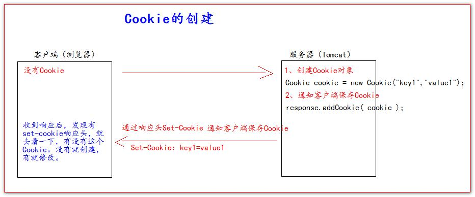

> CookieServlet.java程序中的代码:

```java
package github.servlet;

import javax.servlet.ServletException;
import javax.servlet.http.Cookie;
import javax.servlet.http.HttpServletRequest;
import javax.servlet.http.HttpServletResponse;
import java.io.IOException;

public class CookieServlet extends BaseServlet {

    protected void createCookie(HttpServletRequest req, HttpServletResponse resp) throws ServletException,IOException {
        // 1.创建Cookie对象
        Cookie cookie = new Cookie("key","value");
        // 2.通知客户端保存
        resp.addCookie(cookie);
        
        resp.getWriter().write("Cookie创建成功");
    }
}
```

> BaseServlet.java中的代码:

```java
package github.servlet;

import javax.servlet.ServletException;
import javax.servlet.http.HttpServlet;
import javax.servlet.http.HttpServletRequest;
import javax.servlet.http.HttpServletResponse;
import java.io.IOException;
import java.lang.reflect.Method;

public abstract class BaseServlet extends HttpServlet {

    @Override
    protected void doGet(HttpServletRequest req, HttpServletResponse resp) throws ServletException, IOException {
        doPost(req, resp);
    }

    protected void doPost(HttpServletRequest req, HttpServletResponse resp) throws ServletException, IOException {
        // 解决post请求中文乱码问题
        // 一定要在获取请求参数之前调用才有效
        req.setCharacterEncoding("UTF-8");
        // 解决响应中文乱码问题
        resp.setContentType("text/html; charset=UTF-8");

        String action = req.getParameter("action");
        try {
            // 获取action业务鉴别字符串，获取相应的业务 方法反射对象
            Method method = this.getClass().getDeclaredMethod(action, HttpServletRequest.class, HttpServletResponse.class);
//            System.out.println(method);
            // 调用目标业务 方法
            method.invoke(this, req, resp);
        } catch (Exception e) {
            e.printStackTrace();
        }
    }
}
```

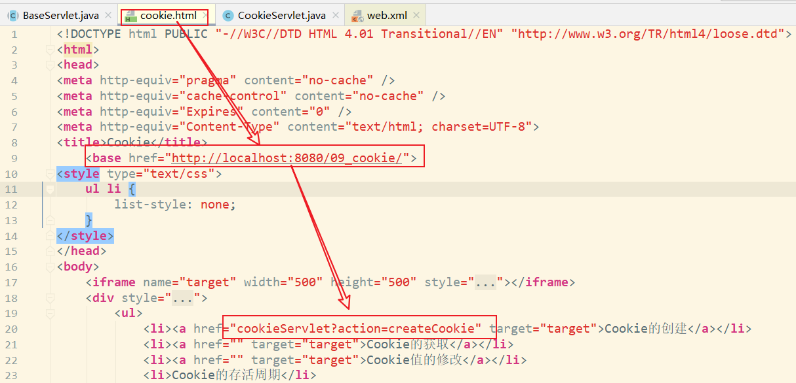

> web.xml配置文件:

```xml
<?xml version="1.0" encoding="UTF-8"?>
<web-app xmlns="http://xmlns.jcp.org/xml/ns/javaee"
         xmlns:xsi="http://www.w3.org/2001/XMLSchema-instance"
         xsi:schemaLocation="http://xmlns.jcp.org/xml/ns/javaee http://xmlns.jcp.org/xml/ns/javaee/web-app_4_0.xsd"
         version="4.0">
    
    <servlet>
        <servlet-name>CookieServlet</servlet-name>
        <servlet-class>github.servlet.CookieServlet</servlet-class>
    </servlet>
    <servlet-mapping>
        <servlet-name>CookieServlet</servlet-name>
        <url-pattern>/cookieServlet</url-pattern>
    </servlet-mapping>
</web-app>
```

> 运行结果:

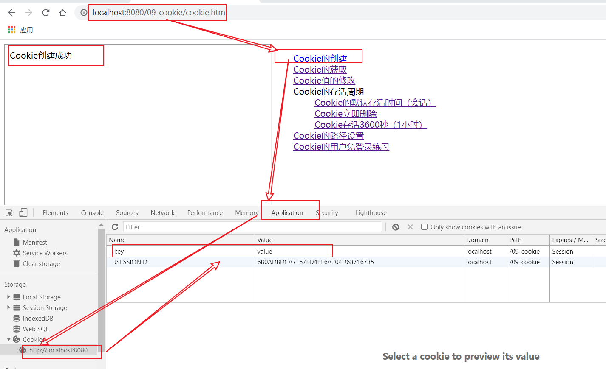

## 服务器如何获取Cookie

> 服务器获取客户端的Cookie只需要一行代码：req.getCookies():Cookie[]

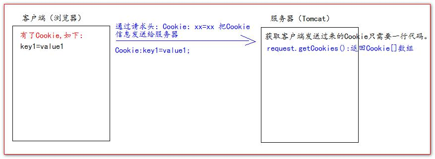

> Cookie的工具类: 

```java
import javax.servlet.http.Cookie;

public class CookieUtils {
    // 查找指定名称的Cookie对象
    public static Cookie findCookie(String name , Cookie[] cookies){
        if (name == null || cookies == null || cookies.length == 0) {
            return null;
        }

        for (Cookie cookie : cookies) {
            if (name.equals(cookie.getName())) {
                return cookie;
            }
        }

        return null;
    }

}
```

> Servlet程序中的代码:

```java
	protected void getCookie(HttpServletRequest req, HttpServletResponse resp) throws ServletException, IOException {

        Cookie[] cookies = req.getCookies();

        for (Cookie cookie : cookies) {
            // getName方法返回Cookie的key（名）
            // getValue方法返回Cookie的value值
            resp.getWriter().write("Cookie[" + cookie.getName() + "=" + cookie.getValue() + "] <br/>");
        }

        Cookie iWantCookie = CookieUtils.findCookie("key1", cookies);

//        for (Cookie cookie : cookies) {
//            if ("key2".equals(cookie.getName())) {
//                iWantCookie = cookie;
//                break;
//            }
//        }
        // 如果不等于null，说明赋过值，也就是找到了需要的Cookie
        if (iWantCookie != null) {
            resp.getWriter().write("找到了需要的Cookie");
        }

    }
```

> cookie.html文件

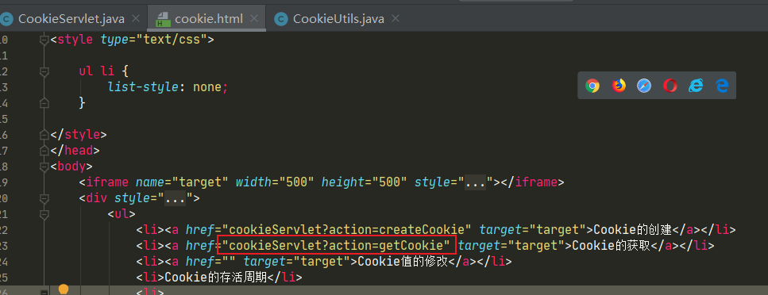

> 运行显示:

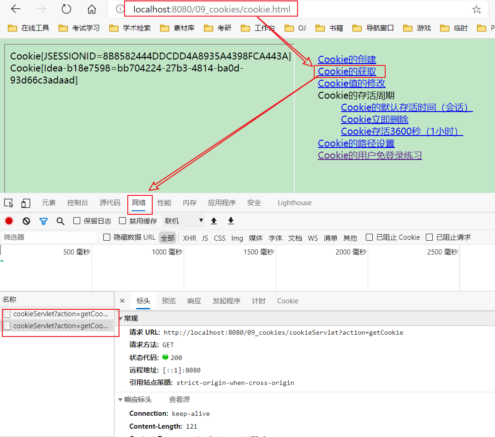

---

## Cookie值的修改

> 方案一：
>
> 1、先创建一个要修改的同名（指的就是key）的Cookie对象;
>
> 2、在构造器，同时赋于新的Cookie值;
>
> 3、调用response.addCookie(Cookie); 

```java
    protected void updateCookie(HttpServletRequest req, HttpServletResponse resp) throws ServletException, IOException {
//        方案一：
//        1、先创建一个要修改的同名的Cookie对象
//        2、在构造器，同时赋于新的Cookie值。
        Cookie cookie = new Cookie("key1","newValue1");
//        3、调用response.addCookie( Cookie ); 通知 客户端 保存修改
        resp.addCookie(cookie);

        resp.getWriter().write("key1的Cookie已经修改好");

    }
```

```html
			<li><a href="cookieServlet?action=updateCookie" target="target">Cookie值的修改</a></li>
```

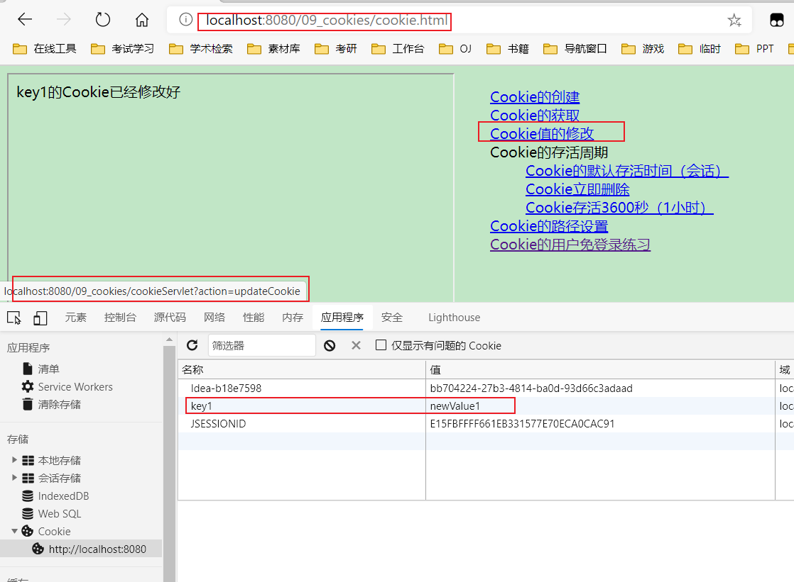

> 方案二：
>
> 1、先查找到需要修改的Cookie对象;
>
> 2、调用setValue()方法赋于新的Cookie值;
>
> 3、调用response.addCookie()通知客户端保存修改;

```java
    protected void updateCookie(HttpServletRequest req, HttpServletResponse resp) throws ServletException, IOException {
//        方案二：
//        1、先查找到需要修改的Cookie对象
        Cookie cookie = CookieUtils.findCookie("key2", req.getCookies());
        if (cookie != null) {
//        2、调用setValue()方法赋于新的Cookie值。
            cookie.setValue("newValue2");
//        3、调用response.addCookie()通知客户端保存修改
            resp.addCookie(cookie);
        }

        resp.getWriter().write("key的Cookie已经修改好");

    }
```

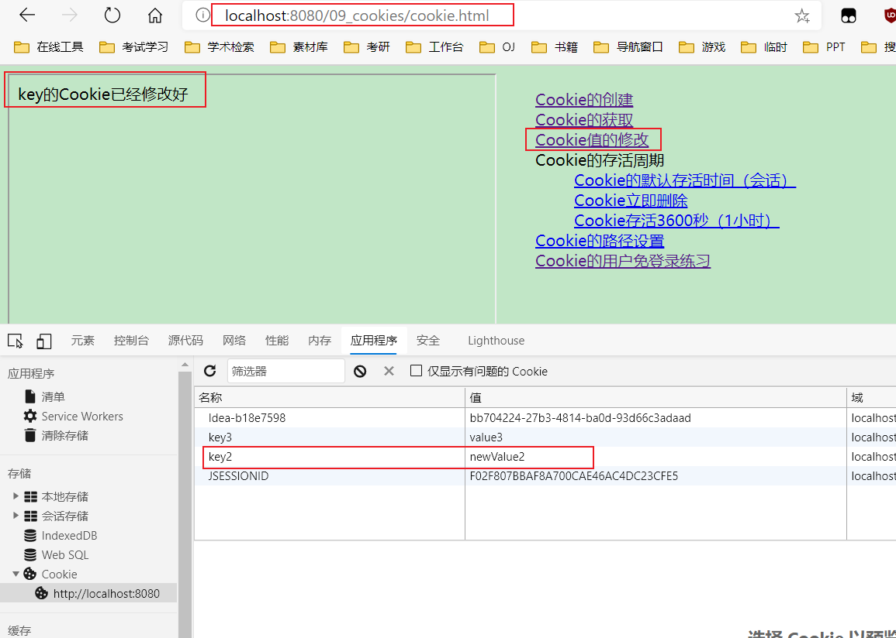

##  Cookie生命控制 

> Cookie的生命控制指的是如何管理Cookie什么时候被销毁（删除）。
>
> setMaxAge():
>
> ​	正数，表示在指定的秒数后过期;
>
> ​	负数，表示浏览器一关，Cookie就会被删除（默认值是-1）;
>
> ​	零，表示马上删除Cookie;

```java
    protected void defaultLife(HttpServletRequest req, HttpServletResponse resp) throws ServletException, IOException {
        Cookie cookie = new Cookie("defalutLife","defaultLife");
        cookie.setMaxAge(-1);//设置存活时间
        resp.addCookie(cookie);
    }
```

```html
<li><a href="cookieServlet?action=defaultLife" target="target">Cookie的默认存活时间（会话）</a></li>
```

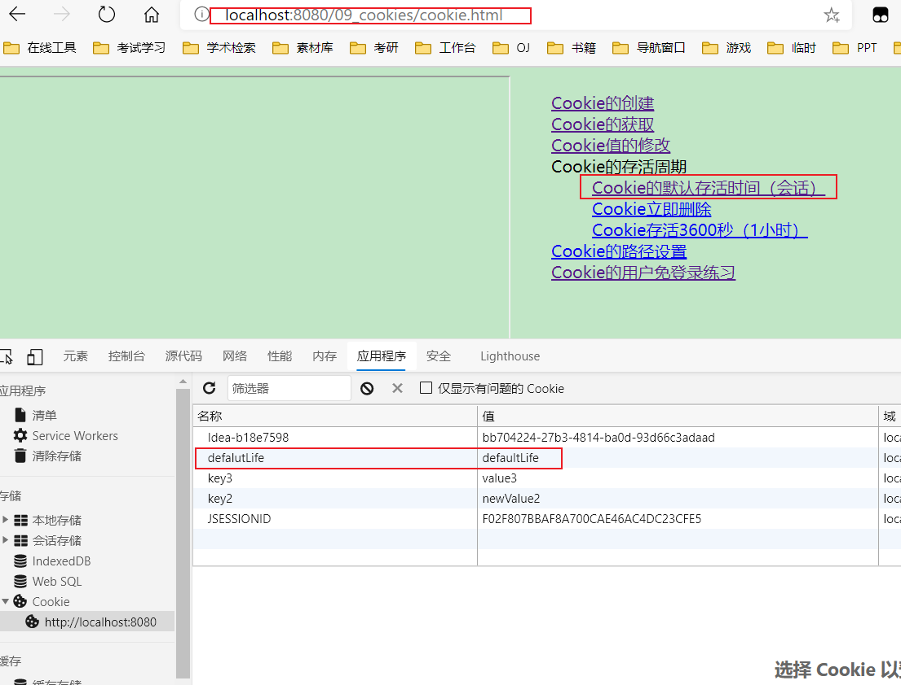

```java
    /**
     * 马上删除一个Cookie
     * @param req
     * @param resp
     * @throws ServletException
     * @throws IOException
     */
    protected void deleteNow(HttpServletRequest req, HttpServletResponse resp) throws ServletException, IOException {
        // 先找到你要删除的Cookie对象
        Cookie cookie = CookieUtils.findCookie("key3", req.getCookies());
        if (cookie != null) {
            // 调用setMaxAge(0);
            cookie.setMaxAge(0); // 表示马上删除，都不需要等待浏览器关闭
            // 调用response.addCookie(cookie);
            resp.addCookie(cookie);

            resp.getWriter().write("key3的Cookie已经被删除");
        }

    }

    /**
     * 设置存活1个小时的Cooie
     * @param req
     * @param resp
     * @throws ServletException
     * @throws IOException
     */
    protected void life3600(HttpServletRequest req, HttpServletResponse resp) throws ServletException, IOException {

        Cookie cookie = new Cookie("life3600", "life3600");
        cookie.setMaxAge(60 * 60); // 设置Cookie一小时之后被删除。无效
        resp.addCookie(cookie);
        resp.getWriter().write("已经创建了一个存活一小时的Cookie");

    }
```

```html
<li><a href="cookieServlet?action=deleteNow" target="target">Cookie立即删除</a></li>
<li><a href="cookieServlet?action=life3600" target="target">Cookie存活3600秒（1小时）</a></li>
```

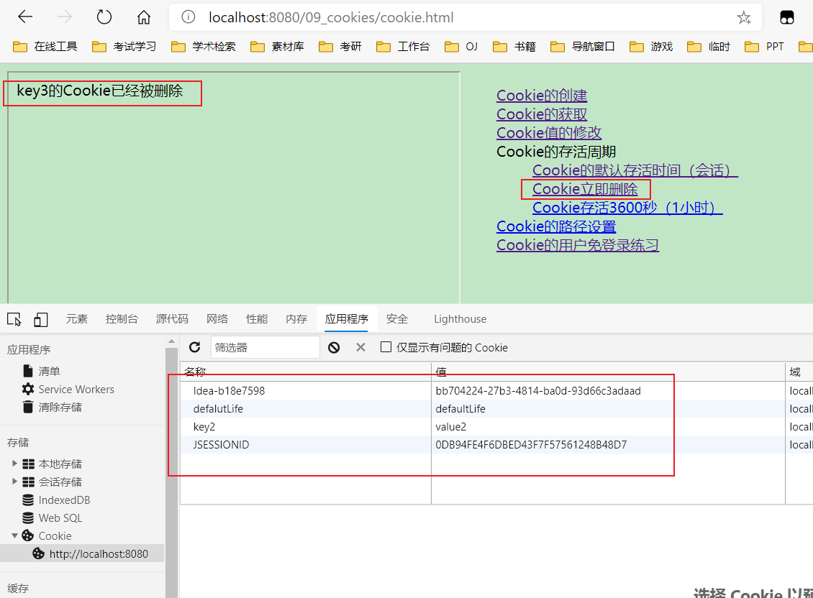

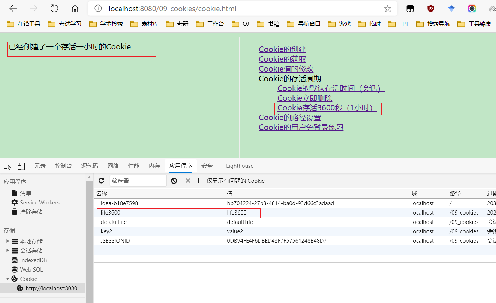

## Cookie有效路径Path的设置

> Cookie的path属性可以有效的过滤哪些Cookie可以发送给服务器。哪些不发。path属性是通过请求的地址来进行有效的过滤。 

```java
CookieA		path=/工程路径
CookieB		path=/工程路径/abc
    
请求地址如下：
    http://ip:port/工程路径/a.html
			CookieA发送
            CookieB不发送
                
    http://ip:port/工程路径/abc/a.html
			CookieA发送
            CookieB发送
```

```java
    protected void testPath(HttpServletRequest req, HttpServletResponse resp) throws ServletException, IOException {
        Cookie cookie = new Cookie("path", "path");
        // getContextPath() ===>>>>  得到工程路径
        cookie.setPath( req.getContextPath() + "/abc" ); // ===>>>>  /工程路径/abc
        resp.addCookie(cookie);
        resp.getWriter().write("创建了一个带有Path路径的Cookie");
    }
```

```html
<li><a href="cookieServlet?action=testPath" target="target">Cookie的路径设置</a></li>
```

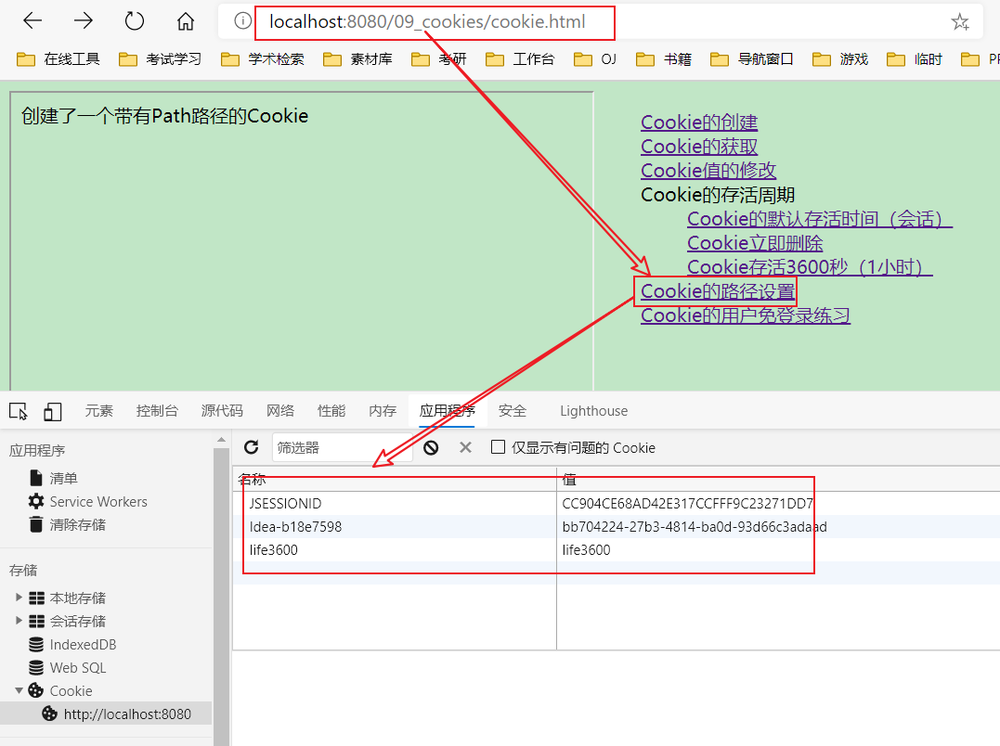

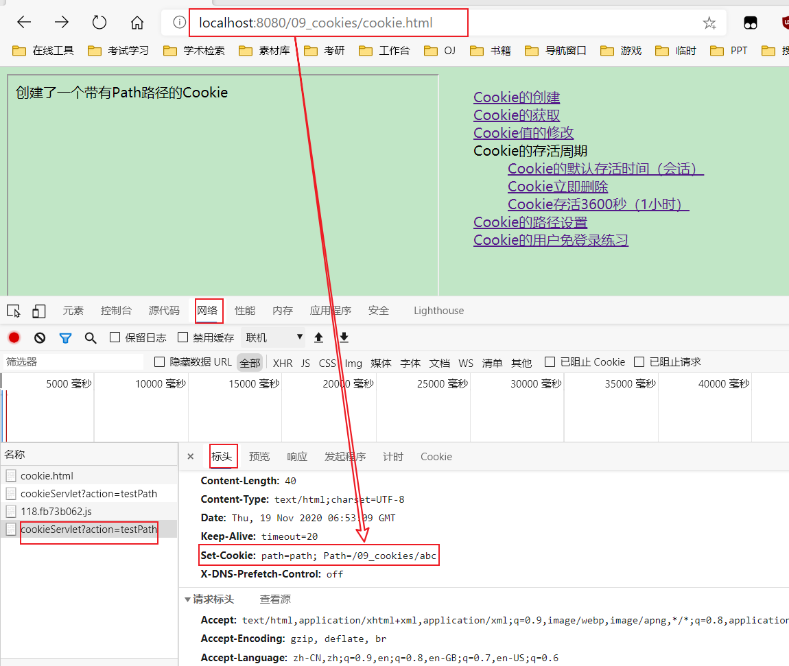

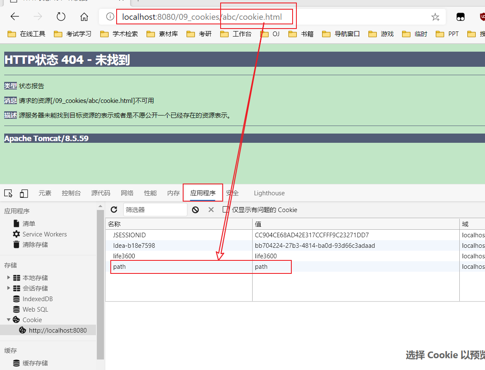

# Session会话 

## 什么是Session会话? 

> 1、Session就一个接口（HttpSession）。
>
> 2、Session就是会话。它是用来维护一个客户端和服务器之间关联的一种技术。
>
> 3、每个客户端都有自己的一个Session会话。
>
> 4、Session会话中，我们经常用来保存用户登录之后的信息。 

##  如何创建Session和获取(id号,是否为新) 

```java
如何创建和获取Session。它们的API是一样的。
request.getSession()
    第一次调用是：创建Session会话;
	之后调用都是：获取前面创建好的Session会话对象。
        
isNew();判断到底是不是刚创建出来的（新的）
        true	表示刚创建
        false	表示获取之前

创建每个会话都有一个身份证号。也就是ID值。而且这个ID是唯一的。
getId()得到Session的会话id值。
```

> 

```java
package com.github.servlet;

import javax.servlet.ServletException;
import javax.servlet.http.HttpServletRequest;
import javax.servlet.http.HttpServletResponse;
import javax.servlet.http.HttpSession;
import java.io.IOException;

public class SessionServlet extends BaseServlet {
    protected void createOrGetSession(HttpServletRequest req, HttpServletResponse resp) throws ServletException, IOException {
        // 创建和获取Session会话对象
        HttpSession session = req.getSession();
        // 判断当前Session会话，是否是新创建出来的
        boolean isNew = session.isNew();
        // 获取Session会话的唯一标识 id
        String id = session.getId();

        resp.getWriter().write("得到的Session，它的id是：" + id + " <br /> ");
        resp.getWriter().write("这个Session是否是新创建的：" + isNew + " <br /> ");
        
    }
}
```

```html
<li><a href="sessionServlet?action=createOrGetSession" target="target">Session的创建和获取（id号、是否为新创建）</a></li>
```

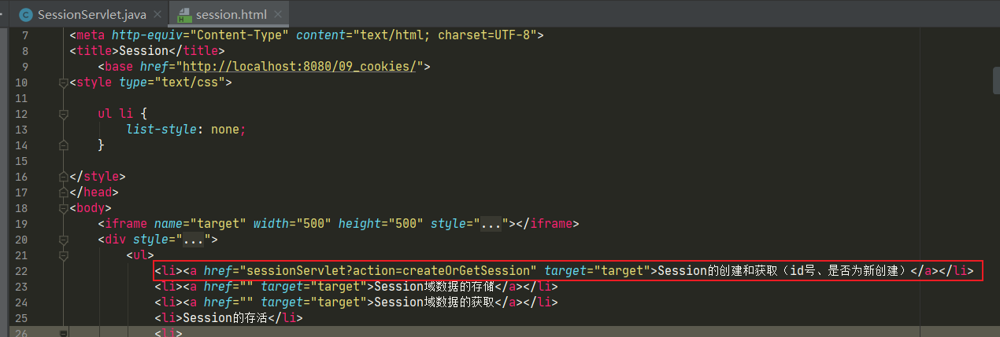

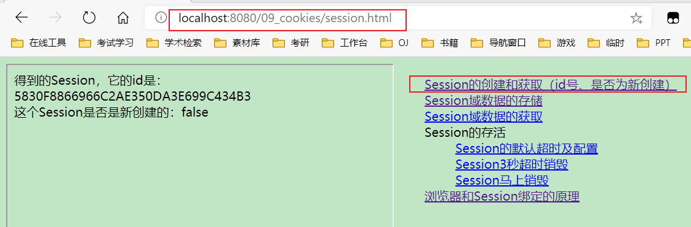

##  Session域数据的存取 

```java
    /**
     * 往Session中保存数据
     * @param req
     * @param resp
     * @throws ServletException
     * @throws IOException
     */
    protected void setAttribute(HttpServletRequest req, HttpServletResponse resp) throws ServletException, IOException {
        req.getSession().setAttribute("key1", "value1");
        resp.getWriter().write("已经往Session中保存了数据");

    }

    /**
     * 获取Session域中的数据
     * @param req
     * @param resp
     * @throws ServletException
     * @throws IOException
     */
    protected void getAttribute(HttpServletRequest req, HttpServletResponse resp) throws ServletException, IOException {
        Object attribute = req.getSession().getAttribute("key1");
        resp.getWriter().write("从Session中获取出key1的数据是：" + attribute);
    }
```

```html
<li><a href="sessionServlet?action=setAttribute" target="target">Session域数据的存储</a></li>
			<li><a href="sessionServlet?action=getAttribute" target="target">Session域数据的获取</a></li>
```

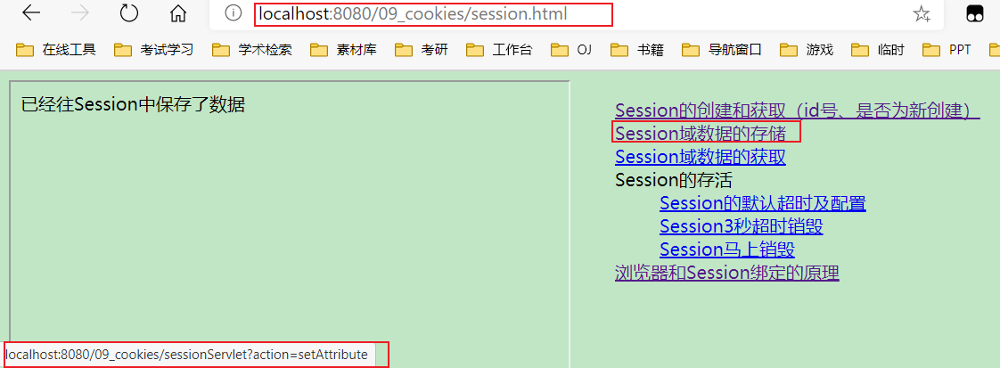

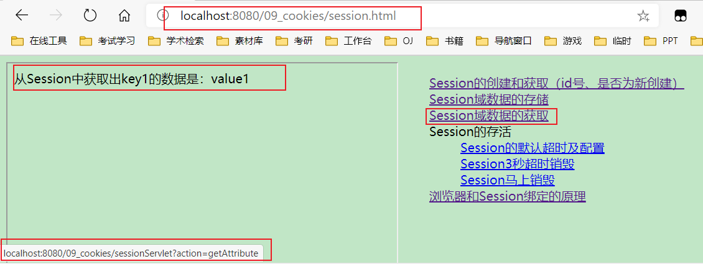

## Session生命周期控制 

> ```html
> public void setMaxInactiveInterval(int interval)
> 设置Session的超时时间（以秒为单位），超过指定的时长，Session就会被销毁。
> 值为正数的时候，设定Session的超时时长。
> 负数表示永不超时（极少使用）。
> 
> public int getMaxInactiveInterval()		获取Session的超时时间
> 
> public void invalidate()		让当前Session会话马上超时无效。
> 
> Session默认的超时时长是多少！
> Session默认的超时时间长为30分钟。
> 因为在Tomcat服务器的配置文件web.xml中默认有以下的配置，它就表示配置了当前Tomcat服务器下所有的Session超时配置默认时长为：30分钟。
> <session-config>
>     <session-timeout>30</session-timeout></session-config>
> ```

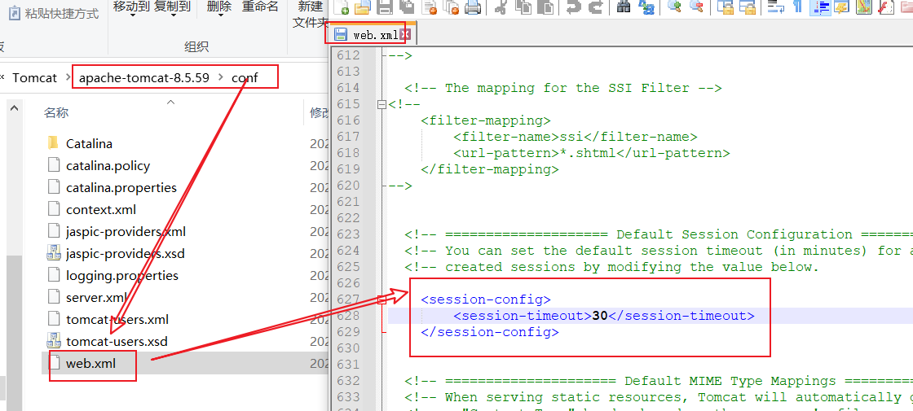

> 你希望你的web工程，默认的Session的超时时长为其他时长。你可以在你自己的web.xml配置文件中做以上相同的配置。就可以修改你的web工程所有Seession的默认超时时长。 

```xml
<!--表示当前web工程。创建出来的所有Session默认是20分钟超时时长-->
<session-config>
    <session-timeout>20</session-timeout></session-config>
```

```java
    protected void defaultLife(HttpServletRequest req, HttpServletResponse resp) throws ServletException, IOException {
        // 获取了Session的默认超时时长
        int maxInactiveInterval = req.getSession().getMaxInactiveInterval();

        resp.getWriter().write("Session的默认超时时长为：" + maxInactiveInterval + " 秒 ");

    }
```

```html
<li><a href="sessionServlet?action=defaultLife" target="target">Session的默认超时及配置</a></li>
```

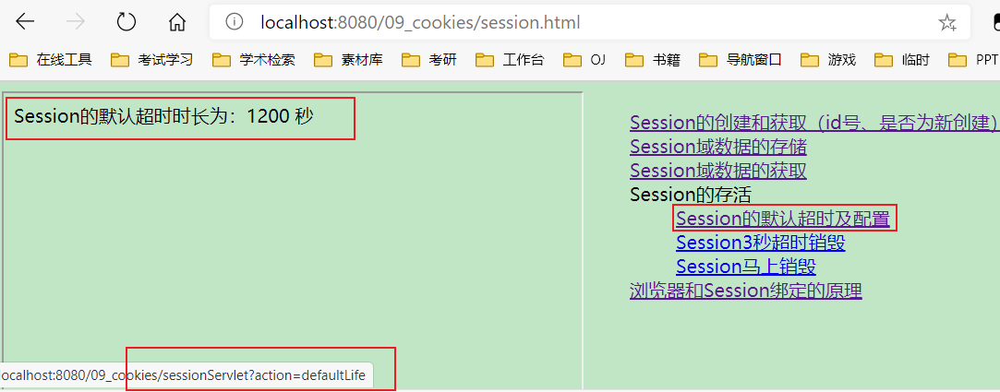

> 如果你想只修改个别Session的超时时长。就可以使用上面的API。setMaxInactiveInterval(intinterval)来进行单独的设置。
>
> session.setMaxInactiveInterval(intinterval)单独设置超时时长。 

> Session超时的介绍: 

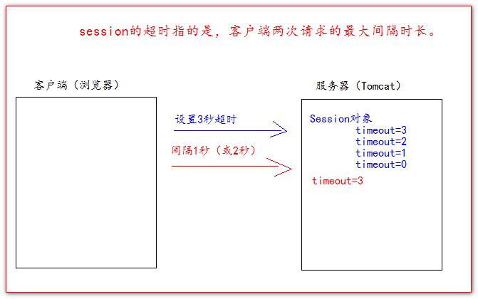

```java
    protected void life3(HttpServletRequest req, HttpServletResponse resp) throws ServletException, IOException {
        // 先获取Session对象
        HttpSession session = req.getSession();
        // 设置当前Session3秒后超时
        session.setMaxInactiveInterval(3);

        resp.getWriter().write("当前Session已经设置为3秒后超时");
    }

    protected void deleteNow(HttpServletRequest req, HttpServletResponse resp) throws ServletException, IOException {
        // 先获取Session对象
        HttpSession session = req.getSession();
        // 让Session会话马上超时
        session.invalidate();

        resp.getWriter().write("Session已经设置为超时（无效）");
    }
```

```html
<li><a href="sessionServlet?action=life3" target="target">Session3秒超时销毁</a></li>
					<li><a href="sessionServlet?action=deleteNow" target="target">Session马上销毁</a></li>
```

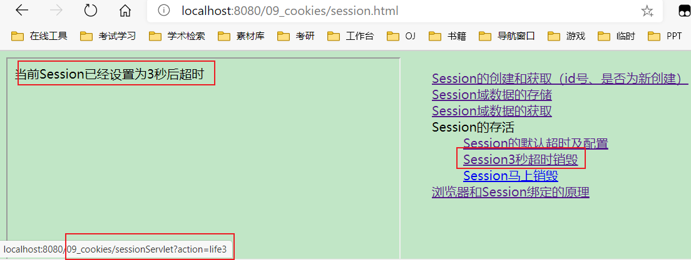

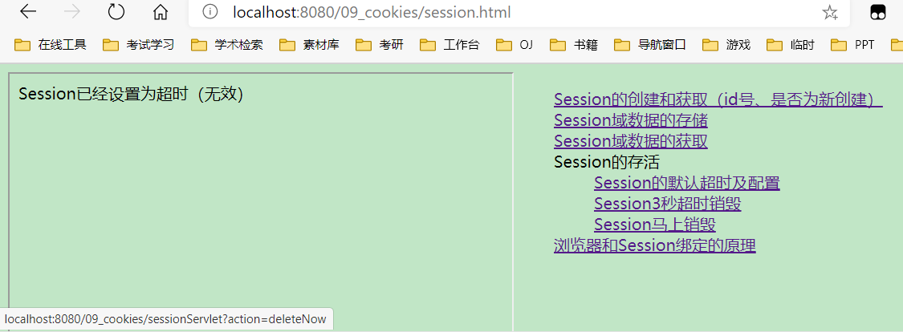

## 浏览器和Session之间关联的技术内幕 

> Session技术，底层其实是基于Cookie技术来实现的。 

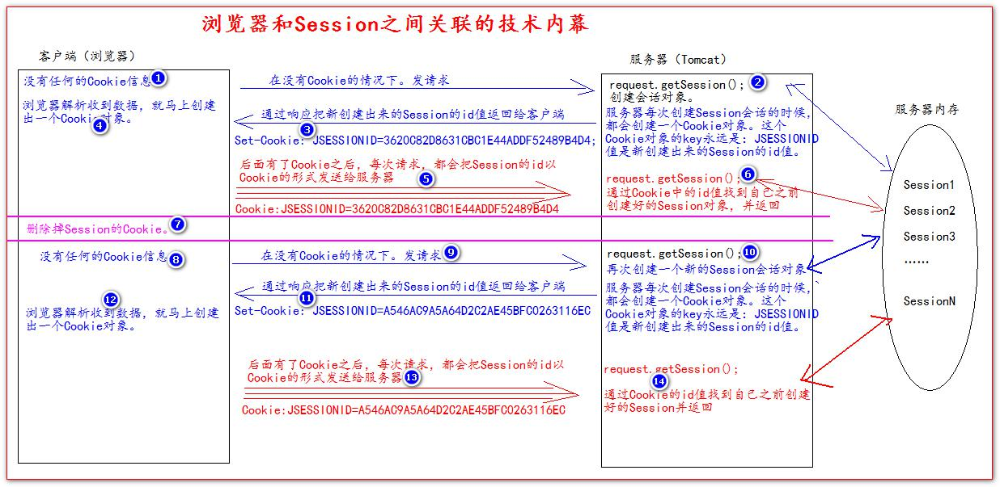

