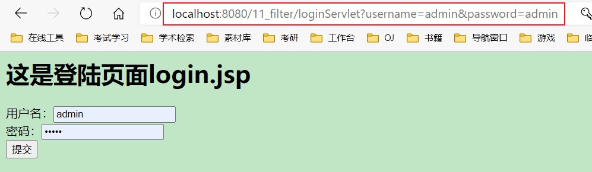

[TOC]

#  Filter过滤器 

##  Filter什么是过滤器 

> 1、Filter过滤器它是JavaWeb的三大组件之一。三大组件分别是：Servlet程序、Listener监听器、Filter过滤器;
>
> 2、Filter过滤器它是JavaEE的规范。也就是接口;
>
> 3、Filter过滤器它的作用是：拦截请求，过滤响应。 

```java
拦截请求常见的应用场景有：
    1、权限检查
    2、日记操作
    3、事务管理
    ......等等
```

## Filter的初体验 

> 要求：在你的web工程下，有一个admin目录。这个admin目录下的所有资源（html页面、jpg图片、jsp文件、等等）都必须是用户登录之后才允许访问。 


> 思考：根据之前我们学过内容。我们知道，用户登录之后都会把用户登录的信息保存到Session域中。所以要检查用户是否登录，可以判断Session中否包含有用户登录的信息即可！！！ 


> 这是a.jsp页面:

```jsp
<%@ page contentType="text/html;charset=UTF-8" language="java" %>
<html>
<head>
    <title>Title</title>
</head>
<body>
    <%
        Object user = session.getAttribute("user");
        // 如果为null,说明未登录
        if(user == null){
            request.getRequestDispatcher("/login.jsp").forward(request,response);
            return;
        }
    %>
    <h2>这是a.jsp页面</h2>
</body>
</html>
```

> 这是login.jsp页面:

```jsp
<%@ page contentType="text/html;charset=UTF-8" language="java" %>
<html>
<head>
    <title>Title</title>
</head>
<body>
    <h1>这是登陆页面login.jsp</h1>
</body>
</html>
```


---

> Filter的工作流程图: 


> Filter的代码:

```java
package com.github.filter;

import javax.servlet.*;
import javax.servlet.http.HttpServletRequest;
import javax.servlet.http.HttpSession;
import java.io.IOException;

/**
 * @author subei
 * @create 2020-11-19 22:46
 */
public class AdminFilter implements Filter {


    @Override
    public void init(FilterConfig filterConfig) throws ServletException {

    }

    /**
     * doFilter方法，专门用于拦截请求。可以做权限检查
     * @param servletRequest
     * @param servletResponse
     * @param filterChain
     * @throws IOException
     * @throws ServletException
     */
    @Override
    public void doFilter(ServletRequest servletRequest, ServletResponse servletResponse, FilterChain filterChain) throws IOException, ServletException {
        HttpServletRequest httpServletRequest = (HttpServletRequest)servletRequest;
        HttpSession session = httpServletRequest.getSession();
        Object user = session.getAttribute("user");
        //如果等于null，说明还没有登录
        if(user==null){
            servletRequest.getRequestDispatcher("/login.jsp").forward(servletRequest,servletResponse);
            return;
        }else{
            //让程序继续往下访问用户的目标资源
            filterChain.doFilter(servletRequest,servletResponse);
        }
    }

    @Override
    public void destroy() {

    }
}
```

> web.xml中的配置: 

```xml
<?xml version="1.0" encoding="UTF-8"?>
<web-app xmlns="http://xmlns.jcp.org/xml/ns/javaee"
         xmlns:xsi="http://www.w3.org/2001/XMLSchema-instance"
         xsi:schemaLocation="http://xmlns.jcp.org/xml/ns/javaee http://xmlns.jcp.org/xml/ns/javaee/web-app_4_0.xsd"
         version="4.0">

    <!--filter标签用于配置一个Filter过滤器-->
    <filter>
        <!--给filter起一个别名-->
        <filter-name>AdminFilter</filter-name>
        <!--配置filter的全类名-->
        <filter-class>com.github.filter.AdminFilter</filter-class>
    </filter>
    <!--filter-mapping配置Filter过滤器的拦截路径-->
    <filter-mapping>
        <!--filter-name表示当前的拦截路径给哪个filter使用-->
        <filter-name>AdminFilter</filter-name>
        <!--url-pattern配置拦截路径
        / 表示请求地址为：http://ip:port/工程路径/映射到IDEA的web目录
        /admin/* 表示请求地址为：http://ip:port/工程路径/admin/*      -->
        <url-pattern>/admin/*</url-pattern>
    </filter-mapping>

</web-app>
```


> Filter过滤器的使用步骤：
>
> 1、编写一个类去实现Filter接口;
>
> 2、实现过滤方法doFilter();
>
> 3、到web.xml中去配置Filter的拦截路径 

---

###  完整的用户登录 

> login.jsp页面==登录表单: 

```jsp
<%@ page contentType="text/html;charset=UTF-8" language="java" %>
<html>
<head>
    <title>Title</title>
</head>
<body>
    <h1>这是登陆页面login.jsp</h1>
    <form action="http://localhost:8080/11_filter/loginServlet"method="get">
        用户名：<input type="text"name="username"/><br>
        密码：<input type="password"name="password"/><br>
        <input type="submit"/>
    </form>
</body>
</html>
```

> LoginServlet程序: 

```java
package com.github.filter;

import javax.servlet.ServletException;
import javax.servlet.http.HttpServlet;
import javax.servlet.http.HttpServletRequest;
import javax.servlet.http.HttpServletResponse;
import java.io.IOException;

/**
 * @author subei
 * @create 2020-11-1922:57
 */
public class LoginServlet extends HttpServlet {
    @Override
    protected void doGet(HttpServletRequest req, HttpServletResponse resp) throws ServletException, IOException {
        resp.setContentType("text/html;charset=UTF-8");
        String username=req.getParameter("username");
        String password=req.getParameter("password");
        if("subei365".equals(username)&&"admin".equals(password)){
            req.getSession().setAttribute("user",username);
            resp.getWriter().write("登录成功！！！");
        }else{
            req.getRequestDispatcher("/login.jsp").forward(req,resp);
        }
    }
}
```

> web.xml页面:

```xml
	<servlet>
        <servlet-name>LoginServlet</servlet-name>
        <servlet-class>com.github.filter.LoginServlet</servlet-class>
    </servlet>
    <servlet-mapping>
        <servlet-name>LoginServlet</servlet-name>
        <url-pattern>/loginServlet</url-pattern>
    </servlet-mapping>
```




## Filter的生命周期 

> Filter的生命周期包含几个方法:
>
> 	1. 构造器方法
>  	2. init初始化方法
>       	1. 第1，2步，在web工程启动的时候执行（Filter已经创建）
>  	3. doFilter过滤方法
>       	1. 第3步，每次拦截到请求，就会执行
>  	4. destroy销毁
>       	1. 第4步，停止web工程的时候，就会执行（停止web工程，也会销毁Filter过滤器） 

```java
package com.github.filter;

import javax.servlet.*;
import javax.servlet.http.HttpServletRequest;
import javax.servlet.http.HttpSession;
import java.io.IOException;

/**
 * @author subei
 * @create 2020-11-1922:46
 */
public class AdminFilter implements Filter {

    public AdminFilter(){
        System.out.println("1.Filter构造器方法AdminFilter()");
    }

    @Override
    public void init(FilterConfig filterConfig) throws ServletException {
        System.out.println("2.Filter的init(FilterConfigfilterConfig)初始化");
    }

    /**
     * doFilter方法，专门用于拦截请求。可以做权限检查
     * @param servletRequest
     * @param servletResponse
     * @param filterChain
     * @throws IOException
     * @throws ServletException
     */
    @Override
    public void doFilter(ServletRequest servletRequest, ServletResponse servletResponse, FilterChain filterChain) throws IOException, ServletException {
        System.out.println("3.Filter的doFilter()过滤方法");

        HttpServletRequest httpServletRequest = (HttpServletRequest)servletRequest;
        HttpSession session = httpServletRequest.getSession();
        Object user = session.getAttribute("user");
        //如果等于null，说明还没有登录
        if(user==null){
            servletRequest.getRequestDispatcher("/login.jsp").forward(servletRequest,servletResponse);
            return;
        }else{
            //让程序继续往下访问用户的目标资源
            filterChain.doFilter(servletRequest,servletResponse);
        }
    }

    @Override
    public void destroy() {
        System.out.println("4、Filter的destory()销毁方法");
    }
}
```


## FilterConfig类 

> FilterConfig类见名知义，它是Filter过滤器的配置文件类。
>
> Tomcat每次创建Filter的时候，也会同时创建一个FilterConfig类，这里包含了Filter配置文件的配置信息。
>
> FilterConfig类的作用是获取filter过滤器的配置内容:
>
> 1、获取Filter的名称filter-name的内容;
>
> 2、获取在Filter中配置的init-param初始化参数;
>
> 3、获取ServletContext对象;

> java代码：

```java
    @Override
    public void init(FilterConfig filterConfig) throws ServletException {
        System.out.println("2.Filter的init(FilterConfigfilterConfig)初始化");

//        1.、获取Filter的名称filter-name的内容
        System.out.println("filter-name的值是："+filterConfig.getFilterName());
//        2、获取在web.xml中配置的init-param初始化参数
        System.out.println("初始化参数username的值是："+filterConfig.getInitParameter("username"));
        System.out.println("初始化参数url的值是："+filterConfig.getInitParameter("url"));
//        3、获取ServletContext对象
        System.out.println(filterConfig.getServletContext());
    }
```

> web.xml配置：

```xml
    <!--filter标签用于配置一个Filter过滤器-->
    <filter>
        <!--给filter起一个别名-->
        <filter-name>AdminFilter</filter-name>
        <!--配置filter的全类名-->
        <filter-class>com.github.filter.AdminFilter</filter-class>

        <init-param>
            <param-name>user</param-name>
            <param-value>root</param-value>
        </init-param>

        <init-param>
            <param-name>url</param-name>
            <param-value>jdbc:mysql://localhost3306/test</param-value>
        </init-param>
    </filter>
```


## FilterChain过滤器链 


> Filter1.java

```java
import javax.servlet.*;
import java.io.IOException;

public class Filter1 implements Filter {

    @Override
    public void init(FilterConfig filterConfig) throws ServletException {

    }

    @Override
    public void doFilter(ServletRequest servletRequest, ServletResponse servletResponse, FilterChain filterChain) throws IOException, ServletException {
        System.out.println("Filter1 前置代码");
        filterChain.doFilter(servletRequest, servletResponse);
        System.out.println("Filter1 后置代码");
    }

    @Override
    public void destroy() {

    }
}
```

> Filter2.java

```java
import javax.servlet.*;
import java.io.IOException;

public class Filter2 implements Filter {


    @Override
    public void init(FilterConfig filterConfig) throws ServletException {

    }

    @Override
    public void doFilter(ServletRequest servletRequest, ServletResponse servletResponse, FilterChain filterChain) throws IOException, ServletException {
        System.out.println("Filter2 前置代码");
        filterChain.doFilter(servletRequest, servletResponse);
        System.out.println("Filter2 后置代码");
    }

    @Override
    public void destroy() {

    }
}
```

> target.jsp页面：

```jsp
<%@ page contentType="text/html;charset=UTF-8" language="java" %>
<html>
<head>
    <title>Title</title>
</head>
<body>
    <%
        System.out.println("target.jsp页面执行情况");
    %>
</body>
</html>
```

> web.xml配置

```xml
   <filter>
        <filter-name>Filter1</filter-name>
        <filter-class>com.github.filter.Filter1</filter-class>
    </filter>
    <filter-mapping>
        <filter-name>Filter1</filter-name>
        <url-pattern>/target.jsp</url-pattern>
    </filter-mapping>

    <filter>
        <filter-name>Filter2</filter-name>
        <filter-class>com.github.filter.Filter2</filter-class>
    </filter>
    <filter-mapping>
        <filter-name>Filter2</filter-name>
        <url-pattern>/target.jsp</url-pattern>
    </filter-mapping>
```


## Filter的拦截路径  

- 精确匹配 


```xml
<url-pattern>/target.jsp</url-pattern>
以上配置的路径，表示请求地址必须为：http://ip:port/工程路径/target.jsp
```

- 目标匹配


```xml
<url-pattern>/admin/*</url-pattern>
以上配置的路径，表示请求地址必须为：http://ip:port/工程路径/admin/*
```

- 后缀名匹配


```xml
<url-pattern>*.html</url-pattern>
以上配置的路径，表示请求地址必须以.html结尾才会拦截到;

<url-pattern>*.do</url-pattern>
以上配置的路径，表示请求地址必须以.do结尾才会拦截到;

<url-pattern>*.action</url-pattern>
以上配置的路径，表示请求地址必须以.action结尾才会拦截到;
```

> Filter过滤器它只关心请求的地址是否匹配，不关心请求的资源是否存在！！！ 

# 书城第八阶段 

## 1.使用Filter过滤器拦截/pages/manager/所有内容，实现权限检查 

> Filter代码 

```java
import javax.servlet.*;
import javax.servlet.http.HttpServletRequest;
import java.io.IOException;

public class ManagerFilter implements Filter {
    @Override
    public void init(FilterConfig filterConfig) throws ServletException {

    }

    @Override
    public void doFilter(ServletRequest servletRequest, ServletResponse servletResponse, FilterChain filterChain) throws IOException, ServletException {
        HttpServletRequest httpServletRequest = (HttpServletRequest) servletRequest;

        Object user = httpServletRequest.getSession().getAttribute("user");

        if (user == null) {
            httpServletRequest.getRequestDispatcher("/pages/user/login.jsp").forward(servletRequest,servletResponse);
        } else {
            filterChain.doFilter(servletRequest,servletResponse);
        }
    }

    @Override
    public void destroy() {

    }
}
```

> web.xml中的配置:

```xml
    <filter>
        <filter-name>ManagerFilter</filter-name>
        <filter-class>com.github.filter.ManagerFilter</filter-class>
    </filter>
    <filter-mapping>
        <filter-name>ManagerFilter</filter-name>
        <url-pattern>/pages/manager/*</url-pattern>
        <url-pattern>/manager/bookServlet</url-pattern>
    </filter-mapping>
```


##  2.ThreadLocal的使用 

> ThreadLocal的作用，它可以解决多线程的数据安全问题。
>
> ThreadLocal它可以给当前线程关联一个数据（可以是普通变量，可以是对象，也可以是数组，集合）。
>
> ThreadLocal的特点：
>
> 1、ThreadLocal可以为当前线程关联一个数据。（它可以像Map一样存取数据，key为当前线程）
>
> 2、每一个ThreadLocal对象，只能为当前线程关联一个数据，如果要为当前线程关联多个数据，就需要使用多个ThreadLocal对象实例。
>
> 3、每个ThreadLocal对象实例定义的时候，一般都是static类型
>
> 4、ThreadLocal中保存数据，在线程销毁后。会由JVM虚拟自动释放。 

> 测试类——OrderDao.java:

```java
public class OrderDao {

    public void saveOrder(){
        String name = Thread.currentThread().getName();
        System.out.println("OrderDao 当前线程[" + name + "]中保存的数据是：" + ThreadLocalTest.threadLocal.get());
    }

}
```

> 测试类——OrderService.java:

```java
public class OrderService {

    public void createOrder(){
        String name = Thread.currentThread().getName();
        System.out.println("OrderService 当前线程[" + name + "]中保存的数据是：" + ThreadLocalTest.threadLocal.get());
        new OrderDao().saveOrder();
    }

}
```

> 测试类:

```java
import java.util.Random;

public class ThreadLocalTest {

//    public static Map<String,Object> data = new Hashtable<String,Object>();
    public static ThreadLocal<Object> threadLocal = new ThreadLocal<Object>();
    private static Random random = new Random();

    public static class Task implements Runnable {
        @Override
        public void run() {

            // 在Run方法中，随机生成一个变量（线程要关联的数据），然后以当前线程名为key保存到map中
            Integer i = random.nextInt(1000);
            // 获取当前线程名
            String name = Thread.currentThread().getName();
            System.out.println("线程["+name+"]生成的随机数是：" + i);
//            data.put(name,i);
            threadLocal.set(i);

            try {
                Thread.sleep(3000);
            } catch (InterruptedException e) {
                e.printStackTrace();
            }
            new OrderService().createOrder();
            // 在Run方法结束之前，以当前线程名获取出数据并打印。查看是否可以取出操作
//            Object o = data.get(name);
            Object o = threadLocal.get();
            System.out.println("在线程["+name+"]快结束时取出关联的数据是：" + o);

        }
    }

    public static void main(String[] args) {
        for (int i = 0; i < 3; i++){
            new Thread(new Task()).start();
        }

    }

}
```


## 3.使用Filter和ThreadLocal组合管理事务 

> 使用ThreadLocal来确保所有dao操作都在同一个Connection连接对象中完成。


> JdbcUtils 工具类的修改:

```java
package com.github.util;

import com.alibaba.druid.pool.DruidDataSource;
import com.alibaba.druid.pool.DruidDataSourceFactory;

import java.io.InputStream;
import java.sql.Connection;
import java.sql.SQLException;
import java.util.Properties;

public class JdbcUtils {

    private static DruidDataSource dataSource;
    private static ThreadLocal<Connection> conns = new ThreadLocal<Connection>();

    static {
        try {
            Properties properties = new Properties();
            // 读取 jdbc.properties属性配置文件
            InputStream inputStream = JdbcUtils.class.getClassLoader().getResourceAsStream("jdbc.properties");
            // 从流中加载数据
            properties.load(inputStream);
            // 创建 数据库连接 池
            dataSource = (DruidDataSource) DruidDataSourceFactory.createDataSource(properties);

        } catch (Exception e) {
            e.printStackTrace();
        }

    }

    /**
     * 获取数据库连接池中的连接
     * @return 如果返回null,说明获取连接失败<br/>有值就是获取连接成功
     */
    public static Connection getConnection(){
        Connection conn = conns.get();
        if (conn == null) {
            try {
                conn = dataSource.getConnection();//从数据库连接池中获取连接
                conns.set(conn); // 保存到ThreadLocal对象中，供后面的jdbc操作使用
                conn.setAutoCommit(false); // 设置为手动管理事务
            } catch (SQLException e) {
                e.printStackTrace();
            }
        }
        return conn;
    }

    /**
     * 提交事务，并关闭释放连接
     */
    public static void commitAndClose(){
        Connection connection = conns.get();
        if (connection != null) { // 如果不等于null，说明 之前使用过连接，操作过数据库
            try {
                connection.commit(); // 提交 事务
            } catch (SQLException e) {
                e.printStackTrace();
            } finally {
                try {
                    connection.close(); // 关闭连接，资源资源
                } catch (SQLException e) {
                    e.printStackTrace();
                }
            }
        }
        // 一定要执行remove操作，否则就会出错。（因为Tomcat服务器底层使用了线程池技术）
        conns.remove();
    }

    /**
     * 回滚事务，并关闭释放连接
     */
    public static void rollbackAndClose(){
        Connection connection = conns.get();
        if (connection != null) { // 如果不等于null，说明 之前使用过连接，操作过数据库
            try {
                connection.rollback();//回滚事务
            } catch (SQLException e) {
                e.printStackTrace();
            } finally {
                try {
                    connection.close(); // 关闭连接，资源资源
                } catch (SQLException e) {
                    e.printStackTrace();
                }
            }
        }
        // 一定要执行remove操作，否则就会出错。（因为Tomcat服务器底层使用了线程池技术）
        conns.remove();
    }


    /**
     * 关闭连接，放回数据库连接池
     * @param conn

    public static void close(Connection conn){
    if (conn != null) {
    try {
    conn.close();
    } catch (SQLException e) {
    e.printStackTrace();
    }
    }
    } */
    
}
```

> 修改BaseDao:

```java
package com.github.dao.impl;

import com.github.util.JdbcUtils;
import org.apache.commons.dbutils.QueryRunner;
import org.apache.commons.dbutils.handlers.BeanHandler;
import org.apache.commons.dbutils.handlers.BeanListHandler;
import org.apache.commons.dbutils.handlers.ScalarHandler;

import java.sql.Connection;
import java.sql.SQLException;
import java.util.List;

public abstract class BaseDao {

    //使用DbUtils操作数据库
    private QueryRunner queryRunner = new QueryRunner();

    /**
     * update() 方法用来执行：Insert\Update\Delete语句
     *
     * @return 如果返回-1,说明执行失败<br/>返回其他表示影响的行数
     */
    public int update(String sql, Object... args) {

        System.out.println(" BaseDao 程序在[" +Thread.currentThread().getName() + "]中");

        Connection connection = JdbcUtils.getConnection();
        try {
            return queryRunner.update(connection, sql, args);
        } catch (SQLException e) {
            e.printStackTrace();
            throw new RuntimeException(e);
        }
    }

    /**
     * 查询返回一个javaBean的sql语句
     *
     * @param type 返回的对象类型
     * @param sql  执行的sql语句
     * @param args sql对应的参数值
     * @param <T>  返回的类型的泛型
     * @return
     */
    public <T> T queryForOne(Class<T> type, String sql, Object... args) {
        Connection con = JdbcUtils.getConnection();
        try {
            return queryRunner.query(con, sql, new BeanHandler<T>(type), args);
        } catch (SQLException e) {
            e.printStackTrace();
            throw new RuntimeException(e);
        }
    }

    /**
     * 查询返回多个javaBean的sql语句
     *
     * @param type 返回的对象类型
     * @param sql  执行的sql语句
     * @param args sql对应的参数值
     * @param <T>  返回的类型的泛型
     * @return
     */
    public <T> List<T> queryForList(Class<T> type, String sql, Object... args) {
        Connection con = JdbcUtils.getConnection();
        try {
            return queryRunner.query(con, sql, new BeanListHandler<T>(type), args);
        } catch (SQLException e) {
            e.printStackTrace();
            throw new RuntimeException(e);
        }
    }

    /**
     * 执行返回一行一列的sql语句
     * @param sql   执行的sql语句
     * @param args  sql对应的参数值
     * @return
     */
    public Object queryForSingleValue(String sql, Object... args){

        Connection conn = JdbcUtils.getConnection();

        try {
            return queryRunner.query(conn, sql, new ScalarHandler(), args);
        } catch (SQLException e) {
            e.printStackTrace();
            throw new RuntimeException(e);
        }

    }

}
```


> 使用Filter过滤器统一给所有的Service方法都加上try-catch。来进行实现的管理。 


> Filter 类代码:

```java

```

> 在web.xml中的配置:

```xml

```

> 将BaseServlet中的异常抛给Filter过滤器:

```java

```


> 将所有异常都统一交给Tomcat，让Tomcat展示友好的错误信息页面。


