[TOC]

#  JSON、AJAX、i18n 

## 1.什么是JSON? 

> JSON(JavaScriptObjectNotation)是一种轻量级的数据交换格式。易于人阅读和编写。同时也易于机器解析和生成。JSON采用完全独立于语言的文本格式，而且很多语言都提供了对json的支持（包括C,C++,C#,Java,JavaScript,Perl,Python等）。这样就使得JSON成为理想的数据交换格式。 

> json是一种轻量级的数据交换格式。轻量级指的是跟xml做比较。 

> 数据交换指的是客户端和服务器之间业务数据的传递格式。

### 1.1 JSON在JavaScript中的使用

> json是由键值对组成，并且由花括号（大括号）包围。每个键由引号引起来，键和值之间使用冒号进行分隔，多组键值对之间进行逗号进行分隔。 

```html
<!DOCTYPE html PUBLIC "-//W3C//DTD HTML 4.01 Transitional//EN" "http://www.w3.org/TR/html4/loose.dtd">
<html>
	<head>
		<meta http-equiv="pragma" content="no-cache" />
		<meta http-equiv="cache-control" content="no-cache" />
		<meta http-equiv="Expires" content="0" />
		<meta http-equiv="Content-Type" content="text/html; charset=UTF-8">
		<title>Insert title here</title>
		<script type="text/javascript">
			// json的定义
			var jsonObj = {
				"key1":12,
				"key2":"adobe",
				"key3":true,
				"key4":[11,"arr",false],
				"key5":{
					"key5_1" : 9527,
					"key5_2" : "key5_2_va"
				},
				"key6":[{
					"key_6_1":"6527",
					"key_6_2":"key_6_2_va"
				},{
					"key_6_1":"6527",
					"key_6_2":"key_6_2_va"
				},{
					"key_6_1":"6527",
					"key_6_2":"key_6_2_va"
				}]
			}

			// json的访问
			// json对象转字符串
			// json字符串转json对象
		</script>
	</head>
	<body>
		
	</body>
</html>
```

> json的访问:

```jsp
json本身是一个对象。
json中的key我们可以理解为是对象中的一个属性。
json中的key访问就跟访问对象的属性一样：json对象.key
```

> 示例:

```html
<!DOCTYPE html PUBLIC "-//W3C//DTD HTML 4.01 Transitional//EN" "http://www.w3.org/TR/html4/loose.dtd">
<html>
	<head>
		<meta http-equiv="pragma" content="no-cache" />
		<meta http-equiv="cache-control" content="no-cache" />
		<meta http-equiv="Expires" content="0" />
		<meta http-equiv="Content-Type" content="text/html; charset=UTF-8">
		<title>Insert title here</title>
		<script type="text/javascript">
			// json的定义
			var jsonObj = {
				"key1":12,
				"key2":"adobe",
				"key3":true,
				"key4":[11,"arr",false],
				"key5":{
					"key5_1" : 9527,
					"key5_2" : "key5_2_va"
				},
				"key6":[{
					"key_6_1":"6527",
					"key_6_2":"key_6_2_va"
				},{
					"key_6_1":"6527",
					"key_6_2":"key_6_2_va"
				},{
					"key_6_1":"6527",
					"key_6_2":"key_6_2_va"
				}]
			};
			// json的访问
			alert(typeof(jsonObj));	// object json就是一个对象
			alert(typeof(jsonObj.key1)); // 12
			alert(typeof(jsonObj.key2)); // adobe
			alert(typeof(jsonObj.key3)); // true
			alert(jsonObj.key4); //得到数组[11,"arr",false]
			// json中数组值的遍历
			for(var i=0;i<jsonObj.key4.length;i++){
				alert(jsonObj.key4[i]);
			}
			alert(typeof(jsonObj.key5));
			alert(jsonObj.key5.key5_1); // 9527
			alert(jsonObj.key5.key5_2); // key5_2_va
			alert(jsonObj.key6); // 得到json数组
			// 取出来每一个元素都是json对象
			var jsonItem = jsonObj.key6[0];
			// alert(jsonItem.key6_1_1); // 6527
			alert(jsonItem.key6_1_2); // key_6_2_va
			// json对象转字符串
			// json字符串转json对象
		</script>
	</head>
	<body>
		
	</body>
</html>
```

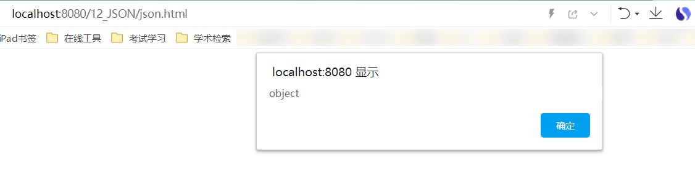

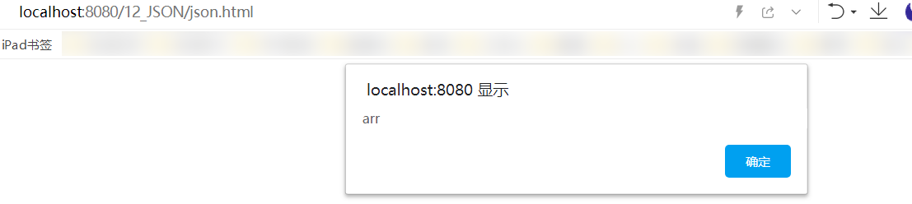

> json的两个常用方法:

```html
json的存在有两种形式。
	一种是：对象的形式存在，我们叫它json对象。
	一种是：字符串的形式存在，我们叫它json字符串。
一般我们要操作json中的数据的时候，需要json对象的格式。
一般我们要在客户端和服务器之间进行数据交换的时候，使用json字符串。
	JSON.stringify()把json对象转换成为json字符串.
	JSON.parse()把json字符串转换成为json对象.
```

> 示例代码：

```html
			// json对象转字符串
			var jsonObjString=JSON.stringify(jsonObj); // 特别像Java中对象的toString
			alert(jsonObjString)
			// json字符串转json对象
			var jsonObj2=JSON.parse(jsonObjString);
			alert(jsonObj2.key1); // 12
			alert(jsonObj2.key2); // adobe
```

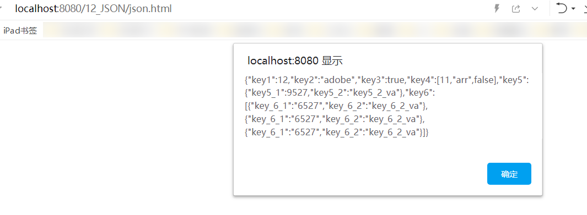

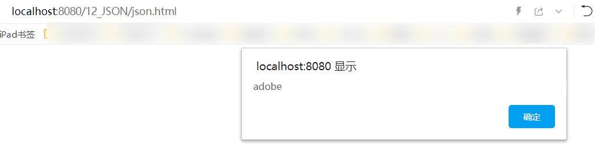

### 1.2 JSON在java中的使用 

> 导入jar包，下载地址:https://www.yuque.com/nizhegechouloudetuboshu/library/defyyo

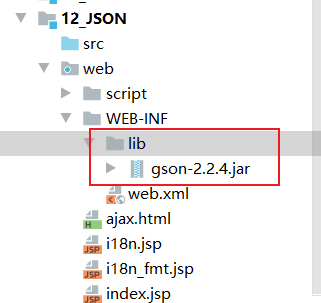

> javaBean和json的互转:
>
> Person.java类

```java
public class Person {
    private Integer id;
    private String name;

    public Integer getId() {
        return id;
    }

    public void setId(Integer id) {
        this.id = id;
    }

    public String getName() {
        return name;
    }

    public void setName(String name) {
        this.name = name;
    }

    public Person() {
    }

    public Person(Integer id, String name) {
        this.id = id;
        this.name = name;
    }

    @Override
    public String toString() {
        return "Person{" +
                "id=" + id +
                ", name='" + name + '\'' +
                '}';
    }
}
```

> 测试类:

```java
package com.github.json;

import com.github.pojo.Person;
import com.google.gson.Gson;
import org.junit.Test;

public class JsonTest {

    // javaBean和json的互转
    @Test
    public void test1(){
        Person person = new Person(1,"哇哈哈好喝!");
        // 创建Gson对象实例
        Gson gson = new Gson();
        // toJson方法可以把java对象转换成为json字符串
        String personJsonString = gson.toJson(person);
        System.out.println(personJsonString);
        // fromJson把json字符串转换回Java对象
        // 第一个参数是json字符串
        // 第二个参数是转换回去的Java对象类型
        Person person1 = gson.fromJson(personJsonString, Person.class);
        System.out.println(person1);
    }
}
```

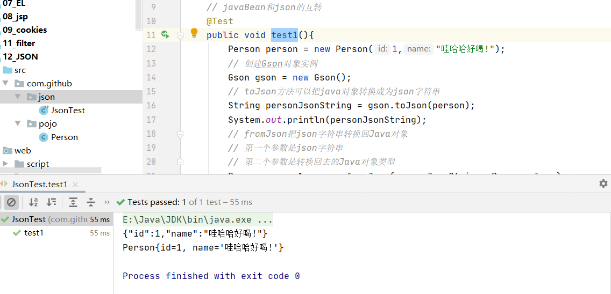

> List和json的互转:
>
> PersonListType.java

```java
import com.github.pojo.Person;
import com.google.gson.reflect.TypeToken;

import java.util.ArrayList;

public class PersonListType extends TypeToken<ArrayList<Person>> {
}
```

>测试类:

```java
    // List 和json的互转
    @Test
    public void test2() {
        List<Person> personList = new ArrayList<>();

        personList.add(new Person(1, "喜之郎"));
        personList.add(new Person(2, "哇哈哈"));

        Gson gson = new Gson();

        // 把List转换为json字符串
        String personListJsonString = gson.toJson(personList);
        System.out.println(personListJsonString);

        List<Person> list = gson.fromJson(personListJsonString, new PersonListType().getType());
        System.out.println(list);
        Person person = list.get(0);
        System.out.println(person);
    }
```

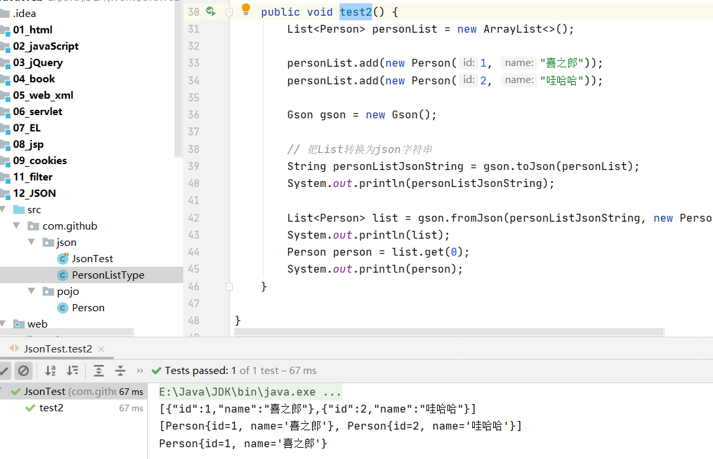

> map和json的互转:
>
> PersonMapType.java

```java
import com.github.pojo.Person;
import com.google.gson.reflect.TypeToken;

import java.util.HashMap;

public class PersonMapType extends TypeToken<HashMap<Integer, Person>> {
}
```

> 测试类:

```java
    // map 和json的互转
    @Test
    public void test3(){
        Map<Integer,Person> personMap = new HashMap<>();

        personMap.put(1, new Person(1, "植物"));
        personMap.put(2, new Person(2, "大战僵尸"));

        Gson gson = new Gson();
        // 把 map 集合转换成为 json字符串
        String personMapJsonString = gson.toJson(personMap);
        System.out.println(personMapJsonString);

//        Map<Integer,Person> personMap2 = gson.fromJson(personMapJsonString, new PersonMapType().getType());
        Map<Integer,Person> personMap2 = gson.fromJson(personMapJsonString, new TypeToken<HashMap<Integer,Person>>(){}.getType());

        System.out.println(personMap2);
        Person p = personMap2.get(1);
        System.out.println(p);
    }
```

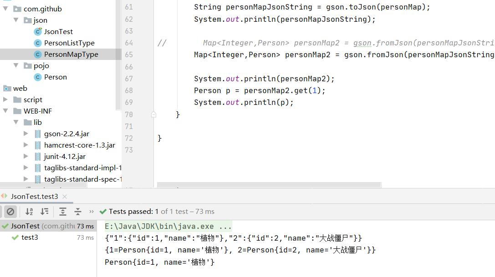

## 2.AJAX请求

> AJAX即“Asynchronous Javascript And XML”（异步JavaScript和XML），是指一种创建交互式网页应用的网页开发技术。
>
> ajax是一种浏览器通过js异步发起请求，局部更新页面的技术。
>
> Ajax请求的局部更新，浏览器地址栏不会发生变化.
>
> 局部更新不会舍弃原来页面的内容.

> 原生AJAX请求的示例:
>
> BaseServlet.java

```html
import javax.servlet.ServletException;
import javax.servlet.http.HttpServlet;
import javax.servlet.http.HttpServletRequest;
import javax.servlet.http.HttpServletResponse;
import java.io.IOException;
import java.lang.reflect.Method;

public abstract class BaseServlet extends HttpServlet {

    @Override
    protected void doGet(HttpServletRequest req, HttpServletResponse resp) throws ServletException, IOException {
        doPost(req, resp);
    }

    protected void doPost(HttpServletRequest req, HttpServletResponse resp) throws ServletException, IOException {
        // 解决post请求中文乱码问题
        // 一定要在获取请求参数之前调用才有效
        req.setCharacterEncoding("UTF-8");
        // 解决响应中文乱码
        resp.setContentType("text/html; charset=UTF-8");
        String action = req.getParameter("action");
        try {
            // 获取action业务鉴别字符串，获取相应的业务 方法反射对象
            Method method = this.getClass().getDeclaredMethod(action, HttpServletRequest.class, HttpServletResponse.class);
//            System.out.println(method);
            // 调用目标业务 方法
            method.invoke(this, req, resp);
        } catch (Exception e) {
            e.printStackTrace();
            throw new RuntimeException(e);// 把异常抛给Filter过滤器
        }
    }
}
```

> AjaxServlet.java

```java
import com.github.pojo.Person;
import com.google.gson.Gson;

import javax.servlet.ServletException;
import javax.servlet.http.HttpServletRequest;
import javax.servlet.http.HttpServletResponse;
import java.io.IOException;

public class AjaxServlet extends BaseServlet {

    protected void javaScriptAjax(HttpServletRequest req, HttpServletResponse resp) throws ServletException, IOException {
        System.out.println("Ajax请求过来了");
        Person person = new Person(1, "哇哈哈");
        try {
            Thread.sleep(3000);
        } catch (InterruptedException e) {
            e.printStackTrace();
        }
        // json格式的字符串
        Gson gson = new Gson();
        String personJsonString = gson.toJson(person);

        resp.getWriter().write(personJsonString);
    }
}
```

> web.xml

```xml
<?xml version="1.0" encoding="UTF-8"?>
<web-app xmlns="http://xmlns.jcp.org/xml/ns/javaee"
         xmlns:xsi="http://www.w3.org/2001/XMLSchema-instance"
         xsi:schemaLocation="http://xmlns.jcp.org/xml/ns/javaee http://xmlns.jcp.org/xml/ns/javaee/web-app_4_0.xsd"
         version="4.0">
    <servlet>
        <servlet-name>AjaxServlet</servlet-name>
        <servlet-class>com.github.servlet.AjaxServlet</servlet-class>
    </servlet>
    <servlet-mapping>
        <servlet-name>AjaxServlet</servlet-name>
        <url-pattern>/ajaxServlet</url-pattern>
    </servlet-mapping>
</web-app>
```

> ajax.html

```html
<!DOCTYPE html PUBLIC "-//W3C//DTD HTML 4.01 Transitional//EN" "http://www.w3.org/TR/html4/loose.dtd">
<html>
	<head>
		<meta http-equiv="pragma" content="no-cache" />
		<meta http-equiv="cache-control" content="no-cache" />
		<meta http-equiv="Expires" content="0" />
		<meta http-equiv="Content-Type" content="text/html; charset=UTF-8">
		<title>Insert title here</title>
		<script type="text/javascript">
			// 在这里使用javaScript语言发起Ajax请求，访问服务器AjaxServlet中javaScriptAjax
			function ajaxRequest() {
// 				1、我们首先要创建XMLHttpRequest
				var xmlhttprequest = new XMLHttpRequest();
// 				2、调用open方法设置请求参数
				xmlhttprequest.open("GET","http://localhost:8080/12_JSON/ajaxServlet?action=javaScriptAjax",true);
// 				4、在send方法前绑定onreadystatechange事件，处理请求完成后的操作。
				xmlhttprequest.onreadystatechange = function(){
					if (xmlhttprequest.readyState == 4 && xmlhttprequest.status == 200) {
						var jsonObj = JSON.parse(xmlhttprequest.responseText);
						// 把响应的数据显示在页面上
						document.getElementById("div01").innerHTML = "编号：" + jsonObj.id + " , 姓名：" + jsonObj.name;
					}
				}
// 				3、调用send方法发送请求
				xmlhttprequest.send();
			}
		</script>
	</head>
	<body>
	<button onclick="ajaxRequest()">ajax request</button>
	<div id="div01">
	</div>
	</body>
</html>
```

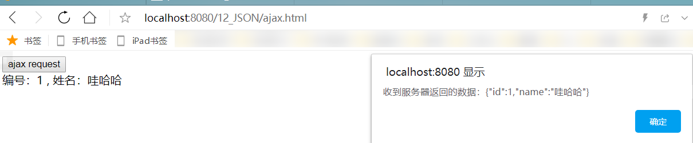

---

> ajax.html：

```html
<!DOCTYPE html PUBLIC "-//W3C//DTD HTML 4.01 Transitional//EN" "http://www.w3.org/TR/html4/loose.dtd">
<html>
	<head>
		<meta http-equiv="pragma" content="no-cache" />
		<meta http-equiv="cache-control" content="no-cache" />
		<meta http-equiv="Expires" content="0" />
		<meta http-equiv="Content-Type" content="text/html; charset=UTF-8">
		<title>Insert title here</title>
		<script type="text/javascript">
			// 在这里使用javaScript语言发起Ajax请求，访问服务器AjaxServlet中javaScriptAjax
			function ajaxRequest() {
// 				1、我们首先要创建XMLHttpRequest
				var xmlhttprequest = new XMLHttpRequest();
// 				2、调用open方法设置请求参数
				xmlhttprequest.open("GET","http://localhost:8080/12_JSON/ajaxServlet?action=javaScriptAjax",true);
// 				4、在send方法前绑定onreadystatechange事件，处理请求完成后的操作。
				xmlhttprequest.onreadystatechange = function(){
					if (xmlhttprequest.readyState == 4 && xmlhttprequest.status == 200) {
						alert("收到服务器返回的数据：" + xmlhttprequest.responseText);
						var jsonObj = JSON.parse(xmlhttprequest.responseText);
						// 把响应的数据显示在页面上
						document.getElementById("div01").innerHTML = "编号：" + jsonObj.id + " , 姓名：" + jsonObj.name;
					}
				}
// 				3、调用send方法发送请求
				xmlhttprequest.send();

				alert("我是最后一行的代码");
			}
		</script>
	</head>
	<body>
<!--	<a href="http://localhost:8080/12_JSON/ajaxServlet?action=javaScriptAjax">非Ajax</a>-->
	<button onclick="ajaxRequest()">ajax request</button>
	<button onclick="ajaxRequest()">ajax request</button>
	<button onclick="ajaxRequest()">ajax request</button>
	<button onclick="ajaxRequest()">ajax request</button>
	<button onclick="ajaxRequest()">ajax request</button>
	<div id="div01">
	</div>
	<table border="1">
		<tr>
			<td>1.1</td>
			<td>1.2</td>
		</tr>
		<tr>
			<td>2.1</td>
			<td>2.2</td>
		</tr>
	</table>
	</body>
</html>
```

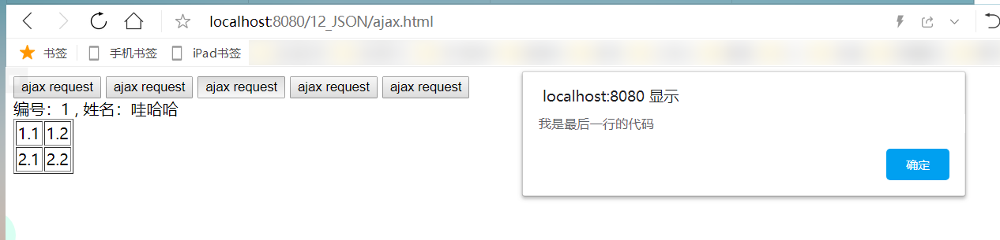


> jQuery中的AJAX请求:

```java
$.ajax方法
    url	表示请求的地址
    type	表示请求的类型GET或POST请求
    data	表示发送给服务器的数据
    	格式有两种：
    		一：name=value&name=value
    		二：{key:value}
	success	请求成功，响应的回调函数
    dataType	响应的数据类型
        常用的数据类型有：
        	text	表示纯文本
        	xml		表示xml数据
        	json	表示json对象
```

> AjaxServlet.java:

```java
	protected void jQueryAjax(HttpServletRequest req, HttpServletResponse resp) throws ServletException, IOException {
        System.out.println("  jQueryAjax == 方法调用了");
        Person person = new Person(1, "哇哈哈");
        // json格式的字符串
        Gson gson = new Gson();
        String personJsonString = gson.toJson(person);

        resp.getWriter().write(personJsonString);
    }
```

> Jquery_Ajax_request.html

```html
// ajax请求
				$("#ajaxBtn").click(function(){
					$.ajax({
						url:"http://localhost:8080/12_JSON/ajaxServlet",
						// data:"action=jQueryAjax",
						data:{action:"jQueryAjax"},
						type:"GET",
						success:function (data) {
							// alert("服务器返回的数据是：" + data);
							// var jsonObj = JSON.parse(data);
							$("#msg").html(" ajax 编号：" + data.id + " , 姓名：" + data.name);
						},
						dataType : "json"
					});
				});
```

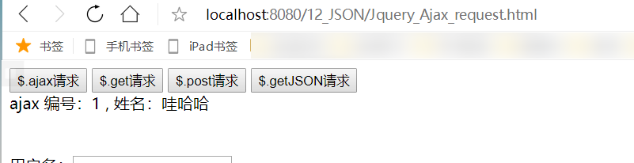

----

>```java
>$.get方法和$.post方法
>    url			请求的url地址
>    data		发送的数据
>    callback	成功的回调函数
>    type		返回的数据类型
>```
>
>AjaxServlet.java:

```java
 protected void jQueryGet(HttpServletRequest req, HttpServletResponse resp) throws ServletException, IOException {
        System.out.println("  jQueryGet  == 方法调用了");
        Person person = new Person(1, "哇哈哈");
        // json格式的字符串
        Gson gson = new Gson();
        String personJsonString = gson.toJson(person);

        resp.getWriter().write(personJsonString);
    }

    protected void jQueryPost(HttpServletRequest req, HttpServletResponse resp) throws ServletException, IOException {
        System.out.println("  jQueryPost   == 方法调用了");
        Person person = new Person(1, "哇哈哈");
        // json格式的字符串
        Gson gson = new Gson();
        String personJsonString = gson.toJson(person);

        resp.getWriter().write(personJsonString);
    }
```

>Jquery_Ajax_request.html

```html
// ajax--get请求
				$("#getBtn").click(function(){

					$.get("http://localhost:8080/12_JSON/ajaxServlet","action=jQueryGet",function (data) {
						$("#msg").html(" get 编号：" + data.id + " , 姓名：" + data.name);
					},"json");

				});

				// ajax--post请求
				$("#postBtn").click(function(){
					// post请求
					$.post("http://localhost:8080/12_JSON/ajaxServlet","action=jQueryPost",function (data) {
						$("#msg").html(" post 编号：" + data.id + " , 姓名：" + data.name);
					},"json");

				});
```

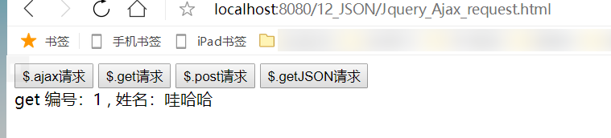

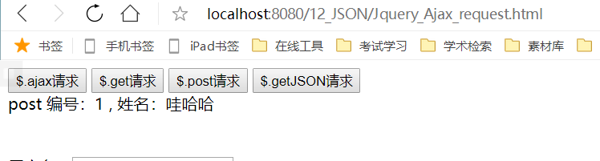

----

> ```java
> $.getJSON方法
>     url			请求的url地址
>     data		发送给服务器的数据
>     callback	成功的回调函数
> ```
>
> AjaxServlet.java:

```java
  protected void jQueryGetJSON(HttpServletRequest req, HttpServletResponse resp) throws ServletException, IOException {
        System.out.println("  jQueryGetJSON   == 方法调用了");
        Person person = new Person(1, "哇哈哈");
        // json格式的字符串
        Gson gson = new Gson();
        String personJsonString = gson.toJson(person);

        resp.getWriter().write(personJsonString);
    }
```

> Jquery_Ajax_request.html

```html
// ajax--getJson请求
				$("#getJSONBtn").click(function(){
					$.getJSON("http://localhost:8080/12_JSON/ajaxServlet","action=jQueryGetJSON",function (data) {
						$("#msg").html(" getJSON 编号：" + data.id + " , 姓名：" + data.name);
					});
				});
```

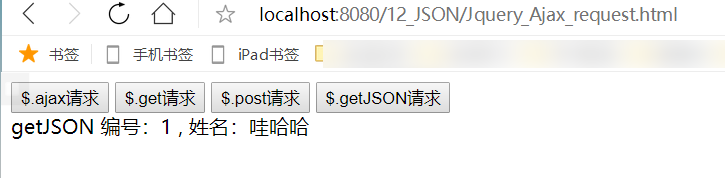

----

> ```java
> 表单序列化serialize()
>     
> serialize()可以把表单中所有表单项的内容都获取到，并以name=value&name=value的形式进行拼接。
> ```
>
> AjaxServlet.java:

```java
protected void jQuerySerialize(HttpServletRequest req, HttpServletResponse resp) throws ServletException, IOException {
        System.out.println("  jQuerySerialize   == 方法调用了");

        System.out.println("用户名：" + req.getParameter("username"));
        System.out.println("密码：" + req.getParameter("password"));

        Person person = new Person(1, "哇哈哈");
        // json格式的字符串
        Gson gson = new Gson();
        String personJsonString = gson.toJson(person);

        resp.getWriter().write(personJsonString);
    }
```

> Jquery_Ajax_request.html

```html
// ajax请求
				$("#submit").click(function(){
					// 把参数序列化
					$.getJSON("http://localhost:8080/12_JSON/ajaxServlet","action=jQuerySerialize&" + $("#form01").serialize(),function (data) {
						$("#msg").html(" Serialize 编号：" + data.id + " , 姓名：" + data.name);
					});
				});
```

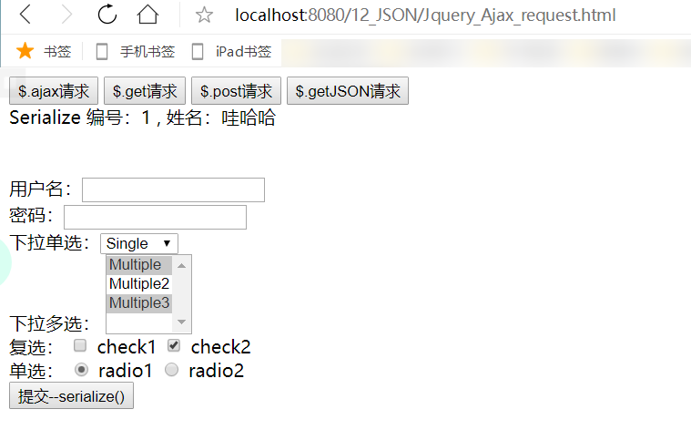

## 3.i18n国际化 

> 什么是i18n国际化？ 

```java
国际化（Internationalization）指的是同一个网站可以支持多种不同的语言，以方便不同国家，不同语种的用户访问。
    
关于国际化我们想到的最简单的方案就是为不同的国家创建不同的网站，比如苹果公司，他的英文官网是：http://www.apple.com而中国官网是http://www.apple.com/cn

苹果公司这种方案并不适合全部公司，而我们希望相同的一个网站，而不同人访问的时候可以根据用户所在的区域显示不同的语言文字，而网站的布局样式等不发生改变。

于是就有了我们说的国际化，国际化总的来说就是同一个网站不同国家的人来访问可以显示出不同的语言。但实际上这种需求并不强烈，一般真的有国际化需求的公司，主流采用的依然是苹果公司的那种方案，为不同的国家创建不同的页面。所以国际化的内容我们了解一下即可。
    
国际化的英文Internationalization，但是由于拼写过长，老外想了一个简单的写法叫做I18N，代表的是Internationalization这个单词，以I开头，以N结尾，而中间是18个字母，所以简写为I18N。以后我们说I18N和国际化是一个意思。
```

> 国际化相关要素介绍:

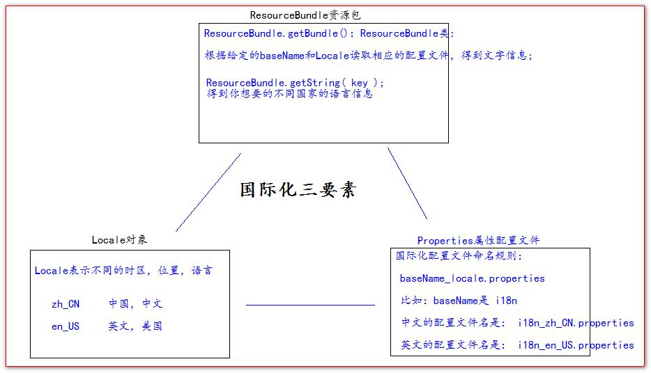

> 国际化资源properties测试:

> 配置两个语言的配置文件： 

```java
i18n_en_US.properties 英文
    
username=username
password=password
sex=sex
age=age
regist=regist
boy=boy
email=email
girl=girl
reset=reset
submit=submit

i18n_zh_CN.properties 中文

username=用户名
password=密码
sex=性别
age=年龄
regist=注册
boy=男
girl=女
email=邮箱
reset=重置
submit=提交
```

> 国际化测试代码： 

```java
import org.junit.Test;

import java.util.Locale;
import java.util.ResourceBundle;

public class I18nTest {

    @Test
    public void testLocale(){
        // 获取你系统默认的语言。国家信息
//        Locale locale = Locale.getDefault();
//        System.out.println(locale);

//        for (Locale availableLocale : Locale.getAvailableLocales()) {
//            System.out.println(availableLocale);
//        }

        // 获取中文，中文的常量的Locale对象
        System.out.println(Locale.CHINA);
        // 获取英文，美国的常量的Locale对象
        System.out.println(Locale.US);

    }

    @Test
    public void testI18n(){
        // 得到我们需要的Locale对象
        Locale locale = Locale.CHINA;
        // 通过指定的basename和Locale对象，读取 相应的配置文件
        ResourceBundle bundle = ResourceBundle.getBundle("i18n", locale);

        System.out.println("username：" + bundle.getString("username"));
        System.out.println("password：" + bundle.getString("password"));
        System.out.println("Sex：" + bundle.getString("sex"));
        System.out.println("age：" + bundle.getString("age"));
    }

}
```

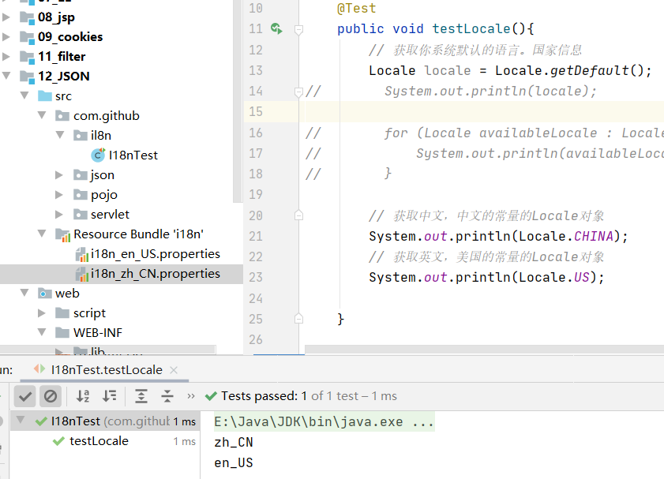

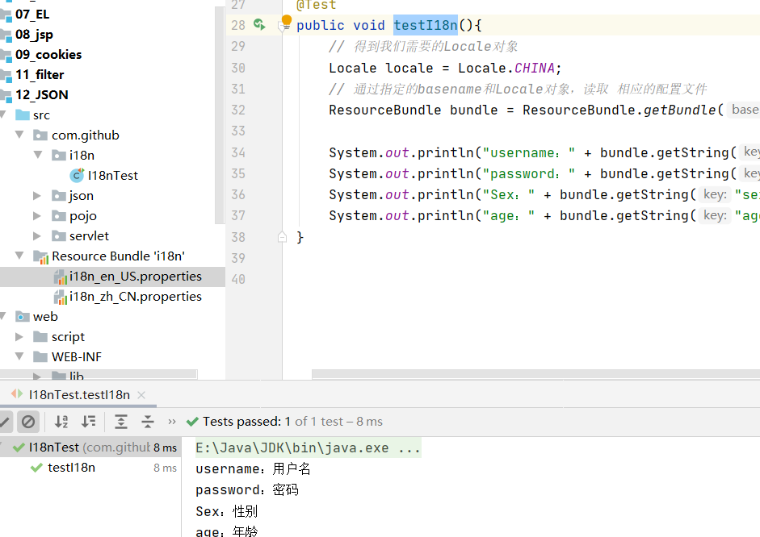

----

> 通过请求头国际化页面:
>
> i18n.jsp

```html
<%@ page import="java.util.Locale" %>
<%@ page import="java.util.ResourceBundle" %>
<%@ page language="java" contentType="text/html; charset=UTF-8"
		 pageEncoding="UTF-8"%>
<!DOCTYPE html PUBLIC "-//W3C//DTD HTML 4.01 Transitional//EN" "http://www.w3.org/TR/html4/loose.dtd">
<html>
<head>
	<meta http-equiv="pragma" content="no-cache" />
	<meta http-equiv="cache-control" content="no-cache" />
	<meta http-equiv="Expires" content="0" />
	<meta http-equiv="Content-Type" content="text/html; charset=UTF-8">
	<title>Insert title here</title>
</head>
<body>
<%
		// 从请求头中获取Locale信息（语言）
		Locale locale=request.getLocale();
		System.out.println(locale);
		// 获取读取包（根据 指定的baseName和Locale读取 语言信息）
		ResourceBundle i18n = ResourceBundle.getBundle("i18n",locale);
	%>
	<a href="">中文</a>|
	<a href="">english</a>
	<center>
		<h1><%=i18n.getString("regist")%></h1>
		<table>
		<form>
			<tr>
				<td><%=i18n.getString("username")%></td>
				<td><input name="username" type="text" /></td>
			</tr>
			<tr>
				<td><%=i18n.getString("password")%></td>
				<td><input type="password" /></td>
			</tr>
			<tr>
				<td><%=i18n.getString("sex")%></td>
				<td>
					<input type="radio" /><%=i18n.getString("boy")%>
					<input type="radio" /><%=i18n.getString("girl")%>
				</td>
			</tr>
			<tr>
				<td><%=i18n.getString("email")%></td>
				<td><input type="text" /></td>
			</tr>
			<tr>
				<td colspan="2" align="center">
					<input type="reset" value="<%=i18n.getString("reset")%>" />&nbsp;&nbsp;
					<input type="submit" value="<%=i18n.getString("submit")%>" /></td>
			</tr>
		</form>
		</table>
		<br /> <br /> <br /> <br />
	</center>
	国际化测试：
	<br /> 1、访问页面，通过浏览器设置，请求头信息确定国际化语言。
	<br /> 2、通过左上角，手动切换语言
</body>
</html>
```

> 通过显示的选择语言类型进行国际化:
>
> i18n.jsp

```html
<%@ page import="java.util.Locale" %>
<%@ page import="java.util.ResourceBundle" %>
<%@ page language="java" contentType="text/html; charset=UTF-8"
		 pageEncoding="UTF-8"%>
<!DOCTYPE html PUBLIC "-//W3C//DTD HTML 4.01 Transitional//EN" "http://www.w3.org/TR/html4/loose.dtd">
<html>
<head>
	<meta http-equiv="pragma" content="no-cache" />
	<meta http-equiv="cache-control" content="no-cache" />
	<meta http-equiv="Expires" content="0" />
	<meta http-equiv="Content-Type" content="text/html; charset=UTF-8">
	<title>Insert title here</title>
</head>
<body>
<%
	// 从请求头中获取Locale信息（语言）
	Locale locale = null;

	String country = request.getParameter("country");
	if ("cn".equals(country)) {
		locale = Locale.CHINA;
	} else if ("usa".equals(country)) {
		locale = Locale.US;
	} else {
		locale = request.getLocale();
	}

	System.out.println(locale);
	// 获取读取包（根据 指定的baseName和Locale读取 语言信息）
	ResourceBundle i18n = ResourceBundle.getBundle("i18n", locale);
%>
<a href="i18n.jsp?country=cn">中文</a>|
<a href="i18n.jsp?country=usa">english</a>
<center>
	<h1><%=i18n.getString("regist")%></h1>
	<table>
		<form>
			<tr>
				<td><%=i18n.getString("username")%></td>
				<td><input name="username" type="text" /></td>
			</tr>
			<tr>
				<td><%=i18n.getString("password")%></td>
				<td><input type="password" /></td>
			</tr>
			<tr>
				<td><%=i18n.getString("sex")%></td>
				<td>
					<input type="radio" /><%=i18n.getString("boy")%>
					<input type="radio" /><%=i18n.getString("girl")%>
				</td>
			</tr>
			<tr>
				<td><%=i18n.getString("email")%></td>
				<td><input type="text" /></td>
			</tr>
			<tr>
				<td colspan="2" align="center">
					<input type="reset" value="<%=i18n.getString("reset")%>" />&nbsp;&nbsp;
					<input type="submit" value="<%=i18n.getString("submit")%>" /></td>
			</tr>
		</form>
	</table>
	<br /> <br /> <br /> <br />
</center>
国际化测试：
<br /> 1、访问页面，通过浏览器设置，请求头信息确定国际化语言。
<br /> 2、通过左上角，手动切换语言
</body>
</html>
```

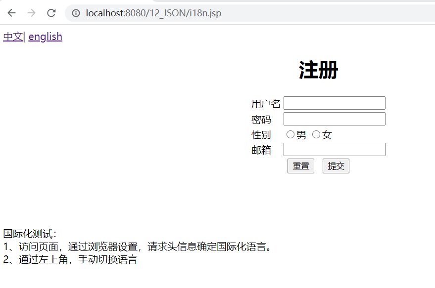

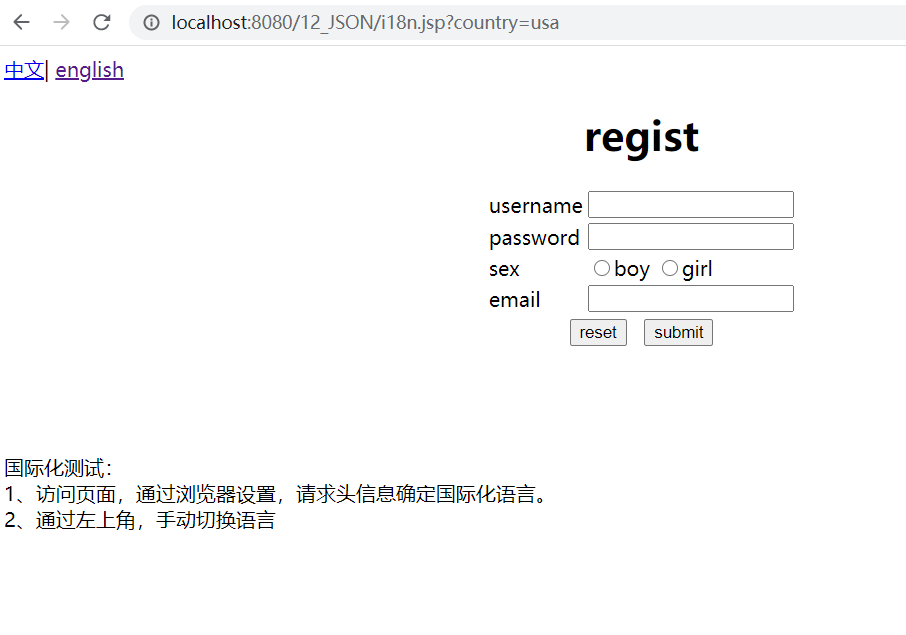

> JSTL标签库实现国际化:
>
> ```jsp
> <%--1使用标签设置Locale信息--%>
> <fmt:setLocalevalue=""/>
> <%--2使用标签设置baseName--%>
> <fmt:setBundlebasename=""/>
> <%--3输出指定key的国际化信息--%>
> <fmt:messagekey=""/>
> ```
>
> i18n_fmt.jsp

```jsp
<%@ taglib prefix="fmt" uri="http://java.sun.com/jsp/jstl/fmt" %>
<%@ page language="java" contentType="text/html; charset=UTF-8"
		 pageEncoding="UTF-8"%>
<!DOCTYPE html PUBLIC "-//W3C//DTD HTML 4.01 Transitional//EN" "http://www.w3.org/TR/html4/loose.dtd">
<html>
<head>
	<meta http-equiv="pragma" content="no-cache" />
	<meta http-equiv="cache-control" content="no-cache" />
	<meta http-equiv="Expires" content="0" />
	<meta http-equiv="Content-Type" content="text/html; charset=UTF-8">
	<title>Insert title here</title>
</head>
<body>
<%--1 使用标签设置Locale信息--%>
<fmt:setLocale value="${param.locale}" />
<%--2 使用标签设置baseName--%>
<fmt:setBundle basename="i18n"/>


<a href="i18n_fmt.jsp?locale=zh_CN">中文</a>|
<a href="i18n_fmt.jsp?locale=en_US">english</a>
<center>
	<h1><fmt:message key="regist" /></h1>
	<table>
		<form>
			<tr>
				<td><fmt:message key="username" /></td>
				<td><input name="username" type="text" /></td>
			</tr>
			<tr>
				<td><fmt:message key="password" /></td>
				<td><input type="password" /></td>
			</tr>
			<tr>
				<td><fmt:message key="sex" /></td>
				<td>
					<input type="radio" /><fmt:message key="boy" />
					<input type="radio" /><fmt:message key="girl" />
				</td>
			</tr>
			<tr>
				<td><fmt:message key="email" /></td>
				<td><input type="text" /></td>
			</tr>
			<tr>
				<td colspan="2" align="center">
					<input type="reset" value="<fmt:message key="reset" />" />&nbsp;&nbsp;
					<input type="submit" value="<fmt:message key="submit" />" /></td>
			</tr>
		</form>
	</table>
	<br /> <br /> <br /> <br />
</center>
</body>
</html>
```

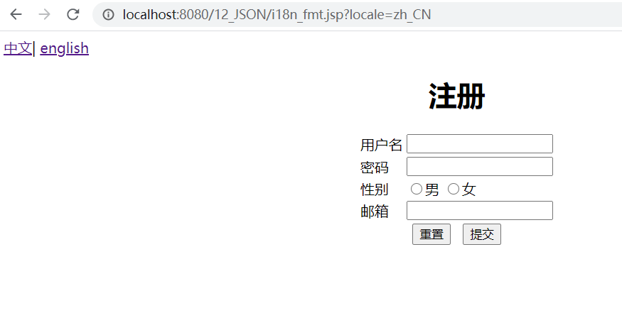

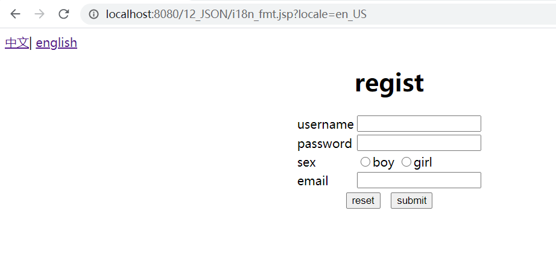

